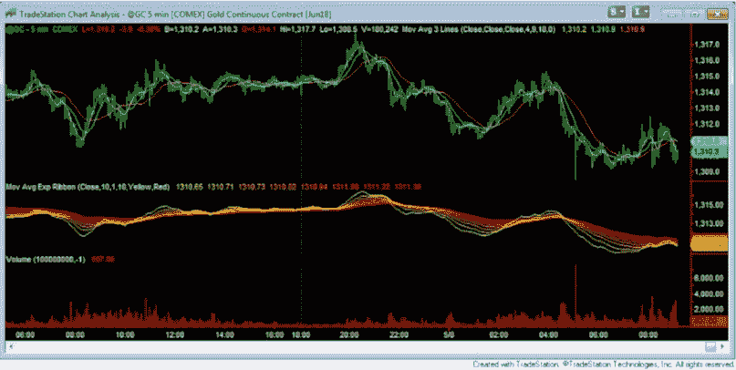
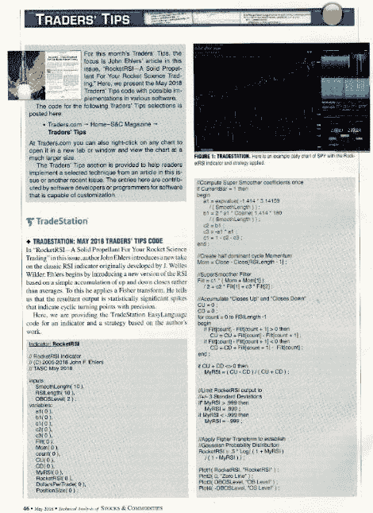

# 第七章 - 选择交易软件平台

当我开始使用零售交易平台（Tradestation）时，实际上没有太多选择。而 Tradestation 无疑是最好的；它功能最全，回测最准确，支持服务出色，用户组活跃且乐于助人。

快进到今天，零售软件平台的格局略有不同。现在有数十个交易平台，大多数都相当不错。每个平台都有一些特定的“细分”领域，试图解决 Tradestation 传统上不太擅长的地方。当然，Tradestation 也在不断改进，并持续构建更好的平台。竞争正在提高所有平台的标准，这非常重要。

这对零售交易者来说非常好——竞争增加、功能更强大、成本更低——但可能会让人感到不知所措！哪个平台是最好的？哪个平台具备你所寻找的功能？哪个平台最容易构建？问题清单还在不断增加。

所以，我不会在这一章告诉你该使用哪个平台，但我会指出一些你在算法交易中所需的“必备”条件。在下一章中，我还会告诉你根据我在过去几年进行的交易者调查得出的最受欢迎的平台。你可能认为受欢迎程度是一个不好的标准，但我认为这很重要。你希望选择一个能存在多年的交易平台，因为将你的算法转移到一个停用的平台将是繁琐的。

最后，我将提供一些主要平台的联系方式，以便你可以开始自己调查。这是个人选择，你希望对所选择的软件感到舒适，因为你会花很多时间在你的软件选择上，构建算法！

## 图表功能

理论上，一个纯粹的算法交易者和开发者不需要任何类型的价格图表。毕竟，这有什么必要呢？算法规则才是关键，而不是图表上的视觉效果。尽管如此，拥有一个良好的图表平台确实是非常重要的。

在创意生成阶段，算法交易者通常想要看到他或她的创意——无论是指标、直方图、条形模式，还是其他——如何运作。软件中的良好图表模块将有助于实现这一点。

图 19 - 图表可以帮助你可视化算法的各个方面

正确使用图表的关键是不要根据你在图表中看到的内容做出任何判断或决策。你看到的可能只是图表上短短的一段时间，而这段时间可能会极具误导性。因此，基于视觉检查得出新的指标或图表模式是不好的，这真是一个糟糕的做法。

另一方面，使用图表来直观检查编码的正确性是非常好的做法。复杂的图表模式可能容易看出，但算法编程可能很困难，因此通过检查图表来验证代码可能非常有帮助。

我建议优秀的图表功能是任何交易平台必不可少的“必须拥有”。

## 经纪人整合

一些零售平台，如 Tradestation，直接与一家经纪公司相关联（在这种情况下是 Tradestation Brokerage）。其他平台，如 NinjaTrader，只有少量有限的经纪人选择。最后，一些平台（如 Multicharts）则有大量的经纪人可供选择。每种方法都有其优缺点。

因此，寻找交易平台可能也是在寻找合适的经纪人。就我个人而言，多年来我使用了许多经纪人，有两次我遇到过可靠的经纪人试图盗取我的钱（Refco，PFG）。这意味着你在选择经纪人时要谨慎，因为很多经纪人会倒闭。

在所有情况下，要有备份计划和备用经纪人，以备不时之需。

## 编程的便利性

大多数优秀的平台提供你创建自己的指标、策略等的能力——除了提供可更改和优化的标准指标。如果你无法创建自己的指标，我建议你寻找其他包，因为你一定会在某个时刻编程自己的创作。

假设你的软件允许自定义工作，主要有三种生成自定义代码的方法。第一种是采用现有代码，简单地修改以满足你的规格。一旦你了解编程语言的基础，这相对容易。我有一些交易朋友只做这件事——他们在职业生涯中从未编程过原创策略，但他们从其他人那里获取了成千上万的策略，并修改代码以适应自己的需求。

产生自定义算法代码的第二种方法是从头开始。这需要更多的工作，但一旦你掌握了编程，操作起来相对简单。

一些平台提供的最后一种编程代码方式是可视化拖放代码创建方法。你基本上是移动指标、模式、if...then 逻辑、止损等的块，并连接这些块。一旦完成，软件就会将你的可视化表示转化为代码。这是一种绕过逐行编程策略的方法，但即便如此，仍需要花费不少时间学习以跟上进度。

由你来决定哪种方法最吸引你。当然，为了让你的决定更加困难，每种编程语言都有自己的风格和格式。有些是基于“专业”的重型编程语言，如 C#，而有些则是基于“老式”语言，如 Basic。因此，编程一个简单策略可能非常简单，也可能非常复杂，具体取决于使用的语言。

研究不同平台并了解不同编程语言的一种方式是拿到最新一期的《股票与商品技术分析》杂志。几乎每个月，编辑们都会挑选一篇文章（带有新指标、算法策略等），并请主要软件平台的专家用他们的语言创建代码。这可以在杂志后面的“交易者提示”部分找到。

图 20 - 《股票与商品技术分析》杂志“交易者提示”部分 - 比较各种编程语言的好方法

在最近一期中，11 个不同的交易平台提供了由受人尊敬的开发者约翰·埃勒斯制作的新 RSI 指标的代码。通过查看每个独特的代码，新手算法交易者可以了解每种编程语言的结构和复杂性。这可能会帮助你决定追求哪种语言。

举个例子，这就是 Tradestation 的 Easy Language 是多么简单。假设我想在今天的收盘价是过去两周（10 根 K 线）的最高收盘价时买入下一根 K 线。在 Easy Language 中，这变成了：

如果 close=highest(close,10)那么以市价在下一根 K 线买入；

不是所有语言都这么简单！

无论你选择什么编程方法和编程语言，在某个时刻你都会想选择一种方法和一个平台，并在这个平台上熟练开发算法。

在本节讨论的所有主题中，我认为这是最重要的。拥有一种你可以轻松学习并感到舒适的编程语言是件大事。花很多时间提前调查什么对你最好，这将会在将来带来回报。

## 与市场数据整合

目前大多数顶级交易平台与市场数据的整合都很好。大多数需要你与第三方数据提供商订阅，虽然像 Tradestation 这样的平台则有自己的数据。

有两个重要点需要注意。首先，确保你的数据是自动传送的，并包含日内数据。没有什么比每晚都要安排数据下载更糟糕的了。过去在拨号调制解调器的时代，这曾是常态，但在今天这个瞬时的世界中，你应该能立即访问数据。

另一个重要点是确保你信任数据源和平台。并非所有数据提供商都向所有平台提供数据，所以如果你心中有一个首选数据供应商，你的选择可能会受到一定限制。

市场数据的整合并不是一个主要点，但如果你忽视它，可能会让你跌倒。

## 标准指标和研究

在一个新平台上开始时，你最不想做的就是重新创建标准的技术研究，比如移动平均线、RSI、ADX、随机指标等。你只想在代码中引用它们，而不是先编程实现它们。

在选择平台之前，确保它已经编程了大量的指标和功能。大多数平台都有，但最好先检查一下。

## 编程能力

之前我讨论了编程的简易性，我认为这是关键。但很多时候，编程可能很简单，因为语言本身的范围有限。一些简单的语言无法完成你可能需要的一些复杂任务。

Tradestation 就是一个很好的例子。它使用一种称为 Easy Language 的语言，确实很简单。但由于它是在几十年前开发的，主要用于回测，因此在今天的计算机交易世界中，这种语言存在某些局限性。因此，Tradestation 现在包含了一种额外的语言，即面向对象的 Easy Language（OOEL），以提供大量额外功能。当然，OOEL 因此是一种更复杂的语言（仅供参考：我在我的算法工作中甚至不使用 OOEL）。

MultiCharts 平台与 Tradestation 做了同样的事情，在该平台的.NET 版本中添加了一种新语言。

如果你有一个复杂的算法想法，但不确定是否能编程实现，我建议你与每个供应商的专家或软件用户组的成员交谈，以查看你所需的功能是否可以在软件中编码。

## 优化

如果你的代码中有任何参数或数字，例如移动平均中的条数，或相对强弱指数（RSI）计算中的买入阈值，最终你很可能会想要优化那个数字。虽然过度优化绝对是个坏事，但至少你会希望软件具备优化的能力。

我认为这是必须具备的，大多数平台都提供这一点。

## 向前分析

在我的算法开发工作中，我使用一种称为向前测试的技术来创建“样本外”结果。这些结果往往比传统的“直接插入和计算”回测优化更好地模拟实时交易。

向前测试是一个高级主题，新算法交易员可能不会立刻需要。但这对于交易软件来说是一个很好的功能。否则，你可能需要购买第三方工具来进行分析，或者（哎呀！）手动进行分析。多年来我在老式方法中手动进行此操作，我可以肯定地说，手动向前测试不是一个好的长期解决方案！

## 交易者社区

拥有一个活跃且庞大的交易社区对于你选择的任何软件平台至关重要。大多数软件供应商的技术支持人员工作负担沉重，人员不足，最重要的是，通常他们并不是交易员。因此，当你有问题时，很多时候你会和一个知识水平低于你的人交谈！

如果社区强大，将会有很多常规用户愿意并能够帮助你解决问题。例如，我在 Tradestation 用户论坛上自愿贡献一些时间，在过去 14 年中平均每周发布 5 个帖子（总共超过 3500 个帖子！）。还有许多其他人比我帮助得还要多。

拥有庞大用户社区的另一个好处是，你可以借用很多可用的代码。我从互联网上找到的免费代码中得到了许多最佳创意和算法。对于一个受欢迎的平台，你想要编写的代码很可能已经为你完成，你只需要进行一些修改以满足你的需求。

一个活跃的社区绝对是个加分项，应当是你搜索标准中非常重要的一部分。

## 实时交易与自动化

一旦你创建并测试了你的算法，最后想要做的事情就是将其转换或迁移到不同的平台上，以便进行实时交易或自动化。不幸的是，这在一些交易软件中仍然是个问题。这些软件没有完全整合测试和实际交易的部分。

你想要一个能做到所有事情的软件包：开发、测试和自动化交易。如果你满足于低于这个标准，最终你会发现自己做了很多额外的工作。

## 选择平台 – 结论

希望在这一章中，我给你提供了一些思考方向，以帮助你选择平台。显然还有其他重要因素需要考虑（成本、在你国家的可用性），虽然我没有提到，但我尝试强调了一些主要关注领域。

没有“统一适用”的解决方案，虽然有很多平台可供选择是好事，但也可能令人不知所措。不要因此而气馁。做一些研究，选择你认为最合适的选项，然后大胆尝试。你越早行动，就能越早开始创建交易算法！
