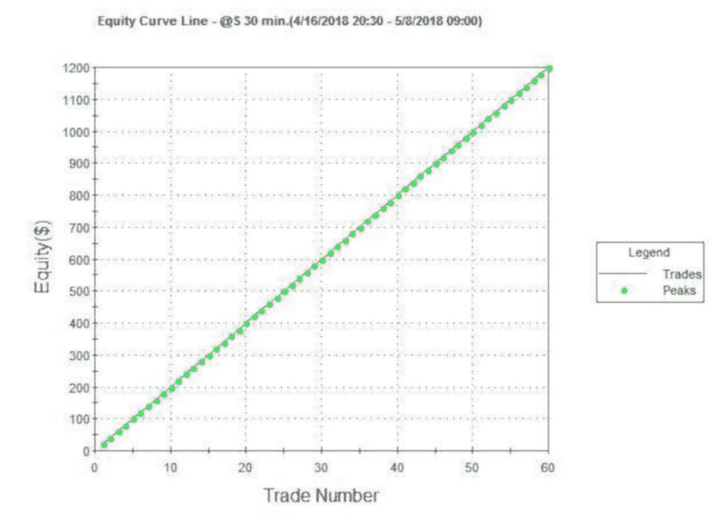

第九章 - 交易平台 - 下一步

一旦你选择了交易平台，就该开始工作了！在你可以开始创建和交易算法之前，还有一些特定的平台任务需要掌握。以下是我推荐的顺序。

## 了解你平台的“帮助”来源

刚开始使用新的交易平台，无论是哪一个，都会是一项令人生畏的任务。你需要帮助。幸运的是，如果你选择了前一章中详细介绍的顶级平台，你会在各个地方找到帮助。

第一个帮助来源应该是软件供应商本身。他们有经过培训的人可以回答大多数问题，特别是对于初学者。然而，随着知识的增长，你会意识到其他用户有时是更好的信息来源。不过，在开始时，供应商或他们的在线帮助文件和视频应该是首选。

记住与供应商帮助的一个重要事项——如果是特定交易的问题（如未成交的订单、错误的成交等），你应该首先拨打经纪商的交易台。他们总是你账户具体交易详情的最佳信息来源。他们可能会把你转给技术支持，但当我遇到问题且不确定自己当前状态时，我首先会拨打交易台。

有时候供应商无法回答你的问题，或者无法花时间与你解决问题。幸运的是，还有第三方技术支持来源。例如，YouTube 上有大量关于 Tradestation 的有用视频。这些外部来源提供免费的信息，以及付费服务。

我认为真正的专家是那些也是交易者的软件用户。确保你知道如何联系这些人。通常，他们可以在像 futures.io 或 elitetrader.com 这样的交易论坛找到。此外，每个软件供应商都有用户论坛，最佳答案可能来自有经验的用户和交易者。我相当频繁地使用 Tradestation 的用户论坛，至今仍会提问，尽管我已经使用这个软件 14 年了。学习是无止境的！

## 了解你平台的基础知识

不要在启动新交易软件的第一天就试图创建算法交易策略。花一些时间，学习基础知识，了解事物是如何设置和工作的。

对待软件要像个孩子。你有没有看过孩子如何与新软件互动？我和我的三个孩子一起看过，我可以说，他们绝对无所畏惧。他们会随意点击任何东西，知道通常可以关闭软件并重新启动。

做个孩子——和你新玩具一起玩吧！拉起图表，添加一些指标，应用一些现成策略到图表上，看看结果报告。探索和玩耍——你会更快地学习。

## 学习编程基础

由于大部分算法开发最终将包括构建策略，所以要学习如何做到这一点！首先学习编程语言的基本结构——if…then 语句、买卖订单语法等。

每个平台供应商可能都有免费的手册、参考指南、视频等。大多数还提供付费服务，比如入门编程“训练营”。此外，还有很多第三方公司提供免费的和付费的编程技巧。

但即使有一本全面的编程手册在手，实际上编程和自己练习是没有什么可以替代的。

查看软件中提供的任何策略。弄清楚每一行的作用以及它是如何编写的。复制该策略，然后修改副本。最初做小的改变，然后逐步尝试更复杂的更改。

最终，你会感到足够自信，从零开始构建自己的策略。这可能需要几天、几周甚至几个月，但这正是你希望达到的地方——能够轻松修改现有策略，创造自己的新策略。

## 学习策略开发和评估的基础知识

你的软件不会帮助你处理的一个主要话题是如何正确地开发策略。它并不像把策略应用到图表上，运行大量优化，然后实时交易最佳的整体优化结果那么简单。事实上，这正是错误的做法，即使软件让这看起来非常简单。

正确的策略开发和评估是一个重要话题，关于适当策略开发有很多优秀的书籍。在我看来，Pardo、Tomasini 和 Davey 的书是学习正确策略开发过程的最佳书籍。我建议你获取几本或所有这些书籍，并将它们的经验融入到你策略的开发中。

## 整合一切——从图表开始，以策略结束

按照下一章中的步骤，我会创建一个简单的策略。虽然我以 Tradestation 作为例子，但你应该能够在你的平台上复制每一个步骤。一旦你可以轻松完成所有这些步骤，你就处于一个良好的位置，可以开始创建自己的交易算法。

## 学习如何“欺骗”你的平台

学习软件的最后一项任务是学习如何“欺骗”它。几乎每个交易平台都可以被“游戏化”。也就是说，有一些编码技巧和软件设置可以产生惊人的收益曲线。下面是一个例子。我在 1 分钟内创建了这个策略。看起来交易完美，不是吗？不过，有一个小问题——它是假的，结果是基于利用交易软件回测引擎的。

图 24- 你能用你的软件创建这样的假算法吗？

一旦你知道几种创造假冒但完美的权益曲线的方法，我可以说你对自己的软件了解得足够深刻。此时，你就知道自己正在成为专家的路上！
