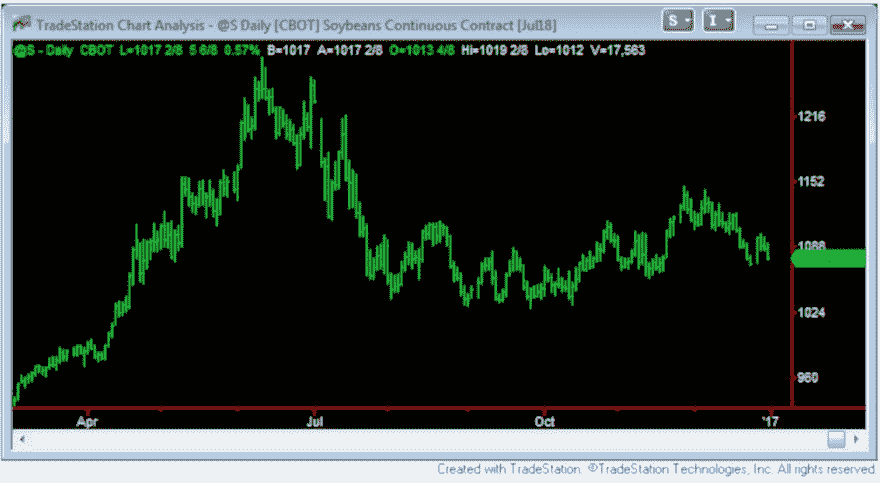
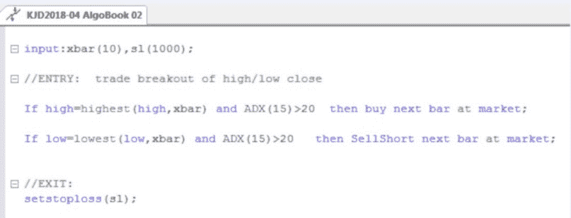
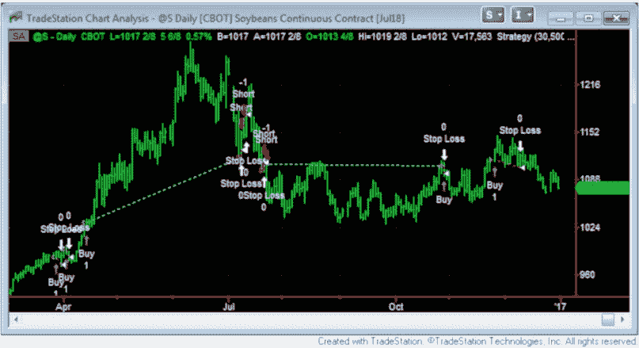
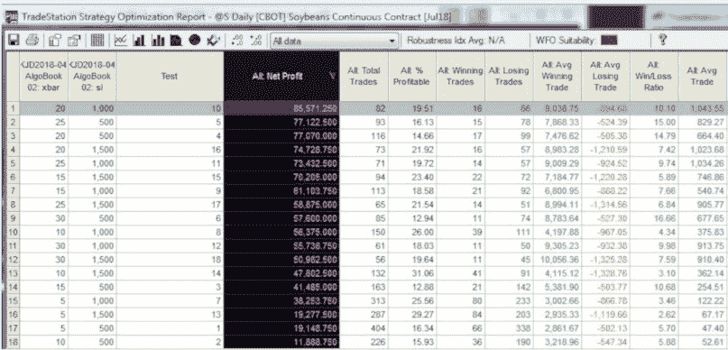
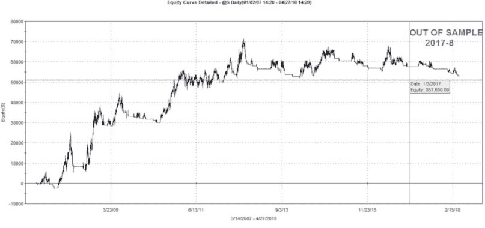
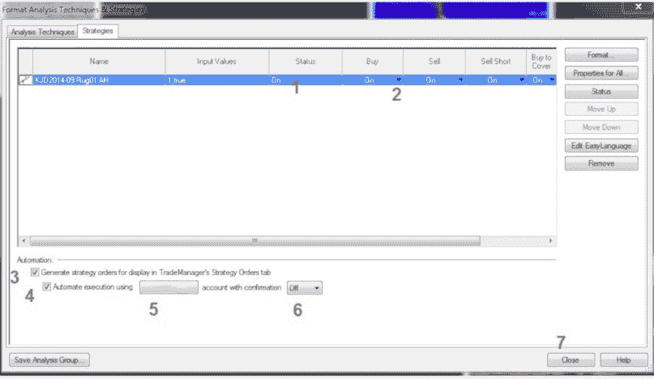

# 第十章 - 开始吧 - 一个简单的示例算法

在本章中，我将演示一个简单的算法交易示例。请注意，我在这里的重点是使用交易软件——无论你使用什么平台，你必须能够完成这些基本任务。

这个例子并不是开发稳健算法的正确或唯一步骤。这超出了这本简短书籍的范围。但这个例子至少可以帮助你开始理解书中阐述的概念。

将本章视为互动指南。对于我采取的每一步，尽量用你的交易软件复制它。只有在掌握第一步后，才能进行下一步。

注意：这个策略如所示，并不是一个可交易策略——它在样本外的表现较弱。它只是一个示例。所展示的步骤并不代表我为自己交易使用的策略开发过程（我注册商标的 Strategy Factory®过程）。关键在于，如果你觉得自己能够执行本章中详细说明的每一步，那么你就已经从初学者算法水平毕业，现在可以成为一名严肃的算法策略开发者。

## 调出图表

让我们从一个简单的任务开始。打开 2007 年至今的大豆日线连续图，起始日期为 2007 年 1 月 1 日，结束日期为 2016 年 12 月 31 日。

图 25 - 你能在你的平台上创建这样的图表吗？

## 获取一个交易想法

一个简单的交易想法通常是最好的。在这个例子中，我将创建一个基本的突破系统。这个想法是，较高的价格只能通过超过以前的高价来实现——非常简单！

在每根 K 线的收盘时，如果最高价是过去“xbars”的最高收盘价，并且 15 根 K 线的 ADX（趋势性技术指标）超过 20，则做多。对于做空交易，则执行相反操作。我还会包括一个简单的止损，没有利润目标（让获利交易继续进行！）。这种系统适合趋势，但在非趋势市场中可能会经历很多震荡。

## 编程它

在你自己的平台上编程这个简单策略。Tradestation Easy Language 的代码如下。包括$5 的来回交易佣金和$25 的滑点（非常重要！）。

图 26 - 在你的平台上编写这个策略

## 应用到图表上

现在，使用你的软件将该策略附加/应用到之前构建的图表上。

图 27 - 你能在你的图表上看到交易吗？

## 适度优化

优化是一个脏字，但适度使用时可以很有用。尝试优化变量“xbar”。使用最小值 5（短期）到 30（中期），以 5 为步长。同时，优化止损，从 500 到 1500，以 500 美元为步长。

图 28- 优化结果

## 查看结果

看一下优化结果。有 18 次迭代（运行），所有都盈利。这通常是个好兆头。问题是，选择哪个参数集？最高净利润？账户平均回报？最低胜率？在交易论坛中问这个问题，准备接受一系列的回答和尖锐的观点。事实上，没有“完美”的标准可用——这取决于个人偏好和经验。

可选的参数几乎是无穷无尽的，这也是我在开发时遵循一套标准的原因，其中包括前向测试。

目前，我们假设选择一个“中位”净利润——既不是最好也不是最差。也就是第 9 次迭代，xbar=30，止损=500。

## 进行样本外测试

一旦选择了参数，就该在 2017 年和 2018 年运行策略。为此，我们只需更改图表结束日期，然后查看更新的性能报告（未显示）。结果虽然不差（如果 2017-2018 年的结果真的很差，说明我们过度优化或曲线拟合过多），但交易的质量并不够好。在此时，策略可能应该放弃，因为如果我们一次又一次地测试，样本外结果就不再是真正的样本外了。

图 29- 示例策略，样本外结果

## 自动化

对于这个策略，基于样本外表现，我不会进行交易。但假设你想交易它。你会采取什么步骤来启用并自动化它？以下是 Tradestation 的逐步流程：

图 30- 自动化策略的步骤，Tradestation
