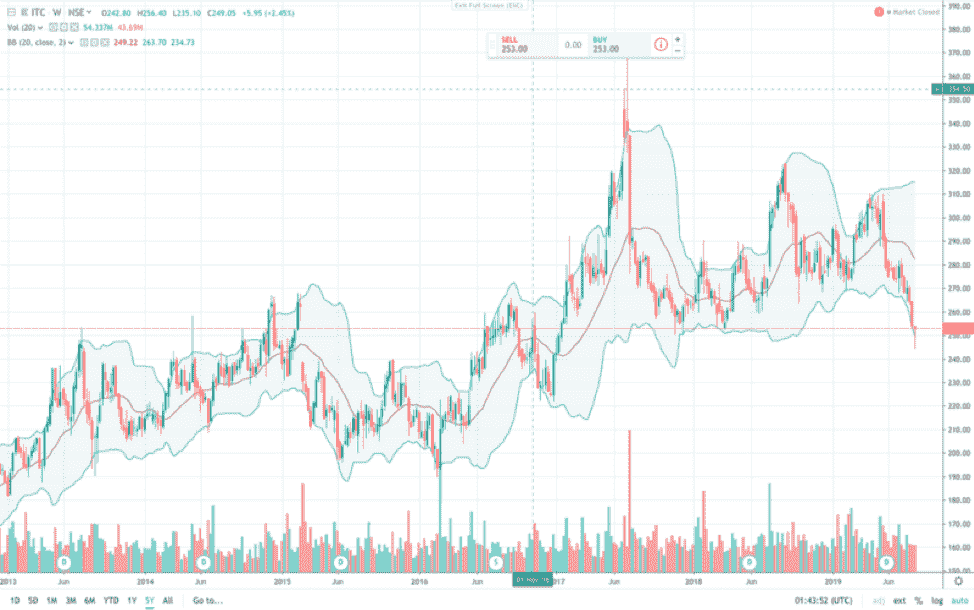
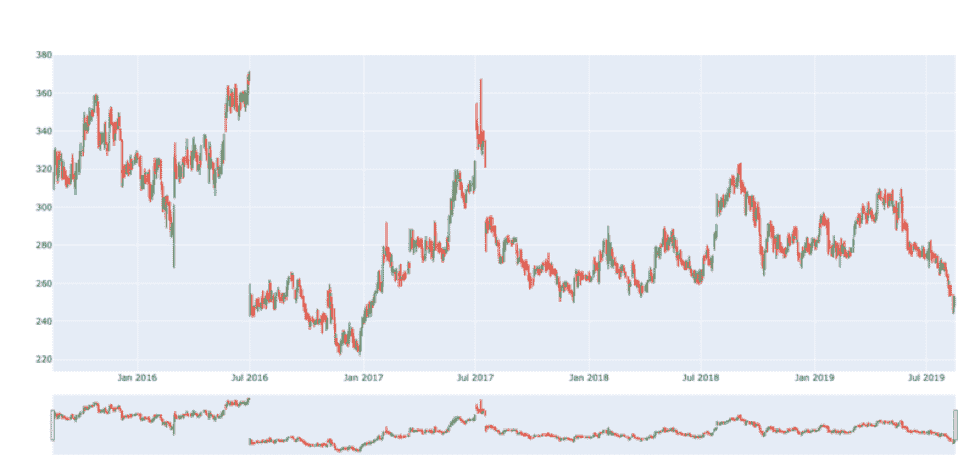
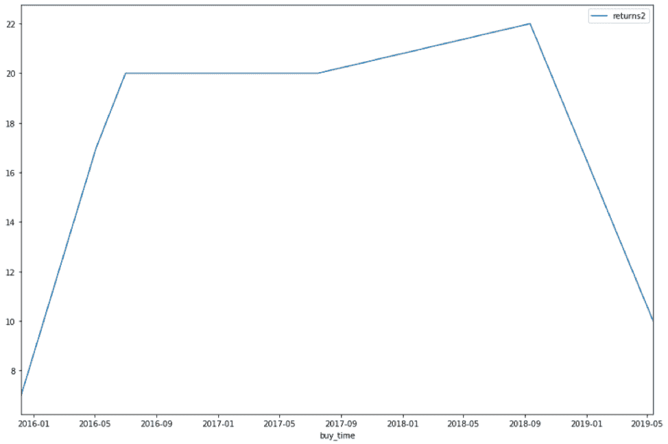
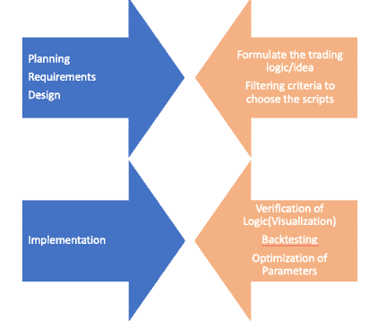
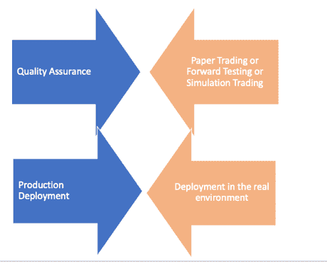

# 简单解释了算法交易阶段

> 原文：<https://blog.quantinsti.com/algo-trading-stages-explained-simply/>

苏尼尔·古格拉尼(NCDEX 助理副总裁)

你是 Algo 交易的新手吗？迷茫于如何开始，从哪里开始？

网上有很多关于回溯测试、技术指标、Python for finance 的课程和内容。

此外，有很多关于算法交易相对于人工交易的好处的资料。但是，如果你想开发你的第一个算法，你必须经历哪些阶段，这方面的信息有限。

注意:这些阶段纯粹是基于我的经验，它可能/可能不会不同于标准程序(我找不到☺).

[T4】](https://www.quantinsti.com/python-basics-handbook)

我将通过一个真实的交易策略来解释这一点。以下是我将介绍的几个阶段:

*   [制定交易概念/逻辑](#concept)
*   [选择脚本的过滤标准](#filter)
*   [逻辑验证(高电平)](#verify)
*   [回溯测试](#backtest)
*   [参数优化](#optimize)
*   [纸上交易或远期测试或真实环境中的模拟交易](#paper)
*   [在真实环境中部署](#deploy)

## 制定交易概念/逻辑

首先，算法交易不是火箭科学..是..这真的不是…这只是一个难题，你需要比其他一些人更有效地解决它。我们知道这个难题..低价买进，高价卖出。

没有必要遵循任何现有的理论或指标或策略。你不需要成为市场专家。如果你觉得舒服，你可以自己做。(我的第一个算法是跨交易所套利。我当时是个业余爱好者，甚至不知道套利的意义。☺)

在此阶段，您需要回答以下问题:

1.  我实现目标的逻辑是什么(低买高卖)？
2.  我的交易频率是多少？
3.  哪一部分最有效(股票/商品/外汇/加密..)
4.  回测期应该是多少？
5.  哪些自动化工具/语言对这个逻辑最有用？

例:我认为快速消费品(FMCG)股票的波动性一般较小，它们围绕着相同的价格区间波动。这让我认为他们是范围有限的，所以他们是均值回复。因此，我将尝试在我的策略中应用一些均值回复技术。此外，日内价格波动很大，因此我会选择每日收盘价进行计算和交易。

考虑到我的上述想法，我的回答如下:

我实现目标的逻辑是什么(低买高卖)？

我将使用均值回归交易策略。为此，我将使用布林线。买入:如果收盘价低于均值的-2 标准差。平仓:如果收盘价高于平均值+2 标准差。

我的交易频率是多少？

每天。

哪一部分最有效(股票、商品、外汇或加密)？

我将使用股权现金部分。

**回测期应该有多长？**

3 年(越长越好)。

哪些自动化工具/语言对这种逻辑最有用？

我对 Python 很熟悉。我们应该把工具用在我们最熟悉的地方。

## 选择脚本的过滤标准

太好了。你已经完成了一个重要的里程碑。你已经写下了核心逻辑，并为你的算法做了高层次的规划。

如果你观察，你的逻辑会在一些特定的条件和特定的脚本上工作得最好。记住你已经决定了第一阶段的部分。

脚本的选择/过滤可以在交易时间之前或期间(实时)完成。这完全取决于你的核心逻辑。

**举例:**

正如我们所决定的，我们将只使用快速消费品脚本和高流动性库存，因此筛选标准如下:a .行业(快速消费品)。b .数量> 100000

## 逻辑验证(高级别)

Algo 开发是一个昂贵的过程，它需要大量的精力和时间。最好使用可视化工具或 excel 来验证您的核心逻辑。

以后会节省很多时间。您可以使用 Tableau、power BI 或 excel 来编写逻辑并验证您的逻辑。你也可以使用图表工具，如交易视图、[investing.com](http://investing.com/)或类似的工具。

这是 ITC 有限公司 5 年来每日频率的图表。并且 SMA，STD(-2，+2)被应用于 20 天的回顾期。(礼貌用语:[](http://tradingview.com/)****)。下面的图片证实了我们的逻辑。****

 ****T2】**

## 回溯测试

[回溯测试](https://blog.quantinsti.com/backtesting/)是使用历史价格信息来验证你的逻辑的方法。这一阶段有助于理解如果你在过去使用这种逻辑会有多好。这个阶段显示了你的逻辑的性能。它还为您提供了优化逻辑及其参数的机会。

在此阶段，应考虑以下参数:

**各种性能参数**

*   返回
*   最大压降
*   最大连续压降
*   最大利润
*   最大连续利润
*   交易数量
*   每笔交易的平均回报
*   交易费用
*   滑倒等。

**另外几个重点是:**

*   止损/跟踪止损
*   目标价格
*   入围标准
*   退出标准

algo 交易者经常犯的一个错误是使用当前价格信息来生成交易信号。我们应该在逻辑中使用历史数据，在买卖信号中使用下一个价格信息。

**要执行的活动有:**

在此阶段，我们需要执行以下活动:

1.  **导入必要的库**
2.  **获取仪器的历史 OHLC 数据。**
3.  **编写支持函数实现我们的逻辑**
4.  **使用烛台产生买入/卖出信号**
5.  **可视化输出**
6.  **检查策略的回报**

回测输出数据的分析和可视化，以了解算法的优化范围。

注意:要回顾回溯测试中使用的步骤，请参考我的文章

[https://medium . com/@ sunil . guglani/how-to-develop-your-first-trading-bot-using-python-by-recognized-烛台模式-a755f7fa6674](https://medium.com/@sunil.guglani/how-to-develop-your-first-trading-bot-using-python-by-recognising-candlestick-patterns-a755f7fa6674)

示例:

**导入必要的库**

```py
import pandas as pd
import numpy as np
from nsepy import get_history
import datetime
import seaborn as sns
import matplotlib.pyplot as plt
import plotly
import plotly.graph_objs as go
from plotly.offline import download_plotlyjs, init_notebook_mode, plot, iplot
------------------------------------------------------
'''
Function to fetch data from nsepy
'''
def Fetch_Historical_Data_nsepy(script,script_cat,fromdate,todate,mode):
    if mode=='nsepy':
        if (script_cat=='NSE_EQ')|(script_cat=='BSE_EQ'):
            try:
                df_stock_data = get_history(symbol=script, 
                                    start=fromdate, 
                                    end=todate)

            except (RuntimeError,ConnectionError):
                print ("Fetch_Historical_Data function, nsepy function: ",RuntimeError)
                df_stock_data = get_history(symbol=script, 
                                    start=fromdate, 
                                    end=todate)
            return df_stock_data

        elif script_cat=='NSE_INDEX':
            try:
                df_index_data = get_history(symbol=script, 
                                    start=fromdate, 
                                    end=todate,
                					index=True)

            except (RuntimeError,ConnectionError):
                print ("Fetch_Historical_Data function, nsepy function: ",RuntimeError)
                df_index_data = get_history(symbol=script, 
                                    start=fromdate, 
                                    end=todate,
                					index=True)
            return df_index_data

'''
Function to fetch data for the algorithm 
'''

def fetch_data(script) :
    todate=datetime.datetime.now().date()
    fromdate=todate-datetime.timedelta(days=365*4)
    script_cat='NSE_EQ'
    script=script

    mode='nsepy'
    df=Fetch_Historical_Data_nsepy(script,script_cat,fromdate,todate,mode)
    return df

------------------------------------------------------

'''
Function to fetch data from nsepy
'''
def Fetch_Historical_Data_nsepy(script,script_cat,fromdate,todate,mode):
    if mode=='nsepy':
        if (script_cat=='NSE_EQ')|(script_cat=='BSE_EQ'):
            try:
                df_stock_data = get_history(symbol=script, 
                                    start=fromdate, 
                                    end=todate)

            except (RuntimeError,ConnectionError):
                print ("Fetch_Historical_Data function, nsepy function: ",RuntimeError)
                df_stock_data = get_history(symbol=script, 
                                    start=fromdate, 
                                    end=todate)
            return df_stock_data

        elif script_cat=='NSE_INDEX':
            try:
                df_index_data = get_history(symbol=script, 
                                    start=fromdate, 
                                    end=todate,
                					index=True)

            except (RuntimeError,ConnectionError):
                print ("Fetch_Historical_Data function, nsepy function: ",RuntimeError)
                df_index_data = get_history(symbol=script, 
                                    start=fromdate, 
                                    end=todate,
                					index=True)
            return df_index_data

'''
Function to fetch data for the algorithm 
'''

def fetch_data(script) :
    todate=datetime.datetime.now().date()
    fromdate=todate-datetime.timedelta(days=365*4)
    script_cat='NSE_EQ'
    script=script

    mode='nsepy'
    df=Fetch_Historical_Data_nsepy(script,script_cat,fromdate,todate,mode)
    return df
```

**获取仪器的历史 OHLC 数据。**

```py
'''
Function to fetch data from nsepy
'''
def Fetch_Historical_Data_nsepy(script,script_cat,fromdate,todate,mode):
    if mode=='nsepy':
        if (script_cat=='NSE_EQ')|(script_cat=='BSE_EQ'):
            try:
                df_stock_data = get_history(symbol=script, 
                                    start=fromdate, 
                                    end=todate)

            except (RuntimeError,ConnectionError):
                print ("Fetch_Historical_Data function, nsepy function: ",RuntimeError)
                df_stock_data = get_history(symbol=script, 
                                    start=fromdate, 
                                    end=todate)
            return df_stock_data

        elif script_cat=='NSE_INDEX':
            try:
                df_index_data = get_history(symbol=script, 
                                    start=fromdate, 
                                    end=todate,
                					index=True)

            except (RuntimeError,ConnectionError):
                print ("Fetch_Historical_Data function, nsepy function: ",RuntimeError)
                df_index_data = get_history(symbol=script, 
                                    start=fromdate, 
                                    end=todate,
                					index=True)
            return df_index_data

'''
Function to fetch data for the algorithm 
'''

def fetch_data(script) :
    todate=datetime.datetime.now().date()
    fromdate=todate-datetime.timedelta(days=365*4)
    script_cat='NSE_EQ'
    script=script

    mode='nsepy'
    df=Fetch_Historical_Data_nsepy(script,script_cat,fromdate,todate,mode)
    return df

```

**编写支持函数实现我们的逻辑**

```py
'''
# Function to backtest any strategy by using parameter         
    #Dataframe, 
    #strategy_type(long/short),entry_criteria,exit_criteria
    #positional_field ,price_field(example Close price),stoploss_pct(stop loss pct),target_pct,only_profit(should wait for trade to be in profit True/False)
'''
def backtest_strategy_stoploss(df, strategy_type,lst_entry_criteria,lst_exit_criteria, positional_field,price_field,stoploss_pct,target_pct,only_profit):
    df['buy_price']=0.0000
    df['sell_price']=0.0000

    df['buy_time']=None
    df['sell_time']=None
    exit_reason_field=positional_field+'_exit_flag'
    df[positional_field]=0
    df[exit_reason_field]=''
    pos=0

    last_buy_price=0.00
    last_sell_price=0.00

    for d in range(0,len(df)):
        entry_flag=lst_entry_criteria[d]
        exit_flag=lst_exit_criteria[d]
        curr_price=df[price_field].iloc[d]
        curr_time=df.index[d]
        stoploss_exit=False
        target_exit=False
        only_profit_exit=False
        exit_reason=''

        if stoploss_pct!=0:
            if (strategy_type=='long')&(last_buy_price>0):
                if ((curr_price-last_buy_price)*100/last_buy_price)0):    
                if ((last_sell_price-curr_price)*100/curr_price)0):
                if ((curr_price-last_buy_price)*100/last_buy_price)>target_pct:
                    target_exit=True
                    exit_reason='TRM'
            elif (strategy_type=='short')&(last_sell_price>0):    
                if ((last_sell_price-curr_price)*100/curr_price)>target_pct:
                    target_exit=True
                    exit_reason='TRM'

        if only_profit==True:
            if (strategy_type=='long')&(last_buy_price>0):
                if ((curr_price-last_buy_price)*100/last_buy_price)>0:
                    only_profit_exit=True
            elif (strategy_type=='short')&(last_sell_price>0):    
                if ((last_sell_price-curr_price)*100/curr_price)>0:
                    only_profit_exit=True
        else:
            only_profit_exit=True

        if exit_flag:
            exit_reason='ECM'

        if entry_flag&(pos==0) :
             if strategy_type=='long':
                df['buy_price'].iat[d]= df[price_field].iloc[d]
                last_buy_price=df[price_field].iloc[d]
                df[positional_field].iat[d]=1
             elif strategy_type=='short':
                df['sell_price'].iat[d]= df[price_field].iloc[d]
                last_sell_price=df[price_field].iloc[d]
                df[positional_field].iat[d]=-1
             pos=1
        elif (exit_flag|stoploss_exit|target_exit)& only_profit_exit & (pos==1) :
             df[exit_reason_field].iat[d]=exit_reason

             if strategy_type=='long':
                df['sell_price'].iat[d]= df[price_field].iloc[d]
                last_sell_price=df[price_field].iloc[d]
                df[positional_field].iat[d]=-1
             elif strategy_type=='short':
                df['buy_price'].iat[d]= df[price_field].iloc[d]
                last_buy_price=df[price_field].iloc[d]
                df[positional_field].iat[d]=1
             pos=0

    df_temp=df[df[positional_field]!=0].copy()

    df_temp['buy_time']=df_temp.index
    df_temp['sell_time']=df_temp.index

    df_buy=df_temp[df_temp.buy_price>0][['buy_price','buy_time']]
    df_buy.reset_index(drop=True,inplace=True)

    df_sell=df_temp[df_temp.sell_price>0][['sell_price','sell_time']]
    df_sell.reset_index(drop=True,inplace=True)

    long= pd.concat([df_buy,df_sell],axis=1,copy=True)

    if len(long)>0:
        if ~(long['sell_price'].iloc[-1]>0):
            long['sell_price'].iat[-1]=curr_price
            long['sell_time'].iat[-1]=curr_time

    long["returns"]=(long["sell_price"]-long["buy_price"])*100/long["buy_price"]
    long['cum_returns']=(long['sell_price']/long['buy_price']).cumprod()
    long['investment_period']=(long['sell_time']-long['buy_time'])

    short= pd.concat([df_buy,df_sell],axis=1,copy=True)

    if len(short)>0:
        if ~(short['buy_price'].iloc[-1]>0):
            short['buy_price'].iat[-1]=curr_price
            short['buy_time'].iat[-1]=curr_time

    short["returns"]=(short["sell_price"]-short["buy_price"])*100/short["buy_price"]
    short['cum_returns']=(short['sell_price']/short['buy_price']).cumprod()
    short['investment_period']=(short['buy_time']-short['sell_time'])

    if strategy_type=='long':
        return df,long
    else:
        return df,short

'''
# Function to generate backtest reports
'''
def backtest_reports_local(df_summary,lot_size,trx_charge):
    #print("investment period", df_summary['investment_period'].sum())
    #print("number of transactions", df_summary['investment_period'].count())
    print("Sum of returns in %", df_summary['returns'].sum())
    print("Average returns per transaction in %", df_summary['returns'].mean())
    print("Absolute returns", df_summary['returns_abs'].sum())
    print("Absolute returns per trx", df_summary['returns_abs'].sum()/df_summary['returns_abs'].count())
    print("Max drawdown for a trx", df_summary[df_summary.returns_abs<0]['returns_abs'].min())
    print("Max returns for a trx", df_summary[df_summary.returns_abs>0]['returns_abs'].max())
    print("Losing trx", df_summary[df_summary.returns_abs<0]['returns_abs'].count())
    print("Winning trx", df_summary[df_summary.returns_abs>0]['returns_abs'].count())
    print("Win/Lose ratio ", (df_summary[df_summary.returns_abs>0]['returns_abs'].count())/(df_summary[df_summary.returns_abs<0]['returns_abs'].count()))

    df_summary.index=df_summary.buy_time
    df_summary['returns2']=np.round((np.int64(df_summary['returns']/.5))*.5,0)

    g1=df_summary[['returns2']].cumsum().plot(figsize=(12,8))
    #fig.autofmt_xdate()
    #ax.fmt_xdata = mdates.DateFormatter('%Y-%m-%d')

    plt.tight_layout()

    plt.show(g1)

    g2=df_summary[['returns_abs']].cumsum().plot(figsize=(12,8))

    plt.tight_layout()

    plt.show(g2)    
    '''    
    df_summary['investment_period2']=(np.int64(df_summary['investment_period']))

    plt.title("Investment period vs Count of transactions")

    g2=sns.countplot(x="investment_period2",
    data=df_summary)
    plt.show(g2)

    #print ('Total returns', df_summary[['returns_abs']].cumsum())
    '''
    plt.title("Percentage Returns vs Count of transactions")

    g3=sns.countplot(x="returns2",
     data=df_summary)

    plt.show(g3)
```

**收集一切**

```py
'''
main Function 
'''

def bb_backtest_positional(script,lot_size,trx_charges,slippages):

    summary_min_grand=pd.DataFrame()
    df=fetch_data(script)

    draw_cndl_chart(df)

    for strat_type in ['long']:
        df_temp=df.copy()
        price_field='Close'

        strategy_type=strat_type
        df_temp,boll_entry,boll_exit=bb(df_temp,price_field,strategy_type)

        if strategy_type=='long':
            final_entry=boll_entry
            final_exit=boll_exit
        elif strategy_type=='short':    
            final_entry=boll_entry
            final_exit=boll_exit

        positional_field='pos_bb'
        price_field='Close'
        stoploss_pct=0
        target_pct=200
        only_profit=True

        df_temp,summary_min=backtest_strategy_stoploss(df_temp, strategy_type,list(final_entry),list(final_exit), positional_field,price_field,stoploss_pct,target_pct,only_profit)

        summary_min['returns_abs']=(summary_min['sell_price']-summary_min['buy_price'])*lot_size
        summary_min['returns_abs']=summary_min['returns_abs']-trx_charges
        summary_min['strat_type']=strat_type

        summary_min_grand=summary_min_grand.append(summary_min)
    return summary_min_grand

```

输出如下所示:

**烛台图表**



************后验测试结果:ITC **********************

以% 12.582204198954024
表示的总回报以% 1.7974577427077176
表示的每笔交易的平均回报以% 1.7974577427077176
表示的绝对回报 39.5000000000000003
每笔交易的绝对回报 5.642857142857147
每笔交易的最大提款为 36.300000000000000001【T4




## 参数优化

我们应该定期优化我们的算法参数。通过使用历史数据和各种方法，如 ML/回溯测试性能。

需要考虑的事项有:

避免参数过度拟合。过度适应是指优化逻辑和参数，使程序在某些特定的情况和场景下工作得最好。但如果情况发生变化，事情可能会变糟。

## 纸上交易或远期测试或真实环境中的模拟交易

纸上交易是你在真实环境中逻辑的验证方式。在这个阶段不需要投入实际的资金。它给出了非常准确和精确的结果。人们可以预期在真实环境中会有相同/相似的结果。但这是一项耗时的活动。一个人可以通过使用他/她的经纪人提供的特性来做到这一点，或者你也可以开发你的框架来测试它。

## 真实环境中的部署

真实环境中的部署需要管理多个方面，这在回溯测试中通常不被考虑

需要管理以下功能方面:

1.  订单管理
2.  风险管理
3.  货币/基金管理
4.  资产多样化
5.  证券管理
6.  用户管理
7.  滑移

#### **技术上需要管理以下几个方面:**

*   与代理 API 建立连接。
*   使用代理连接传递买/卖订单，
*   与数据 API 建立连接(如果数据供应商不同于代理)
*   使用数据 API 连接访问实时和历史数据。

文章到此结束。如果我错过了什么，请随时分享您的想法。我会试着融入它。

## 结论:

总结以下 algo 交易策略，Algo 可以被视为一个软件产品，所有阶段都可以很容易地用“软件**产品**开发生命周期”来映射

所有阶段都有各自的重要性，对算法的成功至关重要。

*   制定交易逻辑/想法
*   选择脚本的过滤标准
*   逻辑验证(可视化)
*   回溯测试
*   参数优化
*   纸上交易或远期测试或模拟交易
*   真实环境中的部署





**免责声明:股票市场的所有投资和交易都涉及风险。在金融市场进行交易的任何决定，包括股票或期权或其他金融工具的交易，都是个人决定，只能在彻底研究后做出，包括个人风险和财务评估以及在您认为必要的范围内寻求专业帮助。本文提到的交易策略或相关信息仅供参考。*T3】***