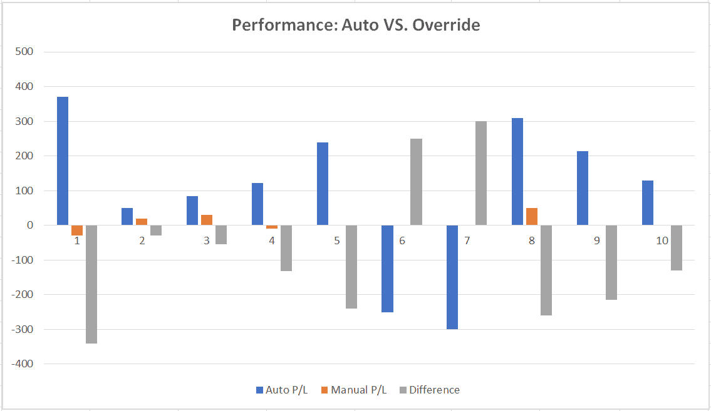

# 高效的自动交易系统覆盖:一种不干涉的方法

> 原文：<https://blog.quantinsti.com/automated-trading-system-overrides/>

扎克·奥克斯

在过去的十年里，交易有了很大的发展，我一直活跃在市场上。随着信息技术的发展，市场交易、进场交易和系统实施都取得了令人难以置信的进步。但是**伴随着巨大的权力而来的是巨大的责任**，在这个过程中有一些你必须克服/避免的技术障碍。

提供一点背景——我犹豫地说——我是一名全栈开发人员，但在我专注于编程之前，我是一名全权期货交易者，在此之前，我是现在 ICE 的场内做市商。我既有高科技背景，也有低科技背景，但我 95%的交易都是自动化的。

## **上线**

我将从一个故事开始…最近我推出了一个新的投资组合，对我来说，这意味着在几周内特别密切地监控系统，并准备好修复任何错误。我注意到，与过去不同的是，我发现这个任务很难用放手式的方式来管理。我想我对这个投资组合抱有期望，并对它进行了大量的研究和测试，所以我知道该期待什么，我想从中看到什么，这自然会导致交易情绪的同意/恐惧混合。

第一天，我注意到条目中有一些错误，但很快就被解决了——一切正常，除了我认为我知道得更好。

随着前几周所有标题风险和美联储会议纪要的出炉**，我认为我应该“确认”我的系统没有陷入任何情绪波动**。一般来说，我认为这是一种更合理、更负责任的覆盖系统的方法，就像在公布收益前调整或暂停系统一样。我现在有了**新规则**来定义什么是“好的”覆盖，但这并不那么简单。

## 也许我可以做得更好？

我看到了一个看起来只是典型的计算机逻辑错误的交易；它是黄金(GCQ19)，在一个大缺口似乎触及支撑后，它即将进入一个坚实的空头头寸。我可自由支配的日子让我尖叫着避免这种交易，但我决定:

如果有的话，如果它对我不利，我会迅速退出。T3】

总的来说，我不喜欢改变交易，但是如果系统持有时间很长，我会偶尔提前退出/止损。这个系统有一个持有期<1hr, so I was completely lying to myself, either way, I looked at it here.

的交易被填满，我很快就下跌了大约 100 美元/合约。我在寻找我的出口，确信我需要定期覆盖系统，因为这不能再清楚了。我等待着系统(希望)回到接近平衡的状态...交易中通常应避免的陈述。
不到 10 分钟，它就到了我的止损下限+250；它继续关闭(在 sim)大约 370，我为我的不耐烦踢我自己。

## **…我不能**

我们建立这些系统是为了比自己更好地交易，避免这些启发式的错误和偏见。然而，如果我们总是忽略我们的工作，我们就否定了自动交易的主要好处——消除人为错误。

我决定**关于这个话题真的没有太多的研究**，在不打开大量数据窥探或事后诸葛亮偏见的闸门的情况下，唯一的方法就是直播，金钱和机会就在眼前。我决定用一周的时间做 10 笔交易，以获取一个小而公平的微型样本，来研究超驰系统是如何影响我的表现的。

我有一个例子，我还有 9 个例子要做——我知道统计显著性的标准是> 30 个观察周期或> 100 个观察，但是如果我用当前的合计期望值-34，000 做 100 次，我就没有交易了。

## **结果**

附件是我这一周的交易报告，以及我的实际表现与被覆盖的结果的比较。这不是公平曲线，只是我有限干预和不干预的结果的可视化。

如您所见，干扰在很大程度上对帐户性能有害。当我认为我知道得更多的时候，似乎在大多数情况下我根本不知道；我最好让我努力开发的系统在没有干扰或干预的情况下运行。

## **改善监控习惯**

如果你需要更多的说服力，这里有一些我在这个过程中注意到的事情:

首先- **当你覆盖你的系统时，你几乎毁了你的性能数据**。我一周的表现并不反映我的系统表现，更多的是反映了我奇怪的混合交易系统的表现。

在验证新的投资组合方面，**这几周的数据**对我来说是有用的参考，但在业绩衡量方面毫无用处。

我也有过**几次干预**，结果造成的问题比我修复的多得多——例如，在 RB & NG 交易中，我平仓获利，然后系统触及跟踪止损下限并执行跟踪止损——让我反向进场，两次都令人沮丧地损失了 1 个基点。

我还注意到，干预往往会导致更多的干预**当你寻找更多的机会时，试着优化每一单交易，或者试着弥补过去犯下的愚蠢错误。这似乎也造成了更多的压力，因为我不再认为这是我所不能控制的，而是觉得我需要在为时已晚之前找到我系统中的错误。

最重要的是，**干扰我的系统让我损失了金钱**！没有理由进一步寻找理由，对我来说，这是一个效率更低，成本更高的交易方法。在相当沮丧的一周之后，我想出了一些帮助我正确监控和区分潜在的好的干预和坏的干预的建议。让我们从定义我认为的**实用覆盖**开始。我认为，如果出现罕见和不寻常的超额总体风险或无形风险，可以通过在交易日之前修改参数进行干预，或者只是暂时关闭系统。

**我觉得这个不应该经常做**；一个例子是，当利率决定即将到来时，在股票交易或美联储会议中发布收益。

给你一个我认为构成超额风险的概念，我认为每年这样做不应该超过 4-6 次。**

> **不要在每次有总统推特的时候停止你的系统——你永远不会完成任何交易。**

## ****帮助监控的一些技巧****

*   **在移动或其他有限的平台上进行监控(在这些平台上，如果您想进行更改而不引起问题，则无法进行更改)。**
*   ****远离它**；每隔 2-6x 回来一次(如果交易 15M，每隔 1.5 小时回来回顾交易；60M，每 2-3 小时一次)。**
*   ****保持忙碌**开发新系统，研究新项目或 alpha 模型。**
*   **平台静音对我来说很有帮助，每当我听到交易开始时，几乎不可能不看它。**
*   ****多目标** & /或跟踪止损/交替出场——它们有助于确保你在结束交易时有一定的判断力，例如，在第一根棒线内+250 的交易，或在均线下交叉的交易，作为移动授权进场信号。此外，使用不相关但交替的停顿也是有帮助的，比如 LL/HH 停顿等等。**
*   **建立适合你风格的系统——这很重要，如果它不适合你的交易风格，那就不容易监控。**
*   **我曾经用 **massive MFE 的**(会变成输家的大额盈利交易)交易了一个摇摆交易系统。对我(黄牛)来说，监控是无法忍受的。我缩短了区间，增加了跟踪止损和目标来消除大的 MFE。**
*   ****内置故障保护**，自动执行良好的覆盖——并坚持下去！**

## ****故障保护****

*   ****Failsafe:** 我使用一个基于 int 的 boolean，级别 0、1 或 2 表示警报级别(0 表示关闭，1 表示打印警报，2 表示暂停(数量= 0))。**
*   ****最大下降:**我留下 1 - 2 个标准偏差，超过迄今为止最大值或蒙特卡洛模拟的最大 DD。**
*   ****胜率:**我将这个设定为比我的实际胜率低 2.5 - 5%(如果胜率为 73%，则为< 70%)。(在开始时要小心，直到样本量很大——否则，1 或 2 笔亏损交易就会触发这种情况)**
*   ****最大损失:**我为滑点/缺口额外定价 1 - 2 个最大损失(或固定止损)。**
*   ****连续亏损的交易:**我添加了 1 或 2 笔比迄今为止最长的交易更长的交易。**
*   ****平均交易:** $5 - $10 <测试平均交易；(同样，要小心，直到样本量足够大)**

## ****结果汇总****

 **
*Totals Sys. Off = -34.2
*If you must, simply turn off temporarily

 

我的覆盖(相对于系统退出)的累计表现差是-850 美元/合约，所以我平均每笔交易比我的系统少 85 美元**。

除了欧元之外，我试图改进的所有工具总体上都是负面的(我确信*没有人*擅长交易欧元，这纯粹是小样本的运气)。

我进一步对否决进行了分类，在通过 ***停止**或省略一笔交易*否决的情况下，总的业绩差异为-34 美元/合约。

所以，如果你觉得*必须*覆盖，根据这个小样本，最好是简单地省略一个交易，而不是在交易进入后介入。总之，如果系统开始交易，你最好让系统结束交易——至少我是这样。对我有帮助的心态是对我的代码有信心，相信让这个*变成现在这个样子的能力和努力——我相信我自己的尽职调查。***

**我知道独自平仓是多么诱人，但是让你的系统赢得胜利吧！**

**交易愉快！

<small>*免责声明:本客座博文中提供的观点、意见和信息仅属作者个人观点，不代表 QuantInsti 的观点、意见和信息。本文中所做的任何陈述或共享的链接的准确性、完整性和有效性都不能得到保证。我们对任何错误、遗漏或陈述不承担任何责任。与侵犯知识产权相关的任何责任由他们承担。*</small>****