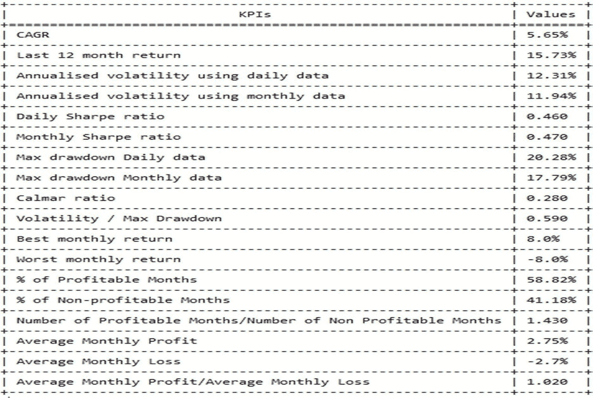
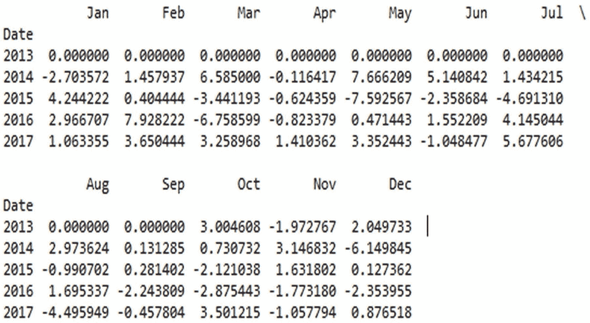
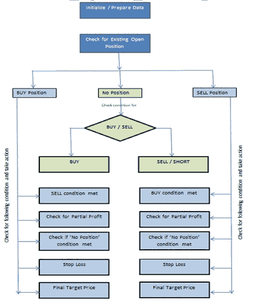
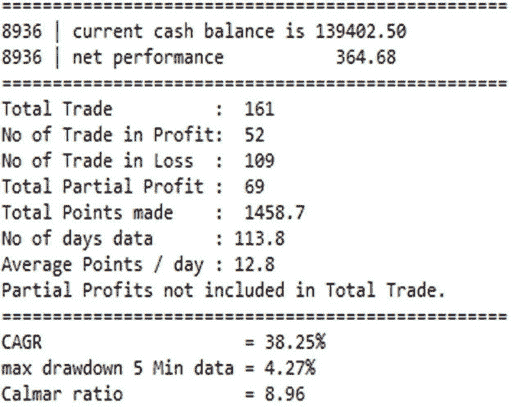
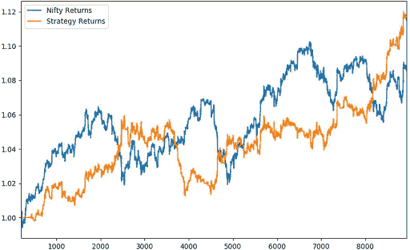

# 使用趋势跟踪指标的自动化

> 原文：<https://blog.quantinsti.com/automation-trend-following-indicators-project-rajesh/>

在这篇文章中，我们学习如何创建一个系统，该系统可以根据基于 200 均线和 50 均线的日内交易策略生成的信号生成买入、卖出和自动化订单。

本文是作者提交的最后一个项目，作为他们在 QuantInsti 的算法交易(EPAT ) 的[管理课程的一部分。请务必查看我们的](https://www.quantinsti.com/epat)[项目页面](/tag/epat-trading-projects/)，看看我们的学生正在构建什么。

这个博客还以可下载的格式提供了与本文相关的完整数据文件。

### **关于作者**

拉杰什·库马尔是 EPAT 大学的校友。他在 IT 领域有大约 20 年的经验，并且拥有很好的编程技能。目前，Rajesh 在一家 IT 公司工作，他加入 EPAT 是因为他对股票市场感兴趣，并且对算法交易非常感兴趣，以避免情绪部分，这是任何交易者在交易中的障碍。

### **本项目涵盖的主题:**

1.  [瞄准](#aim)
2.  [战略构想](#strategy-idea)
3.  [数据集](#dataset)
4.  [动机](#motivation)
5.  [目标](#objective)
6.  [创建的模块](#modules-created)
7.  [回溯测试程序](#backtest-program)
8.  [交易策略](#trading-strategy)
9.  [交易程序流程](#trading-program-flow)
10.  [交易策略回测结果](#backtest-result-trading-strategy)

创建一个系统，该系统可以根据下面详述的策略生成的信号生成购买、销售和自动化订单。我们将使用 Zerodha 进行实时数据和下单。

这是基于 200 均线和 50 均线的日内交易策略。我们将利用 5 分钟的数据。以下是该战略的详细内容:

*   检索 Nifty 的 5 分钟数据。
*   计算 200 均线和 50 均线。
*   我们将采取一个长期和短期的立场。当多头头寸开始时，我们买入看涨期权，当空头头寸开始时，我们买入看跌期权。在执行回测之后，我增加了额外的 7 个点来最小化拉锯
*   同样，当 Nifty 收盘价低于 200 均线和 50 均线时开始卖出
*   如果 Nifty close 在 200 SMA 和 50 EMA 之间，那么就没有仓位。
*   部分利润预定为 20 个点

注意:还将创建用于衡量该策略绩效的模块

实时漂亮的 5 分钟数据

我一直手动交易这个策略，知道它有效。有时，由于情绪的原因，我错过了一些交易或者减少了我的利润。我想自动化这一战略，以便这可以被我用作 LFT。

创建一个交易系统，该系统可以产生买入、卖出信号，并根据下面详述的策略产生的信号自动下单。

我们将使用 Zerodha 进行实时数据和下单。

作为该项目的一部分，创建了以下模块

**用于回测**

- SMA-200 EMA 50 v2.0

模板程序，可用于使用日常数据对任何策略进行回溯测试

-回溯测试库

生成买入/卖出信号时，创建可在模板程序中用于计算的通用模块

-检查性能

创建了通用模块，可在模板程序中用于计算以下 KPI

1.  年回报率
2.  过去 12 个月的回报
3.  波动性
4.  夏普比率
5.  最大水位下降
6.  卡尔马尔比率(年化回报/最大提取额)
7.  波动性/最大提款
8.  最佳月度表现
9.  最差月份表现
10.  盈利月百分比和非盈利月百分比
11.  盈利月数/非盈利月数
12.  平均月利润
13.  平均月损失
14.  平均月利润/平均月亏损

**实时交易程序**

- Strategy 200 SMA v3.0

一个包含我的实时自动交易策略的程序

**我的策略的回溯测试程序**

- SMA-200 EMA 50 v1.0

这个程序是用 5 分钟的数据来测试我的策略的

**6 月 27 日的 5 分钟 csv 数据**

- Nifty_5m -完整数据

我的回溯测试程序 SMA-200 EMA 50 v1.0 使用了这些数据

我为[回溯测试](/backtesting/)创建了 3 个通用模块。这使用每日数据并生成各种报告和 KPI。下面是我的策略使用 5 年每日数据生成的样本

*   KPI

这是基于 200 均线和 50 均线的日内交易策略。我们将利用 5 分钟的数据。下面是策略的细节:

*   检索 Nifty 的 5 分钟数据。
*   计算 200 均线和 50 均线。
*   我们将采取一个长期和短期的立场。当多头头寸开始时，我们买入看涨期权，当空头头寸开始时，我们买入看跌期权。在执行回测之后，我增加了额外的 7 个点来最小化拉锯
*   同样，当 Nifty 收盘价低于 200 均线和 50 均线时开始卖出
*   如果 Nifty close 在 200 SMA 和 50 EMA 之间，那么就没有仓位。
*   部分利润预定为 20 个点

用于测试的 2017 年 6 月 27 日的 5 分钟数据。

*   以 30，000 卢比的初始资本对此进行了测试。
*   买入/卖出 2 手漂亮的买入/卖出期权。
*   以下是性能结果

下面是漂亮回报和策略回报的图表

你可以阅读更多关于建立趋势跟踪策略的五个指标。

### **结论**

在这个策略中，使用了 NIFTY 的 5 分钟数据，从 2017 年 6 月到 2017 年底，这给出了大约 8%的回报，但使用这个策略提供了 12%的回报。做这个项目背后的整个想法是有足够的信心，可以创建一个通用模型，任何人都可以使用它来执行回溯测试，以检查他们的策略(任何策略)的性能。任何对交易和 python 有实时了解的人(如果他们有自己现有的策略)都可以使用这个模型，添加他们的数据，建立自己的交易系统。他们可以进行回溯测试，检查业绩，还可以进行实时交易。

* * *

你也可以通过算法交易(EPAT) 的[执行程序学习算法交易的各个方面。课程涵盖统计学&计量经济学、金融计算&技术和算法&定量交易等培训模块。EPAT 教你在算法交易中建立一个有前途的职业所需的技能。](https://www.quantinsti.com/epat/)

免责声明:就我们学生所知，本项目中的信息是真实和完整的。所有推荐均由学生或 QuantInsti**提供，不做任何保证。学生和 quantin STI***否认对这些信息的使用负有任何责任。本项目中提供的所有内容仅供参考，我们不保证通过使用该指南您将获得一定的利润。*T15】**

****下载中的文件:****

*   **数据文件**
*   **Python 代码**