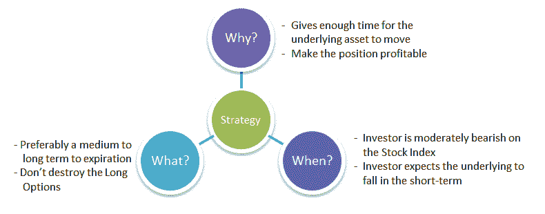
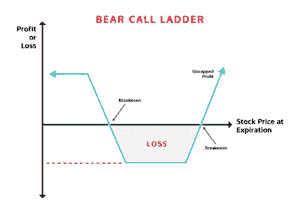
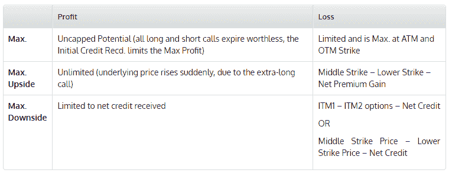
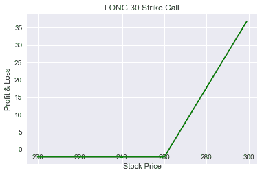
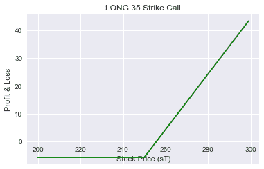
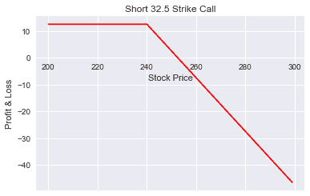
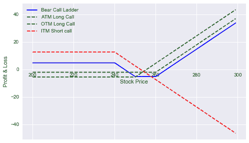
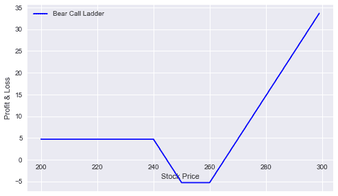

# Python 中的熊市看涨梯形期权交易策略

> 原文：<https://blog.quantinsti.com/bear-call-ladder-options-trading-strategy-python/>

由 [Viraj Bhagat](https://www.linkedin.com/in/virajbhagat/) 我们之前遇到过以下策略:

*   [铁鹰交易策略](https://blog.quantinsti.com/iron-condor-options-trading-strategy)是结合了看涨看跌价差和看跌看涨价差的期权交易策略
*   [蝴蝶价差交易策略](https://blog.quantinsti.com/butterfly-spread-options-trading-strategy-python/)是牛价差和熊价差的结合，中性交易策略

这些期权交易策略是牛市和熊市价差的结合。我将带你浏览熊看涨期权阶梯，它也是熊看涨期权价差的扩展，并通过用 Python 编写策略代码，用一个真实的交易市场例子来解释策略。

### 什么是交易中的阶梯？

阶梯是一种期权合约(看涨或看跌)，允许在期权到期前赚取利润，直到资产的市场价格达到一个或多个执行价格。在特定的交易水平期间，它通过在一个或两个方向上限制旧的执行价格和新的执行价格之间的利润来重置，从而允许支付的灵活性。就像梯子的横档一样，触发打击降低了风险，一旦资产的市场价格达到触发点，它就锁定了利润，从而增加了盈利能力。

### **什么是熊叫天梯？**

熊市看涨梯也被称为“空头看涨梯”，是熊市看涨期权价差的延伸。虽然这不是一个看跌策略，但它是在看涨时实施的。它通常为“净信贷”而设立，购买看涨期权的成本通过出售“价内”看涨期权来融资。对于该[期权交易策略](https://quantra.quantinsti.com/course/options-trading-strategies-python-basic)，必须确保买入期权属于相同的到期日，相同的标的资产和比率得到维持。它主要通过保险来保护卖出看涨期权的不利一面，即通过买入更高执行价格的看涨期权。但重要的是，只有当你确信市场将大幅上涨时，你才执行策略。

### **选择看涨期权阶梯交易策略**



### **建立看涨期权阶梯交易策略**

熊市看涨梯是一种三足期权策略，通常为“净信贷”而设立，用于具有更高行权日期和价格以及相同到期日的相同基础工具。**熊叫梯大概是这样的:** 

#### **选项选择**

*   选择流动性好的期权
*   未平仓权益至少应为 100，最好为 500
*   下罢工- ITM
*   中层罢工-一个或两个罢工以上的低罢工，即进一步 OTM
*   更高的走向-高于中间走向，即更远的 OTM

#### **执行**

*   卖出 1 份 ITM 看涨期权
*   购买 1 个自动柜员机认购期权
*   购买 1 份 OTM 看涨期权

以 1:1:1 的比率组合执行，即每卖出 1 份 ITM 看涨期权，就必须买入 1 份自动柜员机期权和 1 份 OTM 看涨期权。(例如，卖出 1 台 ITM，购买 1 台自动取款机和 1 台 OTM)其他可能的组合是 2:2:2 或 3:3:3(以此类推)。

#### **优先于认购比率价差**

*   对看涨期权比率价差的即兴创作
*   看涨期权比率价差是通过买入 1 份 ITM 看涨期权和卖出 2 份自动柜员机看涨期权而形成的。卖出的期权多于买入的期权，使得多余的期权无所遁形，这对交易者来说是一种风险。
*   在这种情况下，执行成本优于看涨期权比率价差(由于这一点，市场的波动范围也变得很大)
*   现金流总是更好，因为买入看涨期权的执行价格高于卖出看涨期权的执行价格



#### **风险**

交易者或投资者买入的看涨期权多于卖出的，因此限制了最大值。风险

#### **盈亏平衡**

*   较低的盈亏平衡=较低的罢工+净信贷
*   上盈亏平衡=长期履约-短期履约-净溢价

净信贷=从 ITM CE 收到的溢价–支付给自动柜员机和 OTM CE 的溢价=当市场下跌时=净信贷

```py
Tips:
- Understand the direction of the trend
- Identify a clear area of support
- Identify the resistance
```

#### **到期**

期限:只有漂亮的期权是 6 个月的，是流动的，不像其他的。大约 6 个月会更安全。对所有航段使用相同的截止日期。

#### **到期前的替代品**

*   常见做法:在到期前平仓以获取利润，或者因为有 2 个多头看涨期权，止损
*   最佳:从中期到到期结束
*   过期后的替代品:清仓。卖出买入的看涨期权，买回卖出的看涨期权

#### **熊叫梯的优势**

这里最大的优势是能够从基础资产的 5 个可能的变动中的 4 个中获利，以及无限的上升利润

#### **熊叫梯的缺点**

由于这是净信用利差，因此需要保证金

#### **熊市买入阶梯期权交易策略示例**

如果 ABC 现在的股价是 50。市场预计会上涨。所以交易者是这样做的:

*   出售 1 ITM 55 罢工呼吁为印度卢比 5
*   以 2.5 印度卢比购买 1 台 ATM 60 罢工电话
*   购买 1 个 OTM 65 罢工电话为印度卢比 1

如果 ABC 保持在 500 以下，投资者可以获得 1.5 的溢价流入并受益。

*   净信用=卖出溢价-买入溢价= 5 - 2.5 - 1 = 1.5
*   最大风险=中击-下击+净借方(或-净贷方)= 60 - 55 - 1.5 = 3.5
*   最高奖励=无限制
*   盈亏平衡(下跌)=下限+净借方(或+净贷方)= 55 + 1.5 = 56.5
*   盈亏平衡(上涨)=更高的罢工+最大风险= 65 + 3.5 = 68.5


### **实例**

为了解释熊市看涨梯交易策略，我们将使用印度国家银行(股票代码:SBI)目前使用从[nseindia.com 获得的期权链的以下真实市场示例。](https://www.nseindia.com/)


### **用于熊调用阶梯策略的 Python 代码**

#### **导入库**

```py
import numpy as np
import matplotlib.pyplot as plt
import seaborn
seaborn.set(style="darkgrid")
```

#### **计算收益**

```py
def call_payoff (sT, strike_price, premium):
return np.where(sT> strike_price, sT-strike_price, 0)-premium

# SBI spot Price
s0 = 250

# Long Call

OTM_long_call = 260
premium_OTM_long_call = 2.15

ATM_long_call = 250
premium_ATM_long_call = 5.65

# Short Call

ITM_short_call = 240
premium_ITM_short_call = 12.50

# Range of call option at epiration
sT = np.arange(200,300,1)
```

#### **长呼 1 的收益**

```py
OTM_long_call_payoff = call_payoff(sT, OTM_long_call,premium_OTM_long_call)

fig, ax = plt.subplots()
ax.spines['bottom'].set_position('zero')
ax.plot(sT,OTM_long_call_payoff, color='g')
ax.set_title('LONG 30 Strike Call')
plt.xlabel('Stock Price')
plt.ylabel('Profit & Loss')
plt.show()
```



#### **长呼 2 的收益**

```py
ATM_long_call_payoff = call_payoff(sT, ATM_long_call, premium_ATM_long_call)

fig, ax = plt.subplots()
ax.spines['bottom'].set_position('zero')
ax.plot(sT,ATM_long_call_payoff, color='g')
ax.set_title('LONG 35 Strike Call')
plt.xlabel('Stock Price (sT)')
plt.ylabel('Profit & Loss')
plt.show()
```



#### **短期买入回报**

```py
ITM_Short_call_payoff = call_payoff(sT, ITM_short_call, premium_ITM_short_call)*-1.0

fig, ax = plt.subplots()
ax.spines['bottom'].set_position('zero')
ax.plot(sT, ITM_Short_call_payoff, color='r')
ax.set_title('Short 32.5 Strike Call')
plt.xlabel('Stock Price')
plt.ylabel('Profit & Loss')
plt.show()
```



#### **熊市阶梯平仓**

```py
Bear_call_ladder = OTM_long_call_payoff + ATM_long_call_payoff + ITM_Short_call_payoff

fig, ax = plt.subplots(figsize=(8,5))
ax.spines['bottom'].set_position('zero')
ax.plot(sT,Bear_call_ladder,color='b', label= 'Bear Call Ladder')
ax.plot(sT, ATM_long_call_payoff,'--', color='g',label='ATM Long Call')
ax.plot(sT, OTM_long_call_payoff,'--', color='g', label='OTM Long Call')
ax.plot(sT, ITM_Short_call_payoff, '--', color='r', label='ITM Short call')
plt.legend()

plt.xlabel('Stock Price')
plt.ylabel('Profit & Loss')
plt.show()
```



#### **熊叫梯**

```py
Bear_call_ladder = OTM_long_call_payoff + ATM_long_call_payoff + ITM_Short_call_payoff

fig, ax = plt.subplots(figsize=(8,5))
ax.spines['bottom'].set_position('zero')
ax.plot(sT,Bear_call_ladder,color='b', label= 'Bear Call Ladder')
plt.legend()
plt.xlabel('Stock Price')
plt.ylabel('Profit & Loss')
plt.show()
```



```py
Profit = max(Bear_call_ladder)
Loss = min(Bear_call_ladder)

print Profit
print Loss
```

```py
Max. Profit: 33.7
Max. Loss: -5.30
```

### **结论**

当你确信基础证券将大幅波动时，最好使用空头看涨梯或空头看涨梯。如果走势偏高，这是一种有限的风险和无限的回报策略。

### **下一步**

你是否热衷于学习更多关于[算法交易](https://www.quantinsti.com/epat/)的知识？联系我们，了解不同的金融策略世界观。 [QuantInsti](https://www.quantinsti.com/) 帮助人们获得适用于各种交易工具和平台的技能。算法交易(EPAT)的[高管课程](https://www.quantinsti.com/epat/)涵盖了统计学&计量经济学、金融计算&技术和算法&量化交易等培训模块。EPAT 让你具备成为成功交易者所需的技能。*免责声明:股票市场的所有投资和交易都有风险。在金融市场进行交易的任何决定，包括股票或期权或其他金融工具的交易，都是个人决定，只能在彻底研究后做出，包括个人风险和财务评估以及在您认为必要的范围内寻求专业帮助。本文提到的交易策略或相关信息仅供参考。*

### **下载数据文件**

*   熊市看涨期权策略–Python 代码