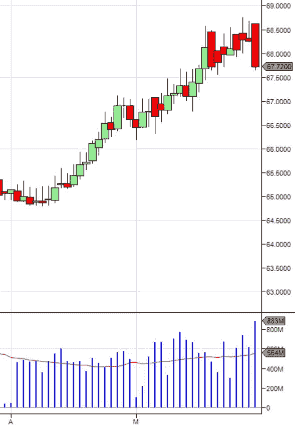
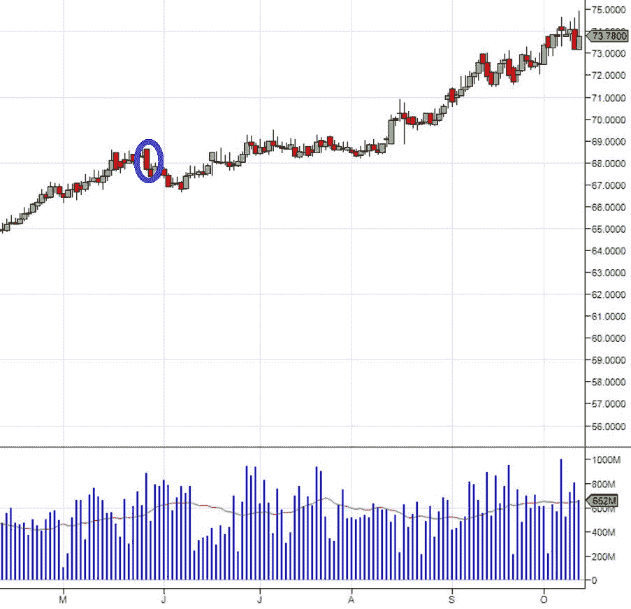

# 空头陷阱-交易

> 原文：<https://blog.quantinsti.com/bear-trap/>

由[瓦伦·迪瓦卡](https://www.linkedin.com/in/varun-divakar-b862a667/)

在这篇博客中，我们将学习一个交易术语，叫做空头陷阱。我们将讨论这个词的含义，学习如何识别陷阱，以及当陷入这样的陷阱时如何保护自己免受损失。

## **捕熊陷阱**

对于不熟悉市场的人来说，交易本身就像一个陷阱。即使对那些熟悉市场的人来说，也有一些他们必须避免的陷阱。空头陷阱是交易者应该熟悉的市场中的主要陷阱之一。

陷入空头陷阱会严重伤害交易者的 PnL，因为这些陷阱通常是快速的，几乎没有机会恢复。在熊市陷阱期间，理解潜在的市场运动可以帮助你识别它，保护你的 PnL。

熊市陷阱通常发生在市场错误地发出牛市趋势反转的信号时。让我们讨论一下为什么以及如何给市场中的空头(卖家)设陷阱的各种原因。

## **捕熊陷阱的条件**

熊市陷阱发挥作用的主要和必要条件是市场中现有的牛市趋势或一条使市场整体情绪看涨的消息。当市场上出现如此强烈的看涨情绪时，一些交易者试图通过趋势交易快速获利。这些交易者大多是游击手，持有时间少，本质上是散户。

当这些小交易者或散户交易者在牛市趋势的急剧逆转中被套时，就会有意或无意地设置空头陷阱。这种急剧逆转可能是由于机构投资者的利润预订，或新基金进入市场挤压弱势多头(散户)。

但这种急剧逆转可能会被正在寻找顶部形态的看跌交易者视为趋势逆转的迹象。这些交易者可能想做空市场，要么是因为他们觉得市场被高估了，要么是因为他们觉得趋势即将修正。看跌的交易者经常错误地认为这是反转，希望在小交易者平仓的时候进入市场。

通常，牛市中的这种大幅下跌只会持续很短时间，任何在大幅抛售后做空市场的看跌交易者都会在底部被套。

## **如何识别空头陷阱**

让我们用一个例子来了解如何识别熊市陷阱。假设我看到了牛市中的大幅抛售，那么我将检查这一举动是否伴随着高于平均水平的交易量，以及是否没有新的外部因素可以证明趋势的大幅反转。如果这些标准得到满足，那么我认为这是一个空头陷阱，市场将暂时保持横盘，稍后恢复趋势。所以，我会坚持做多，等待高点再次被考验。

## **图表中的空头陷阱**

让我们来看一个真实市场中熊市陷阱的例子。2018 年，美元/印度卢比出现大幅反弹。在此轮反弹过程中，有一天出现了大幅抛售，同时交易量大幅飙升。

抛售之后，有几天市场继续看跌或横盘。但一旦市场恢复并再次测试高点，反弹就恢复了，市场收盘时大幅上涨。

这是一个典型的空头陷阱。任何认为反弹已经结束而做空市场的交易者，肯定会被后来的市场波动所套牢。

## **卖空和空头陷阱**

当空头交易者用他们的保证金账户进入空头头寸时，空头陷阱也会发生。这些交易者感受到了最大的痛苦，当市场从低点反弹，他们的保证金要求被触发时，他们被迫尽早回补他们的空头。即使市场不处于牛市趋势，这种情况也可能发生。央行的卖空禁令和干预是一个极好的例子，说明了看跌情绪如何转化为做空或空头陷阱。

## **如何避免熊市陷阱**

避免熊市陷阱的最好方法是制定一个严格的出场标准，并设置严格的止损。有效的风险管理和正确的进场和出场时机会对短线交易的结果产生很大的影响。

另一种避免空头陷阱的方法是将最近的趋势高点设定为止损点，然后做空。

空头陷阱在日内外汇市场很常见。要了解更多关于外汇市场的陷阱以及如何使用新技术进行交易，请访问我们最新的课程。

*免责声明:股票市场的所有投资和交易都涉及风险。在金融市场进行交易的任何决定，包括股票或期权或其他金融工具的交易，都是个人决定，只能在彻底研究后做出，包括个人风险和财务评估以及在您认为必要的范围内寻求专业帮助。本文提到的交易策略或相关信息仅供参考。T3】*