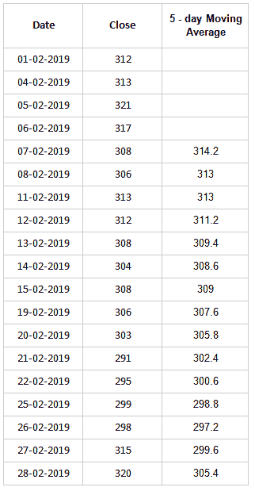
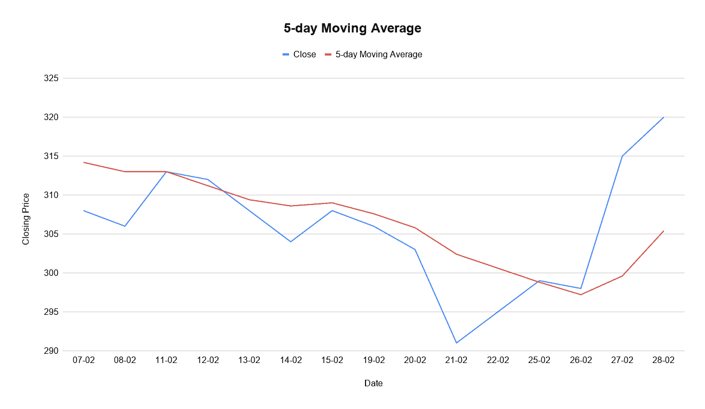
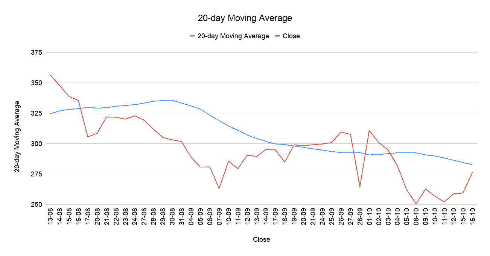
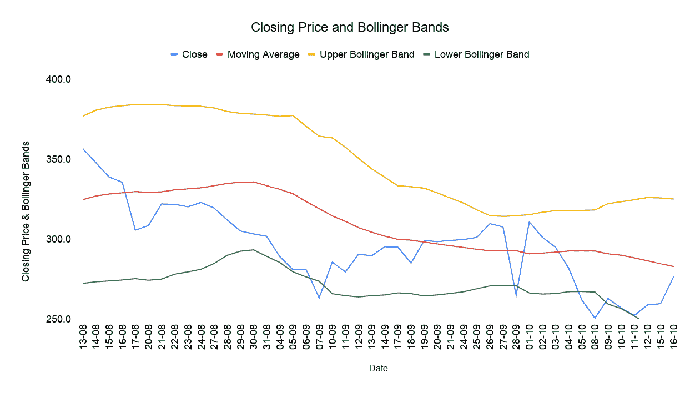
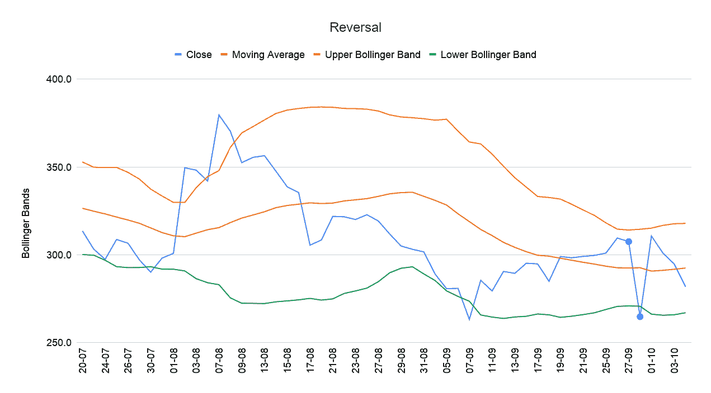
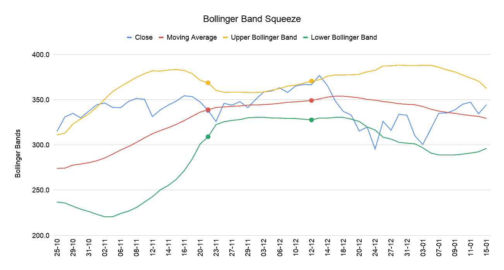
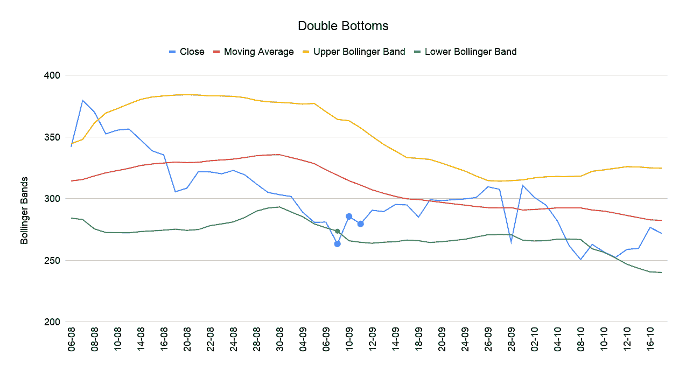
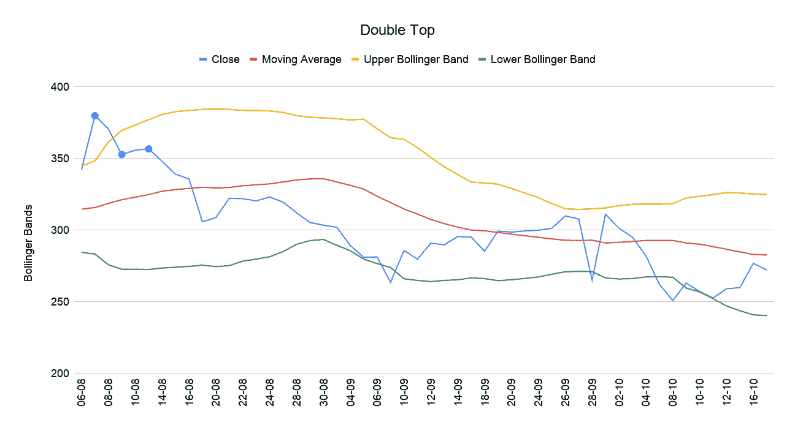
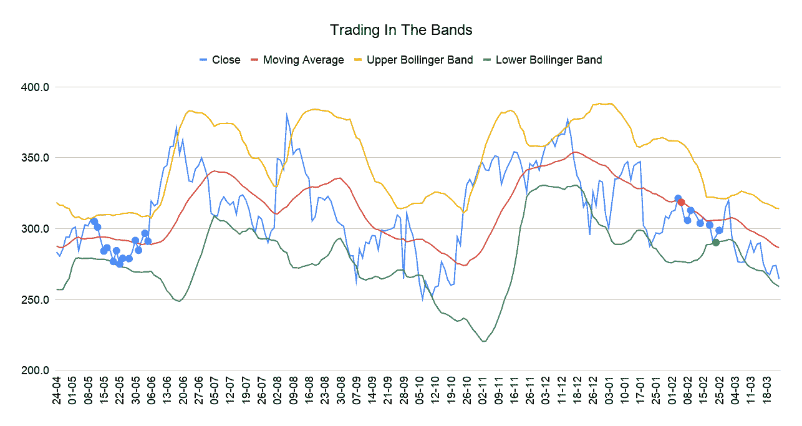
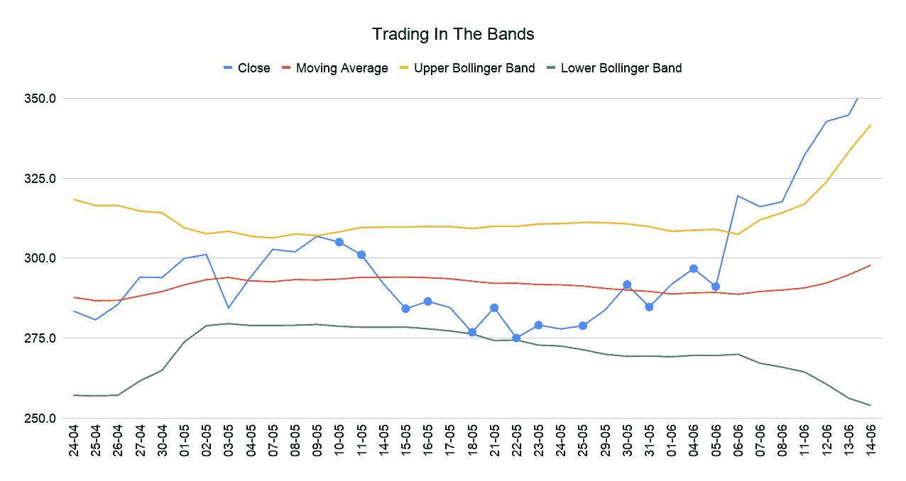

# 如何使用布林线

> 原文：<https://blog.quantinsti.com/bollinger-bands/>

以[重香重香](https://www.linkedin.com/in/rekhit/)

布林线对于交易来说就像莎士比亚对于文学一样，非常重要，如果你想在交易界有所成就，这是很难避免的。布林线是一个[技术指标](https://blog.quantinsti.com/indicators-build-trend-following-strategy)，用于以更好的方式分析市场，并帮助我们对资产价格做出更好的假设，即资产是超买还是超卖。

在本文中，我们将讨论:

*   [如何绘制布林线图](#bollinger_band)
*   [布林线带宽](#bollinger_bandwidth)
*   [基于布林线的交易策略](#strategy)
*   [限制](#limitation)

布林线实际上由三个波段组成:

1.  20 天移动平均线
2.  布林带上轨
3.  下布林线

下面就来详细说说吧。

### **1。20 天移动平均线**

你一定在想，为什么规定在 20 日[均线](https://blog.quantinsti.com/moving-average-trading-strategies)。首先，它是由布林线的创造者，[约翰·布林格](https://en.wikipedia.org/wiki/John_Bollinger)先生本人指定的。

移动平均线就是一系列数字的平均值。让我们以特斯拉汽车公司(TSLA)为例。二月份的收盘价如下:


如果我们必须计算上表中收盘价的 5 天移动平均值，我们将首先找到前五个值的平均值，即(312+313+321+317+308)/5 = 1571/5 = 314.2。

对于下一列，它将是下列值，(313+321+317+308+306)/5 = 1565/5 = 313

插入其他值，表格现在看起来像这样，



如果我们要创建一个如下的图表，它看起来会像下面这样，



同样，对于布林线，我们使用 20 日均线，而不是 5 日均线。下面显示了一个示例。(数据取自特斯拉 2018 年 10 月 13 日至 2018 年 10 月 16 日)



### **2。布林线上轨**

布林线上轨是通过在 20 日均线上方移动 2 个标准差构建的。

因此，对于上面的数据，当添加到图表中时，布林带上轨看起来像这样。


### **3。布林线下轨**

类似于上布林线，我们在 20 天简单移动平均线(SMA)下方两个标准差处构建下布林线。



布林线的上下轨距离均线两个标准差的原因是，这在收盘价周围形成了一个包络，包含了价格动作的大部分。从统计上看，两个标准差包含了 95%的价格变动。因此，任何时候收盘价低于或高于布林线，都有很大的机会突破或价格反转，因此它可以被用作信号。

布林线的美妙之处在于它可以用于任何类型的市场，从股票到衍生品，还有外汇。

就是这样！现在你知道如何为任何股票创建布林线。 **但是等等！**

除了布林线，约翰·布林格说我们也应该看看波段的带宽，以帮助我们的分析。计算带宽非常简单，如下所示:

```py
[(Upper Band - Lower Band)/SMA] * 100
```

布林线带宽被有效地用来识别布林线挤压。

我们现在转移到主要事件，试图找出如何使用布林线来创建一个交易策略。

以下是一些交易策略，可以用来保持布林线的中心。

### **基于布林线的交易策略**

#### **反转**

我们谈到了布林线如何包含波段中的大部分价格行为。这意味着，在任何时候，如果价格高于或低于布林线，它可以作为一个信号。

这就是反转交易策略的逻辑。我们知道恐惧和贪婪驱动着市场。因此，我们可以说，如果价格高于布林带上轨，这可能是趋势可能反转的迹象。一个类似的例子是当价格低于较低的布林线。

示例:



你可以在上面的股票图表中看到，在 9 月 27 日，价格突破了较低的布林线，然后在接下来的几天里看涨。

你必须明白，价格趋势的反转可能是由多种因素造成的，尤其是波段本身。

例如，虽然在特斯拉布林线的图表中，你会看到价格暴跌，这是由于美国证券交易委员会因虚假新闻起诉埃隆马斯克的消息。

#### **布林线挤压**

布林线帮助我们理解资产的波动性。当市场强烈看涨(或看跌)时，由于其固有的属性，布林线包络将大幅加宽。在低波动时期，或者当资产价格停滞不前时，布林线包络收缩，有效地挤压 SMA。

布林线策略用于识别一段时间，在这段时间内，布林线被挤压在一起，表明可能会发生突破。

不像上面讨论的策略，你知道趋势的方向，在一段时间的低波动后，很难预测价格的走向。



例如，在这个图表中，你可以看到布林线在中间挤压，从 11 月 21 日到 12 月 12 日，然后突破。

#### **双底**

虽然双底策略并不完全是布林线独有的，但它可以有效地使用。顾名思义，在双底形态中，我们正在寻找一个 W 形形态，价格在下一个周期短暂上涨之前一度收于下轨下方，但最终再次收于下布林线下方。

正是在这个时候，大多数交易者相信价格会上涨并持续下去。

通常，当价格突破较低的波段，在再次跳水之前反弹一段时间，交易者就会锁定。如果第二个低点在较低波段之上，一般认为是双底，很有可能是上升趋势。



例如，我们可以看到，在 9 月 7 日，价格突破了较低的布林线，然后反弹。价格再次下降，但没有突破较低的布林线，因此，这可以称为双底设置。

如果我们更进一步，我们可以在 10 月 5 日以后看到同样的模式。

#### **双顶**

类似于双底集中在下布林线，双顶出现在上布林线。与之前看到的双底相比，双顶的形成是很少见的。

在双顶(或 M 顶)中，我们倾向于观察价格在下跌一段时间后再次上涨之前突破布林带上轨的情况。交易员将检查第二次上涨是否收于布林带上轨以下，只有那时他们才会做空资产。



例如，价格在 8 月 7 日突破了布林带上轨，然后再次跌破布林带上轨。8 月 10 日再次上涨，但没有突破布林带上轨。因此，这是一个双顶设置。

#### **波段交易**

对于满足于低风险但安全的投资回报的相对低风险的人来说，一个有效的策略是把 SMA 作为进场或出场的信号。因为 SMA 本质上是一个均线，价格从 SMA 的一边到另一边波动，你一定会盈利。这种策略也可以在波动性非常低的时候使用。



在图表中，你可以看到在 2 月 6 日，当价格到达 SMA 时，它改变方向，到达布林带下轨，然后再次反转方向。



早期策略的一个变化是，当价格触及 SMA 时，我们不是退出，而是在波段内和趋势内进入交易，在触及另一个波段时退出。例如，如果收盘价在再次上涨之前触及了布林带下轨，并且如果我们确信它将维持价格上涨，我们就买入股票，并在触及布林带上轨时退出。

在图表中，你可以看到价格在 5 月 9 日触及布林带上轨时改变方向，在 5 月 22 日触及布林下轨时再次改变方向。

### **限制**

布林线的局限性在于，它们是使用 20 天移动平均线计算的，这意味着它们对所有数据点的权重相同。因此，最近发生的事件不会被赋予更大的权重，可能会削弱指标正确观察趋势的能力。

人们普遍认为，我们不应该使用布林线作为唯一的指标来进行交易，因为它不会盈利，因为简单的事实是，市场不会奖励个人表现明显。一个好主意是将它与其他指标如 MACD 或 RSI 配对，以做出更好的交易决定。

总之，布林线是理解资产价格行为的好方法，有助于我们更好地决定何时交易。您可以使用不同指标的组合来创建自己的策略。算法交易策略的[入门包](https://quantra.quantinsti.com/programme/algo-quant-trading-strategies-beginners)将帮助你使用能够适应实时市场条件的技术指标创建量化交易策略。

*免责声明:股票市场的所有投资和交易都有风险。在金融市场进行交易的任何决定，包括股票或期权或其他金融工具的交易，都是个人决定，只能在彻底研究后做出，包括个人风险和财务评估以及在您认为必要的范围内寻求专业帮助。本文提到的交易策略或相关信息仅供参考。*