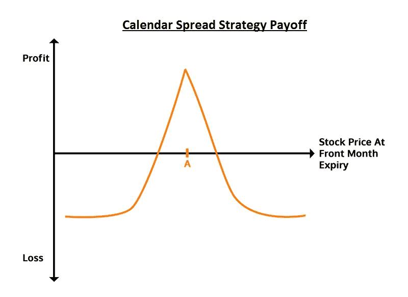
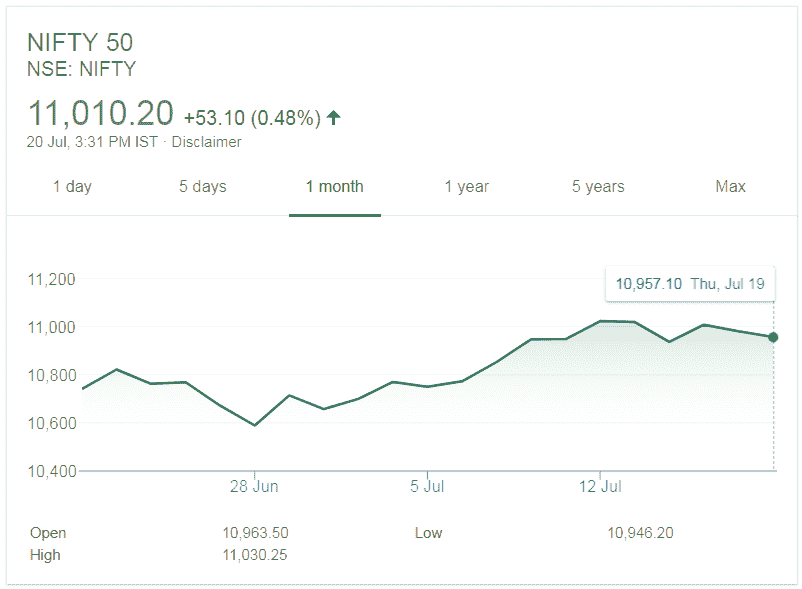

# Python 中的日历价差期权交易策略

> 原文：<https://blog.quantinsti.com/calendar-spread-options-trading-strategy/>

由[维拉伊·巴加](https://www.linkedin.com/in/virajbhagat/)

日历跨页是跨页家族的一部分。日历价差可以由所有看涨期权或所有看跌期权创建，它确实存在方向性偏差。在这里，我们将学习日历差价期权交易策略，并使用 Python 通过市场实例来创建它。

本文涵盖:

*   [期权价差](#what-are-option-spreads)
*   [日历跨页](#what-is-a-calendar-spread)
*   [不同类型的日历跨页](#what-are-the-different-types-of-calendar-spreads)
*   [构建日历传播策略](#construction-of-a-calendar-spread-strategy)
*   [日历差价交易策略的设置](#set-up-of-a-calendar-spread-trading-strategy)
*   [日历跨页示例](#example-of-a-calendar-spread)
*   [实施日历差价期权交易策略](#implementing-the-calendar-spread-options-trading-strategy)
*   [计算日历差价收益](#calculating-the-calendar-spread-payoff)

* * *

## 什么是期权差价？

期权交易在交易领域已经取得了长足的进步。绝大多数交易者都用一些创新的交易策略在市场上留下了自己的印记。不仅是他们，还有许多其他人采用了这种交易策略，并从中受益。

期权差价可以通过同时买入和卖出期权来产生，这两种期权都是相同类型，基于相同的基础证券，具有不同的执行价格和/或不同的到期日。

**注**

*   **买入价差** -使用买入或买入期权构建的价差是买入价差
*   **看跌价差** -使用看跌期权或看跌期权创建的价差是看跌价差

* * *

*建议阅读:*

*   *[期权交易基础知识讲解](/basics-options-trading/)*
*   *[【网上研讨会录制】选项-真实游戏](/webinar-options-the-real-game-30-september-2020/)*

* * *

## 什么是日历跨页？

日历跨页是跨页家族的一部分。日历价差可以由所有看涨期权或所有看跌期权创建，它确实存在方向性偏差。在这里，只有腿因不同的到期日而有所不同。

日历价差也被称为**水平价差**或**时间价差**(其背后的想法是出售时间并利用隐含波动率的上升)。日历差价策略可以作为看涨或看跌策略交易。

当交易员预计短期内会出现渐进或横向波动，并且在较长期期权的生命周期内更倾向于某个方向时，就会采用日历价差。

* * *

## 有哪些不同类型的日历跨页？

下面的图表清楚地解释了当今流行的各种日历跨页的差异。

* * *

## 日历传播策略的构建

日历跨页策略的构建包括以下选项:

*   同等数量的自动柜员机或轻微 OTM 呼叫
*   同样的标的股票，
*   在相同的执行价格，和
*   不同的到期月份

在这里，如果近月期权到期时的基础价格保持不变，则近月期权到期时毫无价值。

**日历价差策略将给出类似下图的收益:**

* * *

## 日历差价交易策略的设置

日历跨页可以通过以下方式设置:

*   卖出/做空 1 期权(前一个月)
*   买入/做多 1 期权(前一个月)
*   这两种期权应该是同一类型的，即要么是看跌期权，要么是看涨期权
*   两种期权应该有相同的执行价格
*   基于相同的基础资产

**利润:**当空头期权到期无价值，IV 在多头期权中扩张时，获得理想利润。无法计算最大利润和盈亏平衡，因为两个选项的到期日期不同。由于期权在不同时间到期，因此无法计算潜在利润

**损失:**最大损失或风险等于为建立交易而支付的初始净借方。如果股票价格剧烈波动或离执行点太远，交易就会造成损失。如果所有选项都有相同的截止日期，则用直线和锐角表示。由于这些电话的到期时间不同，线路也不是直的。

* * *

## 日历跨页示例

让我们用一个简单的 ABC 公司的例子来理解日历传播。

*   2018 年 3 月，ABC 股票交易价格为 100.5 印度卢比
*   以 1.00 印度卢比的价格卖出 4 月 100 日的看涨期权(一份合约 100 印度卢比)
*   以 2.00 印度卢比买入 5 月 100 日的看涨期权(一份合约 200 印度卢比)
*   净成本(借方)1.00 印度卢比(一份合同 100 印度卢比)

* * *

## 实施日历差价期权交易策略

对于这个例子，我将使用 **Nifty** 。

下图捕捉了长达一个月的运动:

Nifty 在本月迄今为止没有看到任何突然的行动，最低为 10589.10 印度卢比，最高为 11023.20 印度卢比，最高接近目前的执行价格 11010.20 印度卢比。根据谷歌财经。

正如策略所解释的，我将卖出 1 个看涨期权，买入 1 个看涨期权，两者都是在 ATM 上，在这种情况下是 11023.20 印度卢比。

以下是 7 月和 8 月 Nifty 期货的期权链:

这是 Nifty 截止日期为 2018 年 7 月 27 日的期权链。

这是 Nifty 截止日期为 2018 年 8 月 30 日的期权链。

来源:nseindia.com

* * *

## 计算日历差价收益

现在，我们将使用 Python 编程代码浏览收益图。日历价差策略受益于期权隐含波动率的时间衰减和/或增加。

在这本笔记本中，我们将创建一个在近月期权到期时的日历价差的收益图。

### 步骤 1 -导入库