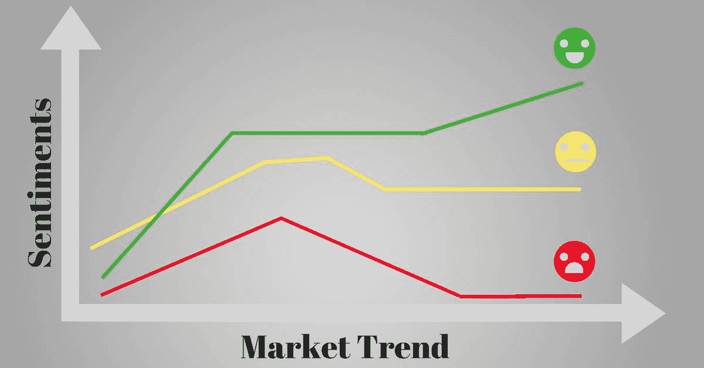
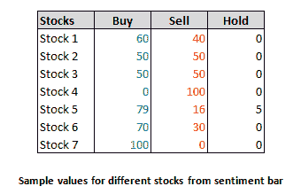

# 众包情绪分析交易策略

> 原文：<https://blog.quantinsti.com/crowdsourced-sentiment-analysis-strategy/>

由[米林德·帕拉德卡](https://www.linkedin.com/in/milind-paradkar-b37292107/)

情绪分析交易策略在市场上并不新鲜。有许多资源可用于开发这种策略，捕捉市场情绪，并根据这些策略产生的信号进行交易。

我们也有一些金融新闻门户网站，它们使用情绪数据，建立情绪指标栏或进行民意调查，以衡量网站访问者的情绪。这个新闻网站可以测量各种话题和主题的情绪。

我遇到了一个这样的金融市场门户网站，它提供了所有股票的情绪指标栏，我想用情绪栏来创建一个策略。一般来说，基于[情绪分析交易](https://quantra.quantinsti.com/course/sentiment-analysis-in-trading)的策略涉及整理大量数据，并得出一个情绪分数，该分数可以给出有利可图的交易信号。在这种情况下，我直接使用情绪栏作为策略的输入。所以，这是我的简单策略。

我的第一步是找出我名单中每只股票的买入/卖出/持有值。我用 Python 写了一个简单的程序来帮助我实现这个目标。还需要 HTML 和 CSS 知识来找到情感栏的确切位置，并从 HTML 页面中获取相应的买入/卖出/持有值。我使用了相关的 Python 库，它们帮助我完成了所有繁重的工作。

下一步是以 Python 数据框或电子表格的形式存储这些值，以便进一步分析和验证这些值。

我能用这些值做什么？我如何知道网站上显示的情绪值是否公平地代表了股票的整体市场情绪？我做的一个实验是在开市前捕捉情绪得分，然后在市场交易结束时根据股票价格的变化进行验证。下表给出了股票样本的单日业绩。可以看出，结果并不令人鼓舞。然而，单日结果并不能告诉我们任何关于策略潜力的信息，因此，我们需要在一段时间内对其进行测试。

这是使用情感分数的一种方式。使用情感分数的其他方法有哪些？我在下面列出了一些可能的方法来处理情感分数和使用策略:

*   过滤分数，并在分数较高的股票中建仓。
*   将获得的情感分数与其他网站上显示的情感分数进行比较。
*   将这种策略与其他策略结合起来，产生强有力的交易信号。

我将继续致力于这个策略，观察一段时间后的结果，如果可能的话，尝试不同的方法来制定一个稳健的策略。我会在以后的博客里分享这个众包情绪策略的成果。所以，请关注我的下一篇关于[情绪分析交易](https://quantra.quantinsti.com/course/sentiment-analysis-in-trading)的博客。同时，你可以在我们的博客上阅读其他的情绪交易策略。

[使用 Python 对新闻文章进行情感分析](https://blog.quantinsti.com/sentiment-analysis-news-python/)

[使用 R【工作模型】](https://blog.quantinsti.com/sentiment-analysis-in-trading/) **进行交易情绪分析您可以报名参加 Quantra 上的[情绪分析课程](https://quantra.quantinsti.com/course/sentiment-analysis-in-trading)，该课程将帮助您利用 Twitter、新闻情绪数据设计新的交易策略。在本课程中，你将学习通过量化市场情绪来预测市场趋势。
 **下一步****

**如果你想学习算法交易的各个方面，那就去看看我们的算法交易(EPAT)执行项目(T2)。该课程涵盖了统计学&计量经济学、金融计算&技术和算法&定量交易等培训模块。EPAT 旨在让你具备成为成功交易者的正确技能。[现在报名](https://www.quantinsti.com/epat/)！**