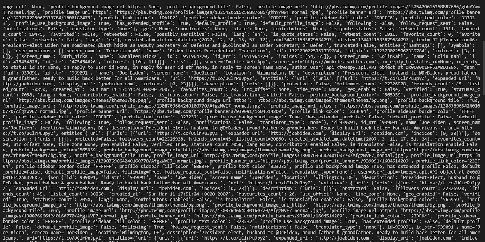

# 为什么数据清理很重要，如何以正确的方式进行？

> 原文：<https://blog.quantinsti.com/data-cleaning/>

作者 [Kshitij Makwana](https://www.linkedin.com/in/kshitij-makwana-b01385195/)

数据清理非常耗时，但却是数据分析过程中最重要、最有价值的部分。没有清理数据，数据分析的过程是不完整的。

但是如果我们跳过这一步会发生什么呢？

假设我们的价格数据中有一些错误的数据。不正确的数据在我们的数据集中形成了异常值。而我们的机器学习模型假设这部分数据集(也许特斯拉的价格确实在一天内从 50 美元跃升至 500 美元)。你现在知道分析的最终结果是什么了。

机器学习模型给出了错误的结果，没有人希望这样！由于预测相差甚远，您必须再次从头开始分析！因此，数据清理是分析的一个重要部分，不应该被忽略。

本博客将带您了解数据清理的整个过程，并为该过程中面临的一些挑战提供解决方案。

*   [什么是数据？](#what-is-data)
*   [各种数据来源](#various-sources-of-data)
*   [原始数据和经过处理的数据是什么样的？](#what-does-raw-and-processed-data-look-like)
*   [数据清理的好处](#benefits-of-data-cleaning)
*   [高质量数据的特征](#features-of-good-quality-data)
*   [数据清理中使用的术语](#terms-used-in-data-cleaning)
*   [清理数据的步骤](#steps-to-clean-your-data)
*   [了解你的数据](#understand-your-data)
*   [清理数据时要解决的基本问题](#basic-problems-to-be-solved-while-cleaning-data)
*   [交易数据清理](#data-cleaning-for-trading)
*   [预先存在的软件](#pre-existing-softwares)
*   [学习数据清洗的资源](#resources-to-learn-data-cleaning)
*   [常见问题解答](#frequently-asked-questions)

## 什么是数据？

[数据科学](https://quantra.quantinsti.com/course/introduction-to-data-science)是当今最受欢迎的职业之一。所以让我从回答这个古老的问题开始——什么是数据？嗯，根据维基百科，“数据是通过观察收集的一组关于一个或多个人或物体的定性或定量变量的值。”

考虑一个数据集，其中包含关于一批不同种类水果的信息。

数据集中的一些变量可能是定性的，如水果的名称、颜色、目的地和原产国、客户反馈(失望、满意、满意)或定量的，如水果的成本、运输成本、货物重量、运输成本和货物中的水果数量。

其中一些变量可能来自其他较低层次的变量。在这个例子中，运输成本来自水果成本和运输成本变量。

这些数量变量也可以分为两类，连续变量和离散变量。连续变量顾名思义在数轴上是连续的，可以取任何实值。离散变量可能只有特定的值，通常是整数。货物的重量将是一个连续变量，而如果我计算每批货物中水果的数量，它将是一个离散变量。

定性变量可以分为名义变量和序数变量。名义变量或无序变量是一种标签变量，这些标签没有量化值。例如，水果的颜色或货物的目的地可以是名义变量。序数或有序变量是那些标签有数量值的变量，也就是说，它们的顺序很重要。在水果的数据库中，顾客反馈将是一个有序变量。

大多数人认为数据科学是传达非常准确和精确信息的美丽图形和图表。然而，大多数人没有意识到的是产生这种数字的必要过程。

数据分析管道由 5 个步骤组成。

**原始数据** - > **处理脚本**->-**整理数据**->-**数据分析** - > **数据通信**

通常，管道的前三个步骤会被忽略。新手直接跳到数据分析这一步。任何企业或学术研究都将致力于获取他们的数据，并在内部对其进行预处理。所以你会想知道如何获取原始数据，并自己清理和预处理它。

这个博客将涵盖所有关于清理和获取数据进行分析的内容。

* * *

## 各种数据来源

首先，让我们谈谈你可以从哪里获得数据的各种来源。最常见的来源可能包括来自数据提供网站的表格和电子表格，如 [Kaggle](https://www.kaggle.com/) 或[加州大学欧文分校机器学习库](https://archive.ics.uci.edu/ml/index.php)或从抓取网页或使用 API 获得的原始 JSON 和文本文件。的。xls 或者。来自 Kaggle 的 csv 文件可能经过预处理，但是原始的 JSON 和。txt 文件将需要工作，以获得一些可读格式的信息。详细的数据提取方法可以在[这里](https://youtu.be/WjySQ_HcpsI)找到。

## 原始数据和经过处理的数据是什么样的？

理想情况下，这是您希望干净数据的样子:

每列只有一个变量。在每一行中，您只有一个观察值。它被整齐地组织成一个矩阵形式，可以很容易地导入 Python 或 R 来执行复杂的分析。但通常情况下，原始数据并不是这样的。它看起来像这样-

让你头晕是吗？

这是使用 Twitter API 获得乔·拜登过去 20 条推文的查询结果。您还不能对这些数据进行任何形式的分析。

我们将在后面详细讨论原始和整洁数据的组成部分。

* * *

## 数据清理的好处

如上所述，要产生合理的结果，干净的数据集是必要的。即使您想要在数据集上构建模型，检查和清理数据也可以成倍地改善结果。向模型提供不必要的或错误的数据会降低模型的准确性。一个更干净的数据集会比任何花哨的模型给你更好的分数。一个干净的数据集也将使您组织中的其他人将来更容易处理它。

* * *

## 高质量数据的特征

在执行数据清理之后，您至少应该有以下这些东西-

*   你的原始数据
*   干净的数据集
*   描述数据集中所有变量的码本
*   包含对原始数据执行的产生干净数据的所有步骤的指令列表

当数据满足以下要求时，我们可以说它处于原始状态

*   自从交给它以来，没有任何软件应用于它
*   没有对数据执行任何操作。
*   没有执行任何汇总
*   没有从数据集中删除任何数据点

处理完数据后，它应该满足这些要求-

*   每行应该只有一个观察值
*   每列应该只有一个变量
*   如果数据存储在多个表中，请确保这些表之间至少有一列是公共的。如果需要，这将帮助您一次从多个表中提取信息。
*   在包含变量名称的每列顶部添加一行。
*   尽量使变量名易于阅读。例如，使用 Project_status 而不是 pro_stat
*   加工中使用的所有步骤都应记录下来，以便从头开始再现整个过程

对于第一次查看你的数据的人来说，密码本是必要的。这将帮助他们理解数据集的基本形式和结构。它应该包含-

*   关于变量及其单位的信息。例如，如果数据集包含一家公司的收入，一定要提到它是以百万还是以十亿美元为单位。
*   关于汇总方法的信息。例如，如果年收入是变量之一，说明你用什么方法得出这个数字，是收入的平均值还是中值。
*   提及你的数据来源，无论是你自己通过调查收集的还是从网上获得的。在这种情况下，也要提到网站。
*   常见的格式是. doc。txt 或降价文件(。md)。

说明列表是为了确保你的数据和研究是可重复的。使用指令列表，数据社区中的其他数据科学家可以验证您的结果。这增加了你研究的可信度。确保包括-

*   电脑脚本
*   这个脚本的输入应该是原始数据文件
*   输出应该是经过处理的数据
*   脚本中不应有用户控制的参数

* * *

## 数据清理中使用的术语

1.  **汇总** -使用多个观察值提供变量的某种形式的汇总。常用的聚合函数有。sum()，。均值()等。Python 提供了[。aggregate()](https://pandas.pydata.org/pandas-docs/stable/reference/api/pandas.DataFrame.aggregate.html) 可以同时执行多种功能的函数。
2.  **Append** - Append 意味着垂直连接或堆叠两个或多个数据帧、列表、序列等。使用[。append()](https://pandas.pydata.org/pandas-docs/stable/reference/api/pandas.DataFrame.append.html?highlight=append#pandas.DataFrame.append) 函数追加数据帧。
3.  **估算** -一般来说，统计学家将估算定义为填补缺失值的过程。我们将在博客后面更详细地讨论插补。
4.  **删除重复数据** -删除重复数据是从数据集中删除重复观察值的过程。在本博客的后面会有更详细的讨论。
5.  **合并**——合并和追加是数据清理中最容易混淆的术语。合并两个数据帧也包括将它们连接在一起。这里唯一的区别是我们将它们水平连接起来。例如，如果我们有两个数据集，一个包含用户的脸书数据，另一个包含用户的 Instagram 数据。我们可以根据用户使用的电子邮件 id(两个数据集中的公共列)合并这两个数据集，因为这对某个用户来说很可能是公共的。
6.  **缩放** -缩放或标准化是缩小特征范围并使其介于 0 和 1 之间的过程。这是用来为在上面建立[机器学习](https://quantra.quantinsti.com/course/introduction-to-machine-learning-for-trading)模型准备数据的。ML 算法为高值分配较高的权重，为低值分配较低的权重。缩放将处理这种数值上的巨大变化。
7.  **解析** -解析是将数据从一种形式转换成另一种形式的过程。在博客的前面，我们查看了来自 Twitter API 的原始数据。原始形式的数据没有任何用处，因此我们需要对其进行解析。我们可以将每条推文作为观察，将推文的每个特征作为专栏。这将使数据以表格的形式呈现和可读。

* * *

## 清理数据的步骤

有几个步骤，如果遵循得当，[将确保干净的数据集](https://www.youtube.com/watch?v=Mp_o_qsyBhA)。

1.  好好看看你的数据，了解数据中出现的基本问题
2.  列出所有的基本问题，单独分析每个问题。试着估计问题的根源
3.  清理数据集并再次执行探索性分析
4.  检查清洗后的问题

* * *

## 了解您的数据

当你收到数据时，首先要做的一件事就是了解你收到了什么。了解数据集包含的内容——其中的变量、它们的类型、缺失值的数量等等。在这篇博客中，我们将使用一家银行的综合客户交易数据。数据集在[这里](https://github.com/kjmakwana/data_cleaning/blob/master/ANZ_synthesised_transaction_dataset.xlsx)可用。

首先，读取 excel 文件并使用。头()和。info()方法来获取数据帧的摘要。