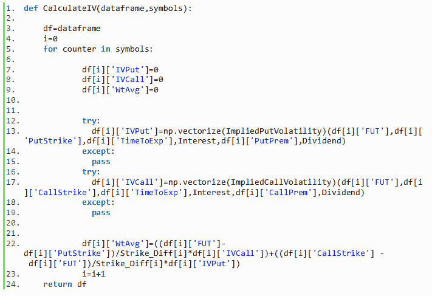
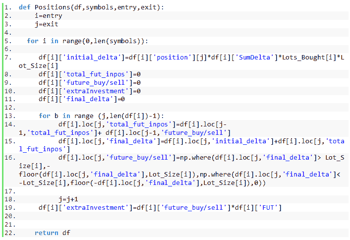
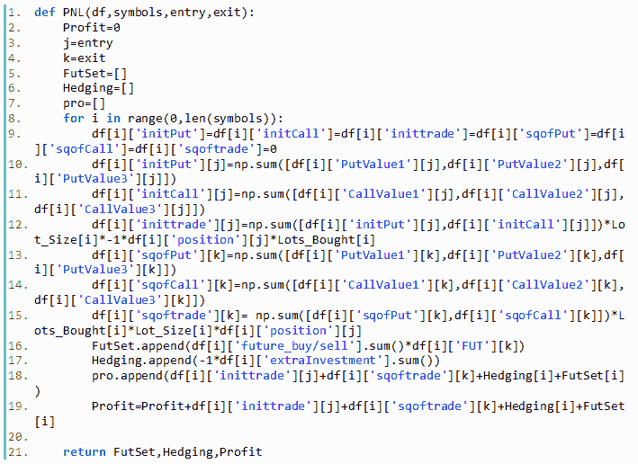

# 使用期权的分散交易[EPAT 项目]

> 原文：<https://blog.quantinsti.com/dispersion-trading-using-options/>

作者:杰耶什·库鲁普

本文是作者提交的最后一个项目，作为他在 QuantInsti 的算法交易(EPAT)高管课程的一部分。请务必查看我们的[项目页面](https://www.quantinsti.com/category/project-work-epat/)，看看我们的学生正在构建什么。

### **简介**

离差交易是一种利用隐含相关性和随后实现的相关性之间的差异的策略。离差交易利用了指数期权之间隐含波动率和实际波动率之间的差异大于单个股票期权之间的差异这一事实。因此，交易者可以基于这种波动性差异卖出指数上的[期权](https://quantra.quantinsti.com/course/options-trading-strategies-python-intermediate)并买入单个股票期权，反之亦然。分散交易是一种相关性交易，因为在个股相关性不强的时候，交易通常是盈利的，而在相关性上升的压力时期，这种策略会亏损。证券之间的相关性被用作确定交易进入的因素。根据单个股票之间的相关值，离差可以通过卖出指数期权和买入指数成分期权或买入指数期权和卖出指数成分期权进行交易。对于这种策略的盈利能力，最广为接受的理论是市场无效率，该理论认为期权市场的供给和需求驱动溢价偏离其理论价值。

### **策略**

为了区分分散交易，它只是一种对冲策略，利用指数和指数成份股之间隐含波动率的相对价值差异。它涉及指数证券的空头期权头寸和指数成分的多头期权头寸，反之亦然。实际上，我们将根据进场信号做多/做空。我们必须注意，只有当 delta 敞口接近于零时，这种交易才会成功。因此，分散策略是针对大的市场波动。下面是成功的分散交易需要采取的一系列行动。

*   计算脏相关(ρ)
*   当脏相关超过阈值/达到极限时生成信号
*   根据逻辑买卖指数和个别证券
*   定期计算 delta，并通过购买/出售期货来抵消它，使交易 Delta 保持中性
*   当脏相关性超过平均值(ρ=0.5)时退出

为了理解波动性的差异是如何被捕捉的，我们需要理解一篮子股票的指数方差。它被给出为:

其中，σ I 2 是指数方差 wi 是股票在指数中的权重σIT6】2 是个股方差ρij 是股票 I 与股票 j 的相关性这一策略的好处在于相关性趋向于均值回复。因此，如果一个人在比率的极端情况下建仓，我们可以确信这将意味着在某一点的回复。

### **实施战略**

要实施该策略，我们需要计算下面给出的指标。

#### **计算最接近的隐含波动率**

因为我们有溢价值，到期时间，利率，股息和最近的罢工，我们可以使用布莱克斯科尔斯模型计算最近罢工的隐含波动率。为了计算相关性，需要将单个证券和指数的最接近的加权平均隐含波动率相加。

在上面的函数 CalculateIV 中，我们可以看到，首先计算单个买入和卖出 IV，然后计算这些 IV 的加权平均值。权重更多地给予那些更接近未来价格的罢工。

#### **脏关联**

这是指数隐含波动率与股票加权平均值之比的平方。公式如下所示:

上面的代码片段显示了脏关联的计算。在这里，首先计算单个证券的交易量，然后在 Vol_IndSecurities 中求和。该比率是在指数和个股之间计算的，并且是平方。

#### **定义阈值**

这是根据风险偏好产生进/出信号的重要一步。在这个项目中，阈值是 z1=0.2，z2=0.8，z3=0.5，其中 z1 给出买入指数和做空单个证券的信号，z2 给出做空指数和做多单个证券的信号，z3 是所有头寸平仓的退出阈值

### **选择要交易的期权**

一旦我们得到买入/卖出的信号，我们将会同时使用空头和空头。本项目考虑了最近的 3 个 OTM 走向。投资金额需要在指数和单个证券之间平均分配。录入时，需要记下批量、购买数量，以便每个阶段的增量便于使用。

### **对冲**

这是进一步对冲使用期货合同，以保持整个过程 delta 中性。这个策略的 Delta 应该每十五分钟调整一次。当 delta 超过 1 时，卖出一份期货合同，当 delta 下降到-1 时，买入一份期货合同来抵消 delta。在交易过程中保持 delta 接近于零是很重要的。

*上面的片段显示了如何根据进/出信号进行持仓。每当我们有进场信号时，我们就持续监控 delta，确保它是中性的。同样，总的 deltas 最初被加起来，然后用买入或卖出的期货合约来抵消。当前持仓的期货也便于计算每个点的 delta。买入或卖出的期货总额被确定，并乘以期货价格，以计算交易的额外投资。*

### **损益计算**

为了计算 PnL，需要考虑以下因素:

*   初始交易，进场时买入/卖出期权的成本
*   对冲成本，为使交易 delta 中性而投资的期货总量
*   期货结算，在退出信号时结算期货合约的金额
*   期权平仓，当所有头寸在退出信号时平仓的结果

 *上面的片段展示了 PnL 的计算。这里我们可以看到，我们已经计算了初始交易的买入成本(买入/卖出看涨期权和看跌期权)。我们已经计算了看涨期权和看跌期权的平方价格。额外的投资或买卖的期货用 FutSet 表示，在交易结束时结算。对冲金额存储在对冲变量中。*  *以上是执行的代码示例。可以看出，由于脚本中包含复杂的计算，执行需要相当长的时间。*

### **结论**

分散交易是一个复杂的策略，然而，这是一个有利可图的策略，在低风险下提供高回报。为了使这种策略更好，有必要使策略自动化，套期保值应该根据价格变动而动态变化。在波动性高的时候交易(即季度业绩、个股新闻等。)当相关性不强时，可能会导致更多的利润。为了最大限度地提高策略的准确性，我们可以缩短捕捉波动的时间间隔，并相应地计算 deltas。了解期权交易中的[未平仓合约](https://blog.quantinsti.com/open-interest-options-trading-python/)一个可以在期货和期权交易中轻松使用的指标，未平仓合约表示什么，如何读取未平仓合约数据，并考虑如何使用 Python 建立未平仓合约交易的一些基本假设