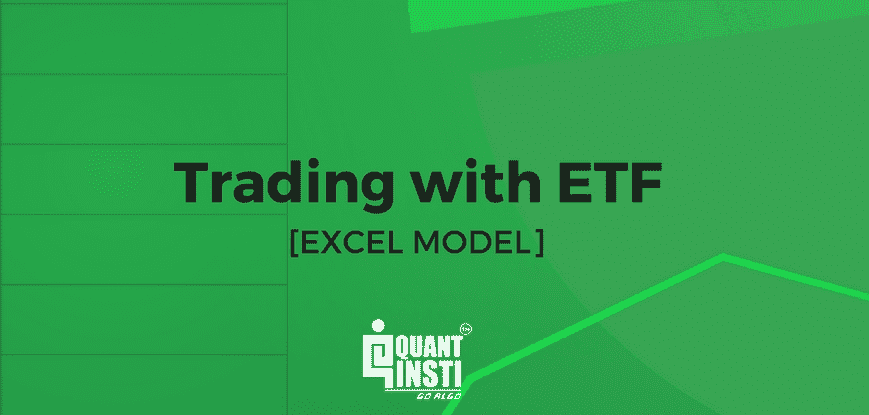

# 以 ETF 作为领先指标的交易

> 原文：<https://blog.quantinsti.com/etf-msci-futures-excel-model/>

#### **指数跟踪交易模式**

指数跟踪交易是一种策略，你观察前 n 个烛台上的价格，并据此下注。直觉是 MSCI 期货跟随 ETF。因此，如果 ETF 表现良好，我们假设 MSCI 期货也表现良好，从而做出相应的买卖决定。

#### **谁可以使用？**

对算法交易感兴趣的人和想了解 ETF 作为领先指标的人。

#### 如何发挥作用？

该 excel 模型将帮助您:

*   建立一个以 ETF 为主要指标的策略
*   理解策略执行的交易逻辑
*   优化交易参数

#### **为什么要下载交易模型？**

由于交易逻辑编码在表格的单元格中，你可以在方便的时候下载并分析这些文件来加深理解。不仅如此，你还可以通过玩弄数字来获得更好的结果。您可能会找到比文章中指定的利润更高的合适参数。

#### **模型说明**

在这个例子中，我们考虑摩根士丹利资本国际期货数据。我们跟踪一只 ETF，并假设摩根士丹利资本国际指数对该 ETF 有很强的正贝塔。我们观察 ETF 和 MSCI 的 5 分钟间隔价格，并根据 ETF 回报买入/卖出 MSCI。如果 ETF 回报为正，我们就买入一手 MSCI 期货。如果 ETF 回报为负**，我们卖出一手 MSCI 期货。我们跟踪的 ETF 是印度 SP 股票。本质上，如果 ETF 看涨，我们就做多(买入)MSCI 期货；如果 ETF 看跌，我们就做空(卖出)MSCI 期货。**

 **用于 MSCI 期货合约的数据是从 2015 年 2 月 2 日日到 2015 年 3 月 4 日日间隔 **5 分钟的数据。**

#### **假设**

1.  出于简化目的，我们忽略买卖价差。
2.  价格以 5 分钟为间隔，我们只以 5 分钟收盘价交易。
3.  由于这是离散数据，平仓发生在蜡烛线结束时，即在 5 分钟结束时的可用价格。
4.  仅交易常规时段(T)
5.  MSCI 期货的交易成本为 1.10 美元。
6.  每笔交易的保证金是 1500 美元。
7.  交易数量为 1 手(MSCI 订单规模为 50)，交易时间为新加坡时间上午 11:30 至下午 5:55

#### **输入参数**

请注意，下面提到的所有输入参数值都是可配置的。

1.  考虑 5 分钟间隔结束时的价格。
2.  我们使用 ETF 作为领先指标

从第 12 行开始，市场数据和交易模型包含在电子表格中。因此，当参考 D 列时，显然应该从 D12 开始参考。

#### **Excel 模型中列的说明**

**C 列**代表 ETF 的价格。

**列 D** 代表 MSCI 期货的价格。

**E 列**表示 ETF 数据的对数收益。

**列 F** 表示 MSCI 数据的对数回报。

**G 列**代表 ETF 数据的平均收益。

**H 列**代表 MSCI 数据的平均回报率。

**栏 I** 计算**交易信号。**公式 **=IF(G13= ""，" "，IF(G13 > H13，"买入"，IF(G13 < H13，"卖出"，" I12 "))**表示如果单元格 G13 中的条目为空，则保持 I13 为空，否则，如果 G13 (MSCI 期货数据)大于 H13，则生成 MSCI 期货合约的买入信号，否则，如果 G13 小于 H13，则生成 MSCI 期货合约的卖出信号。

**J 列**代表**交易价格。**这是产生交易信号的价格。公式 **=IF(I13= ""，" "，IF(I13=I12，J12，D13))** 表示如果单元格 I13 中的条目为空，则该条目为空。否则，如果 I13=I12，则交易价格由 J12 中的条目给出。如果 I13 既不为空也不等于 I12，则交易价格由 D13 给出。

**列 K** 代表**标记上市。**公式 **=IF(OR(I13= "，I12= " ")，0，IF(I13=I12，K12，IF(I13="Buy "，K12+J12-J13，IF(I13="Sell "，K12+J13-J12，0)))**表示如果单元格 I12 或 I13 为空，则 MTM 为零。否则，如果 I13=I12，则 MTM 是 K12，否则，如果 I13 不等于 I12，并且如果 I13=“购买”,则 MTM 由 K12+J12-J13 给出，如果 I13 不等于 I12，并且如果 I13 =“出售”,则 MTM 由 K12+J13-J12 给出。

**列 L** 代表交易的**损益状态。**公式 **=IF(OR(I13= "，I12= " " ")，IF(K13 < K12，"亏损"，IF(K13 > K12，"盈利"，IF(I13<T9】I12，" NPNL "，" "))**表示如果 I13 或 I12 中有一个为空，则盈利分录也为空。否则，如果 K13 小于 K12，则进场是亏损，如果 K13 大于 K12，则进场是盈利。下一部分 I13 < > I12 表示如果 I13 不等于 I12 那么就没有利润没有损失(NPNL)。这是有意义的，因为我们已经计算了以前平仓的利润。

**列 M** 计算交易**的盈亏。**公式 **=IF(L22= "，0，K22-K21 )** 表示如果 L23 为空，表示无盈利无亏损，则交易盈亏为零。如果 L23 不为空，则利润计算为 MTM 值的差值。

#### **输出**

输出表列出了一些性能指标。

盈利交易数量为 118 笔，亏损交易数量为 77 笔。

总交易量为 277 笔，总利润为 1970 美元。每笔交易的平均利润是 7.24 美元。每笔交易的净利润为 5.04 美元。计算方法是每笔交易的平均利润减去两倍的交易成本。交易区间数为 23。月收益的计算方法是总交易量和每笔交易的净利润的乘积除以每笔交易的保证金和插值天数的乘积

#### 现在轮到你了！

*   首先，下载模型
*   修改参数并研究回测结果
*   对其他历史价格运行模型
*   修改公式和策略，添加新的参数和指标！玩逻辑！探索研究！
*   请在下面评论您的结果和建议

#### 点击下载 excel ( )如果您还没有登录，请先登录/注册 ！)**