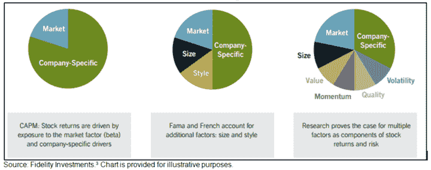
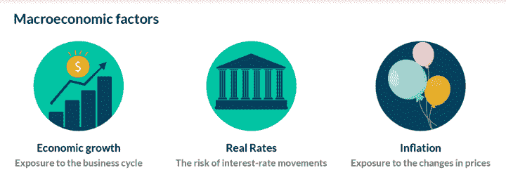
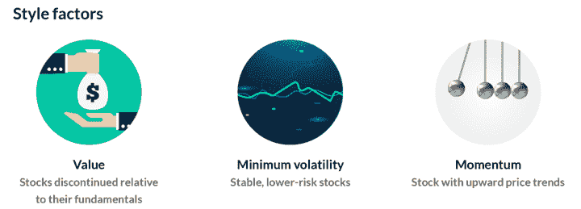
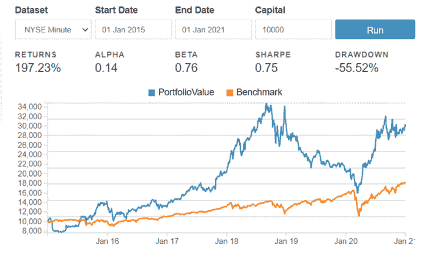

# 要素投资:它是什么，类型，利弊，等等

> 原文：<https://blog.quantinsti.com/factor-investing/>

由[查尼卡·塔卡](https://www.linkedin.com/in/chainika-bahl-thakar-b32971155/)

影响投资决策的因素就像营养对于食物一样。根据营养成分，你决定吃哪种食物，吃多少。对于了解特定投资方法的风险和回报来说，因素是不可或缺的。

因此，每个个体交易者将根据交易者对每个产生的回报的风险承受能力，寻求投资于具有相似风险和回报因素的股票。在本文的后面，我们将详细了解要素投资。

本文涵盖:

*   [什么是要素投资？](#what-is-factor-investing)
*   [要素投资的类型](#types-of-factor-investing)
*   [要素投资与智能测试有何不同？](#how-does-factor-investing-differ-from-smart-beta)
*   [要素投资的优势](#pros-of-factor-investing)
*   [要素投资的弊端](#cons-of-factor-investing)

* * *

## 什么是要素投资？

因素投资意味着利用“因素”或使各种股票回报互不相同的特殊“特征”的投资方法。这些因素包括波动性、动量、股票规模等。

在创建基于因素的投资策略时，调整投资组合(包括或删除因素)的方式是投资组合资产的因素产生有利的长期投资回报。

要素投资[经过一段时间](https://economictimes.indiatimes.com/markets/stocks/news/factor-investing-a-way-to-capture-value-and-quality/articleshow/62790758.cms)已经从仅仅针对市场和公司发展到各种要素。下面是描绘相同的图像:

Factor investing evolved gradually

* * *

## 要素投资的类型

投资组合的两种因素或特征是:

### 宏观经济因素或特征

这些是捕捉各种资产类别回报的广泛风险的工具。此外，宏观经济因素的一些简单例子是:

Examples of macroeconomic factors 

******经济增长******

经济增长是股票回报的一个非常好的因素，经济增长预测导致投资决策的最佳分配。随着积极的经济增长，国内生产总值(GDP)上升，因此，更多的投资发生在金融市场。

例如，当新冠肺炎在 2020 年爆发时，经济大幅下滑，导致股市下跌。

**实际利率或利率变动**

实际利率或利率变动也是做出投资决策的关键因素之一。当中央银行的利率提高时，贷款成本就会增加。因此，企业或商人的消费能力会受到影响。

消费能力下降导致投资减少。同样，随着利率的降低，消费能力增加，因为商人或企业可以借更多的钱，从而增加投资。例如，道琼斯指数在 2020 年 3 月大幅下跌，因为美联储在全球冠状病毒疫情期间将利率降至接近零。

**通货膨胀或价格变化**

通货膨胀或价格变化会对经济产生重大影响，因为高通货膨胀会降低每单位货币的购买能力。此外，这意味着公众可获得的资本更少，利率更高。因此，借贷成本上升，导致投资减少。

虽然，金融资产的价值随着通货膨胀的上升而增加。一些投资者将“高通胀”作为投资的积极因素，因为他们认为基础资产的价格未来可能会上涨。这种积极的投机导致市场波动性增加。

*例如，与 2019 年相比，2020 年印度的通货膨胀率增长了 2.9%。2019 年，股市的繁荣发生在通胀率较低的情况下，因为[苹果上涨了 85%，微软上涨了 15%](https://www.cnbc.com/2019/12/31/the-stock-market-boomed-in-2019-heres-how-it-happened.html) 。*

### 风格因素或特征

风格因素或特征有助于解释资产类别中的回报和风险。以下是一些风格因素的例子:

Examples of style factors

**值**

价值是一种股票，旨在从价格低于其基本价值的股票中获取超额回报。价值股票最常用市盈率、股息和自由现金流的数量来跟踪。

例如，花旗集团的市盈率为 9.67 倍，而标准普尔&500 指数公司的平均市盈率为 19.12 倍。

******最小波动率******

最小波动性意味着波动性较小的股票比波动性较大的股票获得更高的风险调整回报率。因此，波动性最小的资产被认为是投资的好资产。

*例如，印度斯坦联合利华、高露洁、景顺是目前[低波动股票](https://www.google.com/search?q=Low+Volatility+stocks+list&stick=H4sIAAAAAAAAAOOQMZLKyS9XKMvPSSzJzMksqVQoLslPzi5WyMksLomSzM3My8wtzcWUP8XIpZ-rb2CSXJRbVgLlGBcYF6SUn2LkBHEMs8yy46FsM5PcJEMo29zSODcNyjYyMUpLhrLTcs0sgGo4wGriU_JgSjIyDA1-MUr5AB0ZhtWRDSyMi1jxyN9ik2S4MZPLVDBh1bMjH2fN0vy1getlGP_82y2TPgAAI4LVMP8AAAA&sa=X&ved=2ahUKEwik4qH1w-r0AhWLMd4KHS8wDNgQ4qYDegQINBAJ&biw=1280&bih=637&dpr=2)中的一些。*

******气势****T5】**

动量是另一个重要因素，它意味着过去表现优异的股票或金融资产在未来会继续表现良好。[动量交易策略](https://quantra.quantinsti.com/course/momentum-trading-strategies)通常执行几个月到一年。

*例如，通过使用 Python 代码和[蓝移](https://blueshift.quantinsti.com/)应用多空策略，策略回报如下:*

Momentum as a style factor

上图显示了多空策略如何超越基准。你可以在我们关于[动量交易策略](/momentum-trading-strategies/)的博客中看到用 Python 编码的策略和详细解释。

* * *

## 要素投资与智能测试有何不同？

**Smart beta** 是要素投资的子集。这些策略最常用于一只 [ETF](/exchange-traded-funds/) ，仅做多，并且基于[指数](https://quantra.quantinsti.com/glossary/Index)。

Smart beta 与要素投资一样，是被动和主动投资策略的结合，下面你可以看到是什么让 smart beta 成为被动和主动的结合:

| **特性** | **被动** | **智能测试版** | **激活** |
| 基于规则 | 是 | 是 | 不 |
| 资产流动性 | 高的 | 中到高 | 从低到高 |
| 投资能力 | 高的 | 高的 | 从低到高 |
| 投资组合周转 | 低的 | 低的 | 中到高 |
| 因素暴露 | 低的 | 中等 | 中等 |
| 微距曝光 | 高的 | 高的 | 高的 |

此外，smart beta 包括通常指单一资产类别(债券、商品、现金和现金等价物等)中风格因素的策略。).

让我们从下表中清楚地看到要素投资和 smart beta 在风格要素方面的相似之处和不同之处:

| **要素投资** | **智能测试版** |
| 多头/多头空头策略 | 通常，它被认为是一个只做多，简单和基于规则的策略 |
| 宏观和风格因素 | 仅风格因素 |
| 不管有没有杠杆 | 没有杠杆 |

* * *

## 要素投资的优点

由于要素投资是根据决定收益和风险的因素进行投资，这种投资有几个优点。这些优点是:

*   改善投资组合的结果
*   降低波动性和
*   增加投资的多样化

因素投资找出交易时每个因素的回报风险。基于因素的分析有助于改善投资组合结果，降低波动风险，增加投资组合投资的多样化。

* * *

## 要素投资的缺点

因素不是完全没有风险的，不知道这些风险会导致在交易过程中准备不足。首先，我们必须考虑到，有时一个因素可能只是从回报的角度来看，而不是从与之相关的错误的角度来看。

例如，在势头强劲的情况下，一支股票在过去两年的表现可能很好。但是，也有可能该股早在 6-7 年前就已经开始下跌。

在决定投资方式之前，你必须权衡利弊。在权衡两者之后，你可以在这个因素的基础上得到一个接近准确的投资风险和回报的估计。

或许最危险的是，要素投资带来了数据挖掘的风险。仅显示显示良好回测结果的因子。这种偏差被称为**选择偏差**。一个因素的历史记录随机良好/准确会导致错误的决策。

* * *

### 结论

我们在本文中讨论了要素投资对于金融市场交易者来说是一个简单而有益的概念。它有助于获得评估投资策略风险回报所需的必要知识。

要素投资和聪明贝塔之间有一个微小但重要的区别。最后，我们还讨论了各种因素的优缺点。

你想量化构建你的投资组合，创造回报并有效管理风险吗？
您是否希望学习不同的投资组合管理技术，如要素投资、风险平价和凯利投资组合，以及现代投资组合理论？
Quantra 关于[量化投资组合管理](https://quantra.quantinsti.com/course/quantitative-portfolio-management)的课程正是你需要的。立即注册！

* * *

*<small>免责声明:本文提供的所有数据和信息仅供参考。QuantInsti 对本文中任何信息的准确性、完整性、现时性、适用性或有效性不做任何陈述，也不对这些信息中的任何错误、遗漏或延迟或因其显示或使用而导致的任何损失、伤害或损害负责。所有信息均按原样提供。</small>*