# 在外汇市场实施配对交易/统计套利策略[EPAT 项目]

> 原文：<https://blog.quantinsti.com/fx-market-pairs-trading-strategy/>


本文是作者提交的最后一个项目，作为他在 QuantInsti[算法交易(EPAT)](https://www.quantinsti.com/epat/)高管课程的一部分。请务必查看我们的项目[页面](https://www.quantinsti.com/category/project-work-epat/)，看看我们的学生正在构建什么**。**

### **关于作者**

[T2】](https://www.linkedin.com/in/harish-maranani-71840a16?authType=NAME_SEARCH&authToken=KXxV&locale=en_US&trk=tyah&trkInfo=clickedVertical%3Amynetwork%2CclickedEntityId%3A54761348%2CauthType%3ANAME_SEARCH%2Cidx%3A1-2-2%2CtarId%3A1480338720671%2Ctas%3Aharish%20marana)

哈里什·马拉纳尼是一名 EPATian 人。他的学历包括:

*   Acharya Nagarjuna 大学电子和通信工程技术学士学位，
*   英国斯塔福德郡大学 MBA 金融专业，
*   数量金融学证书(CQF)，以及
*   美国纽瓦克新泽西理工学院数学和计算金融理学硕士。

哈里什参加了第 27 批[EPAT](https://www.quantinsti.com/epat)，这份报告是他最后项目工作的一部分。

**目的**:实施货币的配对交易/统计套利策略。

**对事物:**欧律林、usdinr、GBPINR、AUDINR、CADINR、JPYINR

**频率:**每日

**时间段:** 2011 年 4 月 21 日至 2013 年 5 月 22 日

**使用:** Python 实现。

**外汇市场的配对选择标准:**

*   上面选择的货币对的时间序列数据是从 quandl 导入的。
*   对所有可能的配对组合进行协整检验，即欧元兑美元、欧元兑英镑等。
*   选择 t-static 值小于-2.8 的 5%临界值的协整对。
*   对满足协整条件的配对进行切片，以便进一步分析。
*   为了进一步测试共整合的确认，对来自库的切片对进行 CADF 测试。
*   为每个选定的配对组合计算 z 得分，并应用该策略。
*   计算/列表/绘制利润/损失、权益曲线、最大提取额。
*   考虑两种货币对欧元/印度卢比和美元/印度卢比。这里的基础货币分别是欧元和美元，对应货币是印度卢比。

**初步测试:**

*   为了找到共同整合的货币对，通过来自 statsmodels.tsa.stattools 的 coint(x，y)进行初步测试，并在下面绘制它们各自的 pvalues，tstatic。
*   下面显示的 t-static 值是通过了协整测试的值。即 t 静态值小于-2.86 的 5%临界值。

**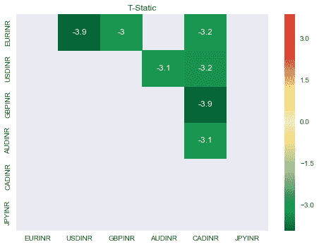T2】**

**以下是 T-static 值小于-2.86 的 5%临界值的配对列表:**

*   ['欧洲卢比/美元卢比:-3.892142826 '，
*   欧元兑英镑汇率:-3.04457063111 '，
*   欧元兑加元:-3.16044058632 '，
*   美元兑人民币:-3.14784526027 '，
*   美元兑加元:-3.19434173492 '，
*   英镑兑人民币汇率:-3.86588509209 '，
*   AUDINR/CADINR: -3.10827352646']

**下面是协整对的 p 值图:** 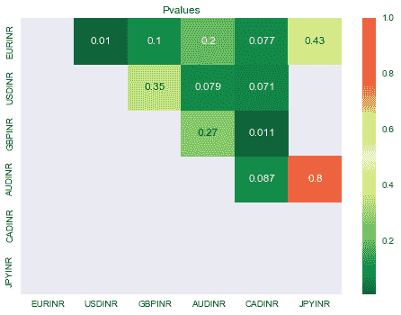

在拒绝零假设以确认价格是均值回复之前，我们将进行协整的增广迪基-富勒(CADF)检验，以确认从整个货币组中分离出的上述切片对也是如此。下面是结果和图。

**我们将考虑基于 CADF 测试的 T 静态值的 4 个协整对。**

**以下是 4 个共整合对:**

欧洲卢比/美元卢比:-3。38660 . 63868686861

GBP INR/CADINR:-3.864863868686

美元/加拿大元:-3.192538363686

欧洲卢比/加拿大卢比:-3.163676363686

#### 欧元/美元

**欧元/美元的时间序列图**

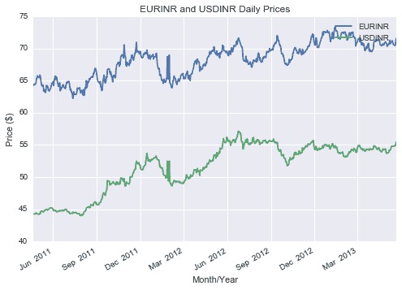

从上图可以明显看出，价格是协整的，但是，为了从统计上证实这一点，我们实施了以下一组测试/程序。

#### 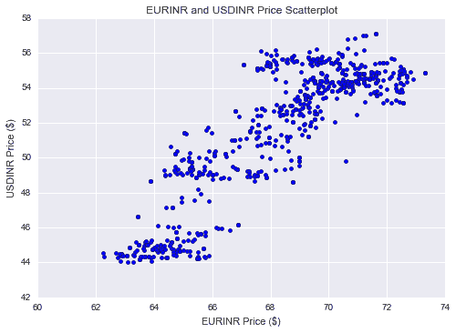

创建一个价格散点图，看看这种关系大体上是线性的。

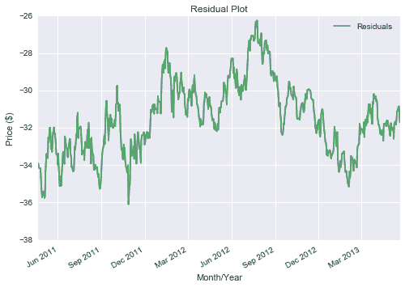

给定上面的残差图，它是相对稳定的。

##### **协整增强 Dickey-Fuller 测试结果**

协整[增广迪基-富勒](https://blog.quantinsti.com/augmented-dickey-fuller-adf-test-for-a-pairs-trading-strategy/) (CADF)测试通过对两个时间序列进行线性回归，然后测试线性组合下的平稳性，从而确定最佳套期保值比率。

在 python 中实现会产生以下结果:

```py
(-3.0420602182962395,

 0.03114885626164075,

 1L,

 652L,

 {'1%': -3.440419374623044,

  '10%': -2.5691361169972526,

  '5%': -2.8659830798370352},

 852.99818965061797)
```

鉴于上述结果，t-static 为-3.04，小于-2.8 的 5%临界值，我们可以拒绝零假设，并可以确认价格是均值回复的。

#### **GBPINR/CADINR**

下面是 GBPINR/CADINR 的时间序列、散点图和残差图

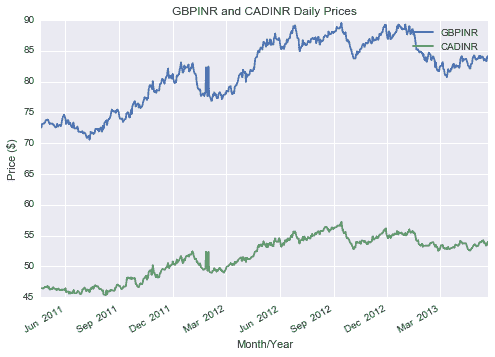

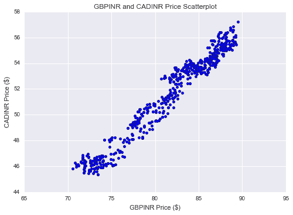

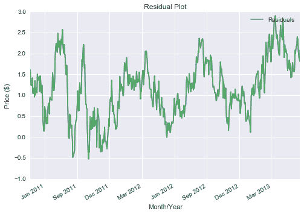

**CADF 测试结果:**

```py
(-3.3637522231183872,

 0.012258395060108089,

 2L,

 651L,

 {'1%': -3.440434903803665,

  '10%': -2.569139761751388,

  '5%': -2.865989920612213},

 -179.04749802146216)
```

鉴于上述结果，t-static 为-3.36，小于-2.8 的 5%临界值，我们可以拒绝零假设，并可以确认价格是均值回复的。

#### **美元兑人民币**

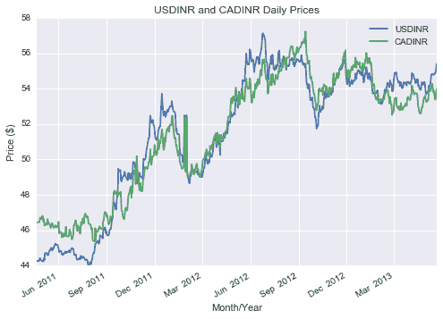T2】

**CADF 测试结果**

鉴于上述结果，t-static 为-2.93，小于-2.8 的 5%临界值，我们可以拒绝零假设，并可以确认价格是均值回复的。

```py
(-2.9344605252608607,

 0.041484961304201866,

 1L,

 652L,

 {'1%': -3.440419374623044,

  '10%': -2.5691361169972526,

  '5%': -2.8659830798370352},

 -99.577663481220952)
```

#### **美元印度卢比/奥地利卢比**

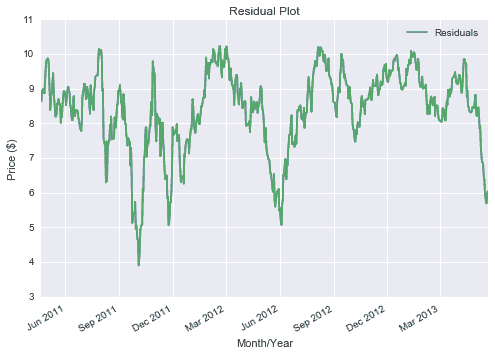T2】

以下是 CADF 测试的结果:

```py
(-3.2595055880757768, 
0.016788501512565262, 
4L, 
649L, 
{'1%': -3.440466106307706,  
'10%': -2.5691470850496558,  
'5%': -2.8660036655537744},
 381.77145926378489)
```

随着 t 静态值-3.25 小于 5%临界值-2.86，我们可以拒绝零假设，并可以确认该对是协整的。

现在我们已经找到了具有 t-static 值的以下配对形式的协整配对:

*   欧元兑美元:3.04 卢比
*   英镑兑人民币汇率:-3.363
*   美元兑加元:-2.934
*   美元兑人民币:3.259 元

下一步是计算 30 天移动平均线和 30 天标准差的价格比率的 Z 值:

*   分别在上述货币对的数据框架(df，df1，df2，df4)中计算价格比率并创建新的列比率。

以下是数据框的快照:

df:


Df1:


**计算 30 天移动平均线和标准差窗口的价格比率的 Z 值:**

*   以下是上述协整对的 z 得分图及其各自的价格比率:

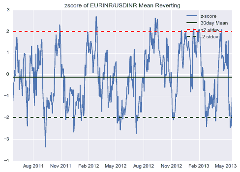

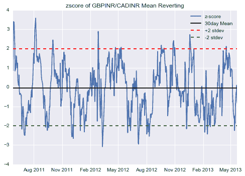

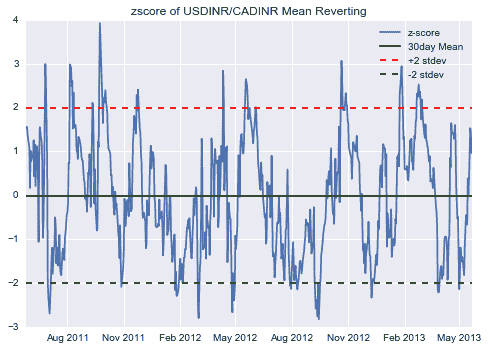

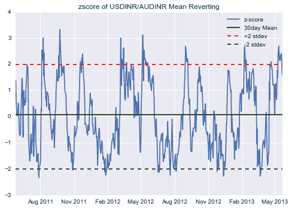

**从上述选定对的 Z 得分图来看，Z 得分在 2 个标准偏差内表现出均值回复行为。**

**建立交易策略:**

*   当 z-score 触及+2 时，做空该对，当它回复到+1 时平仓
*   当 z-score 触及-2 long 对，当它回复到-1 时平仓。
*   在一个时刻只有一个位置。

**权益曲线:**

绘制股本曲线，起始资本为 100 印度卢比，平均分配给 4 对。

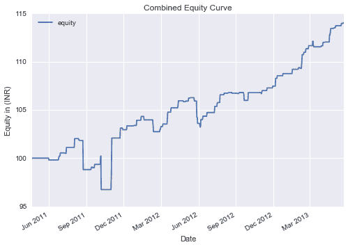

初始资本为 100 印度卢比，股本最终为 114.05 印度卢比。

在没有任何杠杆作用的情况下，累计利润为 14%。10 倍的杠杆(对于[外汇交易](https://blog.quantinsti.com/automated-forex-trading/)来说是理想的)，利润可以达到 140%。以下是该战略的重要绩效指标。

| 无杠杆利润百分比 | 14.0514144897 % |
| 10 倍杠杆的利润百分比 | 140.514144897 % |
| 正交易的数量 | Fifty-nine |
| 负交易数量 | Twenty-three |
| 命中率 | 71.9512195122 % |
| 平均正贸易 | 0.46886657456220338 |
| 平均负交易 | -0.59181362649660851 |
| 平均利润/平均损失 | 0.792253766338 |
| 最大水位下降 | -5.1832506579 % |

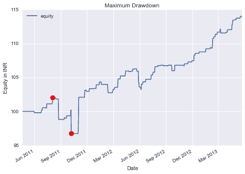

上图显示了用红点标记的最大下降点，该值添加到上表中。

### **实施说明**

*   请运行名为 harish_stat_arb.ipynb 的 IPython 笔记本，以确认结果和图。
*   另一种方法是在任何 python IDE 上运行 python 脚本 harish _ quantin STI _ final _ project _ code . py 来确认结果和图形。
*   使用以下代码将最终数据帧导出到 excel 文件。

```py
writer = pd.ExcelWriter('pairs_final.xlsx',engine = 'xlsxwriter')

pairs.to_excel(writer,'Sheet5')

writer.save()
```

### **结论**

尽管该策略在 2 年的回溯测试期内产生了 140%的回报，但为了更准确地评估该策略的绩效，应考虑以下因素。

*   该模型忽略了滑点和佣金
*   该模型忽略了买卖订单时的买卖价差

在这篇关于[算法交易策略范例](https://blog.quantinsti.com/algorithmic-trading-strategies/)的文章中阅读其他策略。如果你也想了解更多的算法交易，那么[点击这里](https://www.quantinsti.com/epat)。

**参考书目**

*   统计套利讲座 Quantinsti， [Nitesh Khandelwal](https://www.linkedin.com/in/niteshkh)
*   Pairs Trading，Ganapathy Vidyamurthy，Wiley Finance
*   成功的算法交易，迈克尔·霍尔斯-摩尔