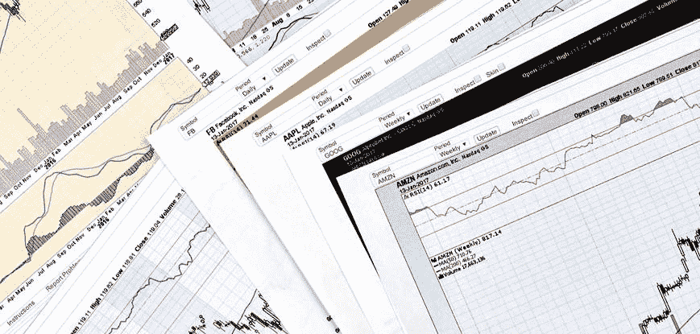
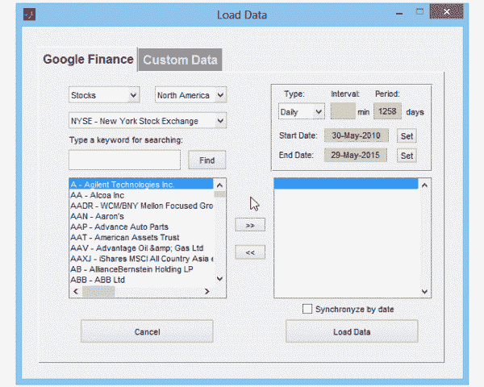

# 谷歌股票历史价格下载工具箱

> 原文：<https://blog.quantinsti.com/google-finance-download-historical-prices/>

亚历克斯·博伊科夫的客座博文

### **利用谷歌股票历史价格建立交易策略**

你好，我叫亚历克斯·博伊科夫。我是 [WFAToolbox](http://wfatoolbox.com/?utm_source=quantinsti&utm_medium=partner&utm_campaign=Articles) 开发团队的一员。这个应用程序为[提供了使用谷歌股票历史价格在 MATLAB](http://wfatoolbox.com/?utm_source=quantinsti&utm_medium=partner&utm_campaign=Articles) 中开发算法交易策略的最简单方法。该工具箱将帮助您解决从 20 多个股票交易所免费获取每日和当日历史股票价格的问题，包括上海证券交易所(SSE)，孟买证券交易所(BSE)等。

你们中有人以前遇到过以下问题吗？你从某人那里听说，或者在网上读到，一些资产的一个有趣的策略(例如，新兴市场石油公司的**对交易**，这些公司之间高度协同整合，并且有足够的流动性)你惊呼:“哦，我的上帝，当然在这里！啊，要是我有那些“俄罗斯天然气工业股份公司”和“卢克石油公司”的盘中历史数据，我就能检验一下了！”。就在那时，你开始疯狂地在所有你知道的网站上寻找免费的历史数据，从在谷歌、论坛、博客等网站上激烈搜索开始。然后你打开自来水厂，访问一些昂贵的数据馈送公司的“定价”页面；最后，在花了漫长而又令人厌倦的一天时间寻找引语后，你变得绝望了。你决定去谷歌金融网站，你看到你需要的谷歌股票历史价格数据。你歇斯底里地惊叫:“为什么！为什么我不能直接从谷歌金融下载呢……”

在 [WFAToolbox](http://wfatoolbox.com/?utm_source=quantinsti&utm_medium=partner&utm_campaign=Articles) ，我们经常会遇到这种情况。只要我们还没有决定改变这种局面。与此同时，我们开发了一个应用程序，极大地简化了在 MATLAB 上对算法交易策略的测试和分析，我们还添加了一个特殊模块，允许您从来自美国、欧洲、亚洲和澳大利亚的 20 多个证券交易所下载 100，000 多个谷歌股票的每日和当日历史价格。

WFAToolbox 提供的一些其他功能包括:

*   构建策略规则
*   进行向前分析
*   执行交易策略的优化
*   性能结果的丰富可视化
*   并行处理技术的使用
*   在 Excel 等中轻松分析策略和投资组合结果。

特别是对于 QuantInsti 博客，我们从 MATLAB 中编译了一个独立的应用程序，允许任何用户(无论有没有 MATLAB)上传 csv 格式的 Google 股票历史价格报价，以便进一步导入其他程序和在 Excel 中工作。我们已经尽了最大努力使申请对这项工作来说尽可能容易。

我们用 MATLAB 创建算法交易策略。我们认为它比 R 和其他解决方案有很多优势，其中最主要的优势是能够添加来自 Mathworks 和第三方开发人员的模块(例如，我们的应用程序—[WFAToolbox—Walk-Forward Analysis Toolbox](http://wfatoolbox.com/?utm_source=quantinsti&utm_medium=partner&utm_campaign=Articles))。

前向分析是一种持续的、适应性的方法，用于评估交易系统的稳健性。它结合了“样本内优化”和“样本外验证”的多个循环。

**MATLAB 的其他优势包括:**

*   易于学习的语言，允许编写一个完整的回溯测试程序
*   提供矢量化操作，加快策略程序的执行时间
*   许多先进的统计和数学内置模块有助于创建策略
*   大量第三方软件包可用于量化交易
*   非常适合测试包含大量股票和其他资产的策略
*   丰富的图形交互式可视化输出，用于评估战略绩效

在[算法交易高管课程(EPAT)](https://www.quantinsti.com/epat/)中，有两个由 E . P . Chan 博士主讲的关于量化动量策略的专题讲座。他广泛使用 MATLAB 来说明动量策略的实际实施。

### **下一步**

在我们的下一篇文章“使用 Python 对股票数据的基本操作”中，我们将展示使用 Python 对股票数据执行的基本操作，以分析和构建算法交易策略。我们使用 Python 运行一些可以在股票数据上执行的基本操作，并从从 CSV 文件中读取股票数据开始。

**更新**

我们注意到一些用户在从雅虎和谷歌金融平台下载市场数据时面临挑战。如果你正在寻找市场数据的替代来源，你可以使用 [Quandl](https://www.quandl.com/) 来获得同样的信息。

***声明:***

这些客座博文中提供的观点、意见和信息仅属于作者个人，并不代表 QuantInsti 的观点、意见和信息。本文中所做的任何陈述或共享的链接的准确性、完整性和有效性都不能得到保证。我们对任何错误、遗漏或陈述不承担任何责任。与侵犯知识产权相关的任何责任由他们承担。