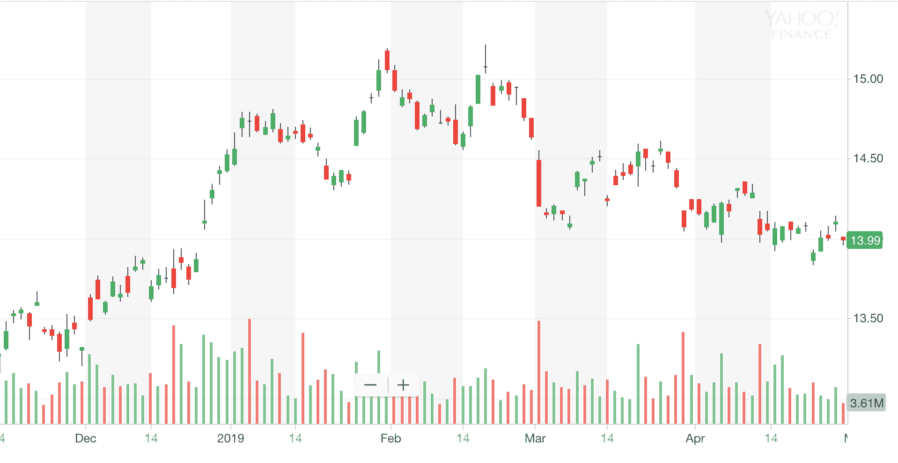
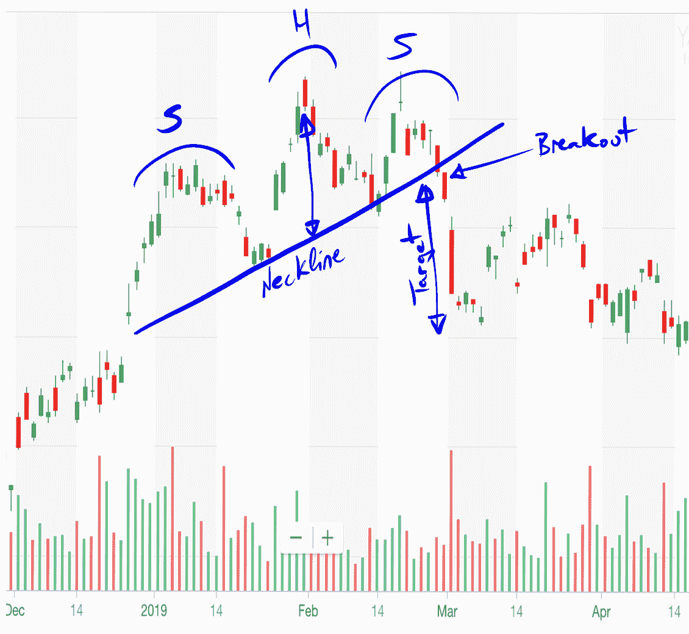
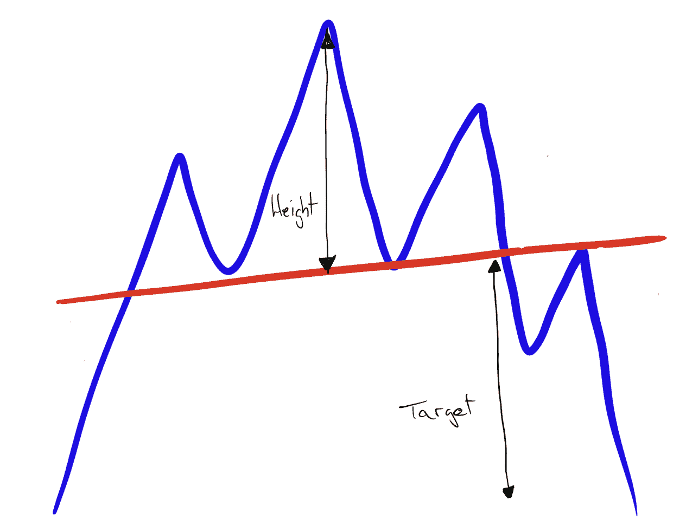

# 头肩底图案

> 原文：<https://blog.quantinsti.com/head-shoulders-pattern/>

By [Mario Pisa Peña](https://twitter.com/mariodevelop)

In this post, we will review the well-known **technical analysis pattern** called **Head and Shoulders** and we will analyze the trading rules that will allow us to take advantage of this price configuration to take a position in the market.

[Candlestick patterns](/candlestick-patterns-meaning/) are one way to interpret the price trend of a particular asset.

The main points we will review in this post are:

*   [什么是头肩底图案？](#what-is)
*   [头肩模式的解剖学](#anatomy)
*   [头肩底图案的形成](#formation)
*   [领口的相关性](#neckline)
*   [体积的作用](#volume)
*   [头肩表](#chart)
*   [交易头肩底形态](#trading-pattern)
*   [头肩模式识别](#pattern-recognition)
*   [技术分析——头肩底形态](#technical-analysis)
*   [结论](#conclusion)

The Head and Shoulders pattern is one of the best-known patterns in technical analysis. It’s a complex and subjective pattern formed on market top or bottom.

The formation is considered a **trend reversal pattern** because, after an uptrend/downtrend, the price begins to get congested and ends up turning around.

People all over the world know and pay attention to this price formation and there are many attempts to systematize the detection and exploitation of this figure - the Head and Shoulders pattern in Trading.We are going to describe here the Head and Shoulders Top pattern, the bottom pattern must be considered a mirror of this and inverting the criteria too.

The formation of a Top Head and Shoulders pattern is a price configuration that requires a rising trend. 

*   最初，像上升趋势中的任何其他峰一样，形成了一个峰，
*   形成比第一峰值高的第二峰值，
*   形成低于第二峰值的第三峰值。

The first and third peaks are shoulders and the second peak, the highest, is the **head**.Let's see step by step how the head and shoulders pattern is formed. Here we can see the **iShares Silver Trust (SLV)** chart.

### **第一步**

Initially, we have an uptrend, at this moment it’s not possible to distinguish or even intuit the pattern we are looking for. At the moment we only have a rising trend. In the below picture, we can see a new recent peak with retracement. 

### **第二步**

In the second step, the price makes a new peak higher than the previous one and again with retracement that penetrates the ground of the previous peak or support level. This is interesting, as if the retracement were greater than the first peak, we would still consider it a rising trend.

Anyway, we can only observe that the rising trend is in doubt, although we can not assume that the figure of head and shoulders is forming, we can draw a support line between the two bottoms. 

### **第三步**

In the last step, a third peak is formed, smaller than the previous one, this one can surpass the first peak or not and also has retracement. Finally, we can **distinguish a possible figure** of head and shoulders, although it is not complete until the retracement of the third peak, breaks the support line that we had drawn that, now, we can call it neckline. It is necessary to wait for the pattern to be completed with the neckline breakout because sometimes the price remains to consolidate for a while or continues its course upwards.

If the price breaks the neckline, we can estimate a price target for a short position; the target is estimated by measuring the height from the neckline to the peak of the head and projected from the break point down. This objective should be considered an estimate and is very useful for calculating the hypothetical risk/benefit of operation with this figure. 
Sometimes a pullback to the neckline occurs offering new opportunities for [short selling](https://quantra.quantinsti.com/course/short-selling-in-trading) and a stop-loss can be placed above the neckline.The volume is an aspect to take into account although it is not determinant. 

*   在第一个高峰期，交易量很高，这通常与上涨趋势相对应。
*   在第二个高峰，即头部，交易量通常低于第一个，这是一个明确的指标，表明新的高峰没有得到许多购买的支持，至少没有第一个高峰那么多。最后，
*   在第三个峰值中，交易量低于第二个峰值，再次表明价格没有能够克服前一个峰值，交易量也没有强大到足以让价格继续上涨。
*   在突破中，成交量通常会再次增长，尽管这不是必要条件，但却是一个好信号。

Below we can see the complete figure with the annotations that reflect the described steps. 
It can be clearly seen how the first peak (the right shoulder) is formed from the end of December 2018 until the middle of January 2019 approximately.

Then the head begins to form to its maximum just at the beginning of February, to begin to fall and form the second bottom in mid-February.

At this point, a hypothetical neckline could be drawn as a support line, which would only be confirmed if the third shoulder is formed.

Finally, from February 15 to the end of February the second shoulder is formed and we can confirm the neckline, when the breakout occurs, we can take short positions with a price objective equal to the height that goes from the base to the peak of the head.

It is also interesting to note the volume, which in the first shoulder is greater than the volume that occurs in the head and the third shoulder, then shoot in the breakout.This price formation has a good success rate according to [Bulkowski studies](http://www.thepatternsite.com/hst.html), the pattern is completed when the bottom of the third peak crosses the neckline. It’s common for the price to present a pullback and offer a second opportunity to trade the formation.

The target for the take-profit can be estimated by measuring the vertical from the neckline to the peak of the head. This distance is projected from the breakout point and marks a fairly approximate target price.
It is usual to adjust a stop-loss above the neckline and if the price exceeds the second shoulder (third peak) it is worth taking upward positions.The Head and Shoulders formation is a very subjective figure and therefore it’s difficult to characterize mathematically, which would give us the possibility of systematizing operations when this price configuration occurs. 

Even so, there is no doubt that there are many eyes on this configuration and many traders eager to see the figure completed.

[Bulkowski](http://www.thepatternsite.com/hst.html) has statistically characterized the behaviour of the figure, but it is under his expert judgment that determines whether or not the Head and Shoulders pattern exists, that is to say, it is a subjective interpretation.There have been numerous other attempts to mathematically characterize the figure and therefore systematically check the ability of the figure to generate positive returns.

The most notable examples are:

*   技术分析的[基础:计算算法、统计推断和实证实施](https://www.cis.upenn.edu/~mkearns/teaching/cis700/lo.pdf)由安德鲁·w·罗、哈里·马迈斯基和王江进行的研究，他们使用了核回归估计器，以及
*   由 Terence Tai Leung Chong 和 Ka-Ho Poon 研究的[一种新的“海飞丝”价格模式识别算法](https://mpra.ub.uni-muenchen.de/60825/1/MPRA_paper_60825.pdf)对之前的算法进行了改进，使用噪声过滤器来提高准确性。

These studies still need to geometrically characterize the figure, and this is the biggest problem.

On the other hand, Shengnan Li’s [Searching for Head and Shoulders Bottom Patterns under Directional Changes](http://repository.essex.ac.uk/21218/1/Shengnan_Dissertation.pdf) study uses the Directional Changes technique to determine the price configuration. Yet, it also faces the problem of geometric characterization of the figure.

Discovering patterns in price in a systematic way for Head and Shoulders configuration or other patterns of technical analysis remains a relevant study area where Machine Learning and Digital Signal Processing (DSP) techniques probably offer the most promising techniques.The Head and Shoulders pattern is a widely known pattern and deserves the attention of numerous traders around the world. Like all price configurations, they are difficult to characterize and therefore systematically exploit.

A source of information to take into account for the technical analysis patterns is the library of patterns of Bulkowski, who defines them strictly and has characterized them statistically.

In order to systematize the exploitation of technical price configurations, there are numerous studies and it is an open research field, the mentioned studies must be taken into account.

Apart from understanding patterns to make effective decisions, you can build indicators to perform a better analysis of the [trends in the market](https://www.quantinsti.com/blog/indicators-build-trend-following-strategy) which will only help in making you a better trader.

You can learn to use 15+ trading strategies including [Statistical Arbitrage](https://quantra.quantinsti.com/course/statistical-arbitrage-trading), Machine Learning, Quantitative techniques, and Options pricing models and more. [This learning track](https://quantra.quantinsti.com/learning-track/algorithmic-trading-for-everyone) is perfect for traders and quants who want to learn and use Python in trading.

**References**

*   技术分析:金融市场技术人员的完整资源。
*   托马斯·n·布尔考斯基的模式网站。

<small>*Disclaimer: All investments and trading in the stock market involve risk. Any decisions to place trades in the financial markets, including trading in stock or options or other financial instruments is a personal decision that should only be made after thorough research, including a personal risk and financial assessment and the engagement of professional assistance to the extent you believe necessary. The trading strategies or related information mentioned in this article is for informational purposes only.*</small>