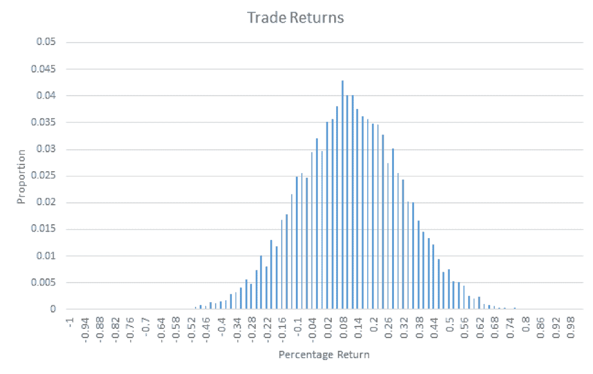
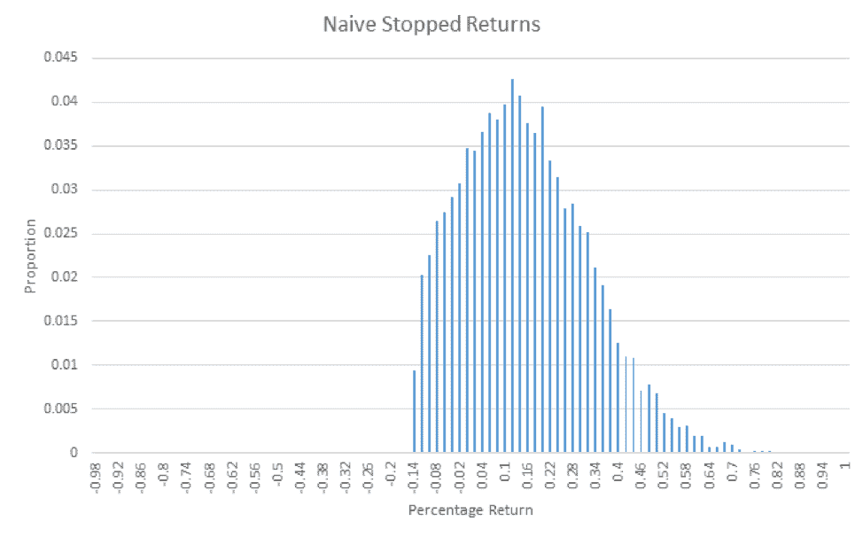
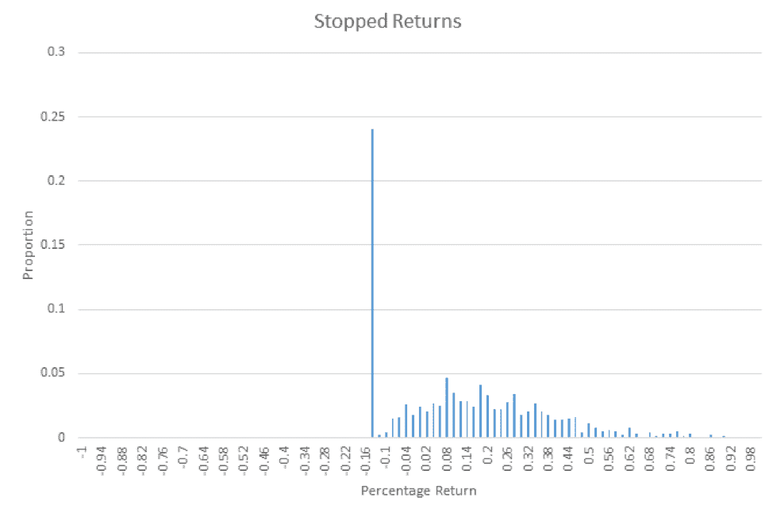
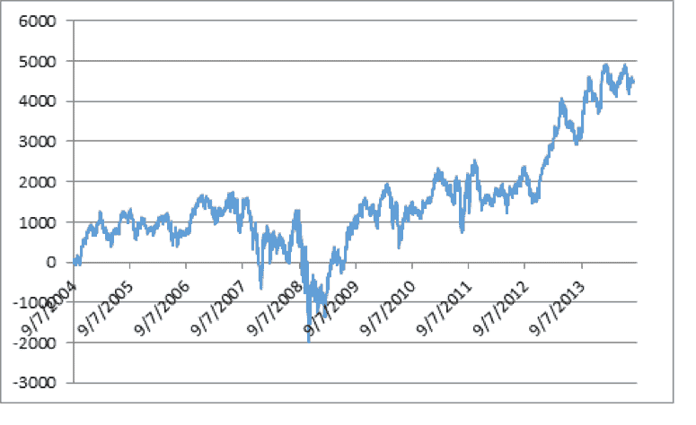
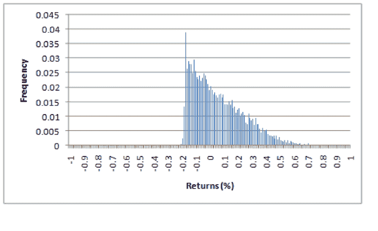

# 交易中关于止损的隐藏真相

> 原文：<https://blog.quantinsti.com/hidden-truths-stop-loss-trading/>

塔尔顿资本管理公司和 EPAT 学院的管理合伙人尤安·辛克莱博士

止损单，或通常所说的止损，是指如果你持有的公司股票达到预先确定的价格，为了避免巨额损失，向经纪人发出的卖出(或买入)订单。在交易领域，止损被视为风险控制和资金管理的重要组成部分。通常，他们认为止损的效用是不言而喻的。

"如果你限制你的损失，你怎么会破产呢？"“减少你的损失，让你的利润奔跑”。“失败者加失败者”。但是就像他们一样，有比看起来更多的东西，停止使用的效果是相当复杂的，坦率地说，很有趣。

在本文中，我们将介绍以下概念:

*   [交易中使用止损的隐性成本](#cost)
*   [止损对你预期收益的影响](#effect)
*   [分解一些关于使用止损的常见论点](#arguments)
*   止损是另一种趋势跟踪工具吗？
*   [固定止损和跟踪止损哪个好](#better)

## 交易中使用止损的隐性成本

首先，我们将了解止损对我们交易结果的分布有什么影响。图 1 显示了一个假设的交易结果示例。该交易的平均回报率为 10%，标准差为 15%。

图 1:我们交易策略的回报分布。

然而，我们也可以看到相当数量的交易是亏损的(这里有近 11%的交易亏损超过 15%)。一个自然的想法是引入止损，以某种方式“切断”分布的左侧。

人们很容易认为止损的使用只是通过将损失限制在某个水平来截断分布的下行。重新绘制分布图来反映这种直觉给了我们图 2，在 15%的下跌水平引入了止损，所以所有的损失都限制在 15%。

图 2:添加止损点后的期望分布。

然而，稍微想一想就足以看出这种分布是不可能的。被止损的交易不会消失。他们的结果仍然需要考虑(数学上，概率密度函数的积分仍然必须是 1)。所以我们下一步推测这些交易集中在止损点附近。但这还是忽略了重要的一点。

许多交易在期末是小赢家，会被提前止损。请注意，大赢家仍然存在，因为这些交易大部分是以赢家的身份开始的，从来没有回头看，但是止损点的存在会大大减少小赢家的数量。这是使用止损的隐性成本。

## 止损对你预期收益的影响

为了了解使用止损的确切效果，我模拟了 10，000 GBM 路径，代表每天检查一次交易的表现。同样，预期的最终回报是 10%，标准差是 15%，止损是 15%。结果如图 3 所示。

图 3:添加止损时的真实分布。

这里有几点需要注意。首先，平均回报受到止损的负面影响。“未止损”投资的平均回报率为 **10** %(正如我们为模拟计划的那样)，但当我们添加止损时，这一回报率降至 **8.8** %。这是假设(未停止的)结果遵循正态分布的数学必然性。

通过增加止损点，我们消除了大输家(在这种情况下，大于 15%)，但我们也消除了后来会恢复到止损水平以上的交易。因为正态分布在平均值附近的密度比在两翼的密度大，所以边际交易比大输家多。

止损不仅仅是止损。它们极大地改变了回报分布的形状，降低了平均回报。增加止损点不会把失败的策略变成成功的策略。我们添加止损的唯一原因是我们喜欢止损分布的形状，也就是说，我们喜欢用大量的小亏损和较少的小盈利来换取一些大亏损。

虽然这是事实，但现实世界要复杂得多。回报不是正态分布的，结果会随着时间而变化。同样，交易者也没有理由只对收益最大化感兴趣。安全和风险控制对经济和心理都很重要。

之前的模拟只针对一个特定的过程:具有正漂移的几何布朗运动。如果稍微困难一点，对交易有更复杂、更现实的结果的情况进行类似的分析是可能的。我们可以加上厚尾、崩溃和偏斜。我们也可以让一次交易的结果依赖于之前的交易。所有情况下的结果基本上是一样的:止损降低了平均回报，并将回报分布变成了双峰。

但在回报过程未知且肯定不正常的实际市场中会发生什么呢？让我们离开理论的领域，进入真实的市场。

显然，许多投资者喜欢使用止损。事实上，有些人坚持止损是绝对必要的，他们认为止损的正确使用是整体长期成功的一个很好的预测。我们不应该因为某个名人说过这样的话就接受它，而是应该研究为什么会这样。考虑到大多数模拟测试显示止损是要花钱的，这些交易者在想什么呢？

## 分解一些关于使用止损的常见论点

### 止损限制损失

对于任何特定的交易来说，这都是千真万确的。忽略滑点和交易成本，当我们使用止损时，我们不能在任何投资上损失超过某个预先定义的金额。但是，正如我们在简单模拟中所看到的，总的来说，这可能只是一种错觉。使用止损实际上会让我们长期亏损，所以这个理由当然需要更多的理由。

### 止损是一种纪律

的确，如果你总是使用止损，那么你就表现出了纪律性。但是纪律需要持续地应用合理的方法，而不仅仅是持续地做一些事情。所以这个答案真的根本不是答案。

### 在每项投资中投入一定数量的风险是很重要的(1%或 2%通常是给定的数量)

为什么这很重要？这也需要证明，而不仅仅是陈述。此外，交易规模和风险控制与为每一个头寸设定亏损是不同的问题。

### 止损实际上是一个预先设定好的出口。当我们不想再处于这个位置时，我们会被阻止。

当我们不想处于某个位置时，退出这个位置是一个极好的主意。如果我们用止损来形式化这一点，那么它们是完全合理的。但我们需要更多地思考这意味着什么。如果我们退出一个仓位纯粹是因为价格变动了一定的幅度，那么我们就是趋势跟踪。我们含蓄地说，已经发生的变化预示着未来的变化。这值得重复。基于价格的止损是一个趋势跟踪系统。因此，如果我们明确押注于[势头](https://quantra.quantinsti.com/course/momentum-trading-strategies)，它们可能是很有意义的。

相反，如果我们交易的是我们预期会恢复的东西，它们就没有多大意义。在这种情况下，我们将在我们认为未来利润潜力最大的时候退出交易。

让我们详细看看前面的观点。换句话说，我们应该卖出对我们不利的头寸的原因是，只有当我们预计这种走势会继续时。损失已经发生；我们需要考虑我们当前的风险，而不是已经发生的损失的沉没成本。如果我们只是根据价格波动来止损，我们是说价格方向决定了未来的价格方向，也就是说，我们是在跟踪趋势。

这意味着任何止损规则的测试实际上都是趋势跟踪策略的测试。止损和风险控制关系不大。它们实际上是对我们优势来源的一种陈述。让我们看看这种说法是否有分量。

## 止损是另一个趋势跟踪工具吗？

作为一个有趣的小练习，看看这会导致什么，我测试了一个非常简单的交易想法。

我以 5 分钟为间隔采样了 10 年的间谍价格(分笔成交点数据在理论上可能更好，但数量太多了)。

每天开始时，我买 100 股 SPY 股票并持有一天，然后在收盘时卖出。结果如下所示，如图 4 所示。

日均利润:$0.49
夏普比率:0.066
总利润:$1225
日均最高利润:$699
日均最高亏损:$794
赢%:54.3%
平均赢/平均亏:0.85

图 4:间谍买入并持有日策略的结果。

毫不奇怪，这么简单的想法执行起来并不是特别好。现在我们加了一个止损点，把我们的买入并持有交易转变为趋势跟踪策略。具体来说，我们计算了过去 20 天每日回报的标准差，如果我们在任何一天损失了超过一半的金额，就停止我们的多头头寸。这些只是我脑海中闪现的第一批参数，但结果相对于选择来说相当稳健(除非我们做一些疯狂的事情，比如将止损点设置得如此之大，以至于永远不会被触及)。所以我们使用一个固定的停靠点，每天早上重新设置。结果如下所示，如图 5 所示。

日均利润:$1.79
夏普比率:0.298
总利润:$4464
日均最高利润:$699
日均最高亏损:$396
赢%:47.0%
平均赢/平均亏:1.18

图 5:停止间谍策略的结果。

增加止损点可以明显改善结果。这很好，但这并不是这个练习的重点。关键是我们现在有了趋势跟踪策略的经典统计数据。买入并持有交易的盈利率为 54.3%，但增加止损点后，盈利率降至 47%。但这被平均输赢比的提高所弥补有余。

我知道对随机条目的测试远不是一个新的想法，但我倾向于认为它们完全被误导了。在我看来，这个结论的部分原因是由于这个名字的误导性。非随机出场的随机进场并不是真正的随机。退出很容易被视为进入现金头寸。但是我在更重要的一点上错了:实施止损的趋势跟踪策略确实有效。

总之，止损是要花钱的，它们是一种趋势跟踪工具，而不是一种风险控制方法。

## 固定止损和跟踪止损哪个更好

这里有点离题，但一个常见的问题是，在距离我们的进场价格给定距离处使用固定止损或移动跟踪止损，使其与最高投资额保持一定距离，这两者之间是否有任何真正的区别。我们来详细看看这个。

跟踪止损是一个非常令人欣慰的策略。它似乎能保护我们免于目睹胜利者变成失败者的痛苦经历。它确实是这样做的。但是如此吸引人的东西真的是免费的吗？为什么不是所有的投资者都这样做呢？

跟踪止损比固定止损成本高。它实际上减少了更多的回报。这是因为一些可能成为大赢家的职位没有机会充分实现他们的潜力。当使用固定止损时，一些投资受益于远离止损，有机会发展。跟踪止损总是在起作用。

调整我们之前的模拟证实了这一点。在止损之前，我们有一个均值为 10%，标准差为 20%的分布。但是现在我们加了一个止损点，这样它总是比交易高点低 15%。

跟踪止损的增加降低了交易的平均回报率，只有 4.7%。这远远低于未止损的回报，也低于使用固定止损时的回报。图 6 显示了我们使用跟踪止损时的分布。

图 6:使用追踪止损时模拟交易的回报分布。

在这种情况下，分配现在与未停止的投资完全不同。

一般形态的出现是因为一些交易开始很糟糕，并在最糟糕的水平被止损。有些赚了一点钱，然后回落，在最初止损点上方被止损，如此类推，直到我们到达那些永远不会被止损的。因为这个止损点在降低交易的期望值方面更昂贵，投资者必须非常确定这是他正在寻找的分布。

所以这个问题确实有一些价值。跟踪止损确实不同。我不确定他们是否更好。这种选择将取决于个人偏好。

## 结论

我们可以说，虽然止损确实让你对你持有的风险数量有了保证，但却损害了你对自己设计的策略的预期回报。此外，我们还将止损单视为趋势跟踪工具，而非风险控制措施。

这个内容是即将出版的《持仓期权交易》一书的一部分。

*免责声明:股票市场的所有投资和交易都有风险。在金融市场进行交易的任何决定，包括股票或期权或其他金融工具的交易，都是个人决定，只能在彻底研究后做出，包括个人风险和财务评估以及在您认为必要的范围内寻求专业帮助。本文提到的交易策略或相关信息仅供参考。*