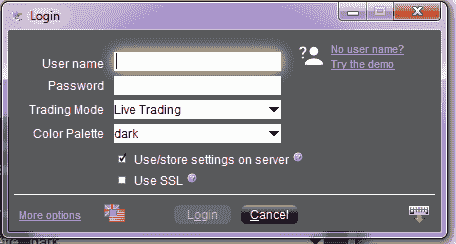
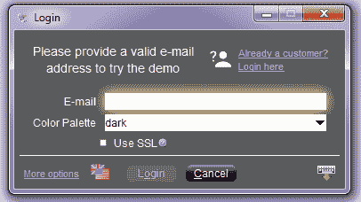
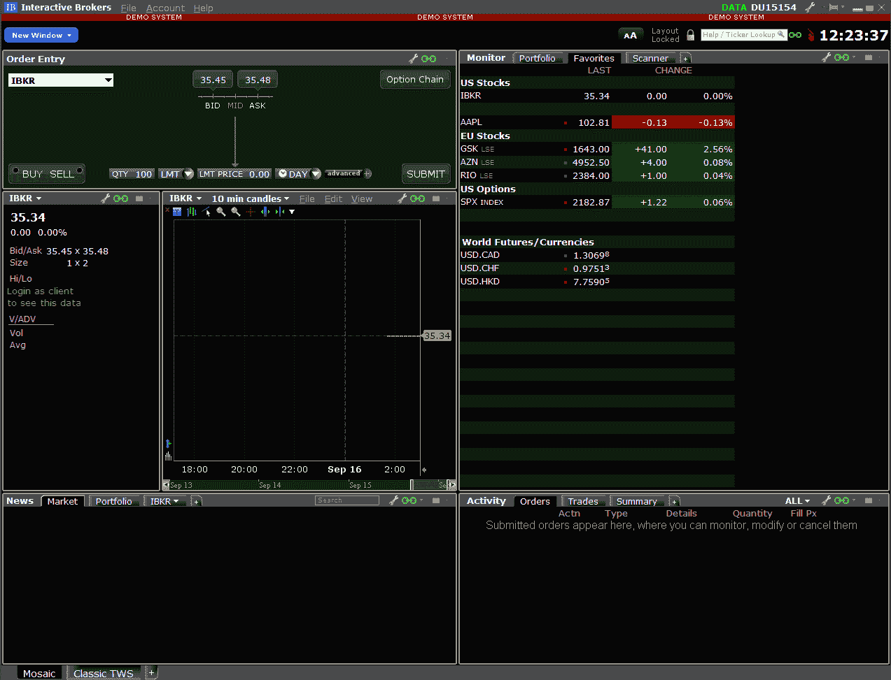
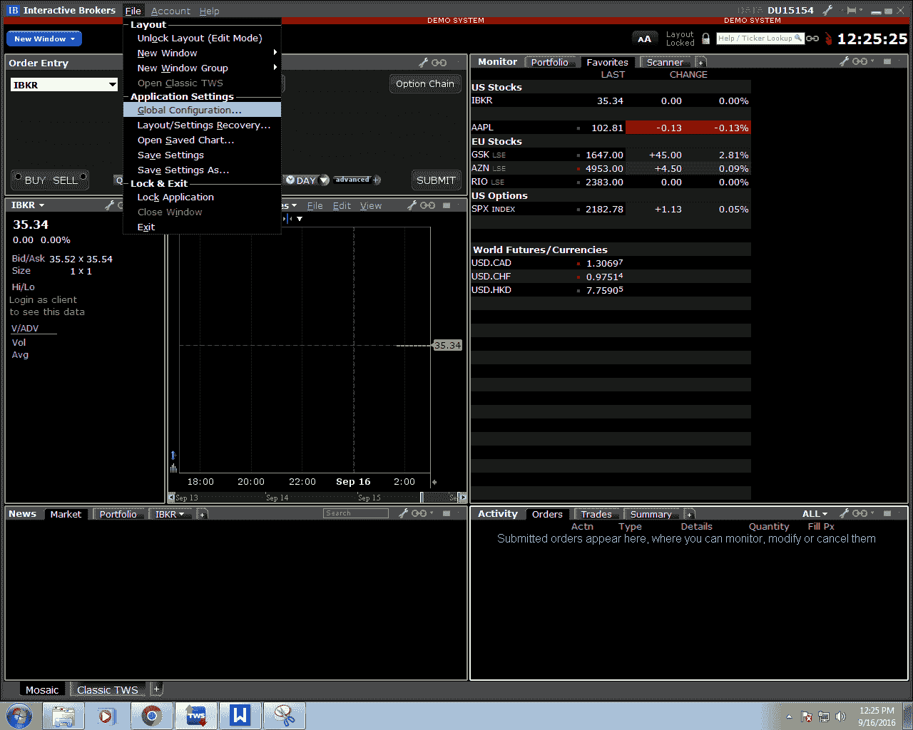
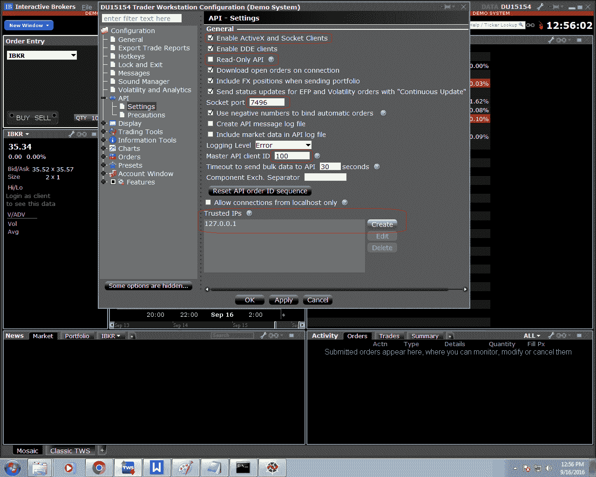
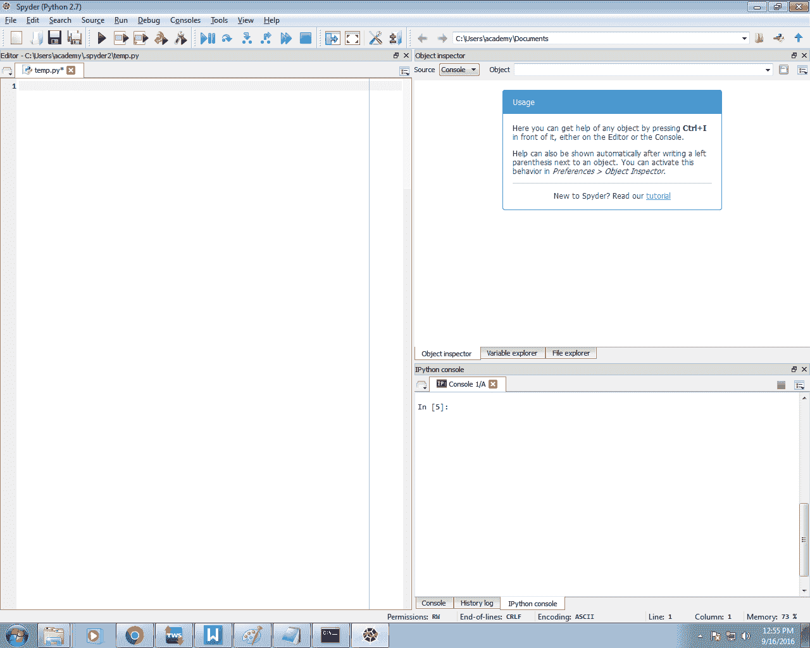

# 在交互式代理 API 中实现 Python 的 IBPy 教程

> 原文：<https://blog.quantinsti.com/ibpy-tutorial-implement-python-interactive-brokers-api/>

我希望您在参加我们关于使用 Python 与交互式经纪人进行 [**交易的网上研讨会时过得愉快。我认为这将是一个非常好的主意，给你一个关于**交互式经纪人 API** 和使用 **IBPy** 在 IB 的 TWS 中实现 Python 的简要见解。**](https://www.quantinsti.com/?p=5347&preview=true)

随着我们的进行，你将需要一个交互式经纪人模拟账户和 IBPy。在本文快结束时，您将使用**交互式代理 API** 运行一个简单的订单路由程序。

我们涵盖的内容:

*   [为什么选择互动经纪人？](#why-interactive-brokers)
*   [什么是 IBPy？](#what-is-ibpy)
*   [在 Python 中实现 IB](#implementation-of-ib-in-python)
*   [交互式经纪人面板的配置](#the-configuration-of-interactive-brokers-panel)
*   [运行第一个程序](#running-the-first-program)
*   [运行代码](#running-the-code)
*   [输出](#output)
*   [完整的 Python 代码](#complete-python-code)
*   [下一步](#next-step)

* * *

对于那些已经了解交互式经纪人(IB)及其界面的人来说，你可以很好地理解为什么我更喜欢 IB 而不是其他在线经纪人。但是，对于没有使用过 IB 的人来说，这可能是他们首先想到的问题:

* * *

### ****[为什么要互动券商？](#why-interactive-brokers)****

**互动经纪人是我的首选，原因很简单:**

1.  在 100 多个市场进行国际投资
2.  **极具竞争力的佣金率**
3.  低利润率
4.  **非常友好的用户界面**
5.  大量订单类型可供选择

上面说的五点，对任何一个初学者来说最重要印象最深的就是第二点和第四点了吧？

交互式代理 API 可以在专业环境中使用，即使是对它完全陌生的人也可以使用。交互式代理 API 与 Java、C++和 Python 的连接也令人印象深刻。

够了，是时候进入下一步了。我可以理解，你们中的大多数人一定已经迫不及待地想在交互式经纪人 API 面板上一试身手了。毕竟，没有人会拒绝一些既友好又有利可图的东西。

你可以很容易地在互动经纪人网站上设置你的账户。有一个选项，您可以选择免费试用包。

算法交易者更喜欢交互式经纪人，因为其相对简单的 API。 在这篇文章中，我将告诉你[如何通过使用一个叫做 **IBPy** 的桥在交互式经纪人 API](https://quantra.quantinsti.com/course/Automated-Trading-IBridgePY-Interactive-Brokers-Platform) 中实现 Python 来自动化交易。

由于交互式经纪人为多种多样的交易者提供了一个平台，因此，它的 GUI 包含了无数的功能。这个独立的应用程序在交互式经纪人上被称为交易员工作站或**【TWS】**。

除了交易者工作站之外，Interactive Brokers 还有一个 IB 网关。这个特殊的应用程序允许 IB 服务器使用命令行界面访问它。Algo 交易者通常更喜欢用这个而不是 GUI。

* * *

## **[IBPy 是什么？](#what-is-ibpy)T3】**

> ***IBPy 是用于访问交互式经纪人在线交易系统的 API 的第三方实现。***
> 
> ***IBPy 实现了 Python 程序员可以用来连接 IB、请求股票行情数据、提交股票和期货订单等功能。***

IBPy 的目的是以一种可以从 Python 调用的方式来构思用 Java 编写的本机 API。IBPy 中最重要的两个库是 ib.ext 和 ib.opt。

通过 IBPy，API 执行订单并获取实时市场数据。该架构本质上利用了客户端-服务器模型。

* * *

## [在 Python 中实现 IB](#implementation-of-ib-in-python)

首先，您必须有一个 Interactive Brokers 帐户和一个 Python 工作空间来安装 IBPy，然后，您可以将它用于您的编码目的。

### **安装 IBPy**

正如我之前提到的， [IBPy](https://github.com/blampe/IbPy) 是一个 **Python 模拟器**为基于 **Java 的** **交互式代理 API** 编写的。IBPy 有助于将 Python 中的**算法交易系统**的开发变成一个不那么麻烦的过程。

为此，我将把它作为与互动经纪人 TWS 进行各种互动的基地。这里**我假设你的系统上安装了 Python 2.7，否则你可以参考这里[提到的安装指南](/getting-started-python-trading)。**

* * *

### **在 Ubuntu 上安装 IBPy**

##### ****采集****

IBPy 可以从 GitHub 仓库获得。

Ubuntu 系统需要以下代码:

```py
sudo apt-get install git-core
```

##### ****创建子目录****

```py
mkdir ~/ibapi
```

##### **T1】下载** IBPy

```py
cd ~/ibapi

git clone https://github.com/blampe/IbPy

cd ~/ibapi/IbPypython setup.py.in install
```

太好了！你已经在你的 Ubuntu 系统上安装了 Python。

* * *

### **在 Windows 上安装 IBPy**

去 github 库，从[https://goo.gl/e6Idr6](https://goo.gl/e6Idr6)下载文件

解压缩下载的文件。将此文件夹移动到 Python 的安装目录，以便它可以识别此包:

**\ \ anaconda 2 \ Lib \ site-packages**

现在，使用 windows 命令提示符打开安装程序，并键入以下命令:

```py
python setup.py install
```

在这之后，你必须让你的交易工作站(TWS)投入运行。

* * *

### ****安装交易员工作站****

互动经纪人交易工作站或 TWS 是图形用户界面，让所有注册用户的互动经纪人交易系统。别担心，即使你事先没有编程或编码知识，TWS 也会让你做交易工作。

你可以从互动经纪人的网站下载 TWS 安装程序，并在你的系统上运行。

你可以从这里下载 TWS 的演示:[https://www.interactivebrokers.com/en/index.php?f=19903&invd = T](https://www.interactivebrokers.com/en/index.php?f=19903&invd=T)

###### ****重要提示:****

在旧版本的 TWS 中，用户可以选择两个不同的程序。第一个是互动经纪公司的 **TWS** ，第二个是我之前已经谈到的 **IB 网关**。虽然它们是不同的应用程序，但是，它们只能一起安装。

**IB 网关运行在较低的处理能力上，因为它没有像交易工作站那样改进的图形用户界面。然而，结果和其他数据以原始代码的形式显示在 IB 网关上，这使得对于某些不具备足够编码知识的用户来说不太友好。*T3】*

**您可以使用这两个界面中的任何一个进行互动经纪人的工作。两者的功能保持不变，即在您的系统和交互式代理服务器之间传递信息。不用说，Python 应用程序将从交互式代理的服务器端获得完全相同的消息。*T3】*

* * *

### ****安装走查****

下载应用程序后，您会在浏览器底部找到可执行文件。出现安全警告提示时，单击运行。

*   现在，点击下一步。
*   单击“完成”完成安装。
*   点击桌面图标，启动 TWS 应用程序。



由于我要使用模拟账户，因此，点击 **<u>没有用户名？</u>T3】**

*   输入您的电子邮件地址，然后点击登录:



* * *

## **[交互式券商面板的配置](#the-configuration-of-interactive-brokers-panel)**

到目前为止，旅程还算顺利，不是吗？如果你同意我的观点，那就太好了。在安装了 TWS 和/或 IB 网关之后，在交互式经纪人服务器上实施我们的策略之前，我们必须对配置进行一些更改。只有更改这些设置后，软件才能正确连接到服务器。

### **程序**

*   转到 TWS 的 API 设置
*   勾选**启用 ActiveX 和 Socket 客户端**
*   将**插座端口**设置为未使用的端口。
*   将主 API 客户端 ID 设置为 100
*   创建一个**可信 IP 地址**并设置为 127.0.0.1







* * *

## **[运行第一个程序](#running-the-first-program)**

**那么，配置完成了吗？**

太好了！我们现在准备运行我们的第一个程序。

在你开始输入这些代码之前，确保你已经启动了 TWS(或 IB 网关)。很多次，我都被问到为什么代码运行时会出现错误信息。

就像我在上一节提到的，你的系统通过 TWS 或 IB 网关连接到交互式经纪人的服务器。所以，如果你还没有打开它，那么你一定会得到一个异常消息，不管你开发代码有多聪明。

让我们开始一步一步地编写代码。

打开 Spyder(开始-所有程序- Anaconda2 - Spyder)

在 Spyder 控制台上，我将输入我的代码。



##### **步骤 1 -我们从导入代码所需的模块开始:**