# 用 Python 安装 Ta-Lib:适用于所有平台的完整指南

> 原文：<https://blog.quantinsti.com/install-ta-lib-python/>

由[伊山·沙阿](https://www.linkedin.com/in/ishan-shah-18393828/)、[雷希特·帕查内卡](https://www.linkedin.com/in/rekhit/)和[高拉夫·辛格](https://www.linkedin.com/in/singh-gamer-gaurav/)

技术指标是使用历史价格和交易量数据来预测市场方向的。这些指标加在图表上，你可以用它来设置你的进场和出场信号。

如果您可以用 python 中的几行代码计算这些技术指标，并对它在许多金融证券上的表现进行回溯测试，这不是很神奇吗？

Ta-Lib python 库最初是 Mario Fortier 的爱好，但很快成为最著名的股票和其他金融证券技术分析库之一。Ta-lib 包括 150+指标，如 ADX、MACD、RSI 和布林线以及[烛台模式](/candlestick-patterns-meaning/)识别。

然而，在 python 中安装 Ta-Lib 很困难，有时甚至令人沮丧。但是不要担心，在本文中，我们将为您简化安装，以便您可以专注于创建和回溯测试策略。

我们将在这个 Ta-Lib 安装教程中讨论以下主题。

**最简单的方法**

*   [安装 Ta-Lib 的最简单方法](#the-easiest-way-to-install-ta-lib)

**替代方法**

*   [在 Windows PC 上安装 Ta-Lib](#install-ta-lib-on-windows-pc)
*   [在 MacOS 上安装 Ta-Lib](#install-ta-lib-on-macos)
*   [在 Linux 上安装 Ta-Lib](#install-ta-lib-on-linux)
*   [使用 Python Ta-Lib 的技术指标](#technical-indicators-using-python-ta-lib)

* * *

在我们开始之前，为什么首先要创建 Ta-Lib python 库？让我们思考函数产生的原因。人们意识到，我们可以创建一个函数，大幅减少代码长度，而不是编写相同的代码。

这与我们应用于 Ta-Lib 的逻辑相同。我们使用 Ta-Lib，只输入一行代码就可以得到结果，而不是写几行代码先找到上下波段，然后找到布林线。

仅此而已！记住这一点，让我们从 Ta-Lib python 库教程开始。

* * *

## 安装 Ta-Lib 最简单的方法

下面是使用 Anaconda 提示符跨平台安装 Ta-Lib 的最简单也是最好的方法。

Anaconda 是一个开源的 Python 分发平台，帮助个人和商业企业轻松实现他们的 Python 代码。这也使得安装各种 [Python 库](/python-trading-library/)变得更加容易。

**要轻松安装 Ta-Lib，您可以遵循以下步骤:**

*   安装 Anaconda
*   打开 Anaconda 提示符
*   写代码:***conda install-c conda-forge ta-lib***
*   按下“输入”键

瞧啊！Ta-Lib 现在安装好了！

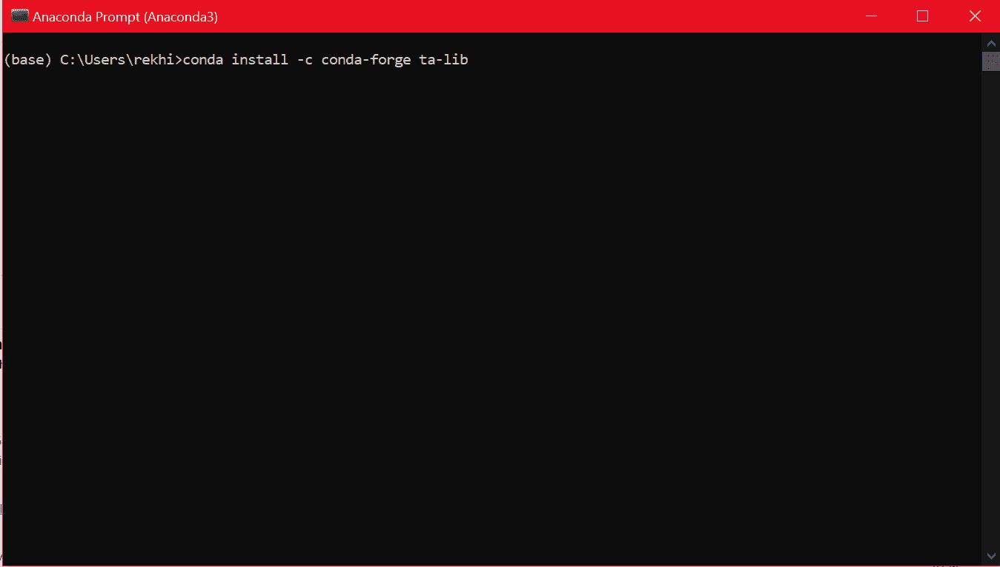

几分钟后，ta-lib 包将被安装。

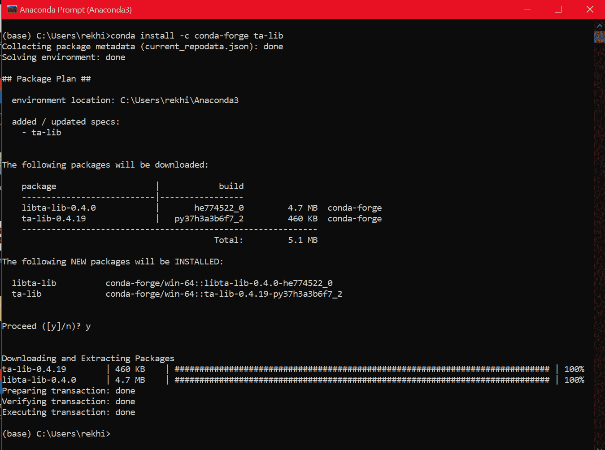

这就是全部了。大多数情况下，这种方法可以帮助你安装软件包，但是如果你仍然面临任何问题，请继续阅读，找到操作系统的安装说明。

**注意:**首先从各自的 web 位置下载包。然后，系统会提示您通过按键盘上的“y”来确认安装过程。这是对安装程序安装必要文件的确认。

* * *

## **在 Windows PC 上安装 Ta-Lib**

第 0 步:我们建议使用 [Anaconda 安装程序](https://www.anaconda.com/distribution/)来安装 Python，因为在用 Python 编程时，它更容易使用。

步骤 1:一旦安装了 Anaconda，您将使用 Anaconda 提示窗口来安装相关文件。

在我们下载 Python Ta-Lib 文件之前，我们必须在我们的计算机上验证 Python 版本以及 Windows 系统架构(32 位或 64 位)。

只需在 Anaconda 提示窗口中编写以下代码，就可以找到系统中安装的版本: **python - version**

您将获得如下所示的输出:


对于 windows 体系结构，您只需右键单击“计算机”(通常命名为“这台电脑”或“我的电脑”)图标，然后单击“属性”，就会显示您的系统详细信息。

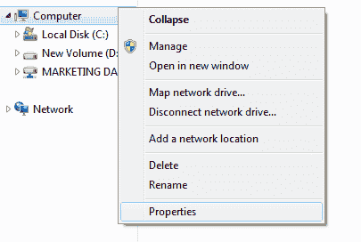

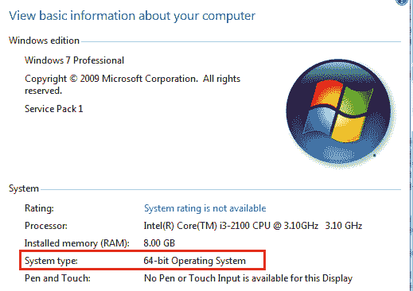

步骤 2:在安装 Ta-Lib 时，我们不能直接使用“pip install”命令。因此，我们将首先安装“whl”文件，该文件可在以下链接中找到:[https://www.lfd.uci.edu/~gohlke/pythonlibs/#ta-lib](https://www.lfd.uci.edu/~gohlke/pythonlibs/#ta-lib)

该网站是许多 Python 扩展的有用资源，但我们现在关心的是 Ta-Lib 的安装。

您可以向下滚动到我们将找到相关链接的部分，如下所示:

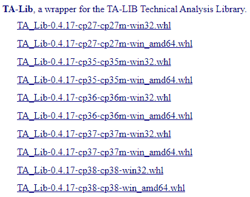

需要注意的是，在下载文件时，请记住您的 Python 版本和 Windows 架构(32 位或 64 位)。例如，由于我们安装了 python 版和 64 位 Windows 7 系统，我们将下载文件“TA _ Lib-0 . 4 . 17-cp37-cp37m-win _ amd64 . whl”。

您可能已经猜到“cp37”意味着 Python 版本 3.7，“win_amd64”意味着 Windows 64 位操作系统。

默认情况下,“whl”文件下载到“Downloads”文件夹中。由于我们已经为 Python 使用了 [Anaconda 安装程序](https://www.anaconda.com/distribution/),我们将把文件放在 Anaconda 提示符上显示的同一个文件夹位置。

例如:C:\Users\rekhit.p

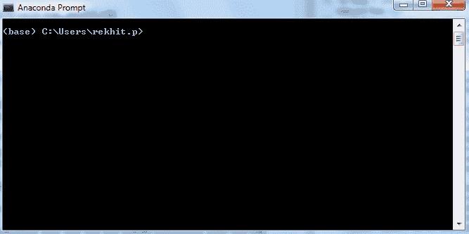

现在是容易的部分。

在 Anaconda 提示符下，使用带有下载文件的文件名的 pip install 命令。

因为我们已经下载了文件“TA _ Lib-0 . 4 . 17-cp37-cp37m-win _ amd64 . whl”，所以命令应该是，**pip install TA _ Lib-0 . 4 . 17-cp37-cp37m-win _ amd64 . whl**

如果没有错误，那么就暗示我们已经成功安装了 Ta-Lib。您应该会看到一个显示以下消息的屏幕。


太好了！我们刚刚安装完 Ta-Lib Python 库。

但是我们如何检查它是否安装正确呢？

在 Anaconda 命令提示符下，您将首先键入“python”来解释程序。

然后，我们将键入以下命令，“import talib”，然后按 Enter 键。

如果没有错误，则意味着 python Ta-Lib 库已经成功安装在您的计算机上。


或者，您也可以打开 Jupyter notebook(或 Spyder)并尝试运行相同的代码来检查 Python Ta-Lib 是否安装正确。


* * *

## **在 MacOS 上安装 Ta-Lib**

与 windows 安装相比，Python Ta-Lib 在 MacOS 上的安装相对简单。但是在我们讨论 Ta-Lib 的安装之前，我们必须确保 python 环境也已安装。

你可以从的[安装 Anaconda，或者从](https://docs.anaconda.com/anaconda/install/mac-os/)的[下载 Python。](https://www.python.org/downloads/mac-osx/)

在我们看来，安装 Anaconda 通常是个好主意，因为它有助于构建一个无缝执行 python 代码的环境。

**注意:**在 Anaconda 安装期间，您将被要求安装 Python 2.7 或 3.7。由于对 Python 2.7 的支持将于 2020 年 1 月 1 日结束，建议选择 3.7 版本。对于无缝安装，请选择图形安装程序。


然后，您将看到下面的对话框。

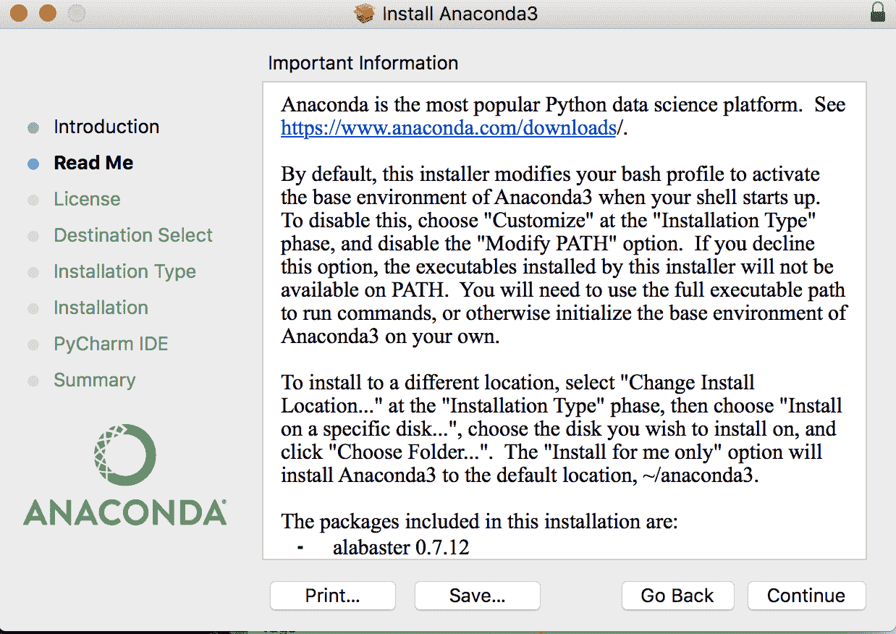

选择“继续”选项卡并选择合适的安装目标，您将在短时间内完成安装。

好了，现在我们进入主事件，即 Ta-lib python 库安装。好的，在主安装之前你需要做一个小步骤。

检查您是否可以使用“brew”命令。对于这个如何安装 Ta-Lib 的教程，让我们假设“brew”命令抛出一个错误。为了纠正这一点，我们在 MacOS shell 中使用下面一行代码来安装必要的包:

```py
/bin/bash -c "$(curl -fsSL https://raw.githubusercontent.com/Homebrew/install/HEAD/install.sh)"
```

如果成功，您将看到以下消息:

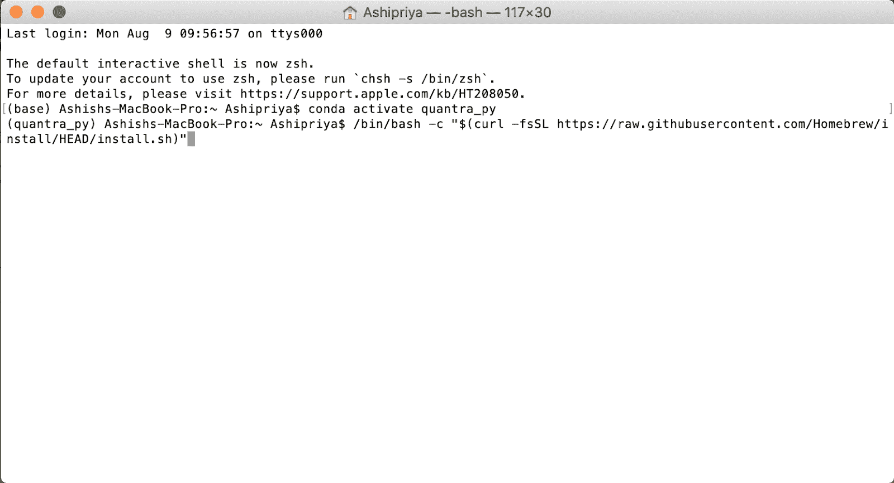

您可能会被要求输入密码，这是该过程的一部分。

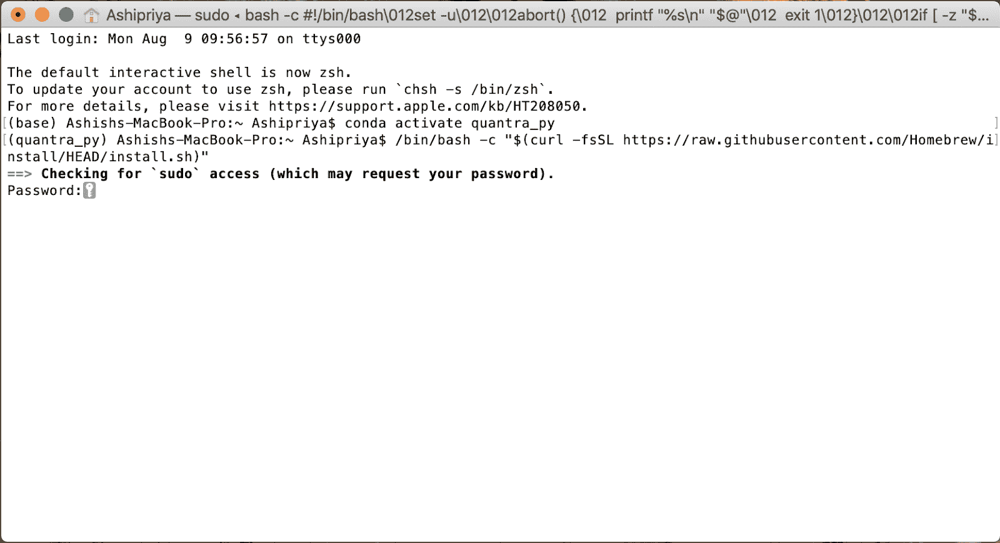

当然，您会得到一个提示，要求您按“Return”继续安装，或者按任何其他键取消安装。

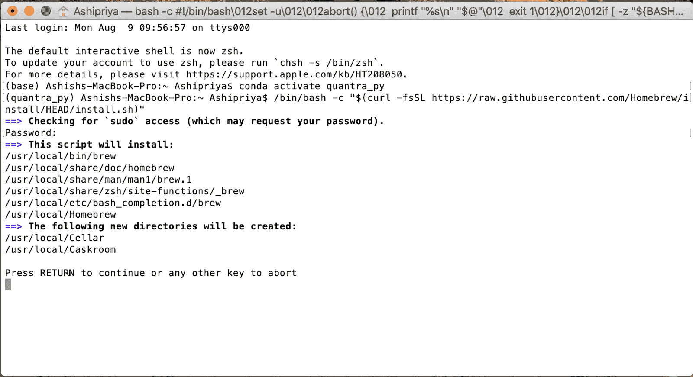

如果你对‘brew’命令很好奇，可以随时访问[这个网站](https://treehouse.github.io/installation-guides/mac/homebrew)了解更多。

太好了！现在 brew 命令已经安装，使用以下代码安装 Ta-Lib 操作系统依赖项:

**brew 安装 ta-lib**

您将看到以下屏幕

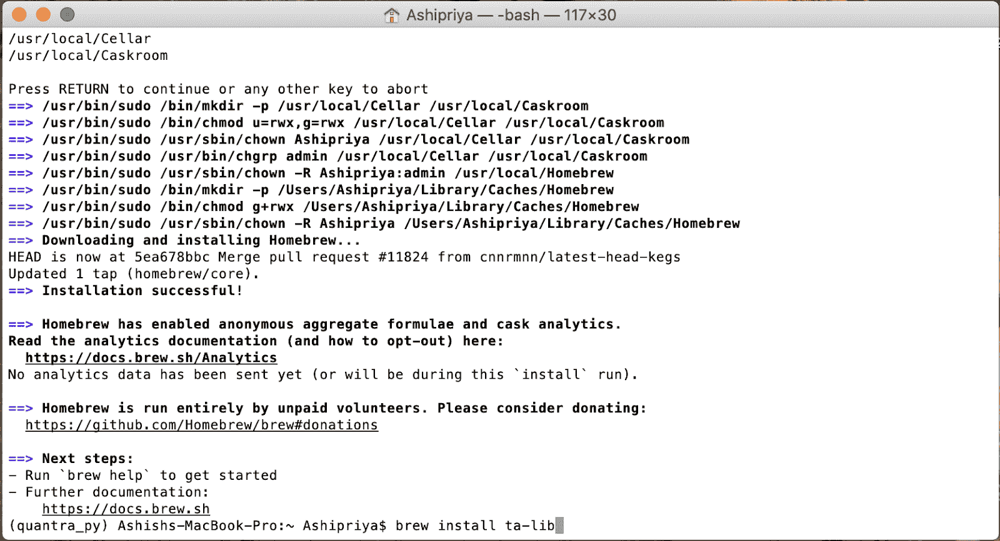

现在，我们使用熟悉的命令，即“pip”在 MacOS 上安装 Ta-Lib。该命令如下所示:

**pip 安装 ta-lib**

您会看到以下文件正在您的系统上安装。

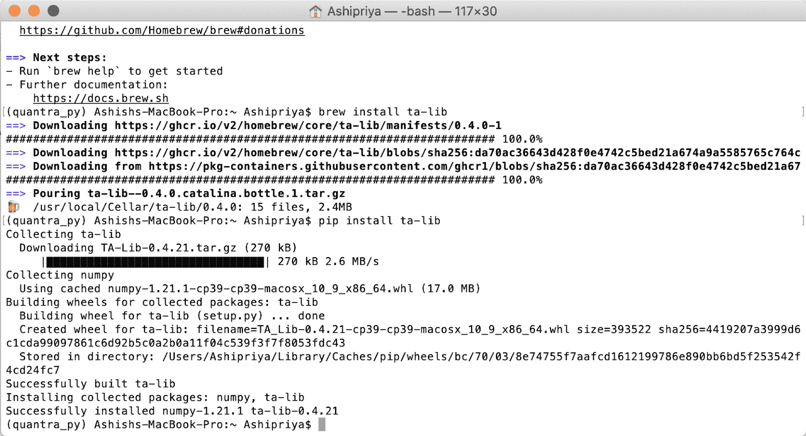

太好了！我们已经成功地在 MacOS 上安装了 Ta-Lib。

但是我们如何检查它是否正确地安装在系统上呢？很简单，我们使用下面的命令。

首先，我们通过在终端中简单地编写“python”来调用 python 语言。然后，我们使用下面的命令导入 Ta-Lib 库。

**导入塔利班**

如果没有错误，那么我们应该能够看到下面的屏幕

* * *

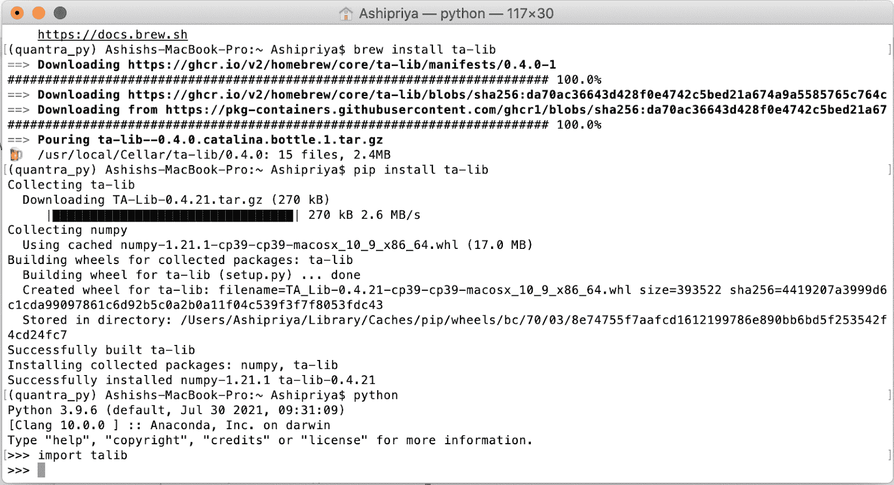

## **在 Linux 上安装 Ta-Lib**

Linux 中的 Ta-lib 安装可能有点棘手。在安装 Python 包装器之前，应该首先安装 Ta-lib 安装所需的库。

但是不用担心！我们已经提供了如何在您的 Linux 系统中安装 Ta-lib 库的完整步骤。

**步骤 0:** 在您的 Linux 系统中安装 Anaconda。你可以遵循[文档](https://docs.anaconda.com/anaconda/install/linux/)或者执行下面共享的命令。

以下命令安装 Anaconda 软件并创建一个名为“quantra”的[环境](https://docs.conda.io/projects/conda/en/latest/user-guide/concepts/environments.html)。您可以[将这个环境](https://docs.conda.io/projects/conda/en/latest/user-guide/tasks/manage-environments.html)用于您的 Quantra 相关编码项目！

*   安装必备组件
*   在您的系统上安装 Anaconda