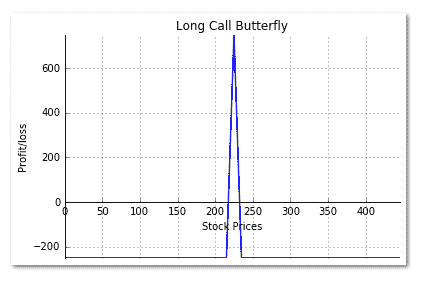

# Python 上的长调用蝴蝶策略

> 原文：<https://blog.quantinsti.com/long-call-butterfly-strategy-python/>

由[米林德·帕拉德卡](https://www.linkedin.com/in/milind-paradkar-b37292107?authType=NAME_SEARCH&authToken=x7bC&locale=en_US&trk=tyah&trkInfo=clickedVertical%3Amynetwork%2CclickedEntityId%3A451572955%2CauthType%3ANAME_SEARCH%2Cidx%3A1-1-1%2CtarId%3A1480940098260%2Ctas%3Amilin)

我们在之前的一篇文章中讨论了[涵盖的拜访策略](https://blog.quantinsti.com/write-covered-call-strategy-in-python/)。在本帖中，我们将介绍长叫蝴蝶。当预期基础证券价格波动不大时，做多蝴蝶是交易者采用的一种流行策略。长叫蝴蝶策略包括三个部分:

*   买入较低的价内执行(ITM)看涨期权
*   购买更高的价外(OTM)看涨期权
*   卖出两个平价(ATM)看涨期权

在这种策略中，所有的看涨期权都有相同的到期日，并且各组成分支的每个执行价格之间的距离必须相同。让我们举一个例子来理解做多蝴蝶的运作，它的收益，以及策略中包含的风险。

#### **举例:**

ABC 股票的交易价格是 100 卢比。2015 年 1 月 2 日 225。为了创造一个长叫蝴蝶翅膀，

1)以 12.50 卢比的价格购买 2015 年 1 月 29 日的 215 罢工认购，每手 100 股

2)在 2015 年 1 月 29 日卖出 2 手 225 份行权价为 6.50 卢比的看涨期权，每手 100 股

3)以 3.00 卢比的价格购买 2015 年 1 月 29 日的 235 罢工认购，每手 100 股

持有这些头寸的净借方金额等于:

短期认购收到的认购溢价减去长期认购支付的认购溢价

1300 卢比–1550 卢比=-250 卢比

如果到期时股价为 230 卢比，则较低的行权价和中等行权价看涨期权将被行使，而较高的行权价看涨期权到期时将一文不值。

利润由下式给出

利润=(ITM 电话的利润-支付的保险费)加上(收到的保险费-自动柜员机电话的损失)减去(OTM 电话支付的保险费)

利润=(1500-1250 卢比)+(1300-1000 卢比)-300 卢比= 250 卢比

多头蝴蝶的风险回报情况如下:

1.  最大风险–已支付的净借方
2.  最大奖励-(相邻好球之间的差异-已支付的净借方)

#### **长时间调用蝴蝶收益图的 Python 代码:**

我们使用上面使用的同一个例子来说明如何用 python 编写策略。

```py
import numpy as np
import matplotlib.pyplot as plt

s0 = 225 # Initial stock price 
k1 = 215;c1 = 12.50; # Strike & premium for ITM Call
k2 = 225;c2 = 6.50; # Strike & premium for ATM Call
k3 = 235;c3 = 3.00; # Strike & premium for OTM Call
shares = 100 # Shares per lot
# Stock Price at expiration of the Call
sT = np.arange(0,2*s0,5)
# Payoff from the Lower Strike ITM Long Call Option
y1 = np.where(sT > k1,((sT-k1) - c1) * shares, -c1 * shares)
# Payoff from ATM Short Call Option
y2 = np.where(sT > k2,((k2-sT) + c2) * 2 * shares, c2 * 2 * shares )
# Payoff from the Higher Strike OTM Long Call Option
y3 = np.where(sT > k3,((sT-k3) - c3) * shares, -c3 * shares)
# Payoff for the Long Call Butterfly
y = y1 + y2 + y3
# Create a plot using matplotlib 
fig, ax = plt.subplots()
ax.spines['top'].set_visible(False) # Top border removed 
ax.spines['right'].set_visible(False) # Right border removed
ax.spines['bottom'].set_position('zero') # Sets the X-axis in the center
ax.tick_params(top=False, right=False) # Removes the tick-marks on the RHS

plt.plot(sT,y,lw=1.5)

plt.title('Long Call Butterfly') 
plt.xlabel('Stock Prices')
plt.ylabel('Profit/loss')

plt.grid(True)
plt.axis('tight')
plt.show()
```



我们使用 numpy 的 np.where 函数来计算策略的每一步的收益。然后我们使用 [matplotlib](https://blog.quantinsti.com/python-matplotlib-tutorial/) 库来绘制图表。我们首先创建一个空的图形，并添加一个支线剧情。然后我们移除顶部右边的&，并在中心移动 X 轴。使用 plt.plot 函数，我们绘制了多头蝴蝶的收益图。最后，我们在图表中添加标题和标签。请注意，我们没有画出它的任何组成部分的收益。

### 下一步

这是一篇使用 Python 写的关于多头蝴蝶及其收益图的简短文章。在我们接下来的文章中，我们将涵盖更多的期权策略，并举例说明如何使用 Python 绘制它们的收益图。如果你想了解更多的策略以及在现实市场中实施这些策略的方法，那么你应该考虑通过点击这里注册 EPAT。

*   **龙打电话给蝴蝶 Payoff.rar**
    *   长呼蝴蝶心诚(2)。巴拉圭