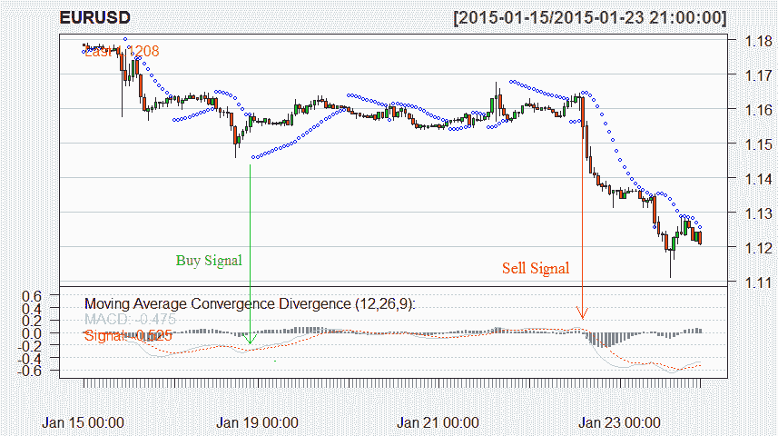
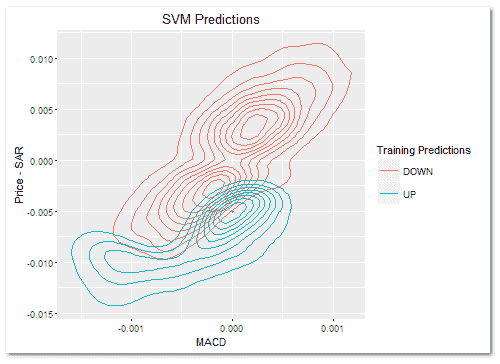
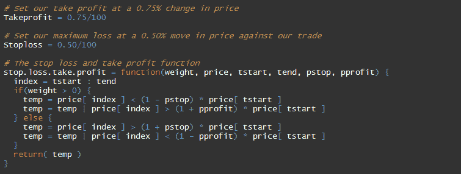
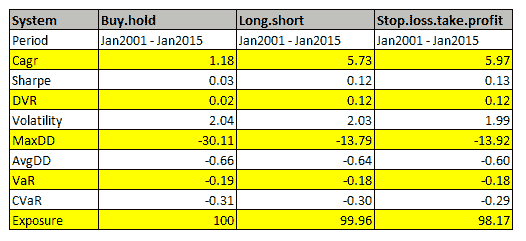

# 机器学习及其在外汇市场中的应用——第二部分——工作模型

> 原文：<https://blog.quantinsti.com/machine-learning-application-forex-markets-part-2/>

###  **T2】**

在我们关于机器学习的[上一篇文章](https://blog.quantinsti.com/machine-learning-application-forex-markets-working-models/)中，我们使用 r 中的 SVM 算法推导出了[外汇策略](https://blog.quantinsti.com/fx-market-pairs-trading-strategy/)的规则。在这篇文章中，我们更进一步，演示了如何回测我们的发现。

概括一下上一篇文章，我们使用[抛物线 SAR](https://blog.quantinsti.com/parabolic-sar/) 和 MACD 直方图作为机器学习的指标。抛物线 SAR 指标跟随价格，因为趋势随着时间延伸。当价格上涨时，SAR 低于价格，当价格下跌时，SAR 高于价格。当价格趋势反转并突破它的上方或下方时，SAR 停止并反转。

MACD 振荡器由 MACD 线、信号线和 MACD 直方图组成。MACD 线是 12 天指数移动平均线(EMA)减去 26 天 EMA。MACD 信号线是 MACD 线的 9 日均线。MACD 直方图表示 MACD 线和 MACD 信号线之间的差异。当 MACD 线高于其信号线时，直方图为正，当 MACD 线低于其信号线时，直方图为负。

下面的欧元/美元价格序列图表显示抛物线 SAR 以蓝色绘制，MACD 线、MACD 信号线和 MACD 柱状图位于欧元/美元价格序列下方。

我们的目的是在 MACD 线交叉点和抛物线 SAR 反转点周围定位。当抛物线 SAR 给出买入信号，MACD 线向上交叉时，我们买入。当抛物线 SAR 给出卖出信号，MACD 线向下交叉时，我们卖出。

选择指标后，我们对欧元/美元数据运行 SVM 算法，得到如上图所示的曲线。看看 SVM 的预测，我们现在制定规则，并对它们进行回溯测试，看看我们策略的表现。

空头规则=(价格–SAR)< 0.0010 & MACD histogram < 0.0010 Long rule = (Price – SAR) >-0.0050 & MACD 直方图>-0.0010

我们已经使用了迈克尔·卡普勒的[系统投资者工具箱](https://github.com/systematicinvestor/SIT)来回测我们的 r 模型。我们首先加载工具箱和必要的库。

接下来，我们创建一个新环境，并使用 getSymbols 函数加载历史 EUR/USD 数据。

我们将对照简单的“买入并持有”模型来检验我们基于规则的模型的性能。为此，我们首先创建了一个“买入并持有”模型。

我们的下一步是计算基于规则的模型的指标。

我们在这里运行两个模型，“多头空头”模型，另一个“多头空头”模型使用止损和止盈。首先，我们创建一个没有止损和止盈的多空模型。

接下来，我们设置止盈和止损水平，并使用这些水平创建一个多空模型。我们称这个模型为“止损.止损.获利”模型。

现在让我们运行所有三个模型，并检查它们的相对性能。

 

正如你可以看到的，基于规则的策略有一个平滑的权益曲线，并给出了一个更好的 CAGR 5.97 比简单的“购买持有”模型 CAGR 1.18。我们策略的最大减仓是 13.92，相比之下“买入持有”策略的最大减仓是 30.11。你可以调整指标设置，改变多空规则或止损止盈水平，进一步完善模型。

一旦你理解了机器学习算法，这些可以成为制定盈利策略的伟大工具。要了解更多关于机器学习的信息，您可以观看我们最新的网络研讨会“交易中的机器学习”[，该研讨会由 QuantInsti 主办，由我们的嘉宾演讲者 Inovance 首席执行官/联合创始人 Tad Slaff 主持。](https://www.youtube.com/watch?v=V7UGqi83iJw&feature=youtu.be&utm_source=aiattendees&utm_medium=email&utm_campaign=aiwebinarmar16)

QuantInsti 开展的算法交易(EPAT)课程中的高管课程涵盖了机器学习。要了解更多关于 EPAT 的信息，请查看 EPAT 课程页面，或随时联系我们在 contact@quantinsti.com 的团队，询问关于 EPAT 的问题。

### **下载 R 代码**