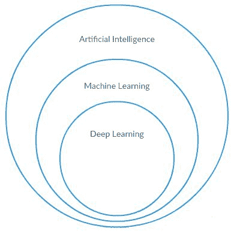
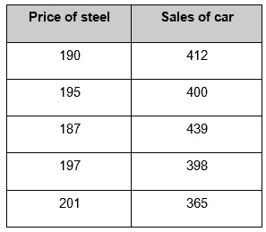
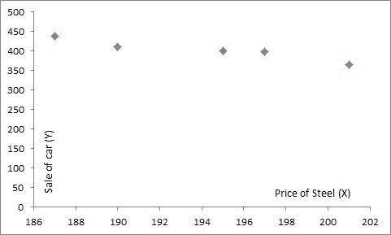
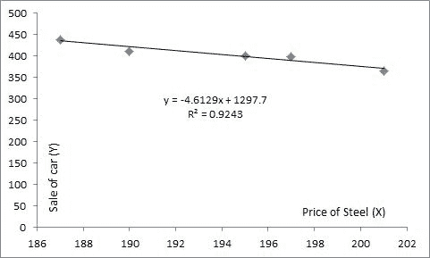
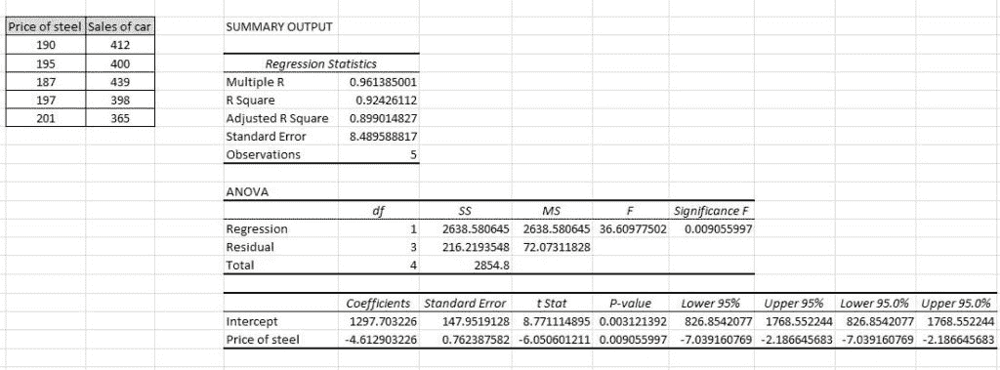
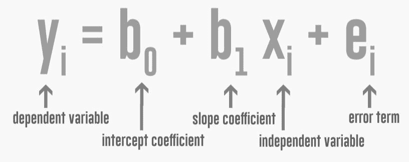
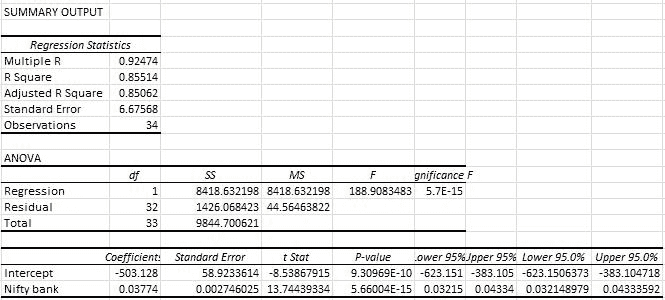
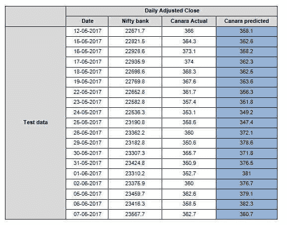

# 基于回归的股票价格预测机器学习

> 原文：<https://blog.quantinsti.com/machine-learning-trading-predict-stock-prices-regression/>

Sushant Ratnaparkhi

前几天我读了一篇关于人工智能和机器学习迄今为止进展如何以及它们将走向何方的文章。我肃然起敬，很难理解作者对未来可能性的描绘。

以下是我的反应。(不，我没有乔伊好看，但你应该知道)

这是人工智能应用于医疗领域的一种可能性，

外科医生可以用她的运动皮层来控制机器手术刀，而不是拿在手里，她可以从手术刀接收感官输入，这样对她来说就像是第 11 个手指。因此，这就好像她的一个手指是一把手术刀，她可以不用任何工具来做手术，让她更好地控制她的切口。一个没有经验的外科医生在进行艰难的手术时，可以带几个她的导师到现场，通过她的眼睛观察她的工作，并思考给她的指示或建议。如果真的出了什么问题，他们中的一个可以“控制方向盘”，将他们的运动皮层连接到她的输出，以控制她的手。

你可以在这里阅读文章[。](http://waitbutwhy.com/2015/01/artificial-intelligence-revolution-1.html)

目前，人工智能和机器学习已经取得了足够的进展，所以我们现在可以在交易中应用这些机器学习技术并达到很高的准确性吗

### [**什么是机器学习？**T3】](/free-resources-learn-machine-learning-trading/)

定义是这样的，“机器学习是指使用计算机算法从数据和信息中自主学习，并改进现有算法”

但简单来说，机器学习是这样的，以这个孩子为例——考虑他是一个智能机器，现在，

1.  给他一个棋盘
2.  解释游戏的基本规则
3.  给出 100 个好游戏的记录
4.  把孩子锁在一个房间里(同时扔进一些食物和水)

10 天后，

当孩子走出那个房间时，你会看到一个相当好的棋手。在这种情况下，孩子是机器，过去的比赛记录是数据，国际象棋规则书是算法。我们只给机器输入了一个基本算法和一些可以学习的数据。这台机器通过数据进行筛选，了解哪些步骤提高了赢得比赛的机会，并将这些步骤添加到算法中。这就是机器学习的全部概念。与人类相比，计算机的优势在于，对于更大的数据集和连续的一段时间，计算机可以快速完成这项工作。

然而，这只是一个例子，机器学习有不同的[方面，它们非常有趣。但是在这篇文章中，我们将坚持基本原则。](https://quantra.quantinsti.com/course/trading-machine-learning-classification-svm)

此外，人们经常在人工智能、机器学习和深度学习之间感到困惑。人工智能是一个更大的空间，涵盖了很多东西，而机器学习是人工智能的一部分，进一步的深度学习是机器学习的一个子集。这里，我为你手绘了这张图。

如果你想更深入地了解这些话题的细节，你可以看看这个。

### 为什么机器学习最近变得如此流行？

如果你深入挖掘，你会发现机器学习已经存在很久了。例如，在 1763 年，托马斯·贝叶斯发表了一部作品'[一篇旨在解决机会主义](https://en.wikipedia.org/wiki/An_Essay_towards_solving_a_Problem_in_the_Doctrine_of_Chances)中的一个问题的论文'，这导致了'贝叶斯规则'，机器学习中使用的一个重要算法[【1】](https://en.wikipedia.org/wiki/An_Essay_towards_solving_a_Problem_in_the_Doctrine_of_Chances)

但是今天，机器学习正以前所未有的速度前进。我们可能没有意识到，但是机器学习的应用无处不在，例如，

*   推荐系统(facebook 新闻源、亚马逊产品推荐)
*   自然语言处理(Siri、谷歌语音)
*   医疗诊断(图像中的斑点模式)
*   物体识别和跟踪(面部识别、车牌读取和跟踪)
*   挖掘“大数据”——分析(具有这种模式的股票往往会上涨)
*   数据的分类和聚类(欺诈检测、序列挖掘等。)

所有这些都是基于从过去的数据中学习并预测未知/新情况的结果的概念，就像人类学习的方式一样。但计算机的优势在于，它们可以处理更大规模、更复杂的数据，这是人类根本无法理解的。

考虑到今天的环境，每天都有数万亿千兆字节的数据生成，人类不可能处理这些数据并从中做出有用的推断。当然，聪明人可能能够做出更好的预测和推断，但机器学习算法在规模和复杂性方面击败了我们。随着时间的推移，这些计算机做出的预测将超过人类的水平。

所以，当每个行业都开始以某种形式实施机器学习时，作为交易者，你为什么不利用这一点来提升你的交易技能呢？你猜怎么着？机器学习和交易就像奶酪和葡萄酒一样齐头并进。一些顶级交易员和对冲基金经理已经使用机器学习算法来做出更好的预测，并因此赚钱！

在本帖中，我将教你如何使用机器学习，利用回归进行股价预测。

### **什么是线性回归？**

以下是正式定义，“线性回归是一种对标量因变量 y 和一个或多个解释变量(或自变量)X 之间的关系进行建模的方法”[【2】](https://en.wikipedia.org/wiki/Linear_regression)

让我以非常基本的方式解释一下[回归](https://quantra.quantinsti.com/course/trading-with-machine-learning-regression)的概念，假设你经营一家制造汽车的公司，你想了解原材料(比如说钢铁)价格的变化将如何影响汽车的销售。一般的理解是，钢铁价格的上涨将导致汽车价格的上涨，从而导致需求减少，进而导致销量下降。但是我们如何对此进行量化呢？以及我们如何根据钢价的变化程度来预测销量会发生多大的变化。这就是回归出现的时候。

为了便于理解，让我们考虑下面提到的样本数据，

让我们把它做成一个图，这个图叫做散点图

y 轴是一辆车的销量(这是我们的因变量)，X 轴是钢材价格(自变量)。通过一般观察，你会发现只要钢材价格下降，汽车的销量就会增加。

样本数据是回归算法的训练材料。现在，它将帮助我们预测，如果钢价下降到 168(相当大的降幅)，我们可能实现什么样的销售，这是算法的新信息。

我们将接受 Excel 的帮助来处理这些数据，

因此，当您将样本数据放入 excel 电子表格中并执行回归时(您可以观看此[视频](https://www.youtube.com/watch?v=O7TMCYuDbDc)以了解如何在 excel 中执行回归)，您将获得下图所示的回归线

像这样一些看起来很奇怪的数字，但为了基本理解，我将只关注其中的几个指标。线性回归函数的目的是找到一条距离所有数据点最近的直线，这样每当我们想要计算新因变量的预测值时，我们就可以选择与 X 轴上的自变量相对应的直线上的下一个点。

因此，上述计算是基于下面的等式进行的，也称为回归表达式。

Y' -汽车销量或因变量，这是我们试图预测的

X' -钢价或自变量，这将用于预测' Y '

b 0 '-截距是回归线穿过 y 轴的值

b 1 ' -斜率系数，它告诉我们，x 增加一个单位，预期会导致 y 的变化量

eI’——误差项，当我们用这个方程对任何变量表达的关系不能完全代表自变量和因变量之间的实际关系时，代表这个差异的变量称为误差项或残差项、扰动项或余项

R 2 - R 的平方或相关系数，这表示数据与拟合回归线的接近程度

如果你看上面的回归图，你会看到一个回归方程，它是

> **y = -4.6129x + 1297.7**

所以在这个等式中，

> **b 1 = -4.6129**
> 
> **b0+**T4】eI= 1297.7

请注意，斜率系数或 b 1 为负，这意味着两个变量(钢价和汽车销量)负相关，这意味着当钢价上涨时，汽车销量下降。

方程的 R 2 是 0.92，这很好，我们希望这个值尽可能接近 1，以便更好地预测。

现在到了令人敬畏的部分，以钢铁价格的任何变化为例，比如说钢铁价格是 168，我们想计算汽车销售的预测增长。你应该这样做，

(汽车销量)= -4.6129 x (168) + 1297.7

钢材价格跌至 168 英镑时，汽车销量= 522.73 英镑

是不是很神奇？猜猜看，即使有多个变量影响一辆汽车的销售(就像现实世界中一样)，我们也能够计算出一个预测。当回归中有多个自变量时，称为多元回归模型。

我希望你明白这一部分，如果你还有任何疑问，你可以问他们到我们的社区[这里](https://quantra.quantinsti.com/community)

### **回归与股市**

现在，让我向你展示回归在股票市场中的实际应用。例如，我们持有 Canara 银行股票，希望了解 Bank Nifty(银行指数)价格的变化如何影响 Canara 的股价。我们的目标是找到一个函数，帮助我们根据给定的指数价格预测 Canara 银行的价格。

我们将采用银行 Nifty & Canara 过去两个月的收盘价，我们采用调整后的收盘价以保持数据的一致性。请注意，拥有准确的数据非常重要，因为即使数据中的一个数字也会导致回归函数发生显著变化。

在这些数据中，我们将前 40 天作为训练数据，后 20 天作为测试数据，我们将检查回归算法做出的预测与实际数字的接近程度。

您可以点击下面的“下载”按钮下载工作 excel 表格。

散点图显示了数据。使用相同的 excel 函数，我们绘制了这条回归线，其决定系数(R 2 为 0.85。这意味着 Canara Bank 和 Bank Nifty 有 85%的相关性。

这是回归表达式，

让我们来看看由机器学习回归算法做出的预测，这些预测用蓝色标记

查看数据，我们可以看到预测非常接近(考虑 85%的系数)，也许不可交易，但这给了我们一个方向。您可以并且应该通过添加多个独立变量来进一步改进这种方法。这样做将有助于减少残差或误差，并有助于让你更接近实际价格。

我只取了 2 个月的数据，你可以取几年的数据来得到更准确的结果。训练数据越多，结果越好。随着你继续添加新的市场数据，你会看到这个函数会通过重新计算系数和截距值来不断改进自己。

### **接下来的步骤**

报名参加我们在 Quantra 上开设的关于交易中的神经网络的最新课程。本课程由 Ernest P. Chan 博士撰写，涵盖了核心概念，如反向和正向传播，以及在 Keras 中使用 LSTM 模型，所有内容都以简化的方式涵盖，并为高级学习者提供了额外的阅读材料。您还可以利用动手编程经验和可下载的策略，在课程结束后继续学习。

*免责声明:本文提供的所有数据和信息仅供参考。QuantInsti 对本文中任何信息的准确性、完整性、现时性、适用性或有效性不做任何陈述，也不对这些信息中的任何错误、遗漏或延迟或因其显示或使用而导致的任何损失、伤害或损害承担任何责任。所有信息均按原样提供。T3】*

### **下载数据文件**

*   NiftyBank _ Canara _ 回归分析. xlsx