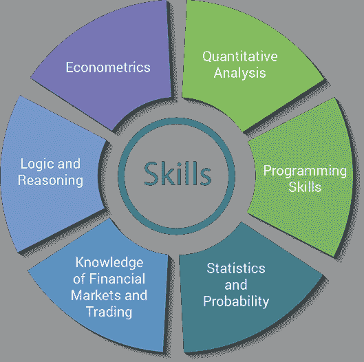

# 以算法交易为职业

> 原文：<https://blog.quantinsti.com/making-career-algorithmic-trading/>

由[维拉伊·巴加](https://www.linkedin.com/in/virajbhagat/)

上世纪末算法交易的出现导致了全球交易所交易方式的巨大“技术转变”。如果你想从事算法交易，这是一个完美的来源。在这里，我们强调了高频交易、自动交易、量化交易或简单的[定量工作](/salary-quants-really-earn/)领域中求职者的一些重要因素。

即使你可能有不同的个人资料、教育背景或工作经验，你也有可能成为一名拥有该领域基本知识的算法交易员。是时候让每个人都意识到算法交易的真正潜力了。

我们将涵盖:

*   算法交易中的工作和职业
*   [Quants 的类型](#types-of-quants)
*   谁雇佣了定量分析师？
    *   [雇佣定量分析师的公司列表](#list-of-companies-that-hire-quants)
*   招聘人员在简历中寻找什么？
    *   [Algo 交易工作要求](#algo-trading-job-requirements)
    *   【Algo 交易面试技巧
*   [算法交易职业的薪水](#salaries-for-a-career-in-algo-trading)
    *   [算法交易工资](#algo-trading-salaries)
    *   [算法交易工作和薪水的变化](#variation-in-algo-trading-jobs-and-salaries)
*   [从事算法交易所需的技能](#skills-required-for-a-career-in-algo-trading)
*   [成为量化分析师的资格](#qualifications-to-become-a-quant)
*   [Ml 和 AI 对你算法交易生涯的影响](#impact-of-ml-and-ai-on-your-algorithmic-trading-career)
*   [学习和升级，在 Algo 交易中建立你的职业生涯](#learn-and-upgrade-to-establish-your-career-in-algo-trading)
*   [在算法交易中提升职业生涯的有用资源](#useful-resources-to-boost-your-career-in-algo-trading)
*   关于算法交易职业的常见问题

* * *

## 算法交易的工作和职业

在过去的几十年里，算法交易市场呈指数级增长，并且继续以显著的速度增长。

*根据[联合市场研究](https://www.globenewswire.com/news-release/2021/07/08/2259816/0/en/Global-algorithmic-trading-market-to-garner-31-49-billion-by-2028-Allied-Market-Research.html)发布的报告，全球算法交易市场在 2020 年达到 121.4 亿美元，预计到 2028 年将达到 314.9 亿美元，表明 2021 年至 2028 年的 CAGR 为 12.7%。*

今天，[算法交易](/algorithmic-trading/)和高频交易被全世界的公司和交易所认可，成为发达市场最常见的交易方式。无论是股票、衍生品、外汇还是大宗商品交易，全球的交易公司都在大规模采用算法交易。

大银行、对冲基金和其他交易公司现在正在雇佣最优秀的人才，以保持竞争优势并获得大笔收入，这导致了算法交易职位的激增。

学生、工程毕业生、开发人员甚至老派交易者都渴望在算法交易领域建立职业生涯。据《彭博》报道，[花旗银行为其交易员和投资银行家所在的部门雇佣了 2500 名程序员](https://www.bloomberg.com/news/articles/2020-01-06/citi-s-investment-bank-plans-to-hire-2-500-programmers-this-year)，随着技术重塑业务，该行扩充了编码员和[数据科学家](https://quantra.quantinsti.com/course/introduction-to-data-science)。

非技术背景的开发人员(如电信行业或专注于编程的垂直行业)很受欢迎。*为什么？*他们在同一个行业工作多年，对编程的基本知识和细微差别有足够的了解，这对交易来说是必不可少的。

* * *

## ****类型**o**f Quants**T5】**

人们经常询问并好奇了解各种在线交易工作、算法交易工作、[期货交易员工作](https://quantra.quantinsti.com/course/futures-trading)等。在他们的算法交易生涯中。

在这里，我们列出了一些概况，以了解行业中有哪些类型的角色，以及担任这些角色需要哪些类型的技能。

*   **桌面量化** -实现交易者直接使用的定价模型
*   **模型验证 Quant** -实施定价模型以验证前台系统模型
*   **-开发和管理计算市场上资产价格的模型**
*   ****投资/资产管理定量分析师** -开发减轻投资损失的模型**
*   ****Research Quant** -研究并创造新的定价方法**
*   ****Quant 开发者** -来自金融领域的开发者/程序员**
*   ****[统计套利 Quant](https://quantra.quantinsti.com/course/statistical-arbitrage-trading)**——识别数据模式，并根据发现建议自动交易**
*   ****资本量化** -对银行的信用风险和资本要求建模**

**这些是在市场上各种其他类型中占优势的一些角色。高频交易领域(HFT 交易)的开发商也很抢手。**

* * *

## ******谁雇佣宽客？**T3】****

**算法交易领域的一些就业问题是:**

*   **谁会雇佣算法交易专业人士？**
*   **谁会把工作给定量分析师？**
*   ***哪些公司雇佣量化分析师？***

### **雇佣定量分析师的公司列表**

**以下是一些雇佣定量分析师的著名公司:**

***   雇佣定量分析师的商业银行
    *   随机阻塞系统（Random Barrage System 的缩写）
    *   汇丰银行*   雇佣定量分析师的投资银行
    *   花旗银行
    *   高盛*   雇佣定量分析师的对冲基金
    *   城堡集团*   雇佣定量分析师的会计公司*   雇佣定量分析师的软件公司*   雇佣定量分析师的金融公司**

 *** * *

## 招聘人员在简历中寻找什么 ****？**T3】**

招聘人员总是在为他们的组织寻找最有才华和技能的人。但是在算法交易领域招聘时:

*   招聘人员在寻找什么？
*   什么描述了算法交易员的职位描述或量化分析师的职位描述？
*   *什么类型的工作会对自己的算法交易生涯有帮助？*

### Algo 交易工作要求

以下是 Algo 交易领域中已建立的公司的一些要求，用于选择他们寻找的候选人:

*   对于**交易策略开发**的职位，Python & R 的知识将是一个优势。
*   要成为一名 **Python 开发人员**,拥有 Python 等编程语言的高级技能是首选
*   在[股票市场](https://quantra.quantinsti.com/course/stock-market-basics)(定量、基本面、技术面、衍生品、宏观等)的领域知识。)和强有力的逻辑技能受到重视
*   拥有应用数学或统计的**硕士**、IIM 的 **MBA** 、 **B.Tech** 计算机科学的人可以成为**量化研究员和交易员**，具备成功实施盈利交易策略(从构思到执行，即研究、设计、回测和执行)的能力，以及使用 R、Python 等数据分析工具的知识和经验。

### Algo 交易面试技巧

在充分了解这些品质的同时提及它们会增加你被他们选中的机会。有些人已经成为成功的交易者，尽管他们来自[商品背景](/commodity-analyst-algorithmic-trader/)，是[金融&科技毕业生](/algorithmic-trading-finance-grads-fundamental-traders/)，是[技术官僚和工程师](/algorithmic-trading-career-engineers-technocrats/)等等。

一个人应该能够表现出对简历中所强调的核心领域的深刻理解。不要提及你不具备的技能，或者只是一知半解的技能——那会留下负面的评论。不要忘记基本规则。对你的个人资料和技能诚实。

如果候选人在他/她感兴趣的领域从事过项目工作或发表过任何研究论文，招聘人员也会给予积极的评价。

* * *

## 算法交易职业的薪水

最常问的一个问题是:**算法交易员赚多少钱？**

根据你所拥有的知识和技能的类型，不同的企业和公司有不同的角色。QuantInsti 的职业小组在 QuantInsti 网站上分享这些数字，说明他们的 [algo 交易课程](https://www.quantinsti.com/epat)的参与者获得的工作机会&薪资包。

### Algo 交易工资

*   数据科学家:每年 150 万印度卢比
*   **Algo Trader:** 每年 80 万印度卢比+奖励，
*   HFT 商人:每年高达 200 万印度卢比，
*   Quant Research 分析师:每年 200 万印度卢比，
*   **定量研究:** AED 每年 100，000 +高达 40 %的奖励，
*   **交易员:**每年 120，000 新加坡元+绩效挂钩奖金，
*   **交易员衍生品:** HKD 每年 384，000 英镑+绩效挂钩奖金

众所周知，在算法交易公司，工资和奖金是有利可图的。

### 算法交易工作和工资的变化

它们各不相同:

*   不同的工作角色和干部
*   在一些公司，交易员和程序员根据策略的盈利能力平分奖金
*   交易公司的类型(如家族办公室，或银行，或[高频交易](/rise-of-hft-in-emerging-markets/) (HFT)公司等)。)和
*   公司采用的策略(低频交易策略/高频交易策略)

薪水是基于职位或头衔的。以下职位和其他职位的工资将按照各自公司的等级。

*   量化交易员工资
*   算法交易工资
*   [量化分析师工资](/quantitative-analyst/#salary-compensation)

这导致了量化交易或算法交易领域不同类型的角色和工作。股票市场也提供了广泛的职业机会。

查看 **[此文](/salary-quants-really-earn/)** 具体了解行业内薪资情况。

* * *

## 算法交易职业所需的技能

> ****为未来做好准备。技能很重要。**T3】**

定量分析师设计并实现数学模型，用于衍生品定价、风险评估或预测市场走势。

以下是最重要和最相关的技能，要求你必须在算法交易领域取得进步，并证明在你的算法交易职业道路上是必不可少的:

### ****解析** s **命案**T5】**

对任何量化交易者/开发者来说，有分析思维是非常重要的品质，在面试中很重要。

例如，面试候选人可能会收到一个巨大的数据集，并被要求从数据中找出模式。对候选人的评估基于他们如何处理任何给定的问题，以及他们客观地证明其解决方案的能力。

### ****数学**年代**命案**T5】**

由于算法交易的核心围绕着算法、数据和编程，拥有合理的编程技能和对统计和微积分的基本理解对于任何一个在算法/HFT 交易的求职者来说都是很重要的。

例如，如果候选人申请一家部署低延迟战略的公司，那么这样的候选人应该具有专家级的编程水平。

### ****编程技巧****

编程语言知识是一个额外的优势，因为它使你能够独立运作。交易者倾向于学习编码的长期效果和好处，特别是 **[Python](/what-makes-python-most-preferred-language-for-algorithmic-traders/)** 。

Python 有利于概念化和策略的回溯测试，并且有许多库用于结果的验证和可视化。它也可以被公司用于不依赖于低延迟的策略。另一方面，C++通常被采用低延迟策略的公司使用。

因此，如果一个有抱负的开发人员的目标是进入一家 HFT 公司，那么不管他开始使用哪种语言，他最终都必须学习 C++。

### ****战略发展过程****

在设计任何策略时，重要的是要了解与该策略相关的风险和回报，以确定它是否在市场中具有优势。这是在策略的回溯测试期间完成的。

交易的频率、交易的工具、杠杆也需要在市场上实施策略之前加以考虑。

单一策略不能保证年复一年的利润。一个人必须使用先进的数学模型和统计学来定期制定和调整策略，以保持在市场中的盈利。

要了解各种算法交易策略，你可以学习[算法交易策略、范式和建模思想](/algorithmic-trading-strategies/)。

### ****了解金融市场****

量化交易涉及处理大型金融数据集，交易不同的工具，如股票、衍生品、外汇等。因此，即使你来自非金融技术背景，作为一个 quant 公司的开发人员，你也需要对金融市场有一个公平的理解。

交易公司通常会让新员工花时间在不同的部门(如量化部门、交易部门、风险管理部门)来了解市场。

除此之外，一个人必须具备该领域的知识。要了解更多所需的技能，请看这张关于[获得量化分析师或交易员面试的顶级技能](/top-skills-nailing-quant-trader-interview/)的信息图。

如果一个人对这些问题了如指掌，他就不需要问[问题](https://quantra.quantinsti.com/course/quant-interview-questions-preparation)比如:**成为算法交易者需要什么样的技能？**

除此之外，还可以培养以下技能:

*   定量分析
*   编程技能
*   统计和概率
*   金融市场和交易知识
*   逻辑和推理
*   计量经济学

Skills for Quants

* * *

## Ml 和 AI 对你算法交易生涯的影响

(Source: Business Insider) AI In Finance

[商业内幕](https://www.businessinsider.com/ai-in-finance)继续陈述:

> 到 2023 年，人工智能应用程序为银行节省的总潜在成本估计为 4470 亿美元，银行正在寻找新的方法将该技术融入他们的服务。

当一些较大的交易公司，如贝莱德、两个适马、文艺复兴科技和其他公司正在使用人工智能来挑选股票时，摩根大通和 IBM 正试图将 T2 人工智能引入金融监管和合规。

事实上，有纯粹基于人工智能的对冲基金，即 Rebellion Research 和 KFL 资本。人们正在根据自己的交易技能开辟自己的人工智能职业道路。

公司已经开始利用人工智能等更新的技术来驾驭他们的力量，并在技术上领先。为此，他们要求个人具备正确的技能，这将有助于他们在这场竞赛中取得领先。编码已经成为这个自动化时代的头号技能。

* * *

## 学习和升级，在 Algo 交易中建立你的职业生涯

很简单。不断学习就好。有了正确的技能，你就可以在你的算法交易生涯中扮演竞价的角色。一个人选择最好的技能来保持成长并在游戏中保持领先是必要的。

*   对构建模型的兴趣可以帮助你成为一名定量分析师/模型开发者
*   编码、维护或修改战略会让你成为一名战略开发人员，或者引领你进入 T2 的核心开发工作
*   财务和解决问题的能力会让你成为更好的交易者
*   关于战略、市场微观结构和编程的知识可以帮助你在 T2 的银行和 T4 的经纪公司找到工作
*   套利和量化策略可以帮助你在顶级公司获得一份**量化分析师**或**量化分析师**的工作

这些都是有助于你找到你有能力胜任的工作的各种场景中的一种。对你来说，确定前进所需的技能是至关重要的。

然而，确定人工智能、大数据、Python 等关键领域。培养相关技能将对你的职业生涯产生巨大影响。这里有一个[分步指南](/learn-algorithmic-trading/)来了解更多。

看看 Raj 这个鼓舞人心的故事，尽管他已经在技术领域工作了 20 多年，却成为了一名独立的算法交易员。

* * *

## 有用的资源，以促进你的职业生涯在算法交易

*   探索符合算法交易要求的各种学习科目、[学术背景](/academic-backgrounds-algo-trading/)和专业背景。
*   要开始探索这个领域，你可以参考非传统的 Quants 最佳网站指南。
*   对算法交易完全陌生？通过与 Algo Trader 的[坦诚讨论，深入了解这一领域。](/candid-discussion-algorithmic-trader/)
*   如果你已经是一个量化分析师，你想进一步提高你的技能，在正确的支持和指导下，你也可以成为一个更好的量化分析师。
*   如果你渴望从事高频交易，就要彻底了解这个领域的内容、方式和原因。

* * *

## 关于算法交易职业的常见问题

以下是我们在算法交易的[提问环节](/algo-trading-ama-5-december-2017/)中遇到的一些最常见的问题。

* * *

问题:一个金融从业者如何在这个领域有所作为？

**回复:**我说过了，是统计学&计量经济学、编程(也就是金融计算)和[量化交易策略](https://quantra.quantinsti.com/course/quantitative-trading-strategies-models)这三样东西的集合。因此，如果你有金融背景，并且你已经擅长第一和第三方面，那么你需要选择金融计算方面。

如果有人告诉你，你已经是一个交易者，你不需要学习编程来自动化你的策略，他们可能没有说谎，你可以这样做。

有一些工具可以使用“拖放”选项，您可以在不实际编码的情况下构建逻辑。但是，这些功能是有限的，它还会限制你改变或修改你的策略或实施你的想法的能力。

所以，如果你知道算法交易程序，这真的很有帮助。即使你不交易，如果你在做数据分析，也会对你有很大帮助。在 python 代码中用两行代码就能完成的事情，如果是在不可编程的工具上完成，就需要更多的代码。

* * *

问题:找到一份算法交易员的工作需要什么技能？

**回复:**你需要的技能通常围绕算法交易的“三大支柱”(就像之前解释的那样)。

如果您正在寻找:

*   要成为一名交易者，你需要学习这三个领域
*   要成为一名算法开发人员，你需要更多编程方面的专业知识
*   要成为更多的战略家，在这种情况下，你需要对交易策略有更深的理解(像衍生品，所有不同类型的课程等等。)
*   成为一名 quant 分析师，那么你需要在统计学和计量经济学方面有更强的专业知识

所以每个人都需要了解这三个方面，但是你需要了解其中每一方面的多少专业知识，这取决于你的目标是什么样的简介。

* * *

**问题:算法交易有哪些职业机会？EPAT 能帮上什么忙？**

**回复:**除了上面提到的三个方面——包括定量分析师、交易员和开发人员，还有一个列表。这不同于:

*   后台角色，
*   前台角色，
*   分析师角色，
*   发展角色，
*   管理角色，
*   网络管理等等。

与传统交易或其他职业领域相比，算法交易是回报更高的领域之一，也更能激发智力。

如果你想做一些你想贡献和尝试的事情，这些类型的简介真的很有帮助。

QuantInsti 的 EPAT 课程有一个专门的安置和职业单元，帮助您找到正确的关系并获得正确的信息。它有助于:

*   在给你安排职位的时候，
*   寻求指导，以相同或不同的角色在您的组织中晋升，
*   要开始一项新业务，
*   如果您需要代理连接、供应商连接，
*   资金，
*   投资等。

这就是 QuantInsti 的职业细胞变得更加有用的地方。他们不断给你带来不同地区市场上的不同机会。

* * *

**问题:一个拥有 10-20 年领域专业知识而没有交易经验的人作为一个算法交易员可以期待什么样的前景？**

**回复:**我们有一个有趣的案例研究，是关于一位 40 多岁的 EPAT 校友。他不是交易出身，但他有 20 多年的经验，能够做到这一点。

所以是的，这样的机会确实存在。他确实投入了很多时间、精力和承诺。如果这些东西在那里，那么是的，有很多机会，机会不断到来，我们每周都与我们所有的参与者分享这样的机会，但最终是你。

我们只能引导，你必须去赢得战争。

* * *

问题:对于完成 QuantInsti 高管课程的人来说，就业市场的流动性有多大？
还是说 quant 交易的工作是博士的储备？

回复:博士肯定有帮助，但不是所有的公司都需要博士。你需要了解你的东西，这是我们不断从不同的安置合作伙伴那里看到的关键要求，不仅是在特定的地理位置，而是在任何地方。

HFT 公司一直专注于雇佣大量数学和物理学博士，但数量不是很多，所以这是一个优势，但不是说没有博士就不能进入量化交易。

* * *

**问题:大多数 quant 面试都是通过谜题等方式来检验应聘者解决问题的能力。
EPAT 将如何为我准备这样的面试？【QuantInsti 有 HFT 公司作为配售伙伴吗？**

**回答:**没错，甚至我们自己的一家公司也这么做，即通过谜题来评估候选人。我们确实可以帮助你；职业单元确实能帮助你获得这些分析技能以及合适的资源。

EPAT 主要研究算法交易策略、编程、统计、金融计算(R、Python、MATLAB 等)。)和战略范式。鉴于这种课程，我们不涉及 EPAT 中的分析部分，但职业单元确实在这方面对你有所帮助。

是的，我们有许多高频交易者作为我们的安置伙伴。

* * *

**问题:我有一点在非金融公司工作的 C & C++编程经验。
现在，我想转到一家金融公司，这样我可以更多地了解定量金融和 HFT。
但我的主要目标是成为一名算法交易员，而不是去深造。
所以，我把目光从定量分析师转向了分析师，然后又转向了交易员。
你能就此提出一些建议吗？**

**回复:**我们过去确实有一些参与者走了同样的路线。考虑到你已经有丰富的编程经验，我认为这是一条合理的路线。

作为一名算法开发人员，你需要学习一些交易策略和统计数据，以理解你正在编码和开发的东西。但一旦你做到了这一点，你就可以作为一名算法开发人员，向分析师和交易员的角色迈进。

总而言之，考虑到你刚才提到的背景，我认为这是一条很好的出去的路线。

* * *

**问题:Quant 的工资是多少，印度对 Quant 的需求是多少？**

**回复:**这要看你的经历和你是什么背景的人。给你一个简单的想法，如果工作经验的范围在 2-8 年之间，并且你来自一个体面的背景，那么定量工资通常会在 100-500 万印度卢比的范围内。

这显然是一个很大的范围，因为它取决于许多不同的因素，因此很难给出一个精确的估计。？

* * *

## ****结论****

这些是有抱负的量化分析师/开发者在为算法交易的成功职业生涯做准备时应该记住的要点。

人们经常想知道:

*   **如何准备从事算法交易*？*
*   *如何在*量化金融*立足？*
*   **如何转入算法交易的职业*？*
*   **如何从*到*从[算法交易](https://quantra.quantinsti.com/course/getting-started-with-algorithmic-trading)* 开始？*

选择专业培训学习算法交易是旅程的下一步。你可能想选择一个量化算法交易项目，这将大大有利于你的技能，职业生活和你在算法交易领域的职业生涯。

如果你是一个交易者，程序员，学生或其他想从事算法交易的人，那么我们为期 6 个月的算法交易(EPAT)综合管理课程，由行业专家，交易从业者和坚定的支持者如 E. P. Chan 博士，Euan Sinclair 博士等教授，正是你需要的。

* * *

*<small>免责声明:本文提供的所有数据和信息仅供参考。QuantInsti 对本文中任何信息的准确性、完整性、现时性、适用性或有效性不做任何陈述，也不对这些信息中的任何错误、遗漏或延迟或因其显示或使用而导致的任何损失、伤害或损害负责。所有信息均按原样提供。</small>***