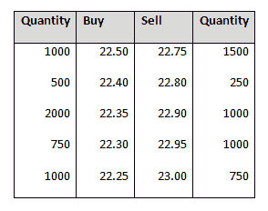

# 市场影响成本

> 原文：<https://blog.quantinsti.com/market-impact-cost/>

由[米林德·帕拉德卡](https://www.google.com/url?q=https%3A%2F%2Fin.linkedin.com%2Fin%2Fmilind-paradkar-b37292107&sa=D&sntz=1&usg=AFQjCNECWQw-Tb-0ag8aABC4VJctE3HISQ)

市场影响成本是交易成本的一个非常重要的组成部分，受到投资组合经理的密切跟踪，因为它可以决定基金的业绩。在本帖中，我们将阐明市场影响成本，并确定其来源和投资组合经理采取的不同方法来减轻它。

**交易成本分解** -在我们开始之前，让我们先来看看投资组合经理的交易成本分解。这些分为:

1.  显性交易成本
    *   佣金
    *   赋税
2.  隐性交易成本
    *   市场影响成本
    *   机会成本

显性交易成本包括经纪费和税费，很容易量化。经纪人将这些费用列为与投资组合经理协议的一部分。第二类，即隐性成本不容易量化，学术研究人员和从业者已经进行了各种研究来量化、预测和减轻影响成本，从而提高投资组合的业绩和净回报。

### **市场影响成本定义**

市场影响成本或简称为“影响成本”是由交易开始前的价格和交易执行时的实际价格之间的差异造成的。

市场影响成本有两种类型:暂时的和永久的。临时部分本质上是临时性的，反映了在订单执行时吸引交易对手所需的价格优惠。永久成分反映了买卖不平衡传递给市场的信息。因此，我们可以将影响成本总结为:

市场影响成本=临时部分+永久部分

**举例:**

考虑上面显示的订单簿。执行交易的理想价格可以定义为最佳买价和卖价的平均值，在上面的例子中，它是(22.50+22.75)/2，即 22.625。在一个无限流动的市场中，有可能以接近 22.625 的价格执行大宗交易。实际上，买入股票时支付的价格可能超过每股 22.625 美元，卖出股票时收到的价格可能低于每股 22.625 美元。

在上面的例子中，4000 股的卖单将以 22.3875 的价格执行，比我们的理想价格 22.625 差 1.05%。因此，交易的影响成本为 1.05%。

### **影响成本的经验估算**

大卫·加拉赫和阿德里安·卢伊(Adrian Looi)发表的一份研究报告研究了 26 家澳大利亚机构的市场影响成本，发现这些机构的积极经理为往返套餐产生了 0.27%的影响成本(基于本金加权)，而通过粗略旅行交易获得的平均异常回报为 0.92%。

从这项研究中可以明显看出，冲击成本可以显著影响投资组合的表现，从而产生净回报。因此，对于投资组合经理来说，识别驱动影响成本的因素并设计策略来减轻这些因素并将其包含在可接受的标准内变得势在必行。

### **驱动影响成本的因素**

以下是影响成本的重要因素-

*   **交易规模—**影响成本与执行的交易规模成正比。当交易规模较大且占股票总交易量的比例较高时，冲击成本预计会偏高。这是因为大宗交易会导致股票价格出现显著的不利变动。

*   **经理的风格–**除了交易规模和复杂性，投资组合经理的风格也有助于确定影响成本。管理人的投资目标、管理的资金数量、交易的资产等因素。对冲击成本有影响。例如，一个想立即交易的经理比一个想分几天交易的经理面临更高的影响成本风险。

*   大卫·加拉赫和阿德里安·卢伊的研究发现，一些经理的成本超过了 1%，而一些经理的收益超过了 2%。因此，单个管理者的技能在控制影响成本方面也很重要。

### **减轻冲击成本的不同方式**

*   一种常见的策略是将大量的市场订单分割成少量，并在一段时间内进行交易，以掩盖投资组合经理的意图。
*   另一种策略是将交易分配给几个经纪人，从而防止所有信息都流向一个经纪人。
*   一篇关于识别昂贵交易的研究论文发现，只有 10%的交易决定了总市场影响成本的 75%。这表明投资组合经理可以通过关注这种昂贵的交易来大幅降低影响成本。

### **预测影响成本的机器学习模型的出现**

今天，机器学习在算法交易领域得到了广泛的应用。研究人员开发并部署了参数和非参数机器学习模型，以预测市场影响成本。已经发现这些模型中的一些在实现这一目标方面是成功的。例如，一篇关于使用非参数机器学习模型预测影响成本的研究论文使用了最先进的非参数机器学习模型，该模型使用了[神经网络](https://quantra.quantinsti.com/course/neural-networks-deep-learning-trading-ernest-chan)、贝叶斯神经网络、高斯过程和支持向量回归来准确预测市场影响成本。非参数模型能够在四个误差测量中胜过最先进的基准参数模型。

这些机器学习模型增加了用于控制和减轻投资组合影响成本的现有传统措施的储存库。

### **总结**

在这篇文章中，我们定义了市场影响成本，驱动它的因素，并了解了为什么成本对投资组合经理具有重要意义。世界各地的定量研究人员继续进行研究，开发更新的模型，寻求解开影响成本。

### **下一步**

如果你想学习算法交易的各个方面，那就去看看算法交易(EPAT) 的[高管课程。课程涵盖了统计学&计量经济学、金融计算&技术和算法&定量交易等培训模块。EPAT 教你成为成功交易者所需的技能。](https://www.quantinsti.com/epat)[现在报名](https://www.quantinsti.com/epat)！

参考资料:

大卫·加拉赫和阿德里安·卢伊，[对活跃的澳大利亚股票经理的市场影响成本的调查](http://wwwdocs.fce.unsw.edu.au/banking/staff/profiles/dgallagher/MarketImpactCosts_JofInvStrategy.pdf)