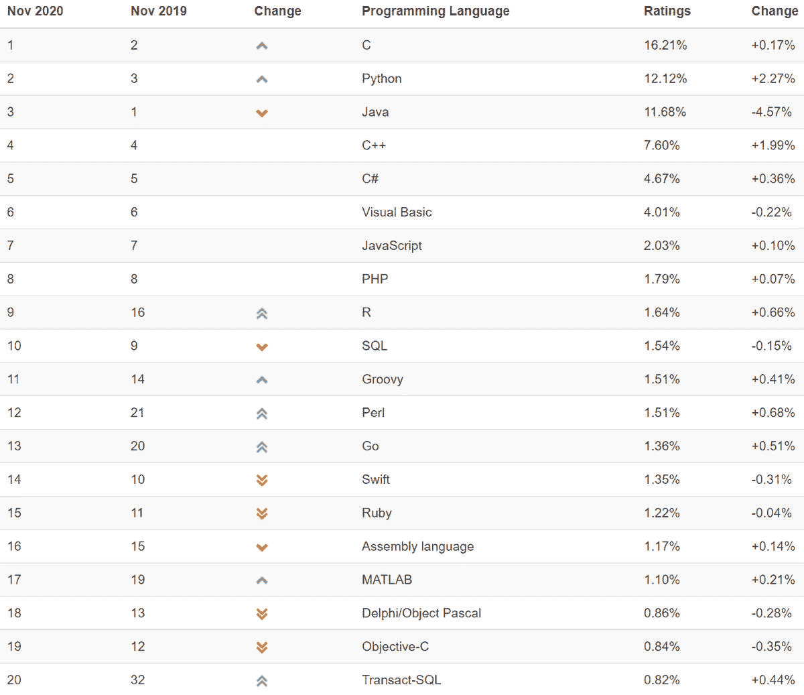

# 2021 年要掌握的五项当代交易技能

> 原文：<https://blog.quantinsti.com/must-have-trading-skills/>

由[查尼卡·塔卡](https://www.linkedin.com/in/chainika-bahl-thakar-b32971155/)

交易领域和世界其他地方一样充满活力。它正在迅速适应技术进步，并转向算法交易领域。考虑到快速的变化，今天的交易者必须提升自己的技能。据估计，在 2021-2025 年间，算法交易市场将增长 37 亿美元。

因此，为了对未来做好准备，让我们来看看 2021 年及以后对交易者来说至关重要的五大技能。

你可以看看下表，快速浏览一下这篇博客中的 5 个交易技巧:

| **等级** | **定量分析** | **Python** | **回溯测试** | **机器学习** | **风险管理** |
| 第一级:学习要求 | Quant 分析师要求学习金融、统计、数学、计算机科学、数据科学、人工智能等学科。 | 为了学习 Python，你不需要有编码背景。你只需要专注，先找到一个学习基础的好平台 | 为了回溯测试交易策略，你需要学习一门编程语言 | 机器学习需要学习编程语言、数据科学、统计学 | 风险管理需要金融知识、市场因素，如趋势、提款等。 |
| 第二级:概念 | 机器学习、神经网络、概率等概念的实现是在交易中完成的 | Python 实现包括函数、数据帧、循环等概念。 | 实施绩效指标，如夏普比率、索提诺比率等。分析战略的绩效 | 机器学习概念，如回归、决策树等。 | 风险管理包括风险的识别、评估和缓解 |
| 第三级:在交易中的应用 | 量化分析师运用他们的知识和技能来分析市场数据，然后制定可以量化的策略 | Python 编程通过使用机器学习等平台来帮助创建交易策略 | 回溯测试根据历史数据测试交易策略，这有助于发现交易策略的有效性 | 借助编程语言开发的机器学习算法被应用于算法交易实践 | 通过研究市场因素，如趋势、夏普比率、成交量、跌价等，你可以做出交易决定 |
| 第 4 级:使用这个技能你在交易领域能成为什么样的人？ | 作为一名定量分析师，你可以运用你的知识成为一名研究分析师，高级定量分析师等。 | Python 编程帮助你成为各种职业的专家，如分析师、算法交易员、开发人员等。 | 回溯测试帮助你测试你自己的交易活动和一些公司的分析师的交易策略 | 有了机器学习概念的知识，你可以成为一名开发人员、数据科学家等。 | 你可以参与投资组合优化、头寸规模、对冲等。帮助降低交易风险 |

*   [定量分析](#quantitative-analysis)
*   [Python](#python)
*   [回溯测试](#backtesting)
*   [机器学习](#machine-learning)
*   [风险管理](#risk-management)

在本文中，让我们探索这些关键的专业领域，理解它们的含义，并确定我们自己需要改进的地方。

## 定量分析

定量分析是基于技术指标如移动平均线、振荡指标等对市场进行的统计/科学研究。简而言之，定量分析师在使用技术指标时，会对策略进行统计回溯测试，就像技术分析一样。

技术分析是通过分析历史市场数据来预测金融证券价格的研究。技术分析使用基于价格和交易量的模型和交易规则。例如，技术分析使用相对力量指数，移动平均线，振荡指标，或者图表模式和波形。

在定量分析的情况下，通过利用[神经网络](https://quantra.quantinsti.com/course/neural-networks-deep-learning-trading-ernest-chan)、机器学习和其他统计工具来发现市场的表现，以开发可以量化的交易策略。为了量化分析，需要数学和统计研究工具和方法方面的专业知识。通常，定量分析比技术分析更有助于交易者，因为它提供了一个科学的结果来帮助开发一个带有进场、出场和[仓位大小](https://quantra.quantinsti.com/course/position-sizing-trading)的算法。

例如，定量分析使用[烛台模式](/candlestick-patterns-meaning/)进行统计测试，然后在可量化分析的基础上发现策略是否可以运行。

这里有一个视频可以帮助你详细了解定量分析和技术分析:

[https://www.youtube.com/embed/SohUND7tLNc](https://www.youtube.com/embed/SohUND7tLNc)

定量分析涵盖的技能有:

*   计算机编程语言
*   机器学习
*   数学技能
*   金融技能
*   面向对象编程
*   最佳证券投资理论
*   结石
*   线性代数和微分方程
*   数据库管理
*   回溯测试

建议阅读:

[如何成为量化分析师？](/quantitative-analyst/#job-responsibilities-expectations-from-the-quant)

接下来是 Python 语言。让我们看看 Python 是如何支持交易的。

## 计算机编程语言

编程语言是任何想要利用技术和计算进步(如机器学习或对历史数据进行回溯测试)的新老交易员的先决条件。

在选择编程语言之前，有几个重要的概念需要考虑，比如成本、性能、弹性、模块化和其他各种[交易策略](/algorithmic-trading-strategies/)参数。

根据交易系统的要求，决定编程语言的选择。2020 年 12 月，Python 成为第二大流行语言。

下图显示了 Python 获得的评分远远高于其他计算机语言，除了位于顶端的语言“C”。

来源: [ZDNet](https://www.zdnet.com/article/programming-language-pythons-popularity-ahead-of-java-for-first-time-but-still-trailing-c/#:~:text=Python%20is%20now%20the%20second,%2Dyear%2Dold%20Tiobe%20index.&text=For%20the%20first%20time%20in,second%2Dmost%20popular%20programming%20language.)

Python 语言帮助交易者快速简单地编码，以导入数据并以图形的形式可视化数据。图形表示使得解释数据进行分析变得更加容易。此外，Python 拥有用于机器学习和数据科学的 API 和库，与其他语言相比，这些 API 和库使得分析更加流畅。

这里有一个视频，来自算法交易领域的专家分享了 Python 在交易中受到青睐的原因:

[https://www.youtube.com/embed/fGUbQWgUq8A](https://www.youtube.com/embed/fGUbQWgUq8A)

python 中包含的技能有:

*   数据结构
*   数据类型和变量
*   面向对象编程
*   机器学习
*   神经网络
*   [自然语言处理](https://quantra.quantinsti.com/course/natural-language-processing-trading)
*   数据科学中的分析技能

建议阅读:

[Python for trading:简介](/python-trading/#benefits-and-drawbacks-of-python-in-algorithmic-trading)

另一个交易技巧是回溯测试，它帮助交易者根据历史数据分析交易策略。接下来让我们了解更多关于回溯测试的内容。

## 回溯测试

回溯测试是使用历史数据测试交易策略的过程，以确定该策略的有效性。回溯测试结果通常以流行的[性能指标](/performance-metrics-risk-metrics-optimization/)如夏普比率、索蒂诺比率来显示策略的性能。性能指标通常有助于量化风险回报。如果结果符合必要的标准，就可以在一定程度上放心地实施战略。如果结果不太令人满意，可以修改、调整和优化策略的参数，以获得理想的结果。

回测系统主要有两种形式:向量化回测和事件驱动回测。

矢量化回溯测试是回溯测试策略的初始阶段。在矢量化回溯测试中，市场互动的所有方面都没有完全模拟出来。但是，近似值被用来确定潜在策略的性能。

在更现实的环境中进行严格的回溯测试之前，您可以利用矢量化回溯测试来测试核心战略思想。例如，你可以在回溯测试平台上运行你的策略，生成交易信号，计算策略回报，只是为了找出策略的效率。为了详细学习矢量化回溯测试，你可以去参加这个关于交易中的 Python 的课程。

这些回溯测试系统通常是用 Python、R 或 MatLab 编写的。在战略创建的初始阶段，当你在测试粗糙但多样的战略想法时，开发的速度比执行的速度更重要。

在事件驱动的回溯测试中，自动化的[交易策略](https://quantra.quantinsti.com/glossary/Trading-Strategy)连接到实时市场反馈。交易执行是在纸上/模拟器上完成的，而不是在真实的[交易所](https://quantra.quantinsti.com/glossary/Exchange)上。该策略接收市场反馈，然后分析这些数据以触发一个事件，该事件进而产生一个交易信号。这些系统通常在一个连续的循环中运行，以接收事件并适当地处理它们。

主要优势是[事件驱动的](https://quantra.quantinsti.com/course/event-driven-trading-strategies)回溯测试可以有子组件，如历史数据处理器和代理模拟器，允许回溯测试以非常类似于实时执行的方式执行。

有了像 [Blueshift](https://blueshift.quantinsti.com/) 这样的平台，用 Python 语言回测你的交易想法或策略，进行算法交易就很容易了。由于 python 语言的简单性，使用 Blueshift 进行回溯测试更加容易。

当你有交易想法，但没有平台来检验它们时，不能保证根据这些想法建立的交易策略会产生有益的结果。在这里，有利的结果意味着更少或没有损失，从交易策略中获得更多的收益。

此外，在下面的演示视频中，您将了解专家如何开发和回测您的交易策略:

[https://www.youtube.com/embed/qLIgx0S8D0w](https://www.youtube.com/embed/qLIgx0S8D0w)

进行回溯测试需要以下技能:

*   数据分析
*   了解业绩指标，如下降、夏普比率
*   编程技能

建议阅读:

1.  [如何回测交易策略](/backtesting/)
2.  [外汇交易策略和回溯测试技术](/forex-trading-strategies-backtesting-webinar-14-august-2018/)
3.  [使用 Quantstrat [EPAT 项目]进行配对交易策略和回溯测试](/pair-trading-strategy-backtesting-using-quantstrat/)

接下来，让我们了解一下机器学习。

## 机器学习

[机器学习](https://quantra.quantinsti.com/course/introduction-to-machine-learning-for-trading)顾名思义，就是机器学习的能力，即使没有显式编程。这是一种基于[算法](https://quantra.quantinsti.com/glossary/Algorithm)的[人工智能](https://quantra.quantinsti.com/glossary/Artificial-Intelligence)，用于检测数据中的模式，并相应地调整程序动作。基本上是人工智能的一个子领域。

机器学习算法使用“学习”模型。学习模型允许算法学习输入和输出组合，然后用新数据做出自己的决定。

在交易中，作为机器学习模型的[线性回归模型](https://quantra.quantinsti.com/course/trading-with-machine-learning-regression)帮助[预测金融证券的价格](/gold-price-prediction-using-machine-learning-python/)。此外，机器学习算法使用最少的人力或干预来完成任何复杂的任务。可以使用 Python 开发机器学习算法，这已经是一项关键技能。此外，Python 比其他语言更受青睐，这是因为它具有我们上面讨论过的优势。

你可以在这里的视频中找到关于使用机器学习进行交易的信息:

[https://www.youtube.com/embed/m_v8K4zIHy8](https://www.youtube.com/embed/m_v8K4zIHy8)

此外，要了解如何使用[机器学习](https://quantra.quantinsti.com/course/introduction-to-machine-learning-for-trading)进行实时交易，这里有另一个视频可以让你彻底了解它:

[https://www.youtube.com/embed/tUN9XGAGRYg](https://www.youtube.com/embed/tUN9XGAGRYg)

机器学习的技能包括:

*   神经网络
*   自然语言处理
*   应用数学
*   机器学习算法，如随机森林、逻辑回归、线性回归等。
*   编程；编排

建议阅读:

1.  [机器学习基础知识](/machine-learning-basics/)
2.  [使用 Python 中的机器学习进行交易](/trading-using-machine-learning-python/)
3.  [Python 中的机器学习分类策略](/machine-learning-classification-strategy-python/)
4.  [面向初学者的 10 大机器学习算法](/top-10-machine-learning-algorithms-beginners/)
5.  [使用回归进行股票价格预测的机器学习](/machine-learning-trading-predict-stock-prices-regression/)

现在，我们将进一步了解风险管理是交易中的一项重要技能。

## 风险管理

交易中的风险管理对于控制承担股票市场交易损失的风险至关重要。风险管理涉及风险的识别、评估和缓解。风险通常出现在市场走势与预期相反的时候。

因此，在对市场进行透彻分析的基础上设定你的预期，并对所有风险进行事后预测，这一点非常重要。

在风险管理中，[趋势](https://quantra.quantinsti.com/glossary/Trend)是最重要的因素。趋势意味着市场、资产价格或其他此类指标的总体方向或势头。

最受欢迎的[风险管理策略](/trading-risk-management/)以及在规避风险的同时使您的交易成功的要素如下:

*   投资组合优化-投资组合优化是构建投资组合的过程，以最大化预期回报，同时最小化风险。它包括通过计算每个投资组合的风险和回报来分析不同投资比例的投资组合。
*   对冲-对冲是一种投资策略，旨在抵消潜在的损失。对于套期保值，金融工具如保险、[期货合约](https://quantra.quantinsti.com/glossary/Futures)、[掉期](https://quantra.quantinsti.com/glossary/Swap)、[期权](https://quantra.quantinsti.com/glossary/Option)等。可以用来对冲。
*   1%原则和 2%投资原则——交易中的 1%和 2%原则意味着每次交易的最大可行风险应该是 1%或 2%。这有助于你避免否则可能发生的过度损失。
*   利用先进技术监控交易-应使用算法交易和回溯测试等技术监控交易。
*   避免不清楚的交易设置——如果你使用均线、均线等移动指标。其中一个指标显示了清晰的交易设置，但与其他指标的交易设置不一致，这就造成了混乱。在这种情况下，最好等待合适的交易，不要在不确定的时候做任何决定。
*   止损——止损是当股票价格达到一个特定的价格即止损价格时触发的买入或卖出指令。这有助于交易者避免持续监控市场。

这里有一个关于交易员风险管理的视频教程，旨在帮助管理投资组合:

[https://www.youtube.com/embed/cz7oJZmBHA8](https://www.youtube.com/embed/cz7oJZmBHA8)

风险管理所需的技能有:

*   交易经验
*   编程技能
*   证券管理
*   市场监控

建议阅读:

[交易风险管理介绍](/trading-risk-management/)

## 结论

因为这个世界正在快速发展和进步，我们为今天的交易者提供了五个当代交易技巧的概述。有了交易技巧和及时的实施，你可以获得最大的收益。交易者有不同的交易方式，如日内交易、趋势交易等。可以从这些交易技巧中获益。

*<small>本文提供的所有数据和信息仅供参考。QuantInsti 对本文中任何信息的准确性、完整性、现时性、适用性或有效性不做任何陈述，也不对这些信息中的任何错误、遗漏或延迟或因其显示或使用而导致的任何损失、伤害或损害承担任何责任。所有信息均按原样提供。</small>T3】*