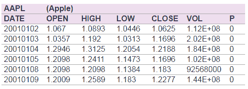
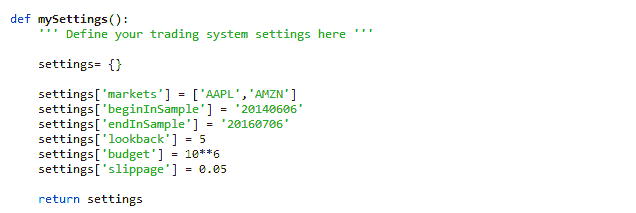
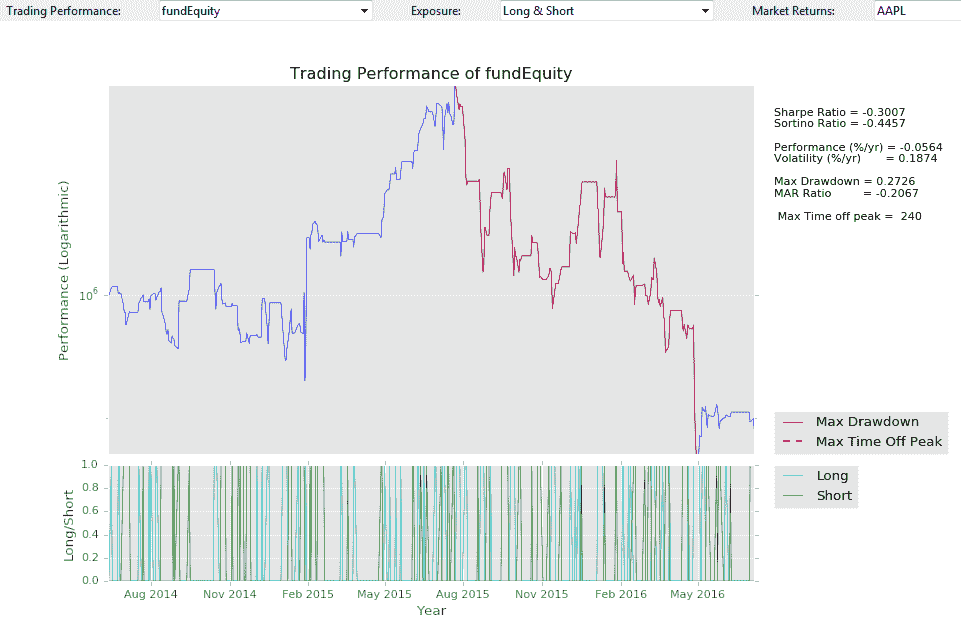

# Quantiacs 平台中的 Python 交易策略

> 原文：<https://blog.quantinsti.com/python-trading-strategy-quantiacs-platform/>

由[米林德·帕拉德卡](https://www.linkedin.com/in/milind-paradkar-b37292107/)

算法交易在最近几年有很大的吸引力，希望探索这个利润丰厚的领域的学生、工程毕业生和金融专业人士的数量逐年呈指数增长。

你是想学习量化技术并利用你的交易理念赚钱的人吗？让我们探索 Quantiacs 平台，它允许你创建、运行和实施你的[https://blog.quantinsti.com/python-trading-library/](https://blog.quantinsti.com/python-trading-library/)Python 交易策略。Quantiacs 为成功的量化分析师提供了巨大的赚钱机会。

### **Quantiacs 工具箱**

Quantiacs 工具箱是免费和开源的。Quantiacs 为 49 只期货和标准普尔 500 股票提供长达 25 年的免费数据。该工具包允许用户创建一个交易策略，并用 1990 年的数据进行回溯测试。除了期货数据，Quantiacs 最近还增加了宏观经济数据，这些数据可以与价格时间序列数据结合使用，以改进交易算法。Quantiacs 同时支持 Python 和 Matlab。在本帖中，我们将探索 Python 工具箱，并展示一个使用它的玩具策略。

### **Quantiacs Python 工具箱**

Quantiacs 创建了一个简单而强大的 [Python 框架](http://quantiacs-python-toolbox-documentation.readthedocs.io/en/latest/)，可以用来创建不同类型的算法策略。它提供了定义交易系统设置，如加载市场数据，交易成本，自定义字段，资本等。Python 工具箱的其他特性包括评估交易系统、优化、结果可视化等。让我们在这里探索一下 Python 框架的一些特性。

**加载市场数据:**

Quantiacs 在股票和期货市场都有交易。股票的数据字段如下所示:

资料来源:Quantiacs.com

我们可以使用 quantiacsToolbox.loadData 函数在 Python 中加载股票数据。

可以看出，数据是 Python 字典的形式。让我们检查键值对的数据类型。

要创建一个 [Python 交易](https://blog.quantinsti.com/python-trading-library/)策略，我们必须操作 numpy 数组，并且要求你对 Python numpy 数组及其支持的无数函数有很好的理解。这里是一些有用功能的[列表](https://docs.scipy.org/doc/numpy/reference/arrays.ndarray.html)。

### **蜡烛高低 Python 策略**

现在让我们采用一个非常简单的蜡烛图高低策略，并尝试使用 Quantiacs 工具箱对其进行编码。一步一步的过程如下所示。

#### **第一步:定义设置**

我们对苹果公司(Apple Inc .)和亚马逊公司(Amazon Inc .)的股票测试了我们的样本策略。回溯测试周期在设置[' begin sample ']和设置['endInSample']变量中定义。我们还定义了回望日、资本和滑点。

#### **第二步:Python 交易策略**

我们保持了简单的策略。在第一步中，我们定义蜡烛线的数量，这些蜡烛线代表先前价格的数量，这些价格将被考虑用于生成买入/卖出信号。然后我们计算最后 n 根蜡烛的价格差。如果所有的价差都是正的，我们做空，预期会出现均值回归行为。如果所有的差价都是负数，我们就做多。

多头头寸由值 1 表示，而空头头寸的值为-1。

#### **第三步:运行策略**

为了执行我们的策略，我们使用 quantiacsToolbox.runts 命令并指定相应的 Python 文件。

#### **第四步:可视化结果**

在执行时，Python 框架会显示一个信息丰富的图表，其中包括市场、选择风险类型的选项、各种性能指标等。

可以看出，Quantiacs Python 框架易于使用，可以用来开发各种交易策略。

### **下一步**

Python 算法交易在 quant finance 社区中获得了牵引力，因为它可以轻松地建立复杂的统计模型，这是因为有足够的科学库可用，如 Pandas、NumPy、PyAlgoTrade、Pybacktest 等。

如果您希望掌握使用 Python 生成交易策略、回溯测试、处理时间序列、生成交易信号、预测分析等艺术，您可以注册我们的 [Python for Trading 课程！](https://quantra.quantinsti.com/course/python-for-trading)

*免责声明:股票市场的所有投资和交易都有风险。在金融市场进行交易的任何决定，包括股票或期权或其他金融工具的交易，都是个人决定，只能在彻底研究后做出，包括个人风险和财务评估以及在您认为必要的范围内寻求专业帮助。本文提到的交易策略或相关信息仅供参考。*

### **下载 Python 代码**

*   蜡烛线高低策略- Python 代码