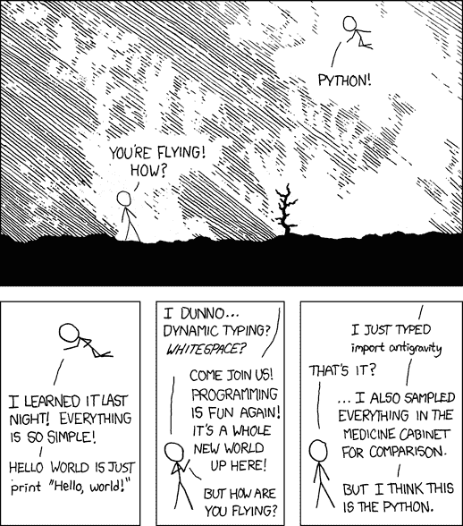

# Python 交易简介:好处、策略等等

> 原文：<https://blog.quantinsti.com/python-trading/>

由 [Viraj Bhagat](https://www.linkedin.com/in/virajbhagat/) 编译

Python，一种由 Guido Van Rossum 在 20 世纪 80 年代后期构思的编程语言，已经见证了巨大的增长，尤其是在最近几年，因为它的易用性、丰富的库和优雅的语法。

*一门编程语言怎么会有‘Python’这样的名字？*

嗯，Python 的创造者 Guido 需要一个简短、独特、有点神秘的名字，因此在观看一部名为“[蒙蒂·Python 的飞行马戏团](https://www.imdb.com/title/tt0063929/)”的喜剧系列片时，他决定使用“Python”。

如果你对 Python 的历史以及什么是 Python 和它的应用很好奇，你可以随时参考 [Python 手册](https://www.quantinsti.com/python-basics-handbook)的第一章，它是你开始 Python 之旅的指南。我们正在走向自动化的世界，因此，总是需要有编程语言经验的人。当谈到[算法交易](https://quantra.quantinsti.com/course/getting-started-with-algorithmic-trading)的世界时，为了让你的交易算法更聪明更快，学习一门编程语言是必要的。

的确，你可以将战略中的编码部分外包给一个有能力的程序员，但当你不得不根据不断变化的市场场景调整你的战略时，这将会很麻烦。

<u>在本文中，我们将介绍以下内容</u>:

*   [选择编程语言](#choosing-a-programming-language)
*   [为什么要用 Python 进行交易？](#why-use-python-for-trading)
*   [Python 这些年的流行程度](#popularity-of-python-over-the-years)
*   [Python 在算法交易中的利与弊](#benefits-and-drawbacks-of-python-in-algorithmic-trading)
*   [Python vs c++ vs R](#python-vs-c-vs-r)
*   [Python 在金融领域的应用](#applications-of-python-in-finance)
*   [用 Python 编码进行交易](#coding-in-python-for-trading)
*   [Python 安装指南](#installation-guide-for-python)
*   [流行的 Python 库又名 Python 包](#popular-python-libraries-aka-python-packages)
*   [在 Python 中处理数据](#working-with-data-in-python)
*   [用 Python 创建样本交易策略和回溯测试](#creating-a-sample-trading-strategy-and-backtesting-in-python)
*   [评估样本交易策略](#evaluating-the-sample-trading-strategy)
*   [如何入门 Python 进行交易](#how-to-get-started-with-python-in-trading)

* * *

## **选择编程语言**

在我们了解 Python 的核心概念及其在金融中的应用以及使用 Python 进行交易之前，让我们了解一下我们应该学习 Python 的原因。

了解流行的编程语言是成为专业算法交易者的基石。随着技术的日新月异，程序员很难学会所有的编程语言。

我们在 QuantInsti 收到的最常见的问题之一是

***“算法交易应该学哪种编程语言？”**T3】*

这个问题的答案是，没有什么比算法交易更好的语言了。在选择编程语言之前，有许多重要的概念需要在整个交易过程中加以考虑:

*   费用
*   表演
*   跳回
*   模块化和
*   其他各种[交易策略](/algorithmic-trading-strategies/)参数

每种编程语言都有其优点和缺点，基于交易系统要求的优点和缺点之间的平衡将影响个人可能更喜欢学习的编程语言的选择。

每个组织基于其业务和文化都有不同的编程语言。

*   你会使用什么样的交易系统？
*   你打算设计一个基于执行的交易系统吗？
*   你需要一个高性能的回溯测试器吗？

基于所有这些问题的答案，你可以决定哪种编程语言最适合算法交易。

* * *

## **为什么要用 Python 进行交易？**

Python 已经成为最近交易的首选，因为 Python 是开源的，所有的[包](/installing-python-packages/)都可以免费用于商业用途。

Python 已经在 quant finance 社区获得了牵引力。由于有足够的科学库可用，Python 使得构建复杂的统计模型变得很容易。

**一些流行的 Python 库有:**

*   [熊猫](/python-pandas-tutorial/)，
*   [NumPy](/python-numpy-tutorial-installation-arrays-random-sampling/) ，
*   [Matplotlib](/python-numpy-tutorial-installation-arrays-random-sampling/) ，
*   [Scikit-learn](/scikit-learn-tutorial/) ,
*   滑索，
*   [TA-Lib](/install-ta-lib-python/) ，等等。

对 [Python trading](https://quantra.quantinsti.com/course/python-trading-basic) 库的首次更新在开发者社区中是经常发生的事情。外面有无数的社区。

**一些经常光顾的 Python 社区有:**

*   [Python meetups](https://wiki.python.org/moin/LocalUserGroups) -全球约有 1637 个 Python 用户组，分布在 37 个国家的 191 个城市，成员超过 860333 人。
*   Github 上的 200 万个知识库中有超过 130 万个是针对 Python 的
*   有超过 170 万个关于 Python 的问题在 [StackOverflow](https://stackoverflow.com/questions/tagged/python) 上得到回答

我们甚至没有考虑到通过各种门户、团体、平台、论坛等的 Python 的绝大多数本地社区。

量化交易者需要一种脚本语言来构建代码原型。在这方面，

*   Python 在整个交易过程中有着巨大的意义
*   Python 在原型化[量化模型](https://quantra.quantinsti.com/course/quantitative-trading-strategies-models)中得到应用，尤其是在银行和对冲基金的量化交易团队中

> "Python is fast enough for our site and allows us to produce maintainable features in record times, with a minimum of developers,"
> 
> Cuong Do 说，软件架构师，[YouTube.com](http://youtube.com/)。【2】

**为什么 quant 交易者更喜欢 Python 进行交易？**

使用 Python 进行交易可以帮助他们:

*   建立他们自己的数据连接器，
*   执行机制，
*   通过[回溯测试](/backtesting/)，
*   [风险管理](/trading-risk-management/)和[订单管理](/automated-trading-order-management-system/)，
*   向前走分析，以及
*   优化测试模块。

[算法交易开发者](/career-developer-algorithmic-trading/)经常困惑于选择开源技术还是商业/专有技术。在决定这一点之前，必须考虑:

*   围绕特定编程语言的社区活动，
*   易于维护，
*   易于安装，
*   语言文档，以及
*   维护成本。

Python 作为一种编程语言之所以流行，部分原因是该领域的一些巨头对它的认可。

这里列出了全球使用 Python 的一些大公司:

> 随着 [#Python](https://twitter.com/hashtag/Python?src=hash&ref_src=twsrc%5Etfw) 的持续快速增长，这里有一份[#使用 Python 的‘十大顶级公司’名单](https://twitter.com/hashtag/list?src=hash&ref_src=twsrc%5Etfw):
> 👉谷歌
> 👉Instagram
> 👉脸书
> 👉Spotify
> 👉Quora
> 👉亚马逊
> 👉网飞
> 👉条纹
> 👉收纳箱
> 👉Reddit
> 
> (来源:TIOBE，Hackernoon)[pic.twitter.com/EP9jDp94Xc](https://t.co/EP9jDp94Xc)
> 
> — QuantInsti (@QuantInsti) [July 11, 2021](https://twitter.com/QuantInsti/status/1414064409698177027?ref_src=twsrc%5Etfw)

