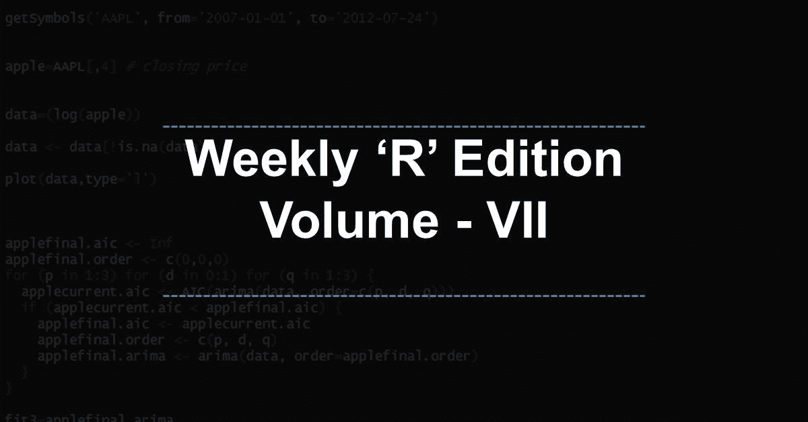

# r 每周简报第七卷

> 原文：<https://blog.quantinsti.com/r-weekly-bulletin-vol-vii/>



本周的 R bulletin 将涉及如何创建日期序列、如何给日期和时间变量添加数字以及如何将美国格式的日期转换为标准格式等主题。希望你喜欢这个 R 周刊。享受阅读！

### 快捷键

1.  运行当前行/选择- Ctrl+Enter
2.  将光标移动到行首- Home 键
3.  将光标移动到行尾键的末尾

### 解决问题的想法

#### **使用**序列**创建日期序列。日期功能**

序列。日期函数可用于生成日期序列。该函数使用类“Date”处理日期。对于 POSIX 类的日期，可以使用 seq。POSIXt 函数同样适用。序列的语法。日期函数给定为:

序列。日期(从，到，到)

其中，“从”是开始日期。“到”是结束日期。这可以是一个可选参数。“by”是序列的增量。“length.out”采用整数值；这是一个可选参数，并指示序列的期望长度

**例子:**

```py
# by month
seq(as.Date("2016/1/1"), by = "month", length.out = 12)
```

[1] "2016-01-01" "2016-02-01" "2016-03-01" "2016-04-01" "2016-05-01" [6] "2016-06-01" "2016-07-01" "2016-08-01" "2016-09-01" "2016-10-01" [11] "2016-11-01" "2016-12-01"

```py
# by quarters.
seq(as.Date("2000/1/1"), as.Date("2003/1/1"), by = "quarter")
```

[1] "2000-01-01" "2000-04-01" "2000-07-01" "2000-10-01" "2001-01-01" [6] "2001-04-01" "2001-07-01" "2001-10-01" "2002-01-01" "2002-04-01" [11] "2002-07-01" "2002-10-01" "2003-01-01"

```py
# If we specify a value in the 'by' argument, it will create a sequence of
# dates which are apart from that given value.
seq(as.Date("2000/1/1"), as.Date("2003/1/1"), by = "2 quarter")
```

[1] "2000-01-01" "2000-07-01" "2001-01-01" "2001-07-01" "2002-01-01" [6] "2002-07-01" "2003-01-01"

#### 向日期和时间变量添加数字

R 中有三个日期和时间类:POSIXct、POSIXlt 和 date。当我们向 POSIXct 或 POSIXlt 类日期添加一个数字时，它会将给定数字的单位作为秒，因此它会将日期移动这些秒。

**举例:**

```py
now_time = Sys.time()
print(now_time)
```

[1]“2017-05-06 21:01:19 IST”

```py
# Let us add a value of 1 to the now_time date variable.
x = now_time + 1
print(x)
```

[1]“2017-05-06 21:01:20 IST”

从输出中可以看出，日期移动了 1 秒。如果我们想给“now *time”变量加 1 天，我们必须给“now* time”变量加 86400，因为 1 天相当于 86400 秒。这将使它提前一天。

```py
now_time = Sys.time()
y = now_time + 86400
print(y)
```

[1]“2017-05-07 21:01:20 IST”

但是，如果日期存储为 date 类，则添加值 1 会将其向前移动 1 天。因此，以 date 类的形式向 Date 变量添加一个数字将使它移动那么多天。

```py
now_time = as.Date(Sys.time())
print(now_time)
```

[1] "2017-05-06"

```py
x = now_time + 1
print(x)
```

[1] "2017-05-07"

#### 将美国日期格式转换为标准格式

美国的日期格式是 mm/dd/yyyy 类型，而 ISO 8601 的标准格式是 yyyy-mm-dd。为了将美国日期格式转换为标准格式，我们将使用 as。日期函数和格式函数。下面的示例说明了该方法。

**举例:**

```py
# date in American format
dt = "07/24/2016"

# If we call the as.Date function on the date, it will throw up an error, as
# the default format assumed by the as.Date function is yyyy-mmm-dd.
as.Date(dt)
```

char tote(x)中的错误:字符串不是标准的明确格式

```py
# Correct way of formatting the date
as.Date(dt, format = "%m/%d/%Y")
```

[1] "2016-07-24"

### 功能去神秘化

#### 相同函数

恒等函数测试 R 中的两个对象是否完全相等。要比较的对象作为参数包含在函数中，函数返回逻辑真/假作为输出。

**例子:**

```py
y1 = c(1:12)
y2 = c(1:12)
identical(y1, y2)
```

[1]正确

```py
days = c("Mon", "Tues", "Wed", "Thurs", "Fri", "Sat", "Sun")
months = c("Jan", "Feb", "Mar", "April", "May", "June", "July")
identical(days, months)
```

[1]错误

#### 全等函数

all.equal 函数用于检查数字是否相等。如果要比较的值不相同，all.equal 函数将返回差异报告。该函数的语法如下所示:

**all.equal(目标，当前)**

其中，目标是一个 R 对象。当前是其他 R 对象，与目标进行比较。

**举例:**

```py
all.equal(3, 2)
```

[1]“平均相对差异:0.3333333”

```py
# Using is.TRUE will return a logical value instead of the differences
# report.
isTRUE(all.equal(3, 2))
```

[1]错误

#### 任何和所有功能

“any”函数用于检查给定的一组逻辑向量中是否有任何真值。“all”函数是另一个有用的函数，如果输入逻辑向量中的所有值都为真，则该函数返回真。

**例 1:**

```py
sample = c(FALSE, FALSE, FALSE)
any(sample)
```

[1]错误

```py
all(sample)
```

[1]错误

**例 2:**

```py
sample = c(TRUE, FALSE, FALSE)
any(sample)
```

[1]正确

```py
all(sample)
```

[1]错误

### **下一步**

我们希望你喜欢这个公告。在接下来的每周公告中，我们将为读者列出更多有趣的方式和方法以及 R 函数。