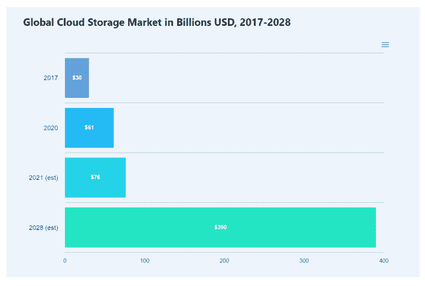
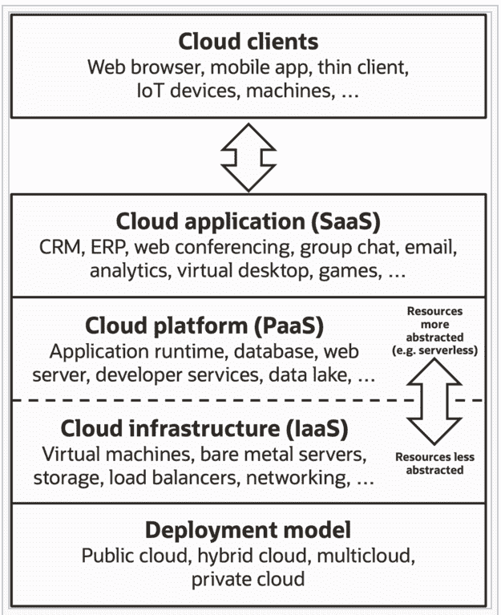
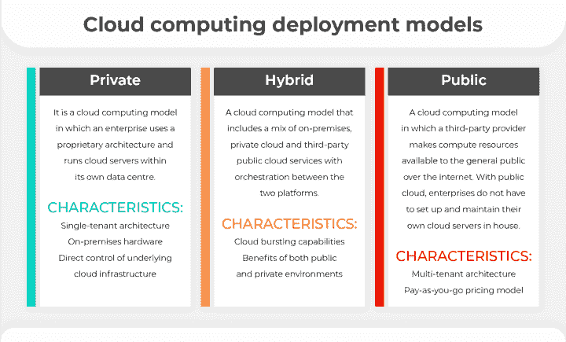
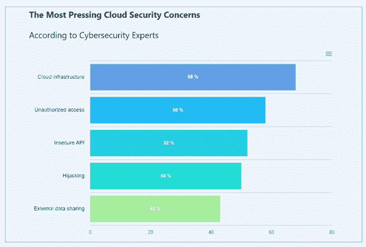

# 交易中的云计算:类型、模型、自动化及更多

> 原文：<https://blog.quantinsti.com/raining-data-cloud-computing-solutions-for-retail-traders/>

由[查尼卡·塔卡](https://www.linkedin.com/in/chainika-bahl-thakar-b32971155/)

云计算是大多数企业不可或缺的一部分。由于云计算提供的便利、安全和可靠的服务，它在交易领域得到了广泛的应用。尤其是因为用户可以在任何地方工作。

在当今这个数据无处不在的当代世界，云计算被证明是零售交易商、机构和几乎所有金融市场参与者的福音。

本文涵盖:

*   [什么是云计算？](#what-is-cloud-computing)
*   [云计算的历史](#history-of-cloud-computing)
*   [云服务的类型](#types-of-cloud-services)
    *   [软件即服务(Saas)](#software-as-a-service-saas)
    *   [平台即服务(PaaS)](#platform-as-a-service-paas)
    *   [基础设施即服务(IaaS)](#infrastructure-as-a-service-iaas)
*   [云计算部署模式的类型](#types-of-cloud-computing-deployment-models)
    *   [私有云](#private-cloud)
    *   [混合云](#hybrid-cloud)
    *   [公有云](#public-cloud)
*   [基于云的交易平台示例](#example-of-cloud-based-trading-platform)
*   [云计算如何应用在自动化交易系统中？](#how-can-cloud-computing-be-used-in-automated-trading-systems)
*   [零售交易中的云计算](#cloud-computing-in-retail-trading)
*   [外汇市场中的云计算](#cloud-computing-in-the-forex-market)
*   [使用云计算服务所需的技能](#skills-required-for-using-cloud-computing-service)
*   [在交易中使用云计算的好处](#benefits-of-using-cloud-computing-in-trading)
*   [在交易中使用云计算的挑战](#challenges-of-using-cloud-computing-in-trading)

* * *

## 什么是云计算？

云计算是通过互联网(“云”)交付计算服务，包括服务器、存储、数据库、网络、软件、分析和智能。

云计算是一项服务，旨在让任何人和每个使用互联网的人都可以访问。这是一个开放的平台，人们需要通过互联网连接登陆，而不需要任何硬件或软件。

各种类型、规模和业务类型的不同公司和行业正在出于各种原因使用云，例如数据备份、灾难恢复、虚拟桌面需求、软件开发、大数据分析等。

例如，医院正在利用云为病人开发更个性化的治疗。同样，金融服务公司正在使用云来支持实时欺诈检测和防范。

此外，预计云计算[市场规模](https://www.globenewswire.com/news-release/2022/07/20/2483111/0/en/The-cloud-computing-market-size-is-expected-to-be-valued-at-US-405-295-8-million-in-2022-and-reach-US-1-465-818-2-million-by-2028.html)将很快在 2022 年达到 4052.958 亿美元，并在 2028 年达到 14658.182 亿美元。

Cloud storage market

由于云计算提供了更快的创新和灵活的资源，因此非常方便。此外，像 Blueshift 这样的云计算平台是免费的，这也有助于您确保低成本。

随着时间的推移，金融领域的云计算正迅速获得广泛的吸引力。

* * *

## 云计算的历史

云计算的历史和发展可以追溯到 20 世纪 50 年代和 60 年代。20 世纪 50 年代，公司开始使用大型主机。但是由于为每个用户购买一台电脑太贵了，在 20 世纪 50 年代末和 60 年代初，一种叫做分时的方法被开发出来。

分时意味着将多台计算机连接到主机上的设备。与其他计算机相比，大型机具有更大的内存和更强的处理能力。

因此，将大型机与其他计算机连接起来，就可以与那些连接的计算机共享大型机的内存和处理能力。

通过将大型计算机与其他多台计算机连接起来，分时有助于更有效地利用大型计算机上昂贵的处理器时间。

20 世纪 70 年代，随着第一台虚拟机的推出，云计算开始变得更加有形，使用户能够在一个物理环境中运行多个计算系统。

这些虚拟机的功能导致了虚拟化的概念，这对云计算的发展产生了重大影响。

谷歌在 2021 年[的一项调查中发现:](https://cloud.google.com/blog/topics/financial-services/market-data-distribution--consumption-through-cloud--ai)

*   93%的交易所、交易系统和数据提供商提供基于云的数据和服务。
*   67%的商业和投资银行使用云部署的市场数据。
*   90%接受调查的买方公司使用云部署的市场数据，主要用于投资组合管理。

在他们的[文章](https://cybersecurityventures.com/the-world-will-store-200-zettabytes-of-data-by-2025/)中，网络安全风险投资公司预测，到 2025 年，云上的全球数据存储将扩大到 100 吉字节——一吉字节等于十亿兆兆字节(或一万亿吉字节)。

* * *

## 云服务的类型

云计算服务有三种不同的模式，即 Saas、PaaS 和 IaaS。虽然这三者通常被描述为堆叠的层，但是每个提供商甚至可以提供其中的任何一个。

例如，提供商可以提供交易功能的 SaaS 实现，而无需使用底层的 PaaS 或 IaaS 层。类似地，人们可以在 IaaS 上运行程序并直接访问它，而不需要 SaaS。

让我们进一步了解每个型号。

Cloud deployment models - Source: [Wikipedia](https://en.wikipedia.org/wiki/Cloud_computing)

### 软件即服务(SaaS)

用户可以在软件即服务(SaaS)模式中访问应用软件和数据库。云提供商管理运行应用程序的基础设施和平台。在 SaaS 模式中，云提供商在云中安装和运行应用软件，云用户通过提供商访问软件。

### 平台即服务(PaaS)

在 PaaS 中，云提供商提供一个平台，通常包括操作系统、编程语言执行环境、数据库和 web 服务器。应用程序开发人员在云平台上开发和运行他们的软件，而不是直接购买和管理底层硬件和软件层。

### 基础设施即服务(IaaS)

基础设施即服务或 IaaS 是指提供高级 API 的在线服务，这些 API 用于抽象底层网络基础设施的各种低级细节，如物理计算资源、位置、数据分区、扩展、安全性、备份等。

* * *

## 云计算部署模型的类型

云计算模型有三种类型。让我们简单看看这三种类型是什么:

### 私有云

私有云是一种云计算模式，在这种模式下，企业使用专有架构，并在自己的数据中心内运行云服务器。

### 混合云

混合云是一种云计算模式，包括内部、私有云及第三方公共云服务的混合，并在两个平台之间进行协调。

### 公共云

公共云是一种云计算模式，其中第三方提供商通过互联网向公众提供计算资源。有了公共云，企业不必在内部设置和维护自己的云服务器。

Cloud computing deployment models

* * *

## 基于云的交易平台示例

基于云的交易环境允许交易者在任何可能的地方工作，从而提供了灵活性和业务连续性。基于云的交易平台通过云平台提供连接，提高了效率，降低了成本。

让我们看一个基于云的交易平台的例子，即 [Blueshift](https://blueshift.quantinsti.com/) 。

[https://www.youtube.com/embed/UrzDnv3w3qg?rel=0](https://www.youtube.com/embed/UrzDnv3w3qg?rel=0)

Blueshift 是一个免费平台，为每个人带来投资研究、[回溯测试](/backtesting/)和算法交易的机构级基础设施；随时随地。此外，还有一个新推出的 alpha 版本，这是一个快速回溯测试平台，拥有涵盖多个资产类别和市场的分钟级数据。

在 Blueshift 上，在运行回溯测试策略时，您必须明确地选择一个数据集。您必须选择与您的策略一致的数据集。

例如，如果你开发了一个交易苹果的策略，你必须选择纽约证券交易所的数据集来运行它而不出错。目前，我们有以下数据集可用于研究/回溯测试):

*   美国市场和印度的股票和 ETF 市场数据——公司行动的分钟级别。每天收市后更新一次。
*   NSE(印度)月度期货(前三份合约)的期货数据–分钟级别，含调整。每天收市后更新一次。
*   外汇数据- 10 种货币对-澳元/美元、欧元/瑞士法郎、欧元/日元、欧元/美元、英镑/日元、英镑/美元、新西兰元/美元、美元/加拿大元、美元/瑞士法郎、美元/日元。分钟级数据每天更新一次。
*   加密数据- 9 枚硬币兑系绳(USDT)和印度卢比(印度卢比)，也包括 USDT/印度卢比。这九枚硬币分别是 BTC、埃思、阿达、BNB、马蒂奇、XRP、索尔、多特和卢娜。您必须将它们指定成对，要么是针对 USDT(如 BTC/USDT)，要么是针对印度卢比(如 BTC/印度卢比)。

你可以研究你的想法，回测它们，并在 Blueshift 上与你选择的经纪人一起实践你的策略。

Blueshift 上提供实时交易的经纪商有羊驼、FXCM 和 MASTERTRUST。对于票据交易，可用的经纪商有羊驼和福汇。

* * *

## 云计算如何应用在自动化交易系统中？

为了在交易中使用云计算，需要遵循使用云服务所需的步骤。

例如，在交易中使用云服务，Blueshift 需要以下[步骤。](https://medium.com/swlh/blueshift-by-quantinsti-a-powerful-new-tool-for-algorithmic-trading-f7e82cde16ed)

*   第一步-注册！
    你只需要注册并签约创建一个账户。
*   **第 2 步-创建策略** 你会得到策略模板来创建你想要的策略。例如，你可以创建一个带有看跌期权和看涨期权的期权策略。此外，您将为该策略命名。
*   **第 3 步-撰写并优化策略**
    接下来，你将撰写并优化策略。您将被带到可以编写算法的页面。此外，您可以在同一页面上优化回报和其他指标。
*   **步骤 4 -回溯测试**
    现在，您可以输入想要用于回溯测试的数据集、开始日期、结束日期以及算法的资本金额。要运行快速回溯测试，请选择运行。
*   第五步-上线！
    最后，点击“上线”按钮，您的策略将上线。

* * *

## 零售交易中的云计算

云计算的概念是一种按需自助式互联网基础设施，您可以“按需付费”，按需使用。散户交易者正慢慢涉足这种形式的数字技术，基于云的便利来执行他们的交易策略。

由于云的便利，交易者可以使用云服务来创建新的交易策略，对历史数据进行回溯测试，并在执行交易的同时运行[时间序列分析](/starting-time-series/)。

有了云计算，他们不用自己构建数据中心基础设施，只要需要，他们就可以测试该策略，如果不成功，他们可以关闭该策略并终止支付相同的费用。

这种通过云租用空间和时间的概念远比创建自己的硬件/软件基础设施更可行。

同样的概念也适用于交易相关软件——交易者可以按需使用和运行的软件即服务(SaaS)。交易策略的分析、研究和测试是零售交易迁移到云的原因。

总之，云不是一个行业或类别，它是一个生态系统。零售交易商正在转向云计算，因为它有助于削减成本、最大限度地利用资源和提高效率，从而在他们的交易策略中产生惊人的产出。

* * *

## 外汇市场中的云计算

外汇市场是交易货币的场外交易市场。这个市场每周 5.5 天，每天 24 小时开放，世界各地的交易者通过计算机网络进行货币交易。

在一个不眠不休的全球市场中，外汇交易员如何利用云服务？拥有[自动交易系统](/trading-systems-architecture/)的外汇交易员将它们放在经纪人的云上或独立的虚拟专用服务器(VPS)公司。

* * *

## 在交易中使用云计算服务的先决条件

要在交易中使用云计算服务，需要以下技能。

### 编程；编排

编程语言(Python，R，MATLAB)是任何想要利用技术和计算进步(比如对历史数据进行回溯测试)的新老交易员的先决条件。

### 回溯测试

因为云计算服务提供回溯测试作为其中一个特性，所以人们必须了解[回溯测试策略](https://quantra.quantinsti.com/course/backtesting-trading-strategies)。回溯测试是使用历史数据测试交易策略的过程，以确定该策略的有效性。

回溯测试结果通常以流行的[性能指标](/performance-metrics-risk-metrics-optimization/)来显示战略的性能，如[夏普比率](/sharpe-ratio-applications-algorithmic-trading/)和索蒂诺比率。性能指标通常有助于量化风险回报。

### 参数知识

为了使用云计算服务，交易者必须充分了解可以利用的参数，例如限制损失的止损单。通过这种方式，云服务可以得到最好的利用。

### 平台知识

了解您正在使用的云平台是如何工作的也很重要。这就要求用户在一个解释平台工作的章节中浏览所有必要的信息。

例如， [Blueshift 文档](https://blueshift.quantinsti.com/docs/)帮助你找到你需要知道的关于这个平台的一切。

此外，作为云平台的用户，需要注意的是，您还应该了解其他方面，例如:

*   围绕云服务使用的法规
*   建立工作关系网
*   数据库ˌ资料库
*   虚拟化
*   操作系统

这些是云提供商需要解决的许多问题中的几个，但是作为用户，您需要意识到它们。

* * *

## 在交易中使用云计算的好处

现在让我们讨论一下在交易中使用云计算对用户的好处。好处如下-

### 可靠性

交易中的云计算提供了可靠性，因为您输入的数据存储在多个服务器上，您的提供商甚至可以将数据存储在多个位置。因此，存储的数据比存储在硬盘上更安全，因为硬盘数据可能会由于格式化、技术故障导致的系统故障等原因而丢失。

### 成本降低

一些云计算平台是免费的(如 Blueshift ),而另一些(如 Cloud9)价格较低。该成本与硬件、软件、硬件和软件维护等方面的支出进行比较。

### 灵活性和移动性

云计算为用户提供了灵活性和移动性，因为云服务只需要一个有互联网连接的系统。人们可以从任何地方访问云平台。因此，没有必要让您的系统随时准备好相关软件。

* * *

## 在交易中使用云计算的挑战

在交易中使用云计算的挑战并没有减少，而是可以管理的。让我们看看你需要知道的关于使用云计算进行交易的缺点:

### 停工期

当你的网络瘫痪时，这是一个缺点。如果你的互联网出现故障，在云上什么也做不了。

### 安全问题

由于云计算服务可供所有人使用，因此安全性是一个问题。为了确保安全，您必须遵循基本的安全措施，如加密、不与任何人共享您的密码以及备份您的数据(以防万一！)

### 缺乏专业知识

要使用云计算服务，掌握专业知识是必不可少的，这样你就可以轻松地浏览和利用平台的功能。为了积累专业知识，通读平台文档非常重要。

此外，了解必要的领域也很重要，如编程、市场知识、绩效指标、战略制定等。当专业知识达不到标准时，会导致性能问题。

### 服从

云平台的用户需要遵守平台制定的规章制度。当用户不遵守规则或合规时，这是一个问题。

### 构建私有云并管理多个云

这是一个广泛的话题，但围绕构建私有云以及管理多个云存在许多挑战。

构建私有云需要很多先决条件，例如需要设置计算、网络和存储资源，为硬件安装管理软件等。类似地，在管理多个云的情况下，安全问题包括安全和隐私设置的错误配置等。

挑战可能会有所不同，这取决于您在该领域的知识和专业技能、您可用的资源、法规、费用等。

下图来自 [Cloudwards](https://www.cloudwards.net/cloud-computing-statistics/) 显示了最常见和最紧迫的云安全问题，以及每种问题出现的百分比。

Cloud security concern

* * *

### 结论

云计算在全球范围内被广泛使用，以使专业人员的工作更容易、更高效，并具有可靠的设置和更低的成本等优势。通过管理与云计算相关的挑战，人们可以成功地交易、回溯测试并找到在市场中不同情况下实施的正确策略。

尽管云计算在交易中有其公平的好处和挑战，但它正在发展、改进，并朝着成为技术和金融领域的下一个大事件而努力。

要了解更多使用云服务的量化交易，你可以探索这个[算法交易课程](https://www.quantinsti.com/epat)，它让你深入了解算法交易的世界。它教你所有你需要知道的关于 algo 交易的知识，并且在云平台上使用它。

* * *

****注:原帖已于 2022 年**1*2*8 月 **更新，以确保准确性和时效性。****

* * *

*<small>免责声明:股票市场的所有投资和交易都涉及风险。在金融市场进行交易的任何决定，包括股票或期权或其他金融工具的交易，都是个人决定，只能在彻底研究后做出，包括个人风险和财务评估以及在您认为必要的范围内寻求专业帮助。本文提到的交易策略或相关信息仅供参考。</small>T3】*