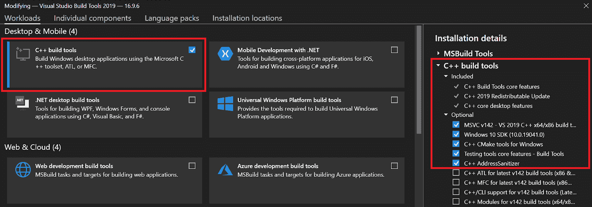

# 在您的系统上设置 Python

> 原文：<https://blog.quantinsti.com/set-up-python-system/>

以[重香重香](https://www.linkedin.com/in/rekhit/)

Python 是一种通用的编程语言，相对来说更容易学习和编程。Python 的优势之一是用户可以在他们的系统上安装大量的库，这样他们就不必从头开始编写代码。

这些库被一次又一次地更新，以确保一切顺利运行。但是有时由于一个库中的更新，一些库可能变得彼此不兼容。

您可以使用本文来设置您的本地 Python 环境，它类似于 Quantra 门户。Quantra 门户包含所有推荐的 quant 分析和算法交易软件包。

这个博客包括以下几个部分。如果您已经熟悉了蟒蛇的安装或者已经安装了蟒蛇，那么您可以直接进入“设置 Python 版本并安装软件包”部分。

如果您想探讨某个特定问题，可以直接访问下面的链接:

## Python 安装步骤

### 安装并运行 Anaconda

1.  在 Windows 上安装 Anaconda
2.  [在 Mac 上安装 Anaconda](#install-anaconda-on-mac)
3.  [解决 Anaconda 安装问题](#troubleshooting-anaconda-installation-issues)

### 设置 Python 环境

1.  [设置 Python 版本并安装包](#set-the-python-version-and-install-packages)
2.  [设置环境的故障排除提示](#troubleshooting-tips-for-setting-environment)

**对于 Quantra 用户**

1.  [如何运行 Quantra 课程下载部分包含的文件](#how-to-run-files-included-in-the-download-section-of-quantra-courses)
2.  [data _ module 中有哪些不同的文件类型？](#what-are-different-file-types-in-data_module)
3.  [故障排除笔记本](#troubleshooting-notebooks)
4.  [您如何访问存储在 data_modules 中的 CSV 文件？](#how-will-you-access-the-csv-files-stored-in-the-data_modules)
5.  [如何访问存储在 data_modules 文件夹中的函数？](#how-to-access-the-functions-stored-in-the-data_modules-folder)

Anaconda 帮助你组织你的代码，在 markdown 单元格中编写简单的代码解释，以及控制程序应该如何运行。

您还可以使用 Anaconda 提示符轻松安装 Python 包。

## 在 Windows 上安装 Anaconda

([跳过这个](#set-the-python-version-and-install-packages)

如果您已经安装了 Anaconda，那么您可以跳过这一节，直接进入关于设置 python 版本的章节。

[https://docs.google.com/presentation/d/e/2PACX-1vR13Yw2UDToymMdlDvhWLRkFpd8tFvpFGfzMOFcLQAyJHaTqgNemxskEmDHdkeyxG-_R-2DsTvMm3Ok/embed?start=false&loop=false&delayms=60000](https://docs.google.com/presentation/d/e/2PACX-1vR13Yw2UDToymMdlDvhWLRkFpd8tFvpFGfzMOFcLQAyJHaTqgNemxskEmDHdkeyxG-_R-2DsTvMm3Ok/embed?start=false&loop=false&delayms=60000)

请记住，您创建的每个环境都有一个特定的名称。现在是“基地”。

现在，您可以前往“[设置 Python 版本并安装包](#set-the-python-version-and-install-packages)”部分。如果 Anaconda 没有正确安装，请转到这个[部分](#troubleshooting-anaconda-installation-issues)。

* * *

## 在 Mac 上安装 Anaconda

([跳过这个](#set-the-python-version-and-install-packages)

[https://docs.google.com/presentation/d/e/2PACX-1vSZJexbsQYCgh9NKEQGu2tZIkU3A4TqK9qH_0WuuyRJb8ofQdOfPfqvglqzoGoN76WXcZ70zFd2vEY-/embed?start=false&loop=false&delayms=3000](https://docs.google.com/presentation/d/e/2PACX-1vSZJexbsQYCgh9NKEQGu2tZIkU3A4TqK9qH_0WuuyRJb8ofQdOfPfqvglqzoGoN76WXcZ70zFd2vEY-/embed?start=false&loop=false&delayms=3000)

请记住，您创建的每个环境都有一个特定的名称。现在是“基地”。

现在，您可以直接进入“[设置 Python 版本并安装包](#set-the-python-version-and-install-packages)”部分。如果 Anaconda 没有正确安装，请转到这个[部分](#troubleshooting-anaconda-installation-issues)。

* * *

## Anaconda 安装问题疑难解答

我们在安装 Anaconda 时遇到的一个常见问题是文件位置问题。通常建议在安装 Python 的地方安装 Anaconda。

有时，由于系统要求，您的系统可能无法安装 Anaconda。那样的话，你可以从这个 [<u>链接</u>](https://repo.anaconda.com/archive/) 中挑选一个较早的版本。

现在已经安装了 Python 和 Anaconda，我们将把 Python 环境修改为 Quantra 使用的相同环境。让我们在下一节看看这个过程。

* * *

## 设置 Python 版本并安装包

我们现在不要使用 Anaconda 提示符在 Python 中创建环境。

[https://docs.google.com/presentation/d/e/2PACX-1vR0BVrhEjhCauNZ286ewF6VK4WLr5XZe80cPwPFSYsPQmYHbR8lpv_3VTLIMFgc41W_azwbv-KmzJem/embed?start=false&loop=false&delayms=3000](https://docs.google.com/presentation/d/e/2PACX-1vR0BVrhEjhCauNZ286ewF6VK4WLr5XZe80cPwPFSYsPQmYHbR8lpv_3VTLIMFgc41W_azwbv-KmzJem/embed?start=false&loop=false&delayms=3000)

下面列出了您必须键入的命令:

1.  a)使用机器学习库创建新环境:

conda env create-f https://quantra . quantin STI . com/downloads/machine learning/environment . yml

1.  b)用于创建没有机器学习库的新环境:

conda env create-f https://quantra . quantin STI . com/downloads/general/environment . yml

2.用于激活新环境:康达激活 quantra_py

3.用于在新环境中打开 jupyter 笔记本:Jupyter 笔记本

现在，您可以打开任何笔记本，并立即开始工作。

* * *

## 设置环境的故障排除提示

安装软件包时，您可能会收到一条错误消息，提示“需要 Windows C++或更高版本才能安装软件包。你可以简单地复制粘贴 [<u>链接</u>](https://visualstudio.microsoft.com/visual-cpp-build-tools/) 并下载构建工具。


点击安装文件，确保您已经选择了“C++构建工具”复选框，并进一步选择了 5 个“可选”工具，如下图所示。



按照安装过程中的说明进行操作，将会安装所需的软件包。然后，您可以再次尝试安装 Python 包，这一次设置将会完成。

为了获得最佳的用户体验，您应该将所有文件提取到安装 Python 的根目录下。例如，如果 Python 安装在文件夹“C:\Users\rekhi”中，那么将文件提取到这个文件夹中。

如果您想要删除现有环境，可以通过以下方式完成。

1.  停用环境
2.  运行以下命令:conda remove - name quantra_py - all


注意:这里，环境名为“quantra_py”。您可以写下要删除的环境的名称。

设置好环境后，您可以运行课程中下载的 zip 文件中的所有笔记本。

现在让我们看看 Quantra 课程的 zip 文件夹中的不同文件。

* * *

## 仅 Quantra 学员专用的部分

* * *

## **如何运行 Quantra 课程下载部分包含的文件**

[https://docs.google.com/presentation/d/e/2PACX-1vQ-JixUa__kl2m9JfJOsQDKzZt1ens0K2is-vFr2zV0aNcQhZX4Zcjo-ZEDmZ8_SlE3tHm8nakPlAxD/embed?start=false&loop=false&delayms=3000](https://docs.google.com/presentation/d/e/2PACX-1vQ-JixUa__kl2m9JfJOsQDKzZt1ens0K2is-vFr2zV0aNcQhZX4Zcjo-ZEDmZ8_SlE3tHm8nakPlAxD/embed?start=false&loop=false&delayms=3000)

## data_module 中有哪些不同的文件类型？

**数据文件**:这些是包含字母数字数据的文本文件。Quantra 以 CSV、bz2 或 pick 文件的形式提供某些财务数据，因此用户不必每次都从 web 资源下载数据。

例如，“infy_dv.csv”文件可以包含 2018 年的 OHLC 数据。

这些文件可以是 csv、bz2 或 pick 格式。但是使用它们的方法是一样的，用熊猫的方法。

**扩展名为的模块或文件。py** : Quantra 在一个函数中整理所有重复使用的代码，比如计算策略回报，这个函数存储在模块中。这样，不用在每一个笔记本上都写相同的代码行，你可以简单地调用模块文件中定义的函数。

这样，你就收到了所有的数据文件以及用于分析的策略笔记本。因此，您不必花费时间来确保一切正常运行。相反，你可以花时间优化和调整你的策略，以便开始系统交易。

* * *

## 笔记本故障排除

1.在设置环境之前，请确保您安装的 Python 版本是正确的。您可以通过在命令提示符下键入“python”来检查版本。

2.如果您遇到“ModuleNotFound”错误，那么您可以通过安装所需的软件包来解决这个问题。

3.如果您遇到“FileNotFound”错误，您可能没有写正确的文件路径。

如果在运行 Quantra 课程中提供的代码时仍然遇到错误，该怎么办？

您可以随时将您的问题发布到社区页面上，在那里像您一样志同道合的人正在学习 Python，并回答彼此的问题。

### 如何访问存储在 data_modules 中的 CSV 文件？

你可以去任何文件夹，打开 Jupyter 笔记本。因为您需要编写以下代码来访问该文件

1.导入熊猫库

```py
import pandas as pd
```

2.正确陈述数据文件的路径。

比如“infy_dv.csv”存储在文件位置“C:\ Downloads \ Python-for-Trading-Basic-Resources \ Data _ modules”，笔记本“Data Visualization.ipynb”在文件夹“C:\ Downloads \ Python-for-Trading-Basic-Resources \ Importing Data and Data Visualization”中。

您需要转到笔记本位置上方的一个文件夹，然后进入“data_modules”文件夹。这里”..“表示我们将转到笔记本位置上方的一个文件夹。

'..\数据模块'

然后，你会写“..\ data _ modules \您要访问的文件的名称。

代码如下所示:

```py
infy = pd.read_csv('../data_modules/infy_dv.csv')
```

这里，infy 是我们存储内容的数据帧，以便我们可以在以后分析它。

### 如何访问 data_modules 文件夹中存储的函数？

这些函数的访问方式与导入库的方式相同。但是还有一些额外的步骤。现在让我们来看一看:

1.假设函数“分析性能”存储在“ST_functions_quantra.py”文件中。如前所述，该模块位于 data_modules 文件夹中。位置给定为。“C:\ Downloads \ Python-for-Trading-Basic-Resources \ Data _ modules”，笔记本“Data Visualization.ipynb”在文件夹“C:\ Downloads \ Python-for-Trading-Basic-Resources \ Importing Data and Data Visualization”中。

2.你应该先写下这一行

“导入系统”将帮助您导入模块中的函数。

3.然后，您应该编写“sys.path.append(”..”)以便我们可以添加特定的路径供解释器搜索。

4.最后，我们指定想要导入的文件和函数的名称。此处文件名为“quantra_functions ”,函数名为“分析性能”。

因此，代码将如下所示

```py
from data_modules.quantra_functions import analyse performance
```

通过这种方式，函数将被导入。

## **总结**

你已经开始了算法交易的旅程。首先，您安装了 Python 和 Anaconda Navigator。你已经安装了所有必要的库，当你进行回溯测试和分析自己的交易策略时，这些库会对你有所帮助。您还看到了 Quantra 课程中使用的不同数据文件，这样您就可以最大限度地减少回溯测试时检索数据所需的时间。最后，您设置的环境与 Quantra 相同，因此，在使用任何课程策略笔记本时，您都会遇到最小的错误。

<small>*免责声明:本文提供的所有数据和信息仅供参考。QuantInsti 对本文中任何信息的准确性、完整性、现时性、适用性或有效性不做任何陈述，也不对这些信息中的任何错误、遗漏或延迟或因其显示或使用而导致的任何损失、伤害或损害承担任何责任。所有信息均按原样提供。*T3】</small>