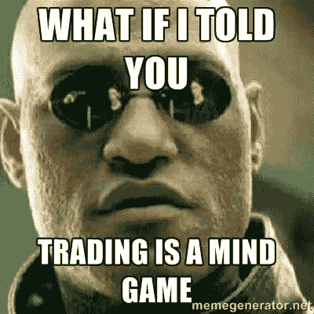

# MBA 毕业后做什么——MBA 金融毕业后的顶级课程

> 原文：<https://blog.quantinsti.com/short-term-courses-mba-finance/>

商业世界是一个激烈竞争的领域。MBA 金融学位有助于培养在许多情况下都可以使用的技能。与 10 年前相比，这是一个巨大的转变，金融职位与科技行业或其他领域的职位一样吃香。金融领域的 MBA 毕业生正在证明，作为许多不同行业的领导者，他们可以有所作为。然而，许多人仍对 MBA 毕业后做什么来提升职业生涯存有疑问。这就是为什么这篇文章列出了 MBA 金融之后学生可以选修的顶级课程。

任何列表都包含一定程度的主观性，因此永远不会完美。尽管如此，我们必须尝试创建一个列表。毕竟，一份清单以最简单的方式帮助我们知道为什么我们决定采取某个行动。

这份清单是一系列的技术技能和实际专业知识，它们在 MBA 课程中没有完全涵盖。MBA 金融课程之后的这些课程肯定会增加你的学习

*   **公司秘书**:参与制定公司政策、维护法律记录、处理公共事务、管理并购相关活动。主要是管理层和董事会之间的调解人。如果你在印度，你可以做兼职，并且可以在一年中的任何时间注册。[点击这里](https://www.icsi.edu/WebModules/AboutUs/Courses/CS_Course_01042014.htm)开始做公司秘书。
*   精算师:作为一名精算师，你的工作是评估风险和不确定性的财务影响。精算师评估金融安全系统，密切关注它们的复杂性、其中涉及的数学以及它们的机制。[点击这里](http://www.actuariesindia.org/admission.aspx)了解如何开始。
*   [**算法交易中的执行程序**](https://www.quantinsti.com/epat/) :尖端工具已经成为交易行业的趋势。想在金融机构有一份利润丰厚的职业，并且比其他知道算法交易的申请者更有优势，这是必须的。你可以成为算法风险分析师、量化分析师、量化算法开发者或市场风险分析师。来自孟买的 [QuantInsti](https://www.quantinsti.com/) 提供了一个关于算法交易的综合在线课程，你可以点击[这里](https://www.quantinsti.com/epat/)查看。此外，QuantInsti 还通过其学习门户[Quantra](https://quantra.quantinsti.com/)提供短期自定进度在线课程。课程充满了许多互动练习，轻松涵盖复杂的概念，查看课程[此处](https://quantra.quantinsti.com/courses)
*   特许金融分析师:在金融服务领域，CFA 特许持有人是为数不多的让 MBA 金融课程物有所值的课程之一。CFA 特许持有人是任何组织中最有价值的人之一。你因为有分析输入支持的见解而受人尊敬。[点击此处](https://www.cfainstitute.org/programs/cfaprogram/courseofstudy/Pages/index.aspx)了解更多信息。
*   [**量化金融**](http://www.cqf.com/) 证书:一个严谨而实用的认证承诺培训人们，帮助他们在衍生品、量化 IT、量化交易、风险管理或保险领域找到工作。我们已经写了一整篇博文，讲述如何成为一名量化分析师，即使你认为现在开始为时已晚。看看我们的博客，[我能在 40 多岁的时候成为一名定量分析师吗？](https://blog.quantinsti.com/can-i-be-a-quant-trader-in-my-40s/)’。如果你好奇的话，这里有一篇关于[的博客文章,“定量分析师的实际工资是多少?”？看了这篇博客，你会感到困惑。](https://blog.quantinsti.com/salary-quants-really-earn/)
*   **国际金融理财师:**要想从事财富管理工作，本课程将为你提供个人理财各方面的深入培训，如税务规划、保险规划、遗产规划等。在印度这样一个金融教育正在兴起的国家，对 CFP 的需求也会更高。
*   **特许另类投资分析师:**CAIA 特许认证是另类投资教育的最高成就标准，提供广泛的知识、专业技能和另类投资的全球信誉。虽然 CFA 和 CAIA 听起来非常相似，但事实上它们确实有一些相似之处，比如需要努力学习和高昂的考试费用。然而，这两者也有一些不同之处，你可以查看[这个链接](http://www.investopedia.com/articles/professionals/110315/caia-vs-cfa-how-are-they-different.asp)了解更多关于不同之处的信息。
*   **金融风险经理:**这一称号是全球最受尊敬和最广泛认可的金融风险管理认证。该考试是全球公认的衡量金融风险管理人员技能和知识的标准。如果你选择成为一名金融风险经理，那么你将被期望管理伴随着任何投资的风险，并希望拓宽他们的知识。[点击这里](http://www.garp.org/#!/frm/program-exams)开始。

## 以下是 MBA 课程中没有教授的其他内容的简要列表

1.  现实是不同的:再多关于有效定价的学术理论也不会让你为这份工作做好充分准备，找到“最优”价格真的很难。与此同时，记住次优价格要好得多。
2.  总有比看上去更多的东西:在营销上花钱的方式是无限的。广泛试验，廉价吸取教训。与此相关的一点是，再多的 MBA 市场营销课程也不会让你为有一天你不得不为完成销售而制造线索做好准备。事实证明，市场营销不仅仅是产品特征矩阵和你的标志的蓝色色调。
3.  **招聘的关键？:**招到最好的人，公平的薪酬，还有股权？没错，但他们没有告诉你的是，公司文化和对你的愿景表现出的热情同样重要。(哦，你的眼光应该放在通往真理、正义和整体善的更大道路上)。你的视野不应该包括伤害小猫。他们很可爱。当你开始创业时，这变得更加重要。
4.  把大学的理论留在大学里:先进的博弈论格外有用。基本的博弈论是危险的——因为它假设你在和一群理性的“玩家”打交道。这就像试图设计一辆真正的汽车，它将在理论上无摩擦的表面上行驶，没有空气阻力，路上也没有白痴。
5.  **工商管理硕士？** **:** 做生意应该是 MBA 最重要的课程，这是它教不了你的。如果你想成为一名企业家，MBA 绝对不是必须的。几年的实践经验会教会你比书呆子气多得多的东西。
6.  **沟通！大学里确实会教你这些，但那只是企业沟通，但日常沟通和自信行为是不同的，在你的工作中同样需要，如果掌握了，也会带你走向巅峰，但这在商学院里是学不到的。**
7.  编程和技术技能:MBA 不教技术技能。有很多理论和模型，还有更多理论。但是从技术上讲，没有教授如何实现理论知识。曾经有一段时间，金融领域的专业人士不需要具备编程技能，但现在许多公司要求分析师等职位必须具备编程技能。不要担心，我们已经为你准备好了，你可以报名参加我们的“Python for Trading”课程，该课程会教你 Python(一种开源的、广泛使用的编程语言)，专门针对金融应用。下面是课程[环节](https://quantra.quantinsti.com/course/python-for-trading)。

尽管你可能在技术上是健全的，并且在 MBA 期间学到了不少原则，但如果你不得不进入定量分析或定量策略师等技能领域，你肯定需要比 MBA 更多的东西。[量化策略](https://quantra.quantinsti.com/course/quantitative-trading-strategies-models)已经从后台办公箱演变成主流的复杂工具。为了利用商业中最好的头脑和最快的计算机，利用低效率，利用杠杆进行市场押注。为了实现这一目标，你必须用实际的技术经验和指导来武装自己。

## **下一步**

了解一个有抱负的金融背景的算法交易者是如何在算法交易领域保住自己的职业生涯的。案例研究算法交易如何为金融&科技毕业生增加价值？带你了解 Rohit Gupta 的旅程，以及[算法交易(EPAT)高管课程](https://www.quantinsti.com/epat/)如何帮助他塑造职业生涯。