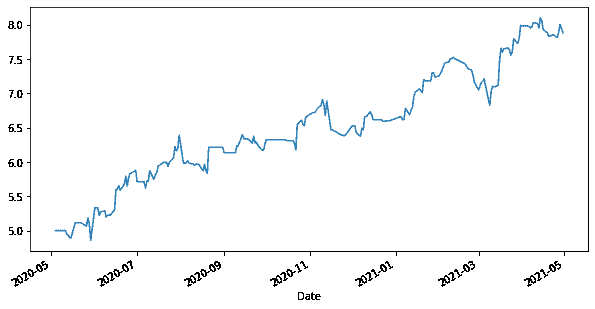
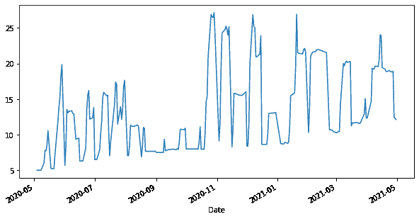

# 巴西股票市场的统计套利配对交易

> 原文：<https://blog.quantinsti.com/statistical-arbitrage-pair-trading-brazil-stock-market-project-luiz-guedes/>

这个项目为巴西的 B3(前 Bovespa)证券交易所建立了一个统计套利对交易策略模型。我们在两个不同的时间间隔运行我们的策略。2009 年 1 月 1 日至 2014 年 12 月 31 日以及 2018 年 1 月 1 日至 2021 年 4 月 30 日。由于我们只有当前的部门分布可用，前一时期的结果明显遭受生存偏差。

股票部门分类是直接从巴西 B3 证券交易所下载的。

在所有行业中，我们只考虑了拥有五只或更多股票的行业，即:
*石油、金属、钢铁、纸张、运输材料、机械、铁路、公路、仓储、服务、农业、肉类、食品、建筑、纺织品、服装、鞋类、教育、汽车租赁、零售、医院、药店、it、电信、电力、水、银行、金融服务、保险、房地产。*

结果非常令人鼓舞，尽管它没有考虑交易费或滑点成本。所有计算都基于每日收盘价。

这个项目的完整 python 代码也可以在文章末尾以可下载的格式获得。

本文是作者提交的最后一个项目，作为他在 QuantInsti 的算法交易管理课程( [EPAT](https://www.quantinsti.com/epat) )的一部分。请务必查看我们的[项目页面](/tag/epat-trading-projects/)，看看我们的学生正在构建什么。

* * *

## **关于作者**


【Luiz Guedes 博士在其软件开发职业生涯中拥有超过 30 年的经验，尤其是在支付卡行业。此外，他还是 IME 军事学院的教员，教授编译器和编程语言。

作为一名软件开发人员和创新者，Guedes 博士广泛使用创新的问题解决方法为受限系统和安全电子交易编写软件，尤其是在编程和执行环境、加密算法和安全通信协议的开发方面。

最近，他将注意力集中在将数据科学方法应用于量化交易上。他还拥有 6 门外语的优秀表达能力。

Guedes 博士拥有 PUC/里约热内卢天主教大学计算机科学博士学位、IME 计算机系统硕士学位和计算机工程师学位。此外，他还获得了 FGV getu lio Vargas 基金会的工商管理硕士学位。

* * *

## 介绍

这个项目旨在为巴西 B3(前圣保罗证交所)股票市场建立一个统计套利对交易策略模型。我们在两个不同的时间间隔运行我们的策略。

*   从 2009 年 1 月 1 日至 2014 年 12 月 31 日，以及
*   从 2018 年 1 月 1 日至 2021 年 4 月 30 日。

由于我们只有当前的部门分布可用，前一时期的结果明显遭受生存偏差。

股票板块分类从【B32021】下载。在所有行业中，我们只考虑了拥有五只或更多股票的行业，即:

石油、金属、钢铁、纸张、运输材料、机器、铁路、高速公路、仓储、服务、农业、肉类、食品、建筑、纺织品、服装、鞋子、教育、汽车租赁、零售、医院、药店、it、电信、电力、水、银行、金融服务、保险、房地产

这些板块上市的所有股票的历史数据都来自雅虎财经。

* * *

## 使用的数据

在每个行业中，我们使用 Johansen 测试选择显著性水平大于 90%的股票对，以获得它们的套期保值关系[Chan，2013]。

从协整对中，我们只保留那些利差没有转换符号并且半衰期不超过 60 天的。这些过滤器减少了我们可用的[股票市场数据](/stock-market-data-analysis-python/)，如表 1 所示。

| **#扇区 x #对** | 2009 年 1 月 1 日至 2014 年 12 月 31 日
 | **2018 年 1 月 1 日至
2021 年 4 月 30 日** |
| 所有(大于 5 的扇区) | 10 x 750 | 15 x 1098 |
| 协整(显著大于 90%) | 10 x 393 | 15 x 442 |
| 常数符号 | 10 x 333 | 14 x 361 |
| 半衰期< = 60 年 | 4 x 89 | 12 x 140 |

表 1:扇区数量 x 可用对数

另一个我们只能应用最近数据的考虑因素是可以卖空的股票。巴西股票市场的流动性不如我们所需要的那样高，我们需要确保总是有可能购买一对股票(做多一只股票，做空另一只)。

因此，我们也运行我们对当前前 100 只股票的策略。这些股票按名为 IBrX100 [B32021a]的指数上市。表 2 示出了在应用上述过滤器之后属于当前前 100 个的扇区和对的数量。

| **#扇区 x #对** | **全部** | **前 100 名** |
| 所有(大于 5 的扇区) | 15 x 1098 | 5 x 81 |
| 协整(显著大于 90%) | 15 x 442 | 5 x 21 |
| 常数符号 | 14 x 361 | 4 x 18 |
| 半衰期< = 60 年 | 12 x 140 | 3 x 5 |

表 2:2017 年 1 月 1 日至 2021 年 4 月 30 日期间的#部门 x #对可用性

* * *

## 交易策略

由于生成的成对价差应该是均值回复，我们建立了一个布林线指标策略，其长度对应于每对半衰期和一个标准差宽度。

当价差穿过上波段时，我们建立一个空头头寸，当价差穿过下波段时，我们建立一个多头头寸。当价差穿过移动平均线时，我们平仓任何未平仓的头寸，如果有的话。

我们还定期运行扩展的 Dickey-Fuller (ADF)测试，以检查利差是否仍在均值回复。由于 ADF 测试是一项长期测试，因此每天运行它是没有意义的。

因此，我们进行了网格搜索，以便找到运行测试的最佳频率和最佳长度。网格检查每月运行测试一次、两次或三次，时间长度为 6、12、18 和 24 个月。

表 3 总结了网格搜索找到的最佳超参数。

| **周期** | 每月**次** | **以月为单位的长度** |
| 2009 年 1 月 1 日至 2014 年 12 月 31 日 | one | Twenty-four |
| 2018 年 1 月 1 日至 2021 年 4 月 30 日(全部) | one | Twelve |
| 2018 年 1 月 1 日至 2021 年 4 月 30 日(前 100 名) | Two | Twelve |

表 3:最佳 ADF 检查频率和长度

* * *

## 结果

对于每种情况，最后一年的数据作为测试集，用剩余的数据训练策略。在各自的测试集上测试每个训练集上的前 10 名表演者。

考虑杠杆系数 1、2 和 3 收集的结果分别显示在表 4、5 和 6 中。表 4 只显示了五对，因为正如我们在表 2 中看到的，在那个场景中只剩下五对。

```py
2020-05-01 to 2021-05-01 - Top 100:
leverage = 1

Pair                      	CAGR 	Hit Ratio  Avg Profit/Loss  Rets StdDev  Max Draw-down
('ARZZ3.SA', 'HGTX3.SA')  	1.23     	2.60     	2.33     	0.37    	-11.07%
('JHSF3.SA', 'MRVE3.SA')  	0.72     	4.33     	0.80     	0.19    	-19.31%
('CMIG4.SA', 'CPFE3.SA')  	0.58     	3.00     	1.46     	0.20     	-4.43%
('CPFE3.SA', 'ENBR3.SA')  	0.36     	2.00     	1.44     	0.13     	-5.43%
('ENBR3.SA', 'TRPL4.SA')  	0.10     	1.00     	1.35         0.08    	-22.27%

leverage = 2

Pair                      	CAGR 	Hit Ratio  Avg Profit/Loss  Rets StdDev  Max Draw-down
('ARZZ3.SA', 'HGTX3.SA')  	3.52     	2.60     	2.33     	1.05    	-21.49%
('JHSF3.SA', 'MRVE3.SA')  	1.63     	4.33     	0.80     	0.45    	-38.62%
('CMIG4.SA', 'CPFE3.SA')  	1.39     	3.00     	1.46     	0.51     	-8.86%
('CPFE3.SA', 'ENBR3.SA')  	0.80     	2.00     	1.44     	0.29    	-10.86%
('ENBR3.SA', 'TRPL4.SA')  	0.12     	1.00     	1.35     	0.17    	-40.94%

leverage = 3

Pair                      	CAGR 	Hit Ratio  Avg Profit/Loss  Rets StdDev  Max Draw-down
('ARZZ3.SA', 'HGTX3.SA')  	7.44     	2.60     	2.33     	2.22    	-31.26%
('CMIG4.SA', 'CPFE3.SA')  	2.49     	3.00     	1.46     	0.93    	-13.29%
('JHSF3.SA', 'MRVE3.SA')  	2.43     	4.33     	0.80     	0.78    	-57.93%
('CPFE3.SA', 'ENBR3.SA')  	1.31     	2.00     	1.44     	0.46    	-16.35%
('ENBR3.SA', 'TRPL4.SA')  	0.06     	1.00     	1.35     	0.27    	-56.35%

```

表 4: 2020 年 5 月 1 日至 2021 年 5 月 1 日-前 100 个结果

```py
2020-05-01 to 2021-05-01 - Top All:

leverage = 1

Pair                     	 CAGR     Hit Ratio  Avg Profit/Loss  Rets StdDev  Max Draw-down
('AFLT3.SA', 'CPLE3.SA') 	10.13     	6.60     	1.11     	3.00    	-17.51%
('MRVE3.SA', 'RDNI3.SA')  	3.42     	8.50     	0.87     	1.36    	-17.39%
('IGTA3.SA', 'SCAR3.SA')  	2.44     	4.00     	1.18     	0.86    	-17.97%
('BRSR3.SA', 'ITSA4.SA')  	2.38     	2.57     	1.16     	0.89    	-46.01%
('GEPA4.SA', 'TRPL4.SA')  	1.61     	3.33     	1.18     	0.42 	   -15.79%
('CRDE3.SA', 'RDNI3.SA')  	1.39     	5.33     	0.79     	0.40    	-25.13%
('BRIV4.SA', 'PINE4.SA')  	1.09     	4.00     	0.83     	0.21    	-14.84%
('ARZZ3.SA', 'HGTX3.SA')  	1.03     	2.75     	1.99   	  0.31        -11.07%
('ARZZ3.SA', 'CGRA4.SA')  	0.94     	3.00     	2.85     	0.25     	-5.75%
('ARZZ3.SA', 'GUAR3.SA')      0.87     	3.25     	2.18     	0.26     	-3.99%

leverage = 2

Pair                      	CAGR 	Hit Ratio  Avg Profit/Loss  Rets StdDev  Max Draw-down
('AFLT3.SA', 'CPLE3.SA') 	64.45     	5.67     	1.27    	21.62    	-35.03%
('IGTA3.SA', 'SCAR3.SA')  	7.17     	3.00     	1.49     	2.78    	-35.94%
('BRSR3.SA', 'ITSA4.SA')  	6.72     	2.57     	1.17     	2.23    	-75.99%
('BMIN4.SA', 'PINE4.SA')  	6.03     	6.00     	1.82     	2.28    	-22.28%
('GEPA4.SA', 'TRPL4.SA')  	4.95     	3.33     	1.18     	1.35    	-30.35%
('BMIN4.SA', 'BRSR3.SA')  	4.64     	5.00     	1.97     	1.82    	-22.34%
('BRIV4.SA', 'PINE4.SA')  	2.87     	6.00     	0.57         0.54    	-29.68%
('ARZZ3.SA', 'HGTX3.SA')  	2.77     	2.75     	1.99     	0.82    	-21.49%
('ARZZ3.SA', 'CGRA4.SA')  	2.54     	3.00     	2.85     	0.62    	-11.39%
('ARZZ3.SA', 'GUAR3.SA')  	2.29     	3.25	     2.18     	0.66     	-7.99%

leverage = 3

Pair                      	CAGR 	Hit Ratio  Avg Profit/Loss  Rets StdDev  Max Draw-down
('AFLT3.SA', 'CPLE3.SA')	237.23     	5.67     	1.27    	87.74    	-52.54%
('BMIN4.SA', 'PINE4.SA') 	18.06     	4.33     	3.47     	6.77    	-24.71%
('IGTA3.SA', 'SCAR3.SA') 	13.80     	3.00     	1.49     	5.87    	-53.91%
('BMIN4.SA', 'BRSR3.SA') 	12.91     	3.67     	3.70     	4.94 	   -24.63%
('BRSR3.SA', 'ITSA4.SA') 	11.49     	2.57     	1.32     	3.52    	-90.64%
('ARZZ3.SA', 'HGTX3.SA')  	5.50     	2.75     	1.99     	1.58    	-31.26%
('ARZZ3.SA', 'CGRA4.SA')  	5.10     	3.00     	2.85   	  1.16        -16.91%
('ARZZ3.SA', 'GUAR3.SA')  	4.47     	3.25     	2.18     	1.25    	-11.98%
('BRIV4.SA', 'PINE4.SA')  	4.06     	4.60     	0.63     	0.76    	-44.52%
('CPFE3.SA', 'ENBR3.SA')  	1.53     	4.50     	0.84     	0.56    	-19.35%

```

表 5: 2020 年 5 月 1 日至 2021 年 5 月 1 日-所有结果排名

```py
2014-01-01 to 2015-01-01

leverage = 1

Pair                      	CAGR 	Hit Ratio  Avg Profit/Loss  Rets StdDev  Max Draw-down
('CBEE3.SA', 'EKTR4.SA')  	5.18    	15.00     	4.50     	1.36     	-2.94%
('BAZA3.SA', 'BNBR3.SA')  	4.62     	6.00     	1.58     	1.62    	-12.25%
('BAZA3.SA', 'BMIN4.SA')  	4.11     	8.50     	1.09     	0.99    	-17.30%
('CTSA4.SA', 'TXRX4.SA')  	2.39     	2.50     	1.54     	0.69    	-45.70%
('BRSR3.SA', 'ITSA4.SA')  	1.13     	5.00     	5.19     	0.37     	-1.61%
('CPFE3.SA', 'CSRN3.SA')  	0.90     	5.50     	8.44     	0.26   	  -1.15%
('BMEB4.SA', 'ITSA4.SA')  	0.46     	1.40     	2.10     	0.17    	-12.08%
('BAZA3.SA', 'BGIP4.SA')  	0.40     	3.14     	0.83     	0.19    	-10.02%
('BMIN4.SA', 'SANB4.SA')  	0.36     	6.00     	0.58     	0.14    	-13.62%
('BMIN4.SA', 'RPAD3.SA')  	0.32     	5.00     	0.69     	0.13    	-12.59%

leverage = 2

Pair                      	CAGR 	Hit Ratio  Avg Profit/Loss  Rets StdDev  Max Draw-down
('CBEE3.SA', 'EKTR4.SA') 	26.89        15.00     	4.50     	6.53     	-5.88%
('BAZA3.SA', 'BNBR3.SA') 	22.42     	6.00     	1.58     	8.77    	-24.50%
('BAZA3.SA', 'BMIN4.SA') 	18.14     	8.50     	1.09     	4.46    	-34.60%
('BRSR3.SA', 'ITSA4.SA')  	3.19     	5.00     	5.19     	0.96     	-3.22%
('CPFE3.SA', 'CSRN3.SA')  	2.41     	5.50     	8.44     	0.69     	-2.30%
('BMEB4.SA', 'ITSA4.SA')  	0.96     	1.40     	2.10     	0.35    	-23.63%
('BAZA3.SA', 'BGIP4.SA')  	0.88     	3.14     	0.83     	0.41    	-20.04%
('BMIN4.SA', 'SANB4.SA')  	0.73     	6.00     	0.58     	0.27    	-27.25%
('BMIN4.SA', 'RPAD3.SA')  	0.65     	5.00     	0.69     	0.26   	 -25.18%
('CEPE3.SA', 'LIPR3.SA')  	0.04      	inf      	inf     	0.00      	0.00%

leverage = 3

Pair                      	CAGR 	Hit Ratio  Avg Profit/Loss  Rets StdDev  Max Draw-down
('CBEE3.SA', 'EKTR4.SA')	101.08    	15.00         4.50    	23.10     	-8.82%
('BAZA3.SA', 'BNBR3.SA') 	76.64     	6.00     	1.58    	34.36    	-36.75%
('BAZA3.SA', 'BMIN4.SA') 	63.20     	8.50     	1.70    	15.45    	-26.56%
('BRSR3.SA', 'ITSA4.SA')  	6.94         3.00     	6.94     	1.50     	-4.83%
('BMEB4.SA', 'ITSA4.SA')  	1.44     	1.40     	2.10     	0.54    	-34.64%
('BAZA3.SA', 'BGIP4.SA')  	1.42     	3.14     	0.83     	0.65    	-30.06%
('BMIN4.SA', 'SANB4.SA')      0.54     	4.00     	0.72     	0.18    	-33.68%
('BMIN4.SA', 'RPAD3.SA')  	0.52     	3.00     	1.03     	0.18    	-27.88%
('BMEB4.SA', 'BRSR3.SA')  	0.48     	2.50     	0.92     	0.17    	-27.01%
('CEPE3.SA', 'LIPR3.SA')  	0.08      	inf      	inf     	0.01      	0.00%

```

表 6: 2014 年 1 月 1 日至 2015 年 1 月 1 日的结果

考虑到属于前 100 名名单的股票的最近情况，整个投资组合的结果总结在表 7 中

| **杠杆** | **返回** | **CAGR** | **标准发展** | **最大压降** |
| 1 | 58% | 60% | 2% | -9% |
| 2 | 142% | 149% | 22% | -71% |
| 3 | 259% | 272% | 41% | -87% |

表 7: 2020 年 5 月 1 日至 2021 年 5 月 1 日 100 大投资组合结果

对于每一个杠杆水平，我们可以在图 1、2 和 3 中看到每一对的单位金额的 MTM 权益曲线。对于所有三个杠杆，投资组合初始金额为 5.0，因为有五对。

**投资组合收益率:0.58 CAGR: 0.60 标准差:0.02 最大下降:-0.09**



Figure 1: 2020-05-01 to 2021-05-01 - Top 100 Portfolio Equity Curve – Leverage 1


**投资组合收益率:1.42 CAGR: 1.49 标准差:0.22 最大下降:-0.7**



Figure 2: 2020-05-01 to 2021-05-01 - Top 100 Portfolio Equity Curve – Leverage 2


投资组合收益率:2.59 CAGR: 2.72 标准偏差:0.41 最大下降:-0.87


Figure 3: 2020-05-01 to 2021-05-01 - Top 100 Portfolio Equity Curve – Leverage 3


* * *

## 参考

*   Chan 2013–Chan，Ernie。“算法交易”，威利贸易，威利，2013 年
*   b 32021-B3，∞部门，源自〔t0〕http://www . B3 . com . br/pt _ br/products-e-services/negotiatao/revenue-variable/acos/consultation/classifo-sectorial/2021 年 5 月 27 日
*   b 32021 a–B3，“巴西指数 100 (IBrX 100 B3)”，摘自[2021 年 5 月 27 日 http://www . B3 . com . br/pt _ br/market-data-e-indexes/indexes/indexes-amplos/indice-Brasil-100-IBrX-100-composicao-da-carte IRA . htm](http://www.b3.com.br/pt_br/market-data-e-indices/indices/indices-amplos/indice-brasil-100-ibrx-100-composicao-da-carteira.htm)。

* * *

## 结论

在这个项目中，我们模拟了一个[对交易](/pairs-trading-basics/)策略，特别是巴西 B3(前 Bovespa)股票市场交易所的统计套利对交易策略。我们在两个不同的时间间隔运行我们的策略。2009 年 1 月 1 日至 2014 年 12 月 31 日以及 2018 年 1 月 1 日至 2021 年 4 月 30 日。

为了运行我们的策略，我们考虑了拥有 5 只或更多股票的所有部门。由于我们现在只有行业股票分类，前一个时期固有地遭受生存偏差。

对于最近一段时间，我们还考虑了卖空股票可能缺乏流动性，因此只对属于前 100 名股票指数 IBrX100 的股票进行了单独测试。

在所有场景中，我们使用去年的数据作为测试集，剩余的数据作为训练集。

结果非常好，从杠杆率为 3 的 272% CAGR 到杠杆率为 1 的更现实的 60% CAGR。

获得的结果没有考虑交易费用或滑点成本。所有计算都基于每日收盘价。

这个项目表明[量化交易策略](https://quantra.quantinsti.com/course/quantitative-trading-strategies-models)在巴西股票市场可以非常多产和有利可图，主要是因为潜在的[统计套利](https://quantra.quantinsti.com/course/statistical-arbitrage-trading)目标市场低效似乎还没有被大多数交易者解决。

* * *

**下载中的文件:**

*   统计套利-巴西股票市场的配对交易-最终 Python 笔记本

* * *

免责声明:就我们学生所知，本项目中的信息是真实和完整的。学生或 QuantInsti 不保证提供所有推荐。学生和 QuantInsti 否认与这些信息的使用有关的任何责任。本项目中提供的所有内容仅供参考，我们不保证通过使用该指南您将获得一定的利润。