# 随机振子:类型、计算和应用

> 原文：<https://blog.quantinsti.com/stochastic-oscillator/>

以[重香重香](https://www.linkedin.com/in/rekhit/)

随机振荡器是一种动量指标，它将资产的最近收盘价与特定时期的价格范围进行比较。虽然随机指标应该和另一个技术指标 RSI 相似，但我们会在文章后面看到这两个指标的不同之处。

我们将试图理解和计算不同类型的随机振荡器。我们也将看到它们如何被用来加强你的交易技巧，帮助你创造一个强大的策略。此外，我们将看看随机 RSI 振荡器如何帮助克服随机振荡器的某些限制

我们将在本文中讨论以下主题:

*   [为什么要用随机振荡器？](#why)
*   [随机振荡器指标策略](#strategies)
*   [什么是快或慢随机振荡器？](#types)
*   [随机振荡器的局限性](#limitation)
*   [随机 RSI](#stochrsi)
*   [ATR 定义和计算](#atr)
*   [ATR 和随机振荡器](#atrstoch)
*   [ATR 指标的局限性](#atrlimit)

## 为什么要用随机振荡器？

用帮助创建随机振荡器的乔治·莱恩博士的话说，它是一个不跟随价格或交易量的指标，而是表示价格的速度或动量。通过这种方式，它帮助我们预测价格方向的变化。

因此，随机振荡指标已经成为交易者识别市场看涨或看跌趋势的一个众所周知的指标。

现在我们将借助一个例子来理解如何绘制随机振荡器。

### 理解随机振荡器的例子

随机振荡器由两条线组成，%K 和% D。

[故事发生在 20 世纪 50 年代，当乔治·莱恩和他的同事们试图手工绘制不同的振荡器时，由于数值的范围，他们会用完图表纸。因此，他们试图用百分比来表示它们。](https://cmtassociation.org/kb/origins-of-the-stochastic-oscillator-article/)

经过反复试验，每个公式都用一个字母表示，他们最终设法创建了一个稳定的%K 指标。

我们现在将更详细地研究%K。

计算%K 的公式

%K 可以表示为，

## 计算随机振荡器-实时市场示例

可接受的范围通常是 14 天。我们将使用 17 年 4 月至 5 月的 Apple 股票信息来计算%K。

因此，该表如下所示，

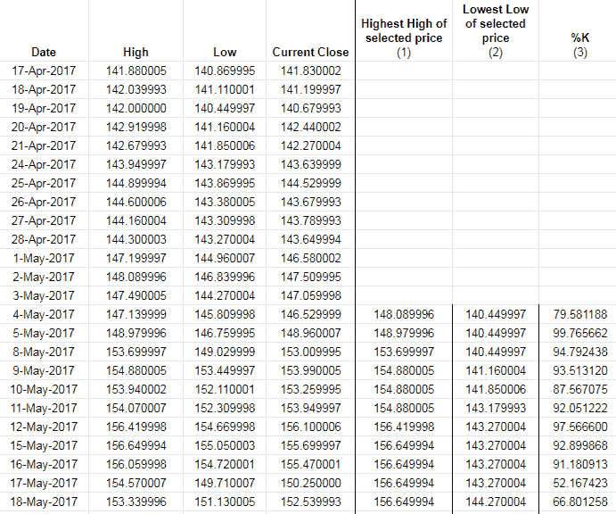

**解释市场实例**

为了解释这一点，让我们以日期为 2017 年 5 月 4 日的行的%K 为例。

1.  为了选择所选价格(1)的最高价，我们检查从 4 月 17 日到 5 月 4 日的“高”列，即 148.089996
2.  对于所选价格(2)的最低下限，值为 140.449997
3.  要计算%K，公式为:

<u>[(当前收盘价)-(选定范围内的最低最低价)]</u>* 100
[选定范围内的最高价]-(选定范围内的最低最低价)]

=[146.529999-140.449997]/[148.089996-140.449997]* 100
=(6.080002/7.639999)* 100
= 0.7958118 * 100
**= 79.58118%**

类似地，我们也填写其余的字段。

4.%D 只是%K 的三天简单移动平均线(SMA)。

因此，该表将被更新如下，

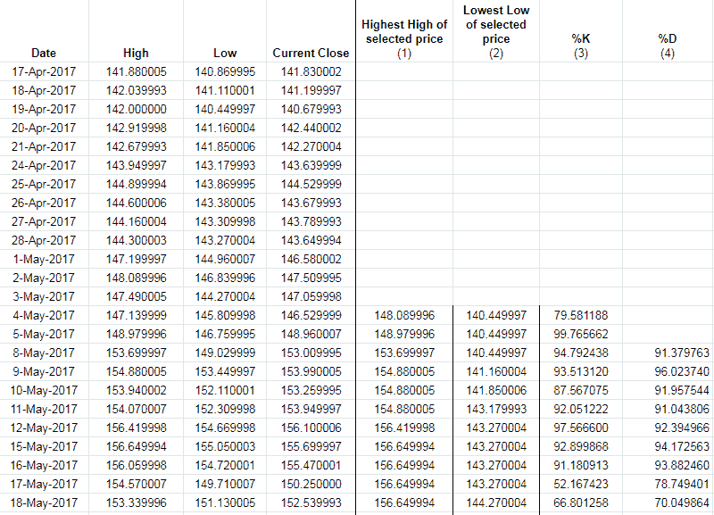

## 使用随机振荡器的结果图

随机振荡器相对于收盘价的图形如下所示:

## 随机振荡器指标策略

随机振荡指标的使用方式如下:

### 超买和超卖信号

随机振荡指标通常用于生成超买或超卖信号。在这方面%K 和%D 都起着至关重要的作用。

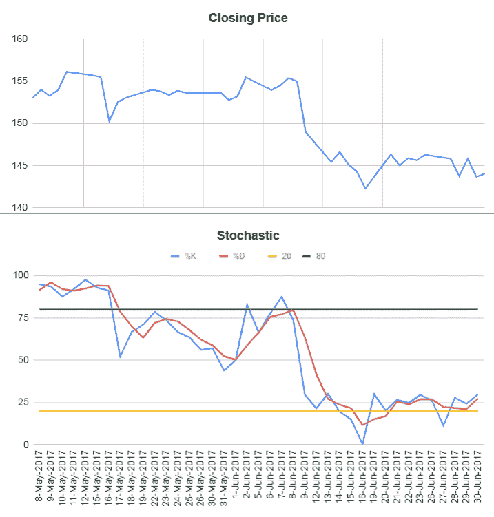

你可以在上面的图像中看到%K 和%D 线触及超买水平，在 6 月 9 日，它们开始向下，价格紧随其后。

### 背离指标(多头和空头)

我们在之前的指标系列中已经看到了这种策略，随机振荡器也可以用来检测市场的波动，或者更确切地说，是市场趋势的变化。

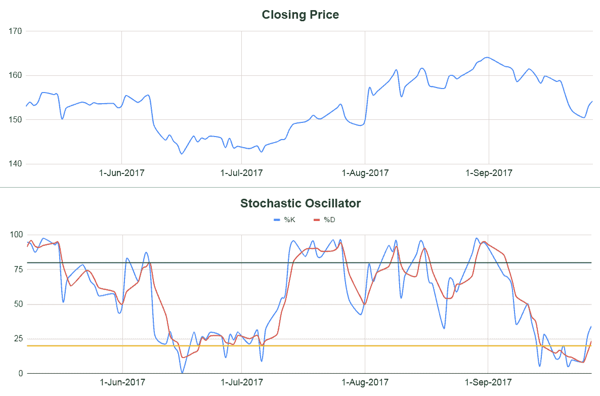

在上图中，你可以看到在 8 月的最后一周，随机振荡指标开始下降，随后，价格从 9 月 1 日开始下降，除非出现短暂的上升趋势，否则一直下降到 9 月底。

### 交叉策略

该策略中有两种类型的信号:

1.  在超买区，k 线在%D 线下方交叉，表示卖出信号
2.  在超卖区域，k 线在 D 线上方交叉，表示买入信号

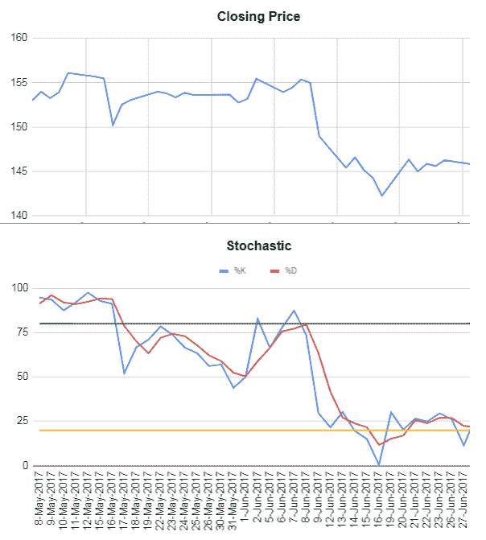

**下跌趋势:**你可以看到，在上图中，5 月 15 日%K 线开始下跌，并在超买区域穿越%D 线，构成卖出信号。后面可以明显看到下跌趋势。

**价格上涨:**另外，6 月 19 日%K 线开始上涨，并在超卖区穿过%D 线，构成买入信号。后面可以明显看到涨价。

这是一些可以在随机指标的帮助下使用的策略。虽然随机振荡器是识别超买或超卖水平的良好指标，但市场发现让读数更有意义是偶然的或草率的。于是，另一种类型的随机振荡器诞生了。我们将在下一节讨论这个问题。

## 什么是快速随机振荡器？什么是慢随机振荡器？

我们之所以用两条线，是因为我们可以用两条线的交叉作为信号，更确切的说%D 线可以称为信号线。

为了强调%D 线的重要性，随机振荡器被修改成两种类型:

1.  快速随机振荡器，以及
2.  慢速随机振荡器

### 计算快速随机振荡器

我们计算的指标被认为是**快速随机振荡器**。

### 计算慢随机振荡器

为了计算慢速随机指标，我们找到了%K 的 3 天均线(本质上和之前的%D 一样)。

%D 变成了新的慢速随机振荡指标的 3 日均线。

这在另一种形式上帮助了我们，因为最初的随机振荡指标被认为是非常不稳定的，因此慢速随机振荡指标起到了平滑波动的作用。

### 计算全随机振荡器

另一个版本，称为完全随机，是当我们在计算完全随机振荡器时修改%K 的周期以及要考虑的天数时的类型。让我们考虑计算完全随机振荡器的%K 的时间周期为 10，而%D 是完全%K 的 5 天 SMA。

### 比较快速、慢速和完全随机振荡器

因此，三种类型的随机振荡器如下:

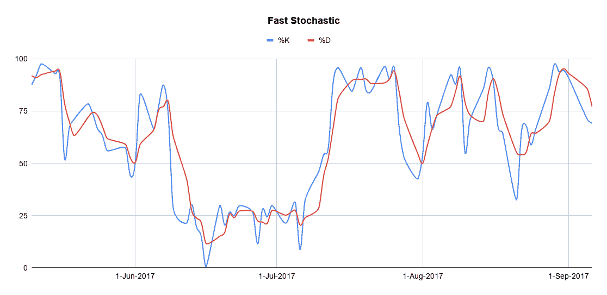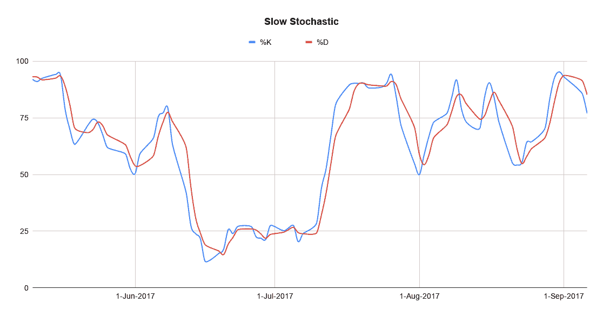T2】

## 随机振荡指标和 RSI 指标的区别

相对强弱指数(RSI)指标和随机振荡指标都是动量振荡指标，都是用来衡量价格运动的动量，但它们有本质的不同。

当 RSI 被用来检测市场趋势的速度时，随机振荡器是建立在收盘价应该与总趋势的方向一致的前提下的。

有趣的是，尽管存在差异，但人们发现将它们结合在一起实际上是有意义的，因此,**随机 RSI (stochRSI)指标**诞生了。我们将在下一节讨论这一点。

## 随机振子的极限

和其他指标一样，随机振荡指标也有假信号的问题。

随机振荡器通常用于价格有规律波动的市场，因此，如果价格处于长期趋势位置，它会给出错误的信号。

在随机震荡器教程的前一部分，我们介绍了不同类型的随机震荡器，并基于它们学习了一些基本策略。但是，我们没有涵盖一个可以称为两个指标组合的[指标](/indicators-build-trend-following-strategy/)，这就是随机 RSI 指标。除此之外，我们还将介绍另一个指标，ATR 指标，并学习如何将它与其他一些流行的指标一起使用。

## 随机 RSI

随机 RSI 的创造者 Chande 和 Kroll 表示，就其本身而言， [RSI 指标](/rsi-indicator/)通常会停留在 80 和 20 的“超买”和“超卖”水平之间，因此不会产生很多买入或卖出信号。

因此，他们建议通过首先计算 RSI 值，然后对其应用随机振荡器公式来创建一个指标的指标。

### 随机 RSI 是如何工作的？

1.  计算 14 天期间的 RSI 值。
2.  然后找出最高 RSI 值和最低低 RSI 值
3.  使用修改的随机振荡器公式 ie

为了使用与随机指标相同的数据，表格如下:

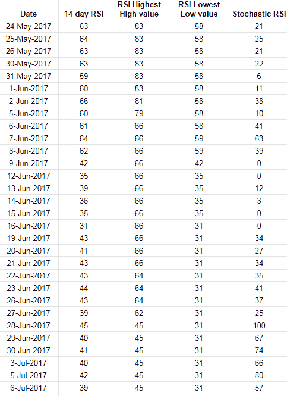

假设在 14 天的时间内(5 月 24 日-6 月 13 日)，随机 RSI 值的计算如下:

= (39 - 35)/(66 -35) * 100 = (4/31)* 100 = 12.

如果你画出相对强弱指数和随机相对强弱指数的图表，结果如下:

正如你所看到的，随机 RSI 指标比普通 RSI 指标给出更多的信号。由于随机 RSI 的敏感性，它可以用来识别短期趋势，因此，短期交易者可以从这个指标中受益。

## 随机 RSI 的局限性

虽然随机 RSI 是为了提高指标的灵敏度而开发的，但它使指标很快从超买跳到超卖，反之亦然，从而在交易者中产生混乱。

随机 RSI 的另一个缺点是，作为一个指标的指标，它离价格只有两步之遥，因此，它可能与当前市场价格不同步。

随机 RSI 相对于收盘价的曲线如下所示，以供参考。

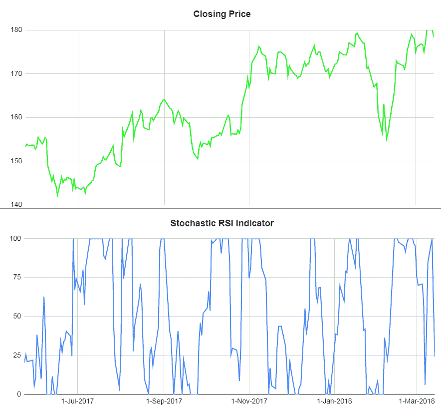

如果你能根据上面给出的图表对价格走向形成看法，请在评论中告诉我们。

我们在这个随机振荡器教程中已经重申过，虽然一个指标是衡量市场的好方法，但有时几个指标一起使用是个好主意。在这方面，我们现在将涵盖平均真实指标，这有助于我们做出更明智的交易，通常会提高我们的信心水平。

## 平均真实范围(ATR)指标定义

本文包含 ATR 的原因有两个:ATR 不是一个可以单独使用的指标，更多的是作为一种验证你的观察的手段。因此，它会给你的交易策略注入信心。第二个原因是，它与其他指标配合得很好。

应该注意的是，ATR 捕捉的只是波动，而不是市场的方向。让我们在下一节看看如何找到一项资产的 ATR。

## TR 计算

在我们计算平均真实范围之前，我们首先推导出资产的真实范围。
根据以下三个分量的最大值进行计算:

1.  当天的(最高价-最低价)
2.  (今日高点-昨日收盘价)和
3.  (昨日收盘价-今日低点)

请注意，对于(2)和(3)，我们使用绝对值。

给你举个例子:真实范围会按以下方式计算。

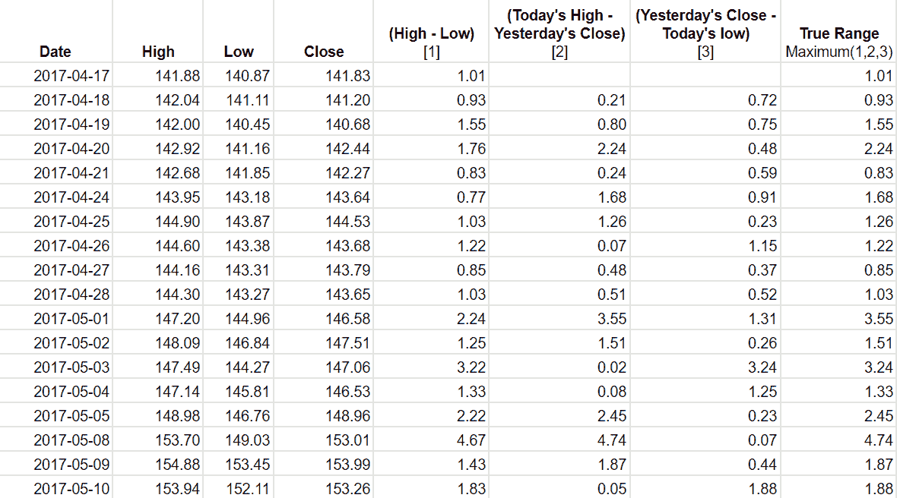

我们从三个值中选择最大值的原因是，它有助于我们捕捉缺失的波动率，如果我们只采用当天的最高值和最低值来计算 ATR，就会忽略这一点。

一旦我们计算出资产的真实范围，我们就用 14 天的时间来计算资产的平均真实范围。

### 计算 ATR 的公式

ATR 的当前值=[(ATR 的前值* 13) +真实范围的当前值)] / 14。

因此，资产的 ATR 如下:

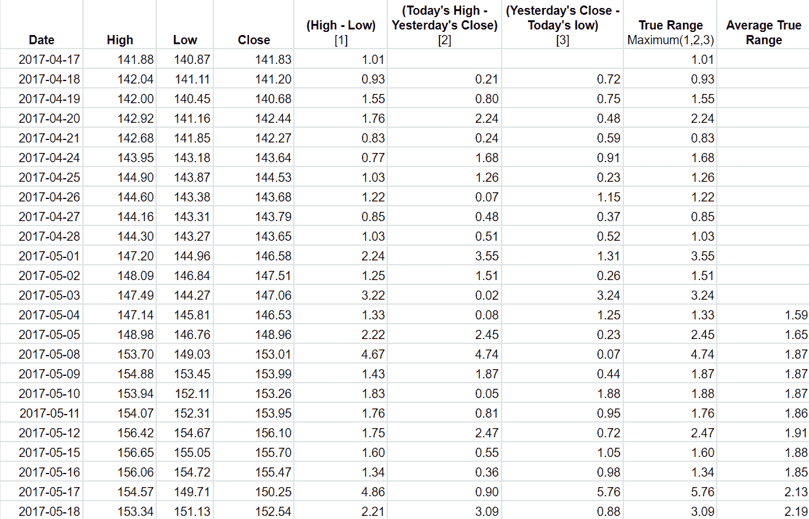

ATR 相对于收盘价的曲线是这样的

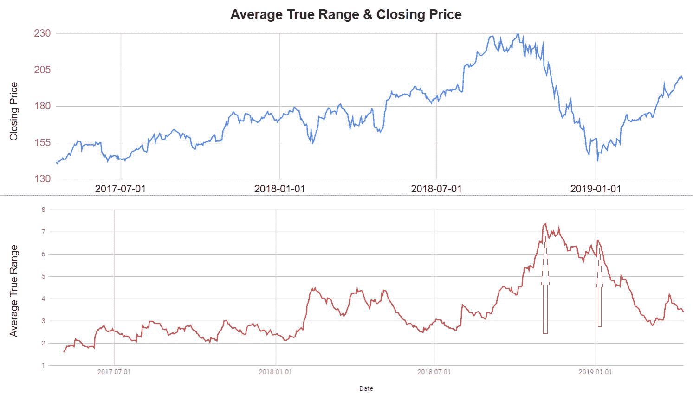

你可以看到 ATR 在以下时间达到峰值:

1.  收盘价格开始大幅下跌
2.  收盘价格开始上涨。

因此，ATR 被视为趋势反转即将发生的确认。

### ATR 和随机振荡器

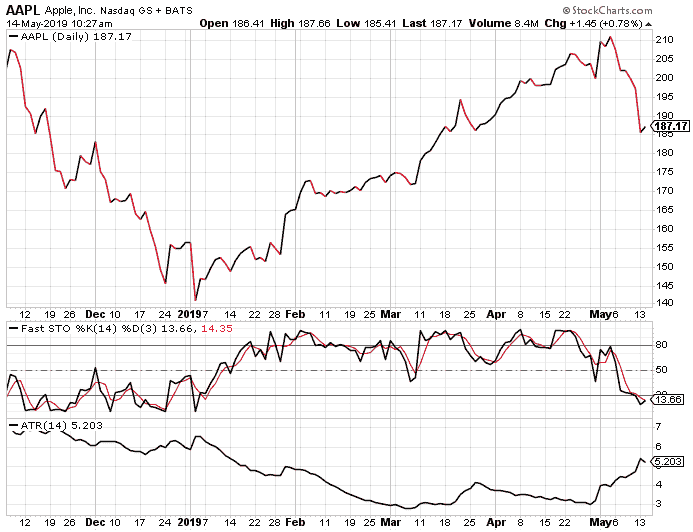

你可以看到上图中，2019 年 1 月第一周，%K 穿越%D 线表示一个趋势的反转。为了支持这一趋势，ATR 在同一时期也很高。因此，收盘价格随后回升。

## ATR 的局限性

我们必须明白，ATR 不是用来预测价格方向的，相反，它向我们展示了特定资产的波动性。在这方面，当仅基于 ATR 值形成观点时，必须小心谨慎。一种常见的方法是将 ATR 与之前的值进行比较，以了解市场的趋势，当然，结合其他指标使用，如随机指标、RSI 或 MACD。

## 结论

总之，我们已经学习了随机振荡指标和 ATR 指标的定义和计算。我们还看到了一些可以在这些指标的帮助下使用的策略。技术指标确实帮助我们更好地理解市场，做出明智的交易。您可以在下面的学习轨道中了解更多关于指标及其应用的知识:[人人算法交易](https://quantra.quantinsti.com/learning-track/algorithmic-trading-for-everyone)

<small>免责声明:股票市场的所有投资和交易都有风险。在金融市场进行交易的任何决定，包括股票或期权或其他金融工具的交易，都是个人决定，只能在彻底研究后做出，包括个人风险和财务评估以及在您认为必要的范围内寻求专业帮助。本文提到的交易策略或相关信息仅供参考。</small>