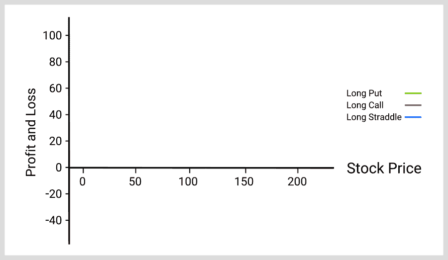
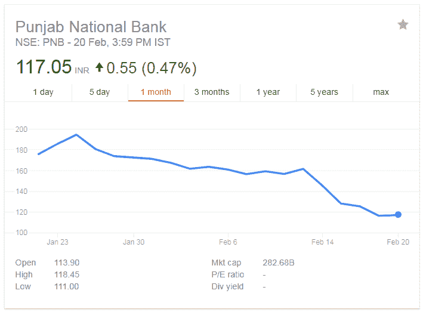
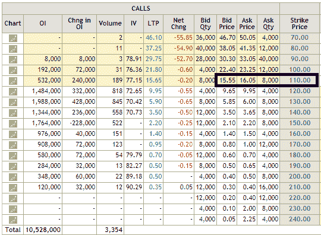
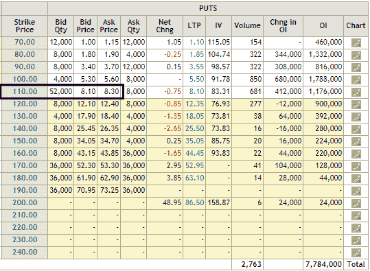
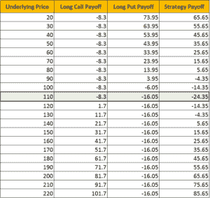
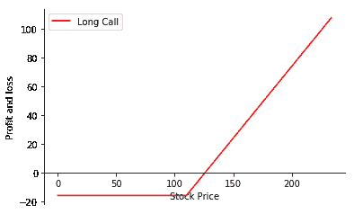
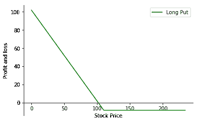
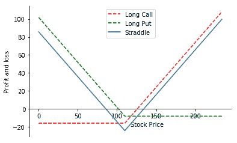

# 使用 Python 的跨期权交易策略

> 原文：<https://blog.quantinsti.com/straddle-options-trading-strategy-python/>


由[维拉伊·巴加](https://www.linkedin.com/in/virajbhagat/)

### **简介**

期权是金融市场中一种易于理解但用途广泛的工具，在过去十年中其受欢迎程度突飞猛进。它们可以通过利用你的市场地位来提高回报。期权非常灵活，也就是说，人们可以通过对冲来管理风险，并从市场的方向运动中获利。

这篇文章的目的是提供一个在交易中的跨期权的介绍性理解，可以用来创建你自己的交易策略。

#### **什么是多空期权策略？**

多头是一种[期权交易策略](https://quantra.quantinsti.com/course/options-trading-strategies-python-intermediate)，其中交易者通过支付两种期权费，持有具有相同执行价格、相同到期日和相同标的资产的看涨期权和看跌期权。

#### **如何练习多空期权策略？**

有两种方法来实践跨期权策略。

*   **方向性策略:**在这样一个动态的市场中，一只股票很有可能会随时间而上涨或下跌，这为这只股票描绘了一个不确定的未来。在这种情况下，股票的价格可能会向两个方向发展。它的未来不确定。这通常被称为“[隐含波动率](https://blog.quantinsti.com/implied-volatility-webinar-7-mar-2017/)”。
*   **波动玩法:**这是一种不同的多空期权策略玩法。这可能是即将到来的收益报告，也可能是年度预算报告等等。人们怀疑，在收益公布之前，波动性会增加。按照一般的观念，人们会蜂拥购买这些股票。正是在这种时候，交易者过早地购买跨期权策略。必须理解的是，市场会意识到这一事实，这将导致自动柜员机调用和自动柜员机看跌期权的明显增加，使它们相当昂贵。这里的关键是在事件发生前退出。

在已知或可以预测种群命运的情况下，这种情况可被视为例外。

#### **跨期权策略的类型**

跨期权策略有两种类型:

*   **多头买卖:**当买入具有相同执行价格的看涨期权和看跌期权时，它被认为是多头买卖
*   空头:与多头正好相反

### **多头多空**

它们通常以基础资产的价格或接近基础资产的价格交易，但也可以以其他方式交易。

跨期权策略在低 IV 状态下运行良好，设置成本低，但股票预计会大幅波动。它将看涨期权和看跌期权置于相同的价格，并且它们对相同的资产有相同的到期日。这不同于[扼杀期权交易策略](https://blog.quantinsti.com/long-strangle-option-strategy-in-python/)中期权价格的变化。

该策略在理想情况下应该是这样的:



#### **多空期权策略集锦**

**要购买的期权的金额**

这可以通过以下两种方法之一实现:

*   在货币买入期权中
*   在看跌期权中

**最大损失:**买入溢价+卖出溢价

**盈亏平衡**

到期时，如果执行价格高于或低于支付的溢价，那么该策略将实现盈亏平衡。

在执行价格高于或低于任何一种情况下，

*   一份期权的价值将等于为该期权支付的溢价，并且
*   另一个期权的价值将变得一文不值。

可以描述如下:

*   上行盈亏平衡=成交+支付的保费
*   下行盈亏平衡=支付的履约溢价

#### **如何从多空期权策略中获利？**

如果工具(在这种情况下，股票)在任何一个方向剧烈波动，或者 IV 突然大幅上升，这就是多头可以获利的时候。波动幅度越大，收益越好。这意味着很有可能获得可观的利润，而最大的损失将是保险费。

现在，如果市场波动小于 10%，那么就很难在这个策略上获利。如果股价以执行价到期，最大风险就会出现。

### **实施跨期权策略**

在这个例子中，我将使用 PNB (Pujab 国家银行)(股票代码:PNB)期权。

如果标的资产大幅波动，无论其走势如何，交易者都会从多头策略中受益。如果你看看下面的图表，你会发现 PNB 的股价也是如此:



过去 1 个月的股价变动(来源——谷歌财经)

PNB 的股票价格有很大的波动，最高为 194.65，最低为过去 1 个月的 117.05，这是根据谷歌金融和 18.25%的 IV 的现值

为了这个例子的目的；我会买入 1 份看跌期权和 1 份看涨期权。

以下是截止日期为 2018 年 3 月 29 日的 PNB 期权链来源:nseindia.com






我将为行权价为 110 的看涨期权支付 16.05 印度卢比，为行权价为 110 的看跌期权支付 8.30 印度卢比。这些期权将于 2018 年 3 月 29 日到期，为了从中获利，PNB 股票在到期前应该会出现大幅波动。

启动该交易所支付的净溢价将为 24.35 印度卢比，因此在该策略实现盈亏平衡之前，股票需要向下移动到 85.65 或 134.35。

考虑到各种因素导致的市场大幅波动，并考虑到市场从最近的下跌中复苏的过程，我们可以假设这里有机会获利。

#### **Python 中如何计算跨期权策略收益？**

现在，让我用 [Python](https://blog.quantinsti.com/python-trading/) 编程代码带你浏览一下收益图。

#### **导入库**

```py
import numpy as np
import matplotlib.pyplot as plt
import seaborn
Define parameters
```

```py
# PNB stock price 
spot_price = 117.05 
# Long put
strike_price_long_put = 110 
premium_long_put = 8.3
# Long call
strike_price_long_call = 110 
premium_long_call = 16.05
# Stock price range at expiration of the put
sT = np.arange(0,2*spot_price,1)
```

#### **电话支付**

我们定义一个函数来计算购买看涨期权的收益。该函数将 **sT** 作为输入，sT 是到期时股票价格、认购期权的执行价格和认购期权的溢价的可能值的范围。它返回看涨期权的收益。

理想的回报应该是这样的:



```py
def call_payoff(sT, strike_price, premium):
    return np.where(sT > strike_price, sT - strike_price, 0) - premium

payoff_long_call = call_payoff (sT, strike_price_long_call, premium_long_call)
# Plot
fig, ax = plt.subplots()
ax.spines['top'].set_visible(False) # Top border removed 
ax.spines['right'].set_visible(False) # Right border removed
ax.spines['bottom'].set_position('zero') # Sets the X-axis in the center
ax.plot(sT,payoff_long_call,label='Long Call',color='r')
plt.xlabel('Stock Price')
plt.ylabel('Profit and loss')
plt.legend()
plt.show()
```

#### 

#### **放收益**

我们定义一个函数来计算购买看跌期权的收益。该函数将 sT 作为输入，sT 是到期时股票价格、看跌期权的执行价格和看跌期权的溢价的可能值的范围。它返回看跌期权的收益。

```py
def put_payoff(sT, strike_price, premium):
    return np.where(sT < strike_price, strike_price - sT, 0) - premium 

payoff_long_put = put_payoff(sT, strike_price_long_put, premium_long_put)
# Plot
fig, ax = plt.subplots()
ax.spines['top'].set_visible(False) # Top border removed 
ax.spines['right'].set_visible(False) # Right border removed
ax.spines['bottom'].set_position('zero') # Sets the X-axis in the center
ax.plot(sT,payoff_long_put,label='Long Put',color='g')
plt.xlabel('Stock Price')
plt.ylabel('Profit and loss')
plt.legend()
plt.show()
```

#### 

#### **跨期支付**

```py
payoff_straddle = payoff_long_call + payoff_long_put

print ("Max Profit: Unlimited")
print ("Max Loss:", min(payoff_straddle))
# Plot
fig, ax = plt.subplots()
ax.spines['top'].set_visible(False) # Top border removed 
ax.spines['right'].set_visible(False) # Right border removed
ax.spines['bottom'].set_position('zero') # Sets the X-axis in the center

ax.plot(sT,payoff_long_call,'--',label='Long Call',color='r')
ax.plot(sT,payoff_long_put,'--',label='Long Put',color='g')

ax.plot(sT,payoff_straddle,label='Straddle')
plt.xlabel('Stock Price', ha='left')
plt.ylabel('Profit and loss')
plt.legend()
plt.show()

Max Profit: Unlimited
Max Loss: -24.35
```

最终输出如下所示:



### **空头多空期权策略**

这与多头期权策略正好相反。然而，多头比空头更常用。

### **结论**

从上图可以看出，对于跨式期权策略，最大利润是无限的，最大损失限制在 24.35 印度卢比。因此，当你的前景是适度看跌股票时，这种策略是合适的。

在本文中，我们通过一个真实的市场例子以及理解如何用 Python 计算策略，涵盖了跨期权策略的所有要素。

### **下一步**

铁蝴蝶期权交易策略是一种[期权交易策略](https://quantra.quantinsti.com/course/options-trading-strategies-python-intermediate)。这是蝶式价差期权的一部分。同样，这种策略也是多头价差和空头价差的组合。铁蝴蝶策略限制了交易者的输赢。这是一种有限风险和有限利润的交易策略，包括使用四种不同的选项。[点击这里](https://blog.quantinsti.com/iron-butterfly-options-trading-strategy/)阅读完整的帖子。

*免责声明:股票市场的所有投资和交易都有风险。在金融市场进行交易的任何决定，包括股票或期权或其他金融工具的交易，都是个人决定，只能在彻底研究后做出，包括个人风险和财务评估以及在您认为必要的范围内寻求专业帮助。本文提到的交易策略或相关信息仅供参考。*

### **下载数据文件**

*   跨期权策略 Python Code.txt