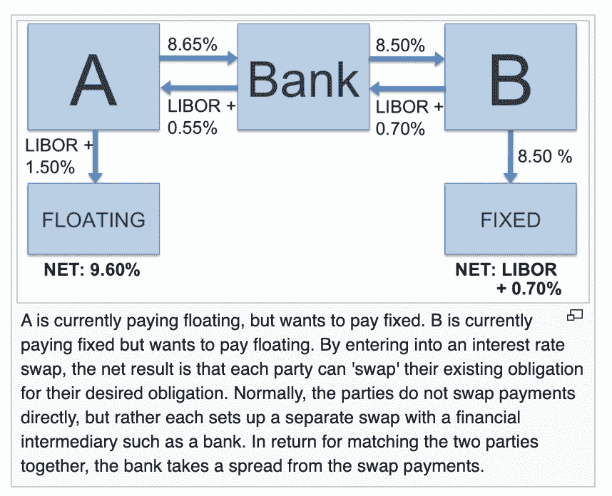
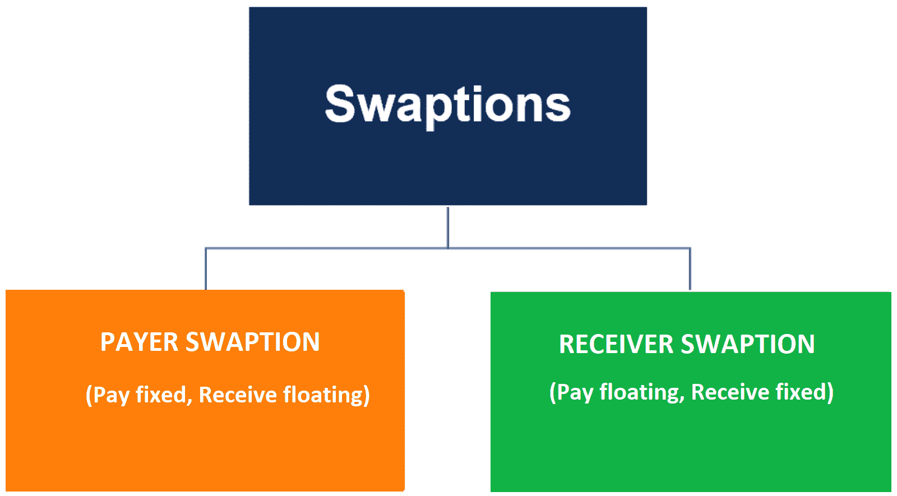
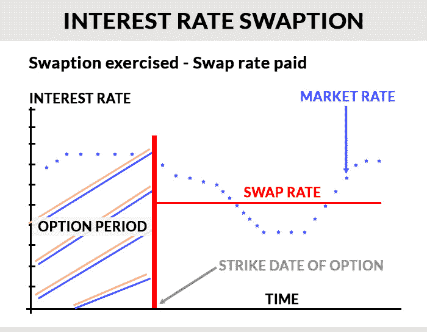

# 交换选项-简介

> 原文：<https://blog.quantinsti.com/swaption/>

由[查尼卡·塔卡](https://www.linkedin.com/in/chainika-bahl-thakar-b32971155/)

生活中有一个选择总是一种享受，给我们一些不同的期待。“互换期权”或术语互换期权为您提供了互换金融工具、现金流的选项，但通常是双方之间的利率。此外，还有不同类型的互换期权。此外，您可以更深入地研究我们在本文中提到的关于交换选项的工作和其他方面，并找到它们。我们将从互换的含义开始，以便首先讨论互换的基础。

因此，本文涵盖了:

*   [互换](#Swap)
*   [掉期合约](#Swaption-Contract)
*   [互换期权合同示例](#Example-Swaption)
*   为什么选择互换期权？
*   [互换期权的类型](#Types-Swaptions)
*   [互换期权定价的推导](#Derivation-Pricing-Swaptions)
*   你如何交易掉期期权？
*   互换期权市场是如何运作的？
*   [互换期权的利弊](#Pros-Cons)

## 互换

互换只是双方之间的契约性协议。在这种协议中，一方可以交换利率、货币(同值)，甚至为违约方偿还贷款的责任(信用违约互换)。

借助下面的流程图，你可以看到互换合约在双方之间是如何运作的。

来源:维基百科

现在让我们向前看一看互换期权合约。

## 掉期期权合约

现在，掉期期权或掉期期权合同意味着一种期权类型，给予买方在未来某个特定日期签订 T2 掉期合同的权利，但没有义务。互换期权合约通常以溢价购买。互换期权是场外交易的[合约，即不在交易所交易。互换期权有两种类型，分别是:](https://quantra.quantinsti.com/glossary/OTC-Over-The-Counter)

*   付款人互换期权
*   接收器交换选项

**付款人掉期期权**

购买赋予你支付固定利率并在未来获得浮动利率 [(LIBOR)](https://quantra.quantinsti.com/glossary/LIBOR) 的权利的合约被称为支付者互换期权。

伦敦银行同业拆放利率是标准的浮动利率，前面有简要的解释。

**接收器交换选项**

相反，互换期权合约为你提供了支付浮动利率(LIBOR)并在未来获得固定利率的权利，这种合约被称为接收者互换期权。

此外，付款人互换期权和收款人互换期权在下图中也有明确区分:

来源: [CFI](https://corporatefinanceinstitute.com/resources/knowledge/trading-investing/swaption/)

最重要的是，当不确定未来利率是上升还是下降时，可以使用互换期权。利率有两种类型，即:

*   固定利率(不变)
*   浮动汇率(可变)

**固定利率(不变)**

固定利率是不随市场变化而波动的利率。这种利率是对债务收取的，如贷款。固定利息在整个预定期限内保持不变，直到偿还本金为止。

**浮动利率(可变)**

浮动利率是指在预先确定的一段时间内，利率不会保持不变，直到偿还本金为止。浮动利率的变化取决于[参考利率](https://corporatefinanceinstitute.com/resources/knowledge/finance/floating-interest-rate-variable/)。在这里，最常见的参考利率是 LIBOR。伦敦银行同业拆放利率是根据汇丰银行、巴克莱银行等伦敦主要银行提交的估价计算得出的平均利率。

此外，掉期合约的双方需要就以下两个方面达成一致，即:

*   溢价(价格)
*   期权合约的期限(到期日)

现在让我们来看一个互换期权合同的例子。

## 互换期权合同示例

让我们假设你有一家 XWZ 公司，该公司提供借贷便利，并规定 6 个月后到期，无需再融资。现在，作为经理，您预计利率可能会在到期日之前超过约定的利率。因此，你将采取互换期权来降低风险。在未来，在到期日，如果利率上升超过掉期利率，您将不会行使掉期期权来享受利率(LIBOR)上升带来的利润。另一方面，如果市场利率没有上升，你将行使掉期期权，并获得高于掉期利率的利率，因为利率下降将是你的损失。

好吧！让我们来看看如何使用图形表示。

在下图中，

*   期权的行权日是到期日
*   互换利率是决定互换的利率
*   市场利率是伦敦银行同业拆借利率浮动利率
*   期权期限截止到行权日

现在，我们可以看到 y 轴上显示的是利率，x 轴上显示的是时间。举个和上面一样的例子，如果你有一家便利借贷的公司，那么在到期日，我们可以看到市场利率或 LIBOR 高于掉期利率。在这种情况下，你将不会行使互换期权，而将获得更高的 LIBOR。

现在，我们将进一步讨论为什么应该选择互换期权。

## 为什么选择互换期权？

掉期期权主要用于对冲固定或浮动利率。

**对冲**

一般来说，套期保值仅仅是减轻市场波动风险的行为。如果你不希望在未来交换你的固定或浮动利率，你可以选择退出。掉期期权有助于你对冲购买合约(付款人的掉期期权或收款人的掉期期权)的未来风险。如果你选择退出互换，唯一的损失将是你购买合约所支付的溢价。

例如，一个有三笔贷款将于 2021 年到期的借款人希望对冲利率的任何剧烈波动，他将购买掉期期权，以减轻未来的任何风险。

进一步看这个例子，如果你目前支付浮动利率，你将选择付款人的掉期期权。而且，如果你预见到未来浮动利率会上升，那么你会希望支付固定利率而不是浮动利率。

因此，在浮动利率上升的情况下，付款人的掉期期权将给予你支付固定利率的权利，而不是义务。

相反，如果你已经支付了固定利率，并且你预见到浮动利率在未来可能会下降，你会希望支付浮动利率。在这种持有未来支付浮动利率而不是固定利率的权利的情况下，你将购买一个接受者的互换期权。

现在让我们进一步了解互换期权合同的类型。

## 互换期权的类型

有趣的是，有三种类型可供支付者或接受者选择(如我们所讨论的)，它们是:

*   百慕大互换期权
*   欧洲互换期权
*   美国互换期权

**百慕大互换期权**

这种类型的互换期权本身可以在几个预定的日期行使，这使得它足够灵活。此外，互换期权的实际执行日期并不重要，因为基础互换将有相同的到期日。

例如，百慕大互换期权持有者可能有权在最初四个季度的任何一天行使合同，而到期日最初是 4 年或 5 年。

**欧洲互换期权**

这种掉期期权合约要求持有者只能在行权日或到期日行使掉期合约。因此，与百慕大互换期权合同相比，这种合同的灵活性较低。

例如，这份合约的持有者只能在合约到期后，比如说 4 年或 5 年内，行使其持有的互换权。

**美国互换期权**

在美国互换期权合约中，互换权可以在起始日和到期日之间的任何一天行使。同样，它也可以在到期日行使。

例如，如果你持有美国互换期权合约，到期日是 4 年或 5 年后的某个特定日期，那么你可以在该日期以及两者之间的任何日期行使互换期权。

此外，还有两种可能的解决方案。一种是现金结算，支付的金额是掉期的价值；另一种是实物结算，在到期日进行掉期交易。

展望未来，掉期期权的定价也很重要。现在让我们讨论一下互换期权的定价问题。

## 互换期权定价的推导

在互换期权的情况下，对于定价，使用[黑色模型](https://en.wikipedia.org/wiki/Black_model)。互换期权是互换期权，这意味着它们允许在未来以预定的价格互换利率。让我们来看看支付者互换期权的定价公式，它是:

$$s_{payer}=\frac{l}{m}\sum_{i=1}^{mn} p(0，T_i)[s_0N(d_1) - s_kN(d_2)]$$

$$这里，$ $

$ $ s _ 0 = spot \；利率$$

$$T =开始\；年份$$

$ $ n = the \；数字\；的\；年\；交换选项\；合同\；will \；last \；对于$$

$ $ m =付款\；per \；年份$$

$$L =名义上的\；资本\；或者\；委托人\；金额$$

$ $ s _ k = strike \；利率$$

$ $ N = the \；累积\；标准\；正常\；分发\；函数$$

$$\frac{l}{m}\sum_{i=1}^{mn} p(0，T_i) =贴现\；因子\；for \；m * n \；报酬$$

$$d_1 =导数\；的\；spot \；利率$$

$$d_2 =导数\；的\；strike \；利率$$

此外，因为它是[按价](https://quantra.quantinsti.com/glossary/AtTheMoney-Option)掉期期权定价，这就是为什么$$s_0= s_k$$让我们假设这是欧式掉期期权合同，因此，利率掉期从到期日 t 开始。这里的利率基准是 LIBOR。

现在，我们假设每年有 m 笔付款。但是，为了去掉所有的计数，我们取了$ $ s _ k \ frac { L } { m } = every \固定\；付款\；on \；的\；互换$美元

现在，

$ $自\；\frac{1}{m}\sum_{i=1}^{mn} P(0，t _ I)\；是\；的\；折扣\；因子，我们\；will \；take \；a = \ frac { 1 } { m } \sum_{i=1}^{mn} p(0，T_i)$$

因此，

$ $ s _ { payer } = la[s _ 0n(d _ 1)-s _ kn(d _ 2)]$。

类似地，我们将评估接受者互换期权，即我们接受固定利率并支付浮动利率，即 LIBOR。那么，接收器交换选项将是，

$ $ S _ { receiver } = LA[S _ 0N(d _ 2)-S _ kN(d _ 1)]$ $

要了解更多关于掉期期权定价的信息，你可以参考研究论文[这里](https://papers.ssrn.com/sol3/papers.cfm?abstract_id=3095336)。

让我们向前看，看看互换期权是如何交易的。

## 你如何交易掉期期权？

互换期权合同是场外交易，这意味着互换期权不是在纽约证券交易所(NYSE)这样的正式交易所进行交易。场外交易是在经纪人-交易商网络的帮助下进行的。这种交易是通过计算机网络或电话使用在线报价和交易服务完成的，这有助于信息共享，如 [OTCBB](https://www.finra.org/filing-reporting/over-the-counter-bulletin-board-otcbb) 。

但是，场外期权不适用于个人交易者。然而，一些私人银行向他们的客户提供访问权限。此外，一些银行向小企业提供场外对冲。因此，如果你成立了一家小公司，你也许可以进入。但是，他们的产品不是很有吸引力。

好吧！我们现在将看到互换期权市场的运作。

## 互换期权市场是如何运作的？

互换期权市场意味着参与者建立互换期权合约的平台。掉期期权市场通常由大型公司组成，因为后者涉及大量的技术和人力资本。

此外，掉期期权市场适用于大多数主要的世界货币，如美元、欧元和英镑。

更进一步，让我们也讨论一下当你决定持有互换期权合约时所遵循的步骤:

*   互换期权市场通常涉及两方，即收款人和付款人、到期日、各种类型的互换期权和预定价格。
*   在开始时，掉期合约的买方支付卖方一笔溢价。
*   现在，买方有权利但没有义务在预定的未来日期(到期日)交换利率。互换利率的决定取决于利率是否对合同持有人有利。
*   到期日取决于互换期权合同的类型。例如，在百慕大合同中，有一些预先确定的日期，可以在到期日之前行使互换。另一方面，美国合约允许在到期日之前的任何时候行使期权。

这里互换期权的一个很好的例子是 risk-free 的最新新闻，提到高盛在与 SOFR(美国无风险利率)相关的互换期权中处于领先地位。

现在，让我们来看看交易掉期合约的利与弊。

## 互换期权的利弊

在预测更好的利率(如果你贷款了)或更好的利率(如果你贷款了)时，互换期权非常有用。然而，为了不被积极的一面所驱使，你应该意识到一些不利的一面。

**优点**

*   当你预期你的固定利率将高于伦敦银行同业拆放利率或反之亦然时，掉期期权被用来规避风险。
*   与其他类型的期权相比，互换期权可以持续更长的时间。

**缺点**

*   如果你没有在合约终止前行使权利，你将最终失去购买掉期合约所支付的溢价金额。
*   互换可能还有其他风险，比如与另一方的违约者打交道。

## 结论

本文旨在涵盖交换选项的基本方面。由于它为交易方提供了降低成本或实现收益最大化的机会，因此它是最受青睐的选择之一。期权合约为你提供了大量预测和交易掉期的机会。同时，你必须与一个值得信赖的实体进行交易，并应谨慎对待其他风险。

<small>免责声明:股票市场的所有投资和交易都有风险。在金融市场进行交易的任何决定，包括股票或期权或其他金融工具的交易，都是个人决定，只能在彻底研究后做出，包括个人风险和财务评估以及在您认为必要的范围内寻求专业帮助。本文提到的交易策略或相关信息仅供参考。</small>