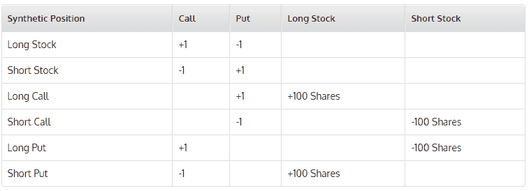
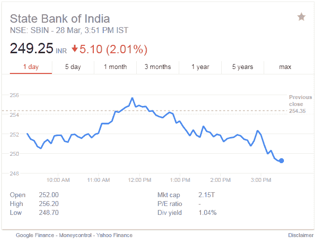
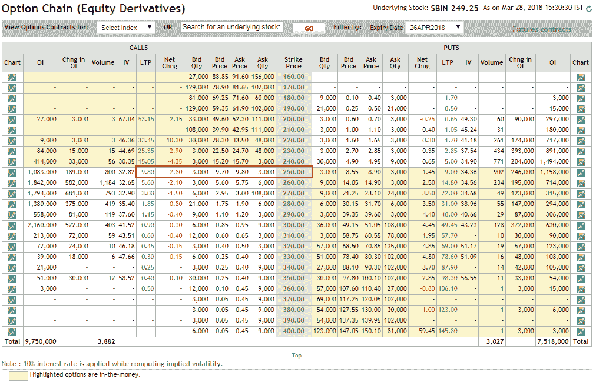
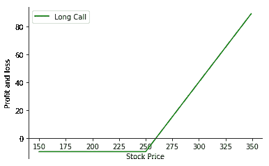
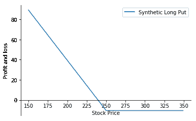

# Python 中的综合多头期权交易策略

> 原文：<https://blog.quantinsti.com/synthetic-long-put-strategy-python/>

有无数的交易者在练习无数的交易策略。比较熟悉的有[铁蝴蝶](https://blog.quantinsti.com/iron-butterfly-options-trading-strategy/)、[长勒死](https://blog.quantinsti.com/long-strangle-option-strategy-in-python/)、[熊出没](https://blog.quantinsti.com/bear-spread-options-trading-strategy-in-python/)等。[期权交易策略](https://quantra.quantinsti.com/course/options-trading-strategies-python-intermediate)在这种快速的交易生活中开辟了自己的空间，并通过改善交易策略极大地帮助了交易者。在这样做的时候，我们经常会遇到合成期权，这就给我们带来了今天的交易策略，合成长期看跌期权交易策略。在交易时，最重要的是要知道仅仅依靠旧的传统的交易方法和实践是不可能生存的。世界正在向算法交易转变，交易者有必要[改进他们的交易实践](https://blog.quantinsti.com/become-better-quant/)和方法。这也导致了模型、策略甚至实践的快速复制和相同的进化，结果，今天，我们看到许多修改的[期权交易策略](https://blog.quantinsti.com/basics-options-trading/)。交易者进行合成交易是为了利用他们的看涨期权和看跌期权，而不是原来的东西，作为另一种交易工具，以确保它是市场独有的，可定制的，有助于利用市场优势，并且易于操作。其中之一就是我们今天要学习的。

## **什么是合成看跌期权？**

可以形象地表示为: [](https://d1rwhvwstyk9gu.cloudfront.net/2018/07/Synthetic-Long-Put.jpg) 这个组合正好类似于一个看跌期权，具有相似的性质。在看跌期权中，一个人只从标的股票的价格变动中获利，而股票中没有标的头寸。这将模拟一个长期看跌头寸，其回报将等同于长期看跌。因此，它经常被用来代替长时间投掷。在这里，人们可以通过持有看涨期权和卖空股票来节省交易成本。这两个因素结合在一起，就形成了一个直线看涨期权的确切风险/回报曲线。

在我们继续之前，让我们快速回顾一下交易中合成头寸的一些基础知识。

## **什么是交易中的综合头寸？**

合成头寸通常用于模拟市场头寸，因为它们能够表现得与原始头寸相似，并且具有相似的风险和回报。它们可以通过以下两种方式创建:
#1 通过组合不同的期权合约来模拟股票的多头或空头头寸。
#2 通过结合期权合约和股票来模仿基本策略

## **合成头寸的类型**

有六种不同类型的综合头寸存在并被交易者用于交易。这些措施如下:



**多头买入价差=空头卖出价差**

**做空买入价差=做空卖出价差**

就合成看跌期权而言，它是卖空股票和看涨期权的组合，提供流动性和灵活性。这是一种让它看起来像看跌期权的策略，但它是合成看跌期权。

## **为什么要合成仓位？**

人们经常质疑创建一个类似于原始策略的策略的目的，以及从长远来看它将如何给他们带来好处。不像普通的交易策略，它最有效的利用了资金。我们将详细讨论所有这些内容。在这篇文章中，我将特别关注综合长期看跌期权交易策略。

## 何时进入合成看跌期权？

一个交易者建立了一个空头期货头寸，感觉股票正在超卖，并预见到了危险，他担心证券的长期疲软。如果当股价下跌时，他不太确定这是否真的会发生，于是买入一个看涨期权来对冲短期的下跌。如果这一战略尽可能快地螺旋式下降，它将被证明更有成效。交易者在期货中有一个空头头寸，如果股票上涨，它将受到多头买入期权的保护。这也经常被认为是对空头头寸的一种改善。

## **合成多头看跌交易策略集锦**

### **构建综合多头策略**

*   做空 100 股
*   长 1 自动柜员机呼叫(批量= 100)

**最大收益/利润** =卖空价格/股票价格-溢价支付**最大亏损** =执行价格-卖空价格溢价支付标的价格> /=看涨期权的执行价格**盈亏平衡点** =执行价格+盈亏平衡点时支付的溢价，执行价格与利润成反比

## **实施综合多头交易策略**

在这个例子中，我将使用 SBI。 [](https://d1rwhvwstyk9gu.cloudfront.net/2018/07/SBIN-Stock-Price.png) 最近 1 个月的股价走势(来源——谷歌财经)。SBI 的股价一直在波动，最高为 255.70，最低为过去 1 个月(截至 2018 年 3 月 28 日)的 249.25，这是根据谷歌金融的当前价值。为了这个例子的目的；我将买入 1 个 ATM 看涨期权(执行价:250，升水:9.80)，卖出 1 个期货(最后价格:250.70)。这是从 nseindia.com[](https://d1rwhvwstyk9gu.cloudfront.net/2018/07/SBIN-Options-Chain-Synthetic-Put.png)到 2018 年 4 月 26 日到期日的 SBIN 期权链，这是 SBIN 期货 [](https://d1rwhvwstyk9gu.cloudfront.net/2018/07/SBIN-Futures-Options-Chain.png) 的期权链

## **Python 中如何计算合成多头策略收益？**

现在，让我用 Python 编程代码带你看一下收益图。

### **导入库**

```py
Import Libraries
import numpy as np
import matplotlib.pyplot as plt
```

```py
Define Parameters
# SBIN stock price
spot_price = 249.25
# Long call
strike_price_long_call = 250
premium_long_call = 9.80
# Stock price range at expiration of the put
sT = np.arange(150,350,1)
```

### **电话支付**

我们定义一个函数来计算看涨期权的收益。该函数将 sT 作为输入，sT 是到期时股票价格、认购期权的执行价格和认购期权的溢价的可能值的范围。它返回看涨期权的收益。

```py
def call_payoff(sT, strike_price, premium):
return np.where(sT > strike_price, sT - strike_price, 0) - premium

payoff_long_call = call_payoff (sT, strike_price_long_call, premium_long_call)
# Plot
fig, ax = plt.subplots()
ax.spines['top'].set_visible(False) # Top border removed
ax.spines['right'].set_visible(False) # Right border removed
ax.spines['bottom'].set_position('zero') # Sets the X-axis in the center
ax.plot(sT,payoff_long_call,label='Long Call',color='g')
plt.xlabel('Stock Price')
plt.ylabel('Profit and loss')
plt.legend()
plt.show()
```

[T2】](https://d1rwhvwstyk9gu.cloudfront.net/2018/07/Long-Call-Payoff.png)

### **股票收益**

```py
stock_payoff = (sT - spot_price)*-1.0

fig, ax = plt.subplots()
ax.spines['top'].set_visible(False) # Top border removed
ax.spines['right'].set_visible(False) # Right border removed
ax.spines['bottom'].set_position('zero') # Sets the X-axis in the center
ax.plot(sT,stock_payoff,label='Stock Payoff',color='b')
plt.xlabel('Stock Price')
plt.ylabel('Profit and loss')
plt.legend()
plt.show()
```

[T2】](https://d1rwhvwstyk9gu.cloudfront.net/2018/07/Stock-Payoff.png)

### **合成长期看跌回报**

```py
payoff_synthetic_long_put = payoff_long_call + stock_payoff
# Plot
fig, ax = plt.subplots()
ax.spines['top'].set_visible(False) # Top border removed
ax.spines['right'].set_visible(False) # Right border removed
ax.spines['bottom'].set_position('zero') # Sets the X-axis in the center
ax.plot(sT,payoff_synthetic_long_put,label='Synthetic Long Put')
plt.xlabel('Stock Price')
plt.ylabel('Profit and loss')
plt.legend()
plt.show()
```

[T2】](https://d1rwhvwstyk9gu.cloudfront.net/2018/07/Synthetic-Long-Put-Payoff.png)

```py
print ("Max Profit:", max(payoff_synthetic_long_put))
print ("Max Loss:", min(payoff_synthetic_long_put))
89.45
-10.55
```

**最大盈利:** 89.45 印度卢比**最大亏损:** -10.55 印度卢比由于上面的收益图代表了一个看跌期权的收益图，所以称为**合成多头看跌**。

## **结论**

就相似的风险和回报而言，这种策略与看跌策略非常相似。那些对卖出期货合约或构建激进期权价差没有把握，但希望获利的交易者可以采用这种策略。如果你想创造一个合成的长期看跌期权，你必须记住期权和股票不同，它是有期限的。

现代交易需要系统的方法，需要引导自己远离直觉交易。通过我们的[系统期权交易](https://quantra.quantinsti.com/course/systematic-options-trading)课程，学习如何以系统的方式交易期权。此外，你可以探索期权交易策略，如蝴蝶，铁秃鹰和传播策略。立即注册！

### **下载数据文件**

*   合成多头交易策略- Python 代码

*<small>免责声明:股票市场的所有投资和交易都涉及风险。在金融市场进行交易的任何决定，包括股票或期权或其他金融工具的交易，都是个人决定，只能在彻底研究后做出，包括个人风险和财务评估以及在您认为必要的范围内寻求专业帮助。本文提到的交易策略或相关信息仅供参考。</small>T3】*