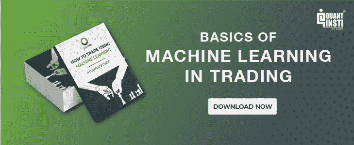
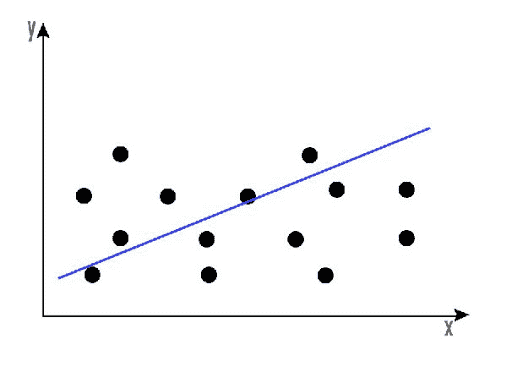
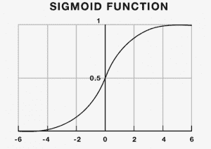
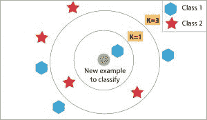
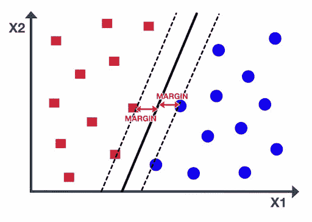
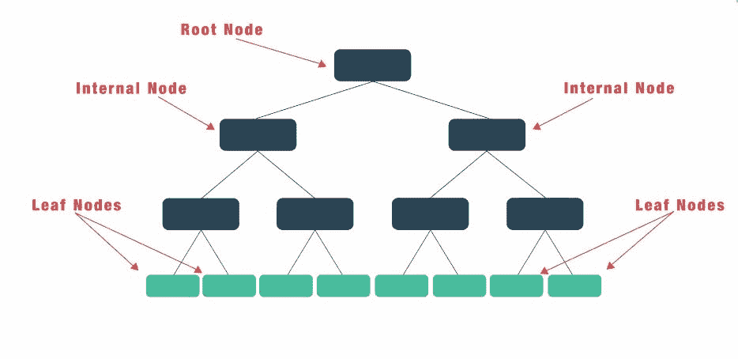
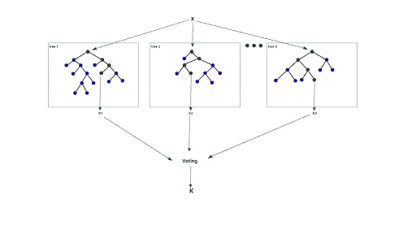

# 面向初学者的 10 大机器学习算法

> 原文：<https://blog.quantinsti.com/top-10-machine-learning-algorithms-beginners/>

以[重香重香](https://www.linkedin.com/in/rekhit/)

英国数学家、计算机科学家、逻辑学家和密码分析学家艾伦·图灵推测，

> “这就像一个学生从他的老师那里学到了很多，但通过自己的工作又增加了更多。当这种情况发生时，我觉得一个人不得不认为机器显示了智能。”

为了给你一个机器学习影响的例子，Man group 的 AHL 维度计划是一个 51 亿美元的对冲基金，部分由 AI 管理。在它开始运作后，到 2015 年，它的机器学习算法贡献了该基金一半以上的利润，尽管它管理的资产要少得多。

[T4】](https://quantra.quantinsti.com/machine-learning-for-trading-ebook)

读完这篇博客后，你将能够理解一些流行的和不可思议的足智多谋的机器学习算法背后的基本逻辑，这些算法已经被交易界使用，并作为你创建最好的机器学习算法的基石。它们是:

*   [线性回归](#linearregression)
*   [逻辑回归](#logisticregression)
*   [KNN 分类](#knn)
*   [支持向量机(SVM)](#svm)
*   [决策树](#decisiontrees)
*   [随机森林](#randomforest)
*   [人工神经网络](#ann)
*   [K-均值聚类](#kmeans)
*   [朴素贝叶斯定理](#bayes)
*   [递归神经网络(RNN)](#rnn)

## 线性回归

最初在统计学中开发用于研究输入和输出数值变量之间的关系，它被机器学习社区采用来基于线性回归方程进行预测。

[线性回归](https://blog.quantinsti.com/machine-learning-trading-predict-stock-prices-regression)的数学表示是一个线性方程，它结合一组特定的输入数据(x)来预测该组输入值的输出值(y)。线性方程为每组输入值分配一个系数，这些值称为用希腊字母 Beta (β)表示的系数。

下面提到的方程代表一个线性回归模型，有两组输入值，x 1 和 x 2 。y 代表模型的输出，β 0 ，β 1 ，β 2 为线性方程的系数。

y =β+β【1】x【1】+β【2】【2】

当只有一个输入变量时，线性方程代表一条直线。为简单起见，考虑β 2 等于零，这意味着变量 x 2 不会影响线性回归模型的输出。在这种情况下，线性回归将表示一条直线，其方程如下所示。

y =β0+β1x1

线性回归方程模型的图表如下所示

线性回归可以用来找出股票在一段时间内的总体价格趋势。这有助于我们了解价格变动是积极的还是消极的。

## 逻辑回归

在逻辑回归中，我们的目标是产生一个离散值，1 或 0。这有助于我们为我们的场景找到一个明确的答案。

[逻辑回归](https://blog.quantinsti.com/machine-learning-logistic-regression-python)在数学上可以表示为，

与线性回归类似，逻辑回归模型计算输入变量的加权和，但它通过特殊的非线性函数(逻辑函数或 sigmoid 函数)运行结果，以生成输出 y。

sigmoid/logistic 函数由下式给出。

y = 1 / (1+ e -x

简单来说，逻辑回归可以用来预测市场的走向。

## KNN 分类

K 近邻(KNN)分类的目的是将数据点分成不同的类，以便我们可以基于相似性度量(例如距离函数)对它们进行分类。

[KNN](https://blog.quantinsti.com/machine-learning-k-nearest-neighbors-knn-algorithm-python) 边走边学，在这种意义上，它不需要明确的训练阶段，并开始对由邻居的多数投票决定的数据点进行分类。

该对象被分配到其 k 个最近邻居中最常见的类别。

让我们考虑将一个绿色圆圈分类为 1 类和 2 类的任务。考虑基于 1-最近邻的 KNN 的情况。在这种情况下，KNN 会将绿色圆圈归入 1 类。现在让我们将最近邻居的数量增加到 3，即 3-最近邻居。如图所示，圆圈内有“两个”类别 2 对象和“一个”类别 1 对象。KNN 将绿色圆圈归类为 2 类物体，因为它占大多数。

## 支持向量机(SVM)

[支持向量机](https://blog.quantinsti.com/trading-using-machine-learning-python-svm-support-vector-machine/)最初用于数据分析。最初，一组训练样本被输入到 [SVM](https://blog.quantinsti.com/support-vector-machines-introduction/) 算法中，属于一个或另一个类别。然后，该算法建立一个模型，开始将新数据分配给它在训练阶段学习的类别之一。

在 SVM 算法中，创建一个超平面作为类别之间的分界。当 [SVM 算法](https://quantra.quantinsti.com/course/trading-machine-learning-classification-svm)处理一个新的数据点时，根据它出现的一侧，它将被分类到其中一个类别中。

当与交易相关时，可以建立一个 SVM 算法，将股票数据分类为有利的买入、卖出或中性类别，然后根据规则对测试数据进行分类。

## 决策树

[决策树](https://quantra.quantinsti.com/course/decision-trees-analysis-trading-ernest-chan)基本上是一种树状的支持工具，可以用来表示原因及其结果。因为一个原因可能有多种影响，我们把它们列出来(就像一棵树有它的分支)。

我们可以通过组织输入数据和预测变量，并根据我们将指定的一些标准来构建决策树。

构建[决策树](https://quantra.quantinsti.com/course/decision-trees-analysis-trading-ernest-chan)的主要步骤是:

1.  检索金融工具的市场数据。
2.  引入预测变量(即技术指标、[情绪指标](https://quantra.quantinsti.com/course/trading-using-options-sentiment-indicators)、广度指标等)。)
3.  设置目标变量或所需输出。
4.  在训练数据和测试数据之间拆分数据。
5.  生成训练模型的决策树。
6.  测试和分析模型。

决策树的缺点是，由于其固有的设计结构，它们容易过拟合。

## 随机森林

一个[随机森林算法](https://blog.quantinsti.com/random-forest-algorithm-in-python)被设计用来解决决策树的一些限制。

随机森林由决策树组成，决策树是表示其行动过程或统计概率的决策图。这些多棵树被映射到称为分类和[回归](https://quantra.quantinsti.com/course/trading-with-machine-learning-regression) (CART)模型的单棵树。

为了根据对象的属性对其进行分类，每棵树都给出一个分类，据说是为该类“投票”。然后，森林选择票数最多的分类。对于回归，它考虑不同树的输出的平均值。

随机森林的工作方式如下:

1.  假设案例数为 N，将这 N 个案例的样本作为训练集。
2.  考虑 M 是输入变量的数目，选择一个数 M，使得 m < M 和 M 之间的最佳分裂用于分裂节点。随着树的生长，m 的值保持不变。
3.  每棵树都长得尽可能大。
4.  通过聚合 n 棵树的预测(即分类的多数票，回归的平均值)，预测新数据。

## 人工神经网络

在我们扮演上帝的探索中，人工神经网络是我们最高的成就之一。我们已经创建了多个相互连接的节点，如图所示，这模仿了我们大脑中的神经元。简单来说，每个神经元通过另一个神经元接收信息，对其执行工作，并将其作为输出传输到另一个神经元。

每个圆形节点代表一个人工神经元，一个箭头代表从一个神经元的输出到另一个神经元的输入的连接。

如果我们用神经网络来寻找各种资产类别之间的相互依赖性，而不是试图预测买入或卖出的选择，那么神经网络会更有用。

## k 均值聚类

在这个机器学习算法中，目标是根据数据点的相似性来标记它们。因此，我们没有在算法之前定义聚类，而是算法在前进的过程中找到这些聚类。

一个简单的例子是，给定足球运动员的数据，我们将使用 [K-means 聚类](https://blog.quantinsti.com/k-means-clustering-pair-selection-python)并根据他们的相似性标记他们。因此，这些聚类可以基于前锋对任意球或成功铲球得分的偏好，即使算法一开始没有给出预定义的标签。

k-均值聚类对那些认为不同资产之间可能存在表面上看不到的相似性的交易者是有益的。

## 朴素贝叶斯定理

现在，如果你还记得基本概率，你会知道贝叶斯定理是以这样一种方式表述的，即我们假设我们有与前一事件相关的任何事件的先验知识。

例如，为了检查你上班迟到的概率，人们想知道你在路上是否遇到交通堵塞。

然而，[朴素贝叶斯](https://blog.quantinsti.com/bayesian-inference)分类器算法假设两个事件相互独立，因此，这在很大程度上简化了计算。最初，朴素贝叶斯仅仅被认为是一种学术练习，但它已经证明了它在现实世界中也能非常好地工作。

朴素贝叶斯算法可用于在没有完整数据的情况下找到不同参数之间的简单关系。

## 递归神经网络(RNN)

你知道 Siri 和谷歌助手在编程中使用了 RNN 吗？rnn 本质上是一种神经网络，其具有连接到每个节点的存储器，这使得处理顺序数据变得容易，即一个数据单元依赖于前一个数据单元。

解释 [RNN](https://blog.quantinsti.com/rnn-lstm-gru-trading/) 优于普通神经网络的一种方式是，我们应该一个字符一个字符地处理一个单词。如果单词是“trading ”,正常的神经网络节点在移动到“d”时会忘记字符“t ”,而递归神经网络会记住该字符，因为它有自己的记忆。

## **结论**

根据 Preqin 的一项研究，已知有 1，360 只量化基金在其交易过程中使用计算机模型，占所有基金的 9%。如果个人的机器学习策略在测试阶段赚钱，公司会为其组织现金奖励，事实上，公司会投入自己的资金，并在实时交易阶段获利。因此，在竞争中领先一步，每个人，无论是数十亿美元的对冲基金还是个人交易，都试图理解并在其交易策略中实现机器学习。

你可以通过 Quantra 上的 AI in Trading 课程详细学习这些算法，并成功有效地将它们应用到实际市场中。

您可以在 Quantra 上注册[在线机器学习课程](https://quantra.quantinsti.com/course/trading-machine-learning-classification-svm)，该课程涵盖分类算法、机器学习中的性能测量、超参数以及监督分类器的构建。

**建议阅读:**

*   [机器学习基础知识](https://blog.quantinsti.com/machine-learning-basics)
*   [2018 年顶级机器学习博客](https://blog.quantinsti.com/top-machine-learning-blogs-2018)
*   [使用 Python 中的机器学习进行交易](https://blog.quantinsti.com/trading-using-machine-learning-python)

*免责声明:股票市场的所有投资和交易都有风险。在金融市场进行交易的任何决定，包括股票或期权或其他金融工具的交易，都是个人决定，只能在彻底研究后做出，包括个人风险和财务评估以及在您认为必要的范围内寻求专业帮助。本文提到的交易策略或相关信息仅供参考。*