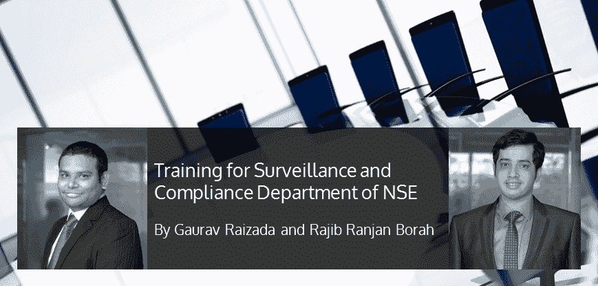

# 印度国家证券交易所算法交易培训

> 原文：<https://blog.quantinsti.com/training-algorithmic-trading-developments-surveillance-compliance-department-nse-india/>

QuantInsti 的联合创始人 Rajib Ranjan Borah 和 Gaurav Raizada 为印度国家证券交易所(NSE India)监督和合规部门的高级管理人员举办了一次特别培训活动。

该活动旨在为印度最大交易所的监管和合规团队提供自动化、算法和高频交易领域的最新知识。

随着贸易公司认识到自动化可以大幅提升贸易利润，市场结构发生了巨大而迅速的变化。因此，监管机构和合规专业人员需要跟上这些最新发展，以便能够在这一新的复杂环境中检查市场参与者。

此次活动旨在为最新发展搭建桥梁——特别关注与算法交易相关的风险管理失败、应适用于自动化交易的额外风险管理程序和流程、交易中的技术干预等。有一个自动交易策略的各种类别的详细分析，以及每一个的特点。讨论了设计算法交易策略的整个生命周期，还讨论了算法交易策略的技术复杂性和创新。

NSE 风险、监督和合规部门的高级和中级经理参加了这一整天的活动，并得到了参与者的积极响应。QuanInsti 很荣幸能与 NSE 合规团队合作，共同追求卓越。

如果你是一名散户交易者或专业技术人员，想要建立自己的自动化交易平台，今天就开始学习算法交易吧！从基本概念开始，如[自动交易架构](https://blog.quantinsti.com/algorithmic-trading-system-architecture/)、[市场微观结构](https://blog.quantinsti.com/market-microstructure/)、[策略回溯测试系统](https://blog.quantinsti.com/backtesting/)和[订单管理系统](https://blog.quantinsti.com/automated-trading-order-management-system/)。你也可以报名参加 EPAT，这是业内最广泛的算法交易课程之一。