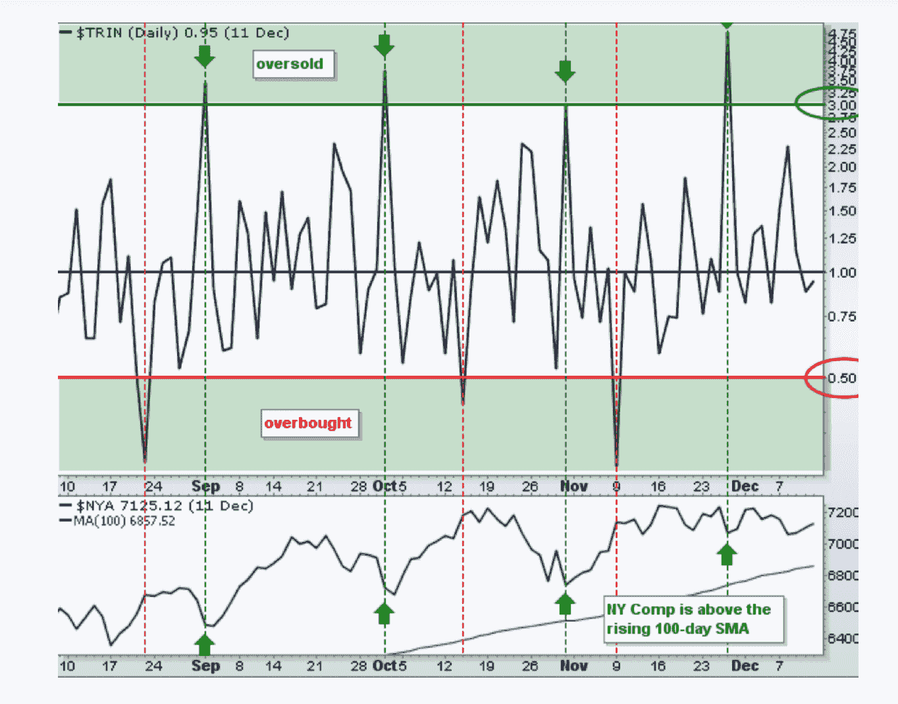

# 交易指数(TRIN):Python 中的公式、计算和策略

> 原文：<https://blog.quantinsti.com/trin/>

由[查尼卡·塔卡](https://www.linkedin.com/in/chainika-bahl-thakar-b32971155/)和[雷希特·帕查内卡](https://www.linkedin.com/in/rekhit/)

**摘要**

为了评估市场的力量，Richard W. Arms，Jr .于 1967 年发明了 TRIN 指数，并用于衡量市场供求关系。TRIN 指数被成功地用于了解市场情绪。此外，未来的价格运动由 TRIN 指示，因为它生成超买和超卖水平，以发现价格指数何时可能改变方向。

基于 TRIN 的价值，交易者可以发现市场是上升还是下降的趋势，并据此做出交易决定。在 Python 中可以高效地计算 TRIN。我们将使用 TRIN 和布林线来创建一个交易策略，根据这些指标的交叉产生买卖信号。我们在这一策略中使用了 S&P500、DJI 和纳斯达克 100 指数的价格数据，发现它以较低的最大提现产生了可观的回报。这将有利于喜欢低风险的交易者。

**关键词**

交易指数，TRIN，TRIN Python，交易指数 Python

**引文**

https://github.com/PyPatel/Options-Trading-Strategies-in-Python/blob/master/TRIN_strategy.py

目录:

*   什么是 TRIN 的军备指数？
*   [TRIN 公式](#formula-of-trin)
*   如何从 arms index 或 TRIN 读取数据？
*   [TRIN 的例子](#example-of-trin)
*   [用 Python 计算 TRIN](#calculation-of-trin-in-python)
*   [描述 TRIN 布林线策略](#trin-strategy-with-bollinger-bands)
*   [投资领域规格](#specification-of-the-investment-universe)
*   [战略绩效](#performance-of-the-strategy)
*   [TRIN 的风险](#risks-in-trin)
*   [结论](#conclusion)
*   [参考文献](#references)

## TRIN 的军备指数是多少？

武器指数或交易指数(TRIN)是一个技术指标(T1)，通过对其的透彻了解，你可以减少一些不必要的事件。

该技术指标有助于衡量内部市场的强弱。TRIN 将上涨和下跌的股票数量与上涨和下跌的交易量进行比较。我们将在文章的后面适当地讨论 TRIN 的比率。Richard W. Arms，Jr .于 1967 年发明了 TRIN 指数，用于衡量市场供求关系。因此，TRIN 指数被成功地用来发现市场情绪。此外，未来的价格变动由 TRIN 指示，因为它生成[超买](https://quantra.quantinsti.com/glossary/Overbought)和[超卖](https://quantra.quantinsti.com/glossary/Oversold)水平，以发现价格指数何时可能改变方向。

在这段信息丰富的视频中了解更多关于 TRIN 的信息:

[https://www.youtube.com/embed/iM9mqsO5XjM?feature=oembed](https://www.youtube.com/embed/iM9mqsO5XjM?feature=oembed)

现在让我们找出 TRIN 的公式。

## TRIN 公式

TRIN 或 arms 指数是一种短期工具，用于指示股票市场的交易情况。基于 TRIN 的价值，交易者可以发现市场是上升还是下降的趋势，然后交易者可以根据预测的方向做出决定。

我们将看看公式，并讨论如何做到这一点。

TRIN =上涨股/下跌股除以上涨量/下跌量

这里:

上涨的股票=当天交易价格上涨的股票数量

下跌股票=当天交易价格较低的股票数量

上涨成交量=所有上涨股票的总成交量

下跌量=所有下跌股票的总成交量

该公式表明，TRIN 通过测量数量和体积来讨论上涨和下跌股票之间的关系。

上涨的 TRIN 值简单地表明市场疲软，趋势看跌，而下跌的 TRIN 表明市场强劲或趋势看涨。

接下来，我们将找到从 arms index 或 TRIN 中读取数据的方法，以便将其投入实际使用。

## 如何从 Arms Index 或 TRIN 读取数据？

要阅读 arms 指数或 TRIN 的数据，你只需要找出 TRIN 指数是高于 1.0 还是低于 1.0。因此，有两种情况:

*   如果市场出现强劲的上升趋势，或者出现牛市，TRIN 将低于 1.0。
*   相反，在强烈下跌趋势或熊市的情况下，TRIN 将出现在 1.0 以上。

除了上面提到的两个级别，还有一些情况下，指数的读数很高。这些高读数是极端水平，通常是即将发生逆转的指标。

例如，如果 TRIN 显示读数 2.0 或 3.0，这是一个极值，这是一个市场已经形成短期底部的指标。类似地，如果该值变为 0.5，则表明市场仅在短期内呈上升趋势。

所以建议交易者等待价格确认。一旦价格被确认，交易者可以据此行动，这样就不会有意外的损失。

这些都是关于阅读 TRIN 的数据，这样你就知道如何根据这些数据采取行动。现在让我们看看 TRIN 的例子。

## TRIN 的例子

Fig1: $TRIN (Daily)

[资料来源:CFI](https://corporatefinanceinstitute.com/resources/knowledge/trading-investing/trin-indicator-technical-analysis/)

根据上面的例子，上涨的 TRIN 表示熊市，而下跌的 TRIN 表示牛市。上面的例子表明，当 TRIN 值高于 3.00 时买入的交易者表现良好，因为这是一个超卖的情况。处于超卖状态的交易者在买进时，肯定从股票供应的增加中获益。此外，基于 0.50 以下的超买值在市场上卖出的交易者，一定没有获利的时间。

[SMA 或移动平均线](/moving-average-trading-strategies/)平滑数据系列，并使其进入在市场中产生超买或超卖信号或价值所需的范围。

我们现在将借助 Python 代码来了解 TRIN 值的计算。要学习和运用其他类似的情绪指标，例如 VIX、看跌看涨期权比率，请查看 Quantra 的“[使用期权情绪指标](https://quantra.quantinsti.com/course/trading-using-options-sentiment-indicators)进行交易”课程。这是一个 5 小时的课程，帮助你一步一步地学习 Python，并在真实的[市场数据](https://quantra.quantinsti.com/course/getting-market-data)上实现你的交易想法。

## Python 中 TRIN 的计算

让我们看看如何用 Python 计算 TRIN 值来分析市场状况。尽管如果你愿意，你可以通过我们关于用 Python 构建技术指标[的博客文章了解更多。](/build-technical-indicators-in-python/)

在计算 TRIN 值时，我们将首先获取股票的价格和成交量数据。我们用 python 代码计算了 S&P500 股票。