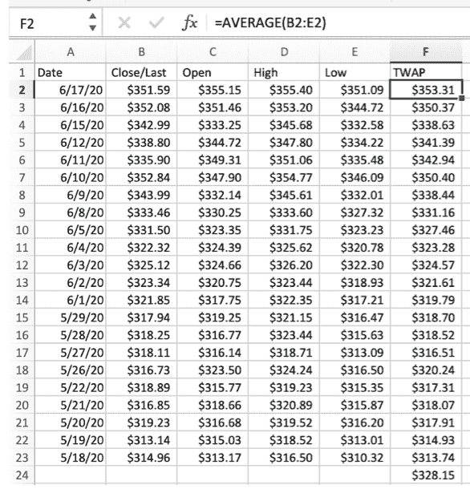

# 时间加权平均价格(TWAP):介绍、一些例子和计算

> 原文：<https://blog.quantinsti.com/twap/>

由[查尼卡·塔卡](https://www.linkedin.com/in/chainika-bahl-thakar-b32971155/)

本文详细讨论了时间加权平均价格，因为这种执行策略对大宗交易订单非常有帮助。如果你想知道 TWAP 是什么，为什么和如何，以及它与 VWAP 的不同，那么这篇文章将很好地为你服务。

让我们看看这篇文章涵盖了什么。它包括:

*   什么是 TWAP？
*   [TWAP 的例子](#example-of-twap)
*   TWAP 是如何计算出来的？
*   为什么选择 TWAP？
*   [TWAP vs VWAP](#twap-vs-vwap)
*   [TWAP 的优点](#pros-of-twap)
*   [TWAP 的缺点](#cons-of-twap)

* * *

## 什么是 TWAP？

时间加权平均价格(TWAP)是一种著名的交易算法，它以加权平均价格为基础，由时间准则定义。TWAP 是为执行大宗交易订单而设计的。有了 TWAP 价值，交易者可以将一个大订单分散成几个小订单，以 TWAP 价格计价，因为这是最有利的价值。

这基本上是为了不让巨额订单突然增加金融市场中特定金融资产的价值。

现在让我们看一个 TWAP 的例子。

* * *

## TWAP 的例子

让我们假设有人想制定一个购买 10，000 股资产的策略。在制定战略的过程中，人们可以从两种可能的战略中进行选择。一个交易者可以在 5 小时内每 15 分钟发出购买 500 股的指令。

第二，交易者可以执行这样的策略，即在 2.5 小时内，每 15 分钟发出购买 1，000 股的指令。

但是，随着金融市场上策略的实施，跟踪其他交易者的交易模式并猜测下一个策略变得更加简单，直到并且除非其订单通过调整参数而被修改。此外，这种修改意味着订单的大小可以随机化，或者每个订单之间的时间可以延迟。

现在，让我们看看如何计算更长时间内的 TWAP 值。

* * *

## TWAP 是如何计算出来的？

在时间加权平均价格的情况下，TWAP 是通过对全天的价格棒线(即当天的开盘价、最高价、最低价和收盘价)进行平均来计算的。然后，在决定执行订单的时间的基础上，每天的平均价格被用于计算整个持续时间价格的平均值。这就是所谓的 TWAP。

TWAP 策略是最好的执行策略，可以将交易分散在一个特定的时间段，减少交易对市场的影响。

像所有交易一样，TWAP 也在所有条件都满足时执行，在此之前，价格从订单输入开始计算，直到收盘。

### 计算 TWAP 的公式

TWAP 的计算如下:

**每日平均价格** =(开盘+高+低+收盘)/4

**28 天平均值** =(第一天价格平均值+第二天价格平均值+)........+第二十八天的平均价格)/28

### 在 Excel 中计算 TWAP

在 excel 表格中，您可以计算每天的平均值。你可以从纳斯达克(NASDAQ)获取历史数据，只需输入你想要的股票代码。这里，我们采用了苹果公司的数据，在 excel 表格中，每天的平均值是按照以下方式计算的:

上面的计算是使用公式=平均值(B2:E2)完成的，如单元格中所示。我们从苹果公司获取了两个月的数据。

要计算每一行的平均值，您只需复制并粘贴 TWAP 下单元格中每一行的公式。

此外，要计算整个周期的平均值，只需输入公式=AVERAGE(G2:G23 ),如下所示:

在 Av_row 项下取出的平均值为 328.15 美元。

计算 TWAP 后，你的订单价格在低于 TWAP 时会被认为低估，在高于 TWAP 时会被认为高估。

### 使用 Python 计算 TWAP

我们也可以用 Python 计算 TWAP。首先，我们将获取我们希望计算 TWAP 的股票的数据。