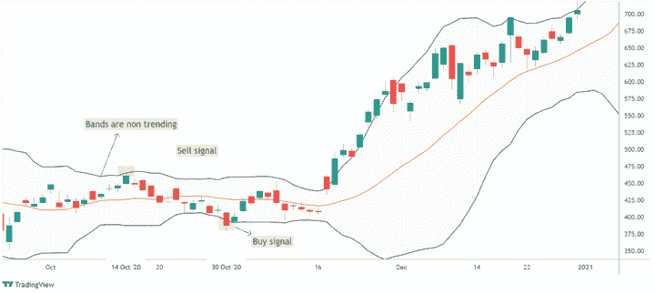
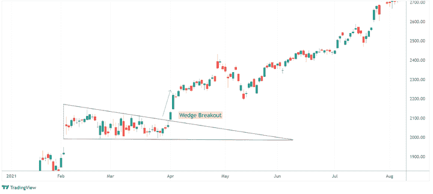
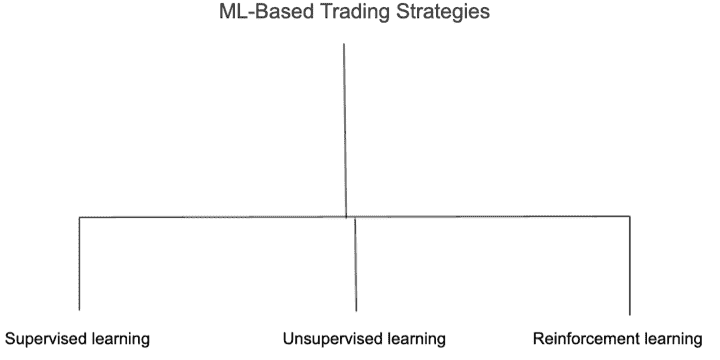
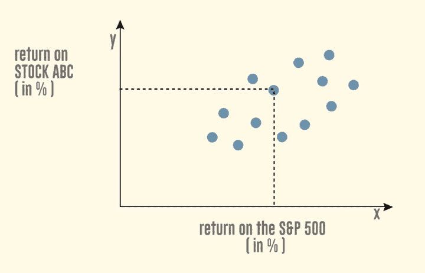
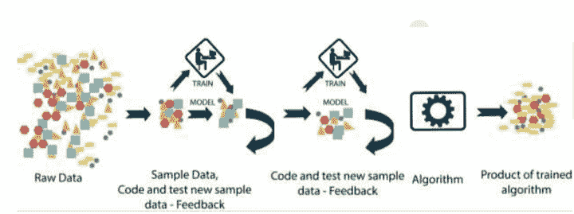

# 交易策略的类型:组成部分，方法，等等

> 原文：<https://blog.quantinsti.com/types-of-trading-strategies/>

由[查妮卡·塔卡](https://www.linkedin.com/in/chainika-bahl-thakar-b32971155/)和[瓦隆·波特呼拉](mailto:varun.p@quantinsti.com)

有各种类型的[交易策略](https://quantra.quantinsti.com/glossary/Trading-Strategy)，正如我们所知，交易策略是现场交易的重要组成部分。如果研究和执行得当，交易策略可以帮助交易者在执行交易指令时达到预期的结果。

当策略执行完全自动化时，这种类型的交易策略称为[算法交易](https://quantra.quantinsti.com/glossary/Algorithmic-trading)策略。通过运用正确的交易策略，交易者可以更加准确和自信地执行交易。在这篇文章中，你将学习不同类型的交易策略

更进一步，本文解释道:

*   [什么是交易策略？](#what-is-a-trading-strategy)
*   [交易策略的组成部分](#components-of-a-trading-strategy)
*   [交易策略类型](#types-of-trading-strategies)
*   [基于 ML 的交易策略](#ml-based-trading-strategies)
*   [策略组合](#portfolio-of-strategies)

* * *

## 什么是交易策略？

交易策略是分析市场状况和做出交易决定的详细计划。策略由估计价格变动的最佳实践和进出交易的规则组成。

* * *

## 交易策略的组成部分

以下是交易策略的组成部分:

*   创建交易策略的方法
*   贸易领域
*   进入和退出逻辑
*   风险管理

******创造交易策略的方法******

设计交易策略有三种主要方法:

1.  技术分析
2.  基本面分析
3.  定量分析

除此之外，还有:

4.用于设计交易策略的机器学习

机器学习是当代的实践，是一种人工智能。现在，让我们讨论每种方法的介绍:

***技术分析**T3】*

技术分析是一种通过研究价格图表中的趋势和模式来识别交易机会的方法。技术分析假设所有与股票相关的信息，如新闻、基本面因素、情绪等。，已经包含在其当前价格中。因此，它关注价格和交易量的当前趋势，并估计价格的未来走势。

***基本面分析***

基本面分析是一种估计股票内在价值的方法。是通过研究股票所属行业、经济、公司基本面因素来完成的。内在价值被认为是股票的真实价值。通过比较资产的内在价值和当前价格，可以认为资产被低估或高估。被低估的股票将被买入，被高估的股票将被卖出。

***定量分析***

在交易中，定量分析是一种借助数学模型和统计技术预测股票价格的方法。定量分析师评估股票的价格和方向，寻找交易机会。

***设计交易策略的机器学习***

机器学习，顾名思义，就是机器学习的能力，即使没有明确的编程。机器学习基于[算法](https://quantra.quantinsti.com/glossary/Algorithm)来检测数据中的模式，并相应地调整程序的动作。机器学习系统检测一个交易模式，学习它，每次都自动执行交易。

**贸易领域**

交易领域包括你应用交易策略的产品和市场。交易的产品范围很广，比如期货、期权、股票。这些产品促进了货币、商品、股票、加密货币等市场的交易。每个交易产品和市场都有自己的风险和交易动态。

******出入境逻辑******

进场和出场逻辑是买入/卖出股票应该满足的一组条件。进场和出场价格水平由交易策略的分析方法定义。

******风险管理****T5】**

风险管理是交易策略的重要组成部分。资本配置和止损是风险管理的主要内容。资本分配表示分配给每笔交易的资本数量。止损用来限制交易的风险。一旦交易策略被设计出来，就要进行回溯测试以了解它的表现。

* * *

## 交易策略的类型

交易策略可以大致分为五种类型:

*   趋势交易策略
*   均值回复策略
*   突破交易策略
*   套利交易策略
*   基于事件的交易策略

* * *

## 趋势交易策略

趋势交易策略根据股票的趋势产生进场和出场条件。根据趋势交易策略，一项资产在其上升趋势期间买入，在下降趋势期间做空，假设价格继续朝着趋势方向发展。并且，一旦趋势逆转，交易就被终止。

使用技术分析，趋势交易策略是根据移动平均线交叉、相对强弱指标(RSI)和平均方向指标(ADX)等指标设计的。

下面是一个用技术分析创建的趋势交易策略的例子。

**策略名称:均线交叉**

当股票趋势上升时，价格的移动平均线向上倾斜，并随着价格的上升而上升。根据[均线交叉策略](/moving-average-trading-strategies/)，当较短周期均线从下方穿过较长周期均线时，就会买入一只股票。

要生成短线交易信号，一般认为 21 日均线是更短周期的均线，50 日均线是更长周期的均线。对于长期交易，50 天移动平均线、200 天移动平均线被认为是更短和更长周期的移动平均线。

在下面给出的 AAPL 日线图中，长期移动平均线交叉策略用于生成交易信号。2016 年 9 月 2 日，当 50 日均线穿越 200 日均线上方时，产生买入信号。卖出信号产生于 2018 年 12 月 20 日，当时 50 天移动平均线交叉低于 200 天移动平均线。

Moving average crossover strategy

在定量分析中，横截面和时间序列[动量策略](https://quantra.quantinsti.com/course/momentum-trading-strategies)属于趋势交易策略。

在横截面动量策略中，通过研究证券在一段选定时间内的相对表现来创建多空投资组合。

例如，考虑一下标准普尔 500 指数。为了创建横截面动量策略，我们将计算 500 只股票最近 3 个月的表现。多空组合是通过在最高的 20%建立多头头寸，在最低的 20%建立空头头寸。投资组合将每 3 个月重新平衡一次。

同样，为了创建时间序列动量策略，我们将通过考虑一段时间内证券的绝对表现来创建多空投资组合。将定义一个截止日期，并根据证券在选定时期的表现，创建一个多空投资组合。

例如，对于标准普尔 500 指数中的股票，在过去 3 个月中回报率超过 5%的股票中持有多头头寸，在过去 3 个月中回报率低于-5%的股票中持有空头头寸。

在基本面分析中，基于因素的投资是趋势交易方法的一个例子。基于因素的投资通过考虑解释股票回报的因素来选择投资的股票。

这些因素包括价值、规模、波动性、动力、增长。除此之外，还要考虑通货膨胀、利率、国内生产总值(GDP)等宏观经济因素。

基于这些因素选择的股票有望长期跑赢市场。这些因素的趋势决定了是买还是卖一只股票。

* * *

## **均值回复策略**

均值回归策略是基于这样的假设而设计的，即随着时间的推移，价格和经济指标会回到均值。股票的组成部分，如价格、波动性等。预期表现出均值回复特性。

在突然跌破均值后买入股票是均值回复交易策略的一个基本例子。使用技术分析设计了几种均值回复交易策略。一些主要的例子是:

*   回调和回撤交易策略
*   超卖和超买交易策略
*   区间交易系统

均值回归交易策略在区间市场表现良好。

让我们考虑一个最常用的均值回归策略的例子，它是利用[布林线设计的。](/bollinger-bands/)

当布林线是非趋势线时，上下带分别代表价格的超买和超卖水平。

*   当价格在低波段附近交易时，就会产生买入信号
*   当价格在上限附近交易时，就会产生卖出信号。

考虑以下 TSLA 的例子。如前所述，均值回归策略在市场无趋势(即区间波动)时效果最佳。平坦的布林线代表区间市场，在超卖和超买水平产生买入和卖出信号。

Mean reverting strategy

在定量分析中，配对交易和[统计套利](https://quantra.quantinsti.com/course/statistical-arbitrage-trading)策略被归类为均值回复交易策略。

*   [统计套利策略](/statistical-arbitrage/)是为了利用价格的均值回复特性以及市场微观结构异常而创建的。
*   [Pairs trading](/pairs-trading-basics/) 是一种市场中性的交易策略，在这种策略中，多空头寸都是在具有高度正相关性的股票中进行的。

在基本面分析中，价值投资策略是均值回复策略的典型例子。

使用基本面分析，计算证券的内在价值。如果证券的交易价格低于其内在价值，则被认为被低估。价值投资包括购买被低估的证券。

* * *

## 突破交易策略

突破[交易策略](https://quantra.quantinsti.com/course/quantitative-trading-strategies-models)包括在突破股票的长期[支撑位和阻力位](/price-action-trading/)等重要价格水平后买入或卖出资产。在技术分析中，突破阻力位后买入或突破支撑位后卖出属于突破交易策略。

技术分析策略，如开盘区间策略、双推力策略和基于楔形、旗形、头肩顶和三角形等形态突破的策略都属于突破策略。

下面是一个楔形下跌突破策略的例子。楔形下跌是一种形态，价格在两条向下倾斜的线之间移动，这两条线相互靠近。当价格高于楔形形态的上线时，买入。

在下面的图表中，在 2 月和 3 月的每日时间框架中，安全性 GOOGL 呈楔形下降。在 2021 年 4 月 1 日，观察到楔形上线的突破，这是买入信号的触发点。

Breakout trading strategy

在定量分析中，使用了先进的定量模型，如时序机制转换和[隐马尔可夫模型](/intro-hidden-markov-chains/)来设计突围策略。

在基本面分析中，相对价值策略被认为是突破策略。将证券的基本比率与行业的基本比率进行比较，并据此确定多头/空头头寸。例如，微软(MSFT)的市盈率(P/E 比率)与信息安全部门的市盈率相比较。

如果 MSFT 的 P/E 比它的部门小，那么 MSFT 被认为是被低估的，并采取了一个长期立场。同样，如果 MSFT 的市盈率大于该行业的市盈率，那么它就被认为是高估的，并持有空头头寸。

* * *

## 套利交易策略

套利交易旨在从支付的利息和赚取的利息之间的差额中获利。这在货币市场上被广泛使用。

在外汇市场，套息交易策略是通过卖出低收益货币和买入高收益货币来执行的。套利策略通过购买基础货币利率高于报价货币的货币对来执行。

例如，考虑货币对 A/B 的情况，其中货币 A 的利率为 6%，货币 B 的利率为 4%。通过购买货币对 A/B 来执行套息交易，这被称为正套息交易。

一旦交易被执行，只要差价为正，你就会从经纪人那里收到利率的差价。然而，如果利息差变成负数，也就是说，如果货币 B 的利率上升并与货币 a 的利率交叉，你就会遭受损失。

在定量分析中，[做市](/market-making/)和现金-期货套利都是套息交易策略的例子。在技术分析中，波动性卖出策略，即做空伽马就是[套利交易](https://quantra.quantinsti.com/course/options-trading-strategies-python-advanced)的一个例子。

* * *

## 基于事件的交易策略

基于事件的交易策略用于利用经济和公司事件发布后形成的价格低效率。

在定量分析中，基于新闻的股票交易被认为是基于事件的交易策略。阅读文章[量化新闻分析:盈利能力与陷阱](/quantified-news-analytics-profitability-pitfalls/)以深入了解基于新闻的股票交易。

在基本面分析中，通过研究新闻事件和经济事件后的价格变化来买卖股票属于基于事件的交易策略。

* * *

## 基于 ML 的交易策略

基本上，[基于 ML 的交易策略](/trading-using-machine-learning-python/)是当代的实践。它们是上面提到的每种交易策略的定量、技术和基本方法的混合，即趋势、均值回复、突破、套利和基于事件。

基于 ML 的战略的三个垂直领域是:

*   监督学习交易策略
*   无监督学习交易策略
*   强化学习交易策略

* * *

## 监督学习交易策略

机器学习模型的监督学习方法包括两种主要技术，即:

*   回归(用于预测任何变量(如股票、商品等)的实数。)
*   分类(用于对变量的类别进行分类，如 TSLA、谷歌等。库存)

### 回归

回归是确定变量之间关系的统计过程。它有助于理解当任何一个自变量变化时，因变量的值是如何变化的。

它还允许比较不同尺度上测量的变量的影响，例如价格变化的影响。在交易中，回归被广泛使用，尤其是在[成对交易](https://quantra.quantinsti.com/glossary/Pairs-Trading)策略中，以及在需要评估股票与市场回报相比的表现时。

**线性回归**

线性回归是最广为人知的建模技术之一。线性回归使用最佳拟合直线在因变量(Y)和一个或多个自变量(X)之间建立关系。

如果只有一个独立变量，那么它被称为简单线性回归，但如果有多个独立变量，那么它被称为多元线性回归。

让我们通过下图来理解这一点:

Linear regression

上图在 x 轴上显示了“标准普尔 500 回报率”的给定数据，在 y 轴上显示了“股票回报率 ABC”的预测数据。要计算回归线斜率，可以使用 Python 中的 [**Scikit-learn**](https://en.wikipedia.org/wiki/Scikit-learn) 库。

Scikit-learn library 提供监督和非监督模型的算法，包括回归技术、分类、聚类、随机森林等。

要计算因变量/预测变量 y 截距，公式如下:

Formula for y intercept of linear regression

例如，如果您计算的斜率为 1.5，截距为 20，则股票的最终线性回归公式为:

y= 20 + 1.5x

监督学习方法中的下一个是逻辑回归。

**逻辑回归**

逻辑回归类似于线性回归，但只有一个区别。逻辑回归模型通过特殊的非线性函数运行结果，逻辑函数产生输出“y”。这里，输出是二进制或 0/1 或-1/1 的形式。

逻辑回归通过使用逻辑函数估计概率来测量因变量和一个或多个自变量之间的关系。

因此，逻辑回归的公式如下:

**y = 1 / 1+ e-x**

### 分类

分类是使用支持向量分类器(SVC)技术应用的方法之一，并且是机器学习中无监督学习方法的一部分。分类技术将输入映射到一个离散的类或类别，如下图所示:

Classification

例如，交易域中的类别可以被分类为以下任何市场中的进入位置和退出位置-股票、商品、债券、衍生品。

推荐阅读:[Python 中的机器学习分类策略](/machine-learning-classification-strategy-python/)

### 随机森林

[随机森林](/random-forest-algorithm-in-python/)，也称为随机决策森林，是机器学习中的一种方法，能够执行回归和分类任务。这是一种使用多种学习算法进行预测的集成学习。

随机森林由[决策树](https://quantra.quantinsti.com/course/decision-trees-analysis-trading-ernest-chan)组成，这些决策树是表示其行动过程或统计概率的决策图。这些多重树被绘制成称为分类和回归(CART)模型的单一树。

为了根据对象的属性对其进行分类，每棵树都给出一个分类，据说是为该类投票。然后，森林选择票数最多的分类。对于回归，它考虑不同树的输出的平均值。

**工作**

1.  让我们假设情况的数量为“N”。然后，随机但有替换地取出这 N 个案例的样本，这将是训练集。
2.  考虑将 M 作为输入变量，选择一个数 M，使得 m < M 和 M 之间的最佳分裂用于分裂节点。随着树的生长，m 的值保持不变。
3.  每棵树都长得尽可能大。
4.  通过聚合 n 棵树的预测(即分类的多数票，回归的平均值)，随机森林预测新数据。

例如，在股票市场中，随机森林用于根据预期回报来识别股票的行为(取股票在“n”年中的过去表现)。

* * *

## 无监督学习交易策略

无监督学习是一种机器学习，其中只提供输入数据，不提供输出数据(标记)。在[无监督学习](https://quantra.quantinsti.com/course/unsupervised-learning-trading)中的算法没有任何帮助来找到结果，并且在这种学习方法中，没有正确或错误的答案。

### k 均值聚类

K-Means 聚类是一种无监督的机器学习，它根据相似性对数据进行分组。K-Means 是一种在数据集中寻找子组的技术。K-Means 与其他聚类方法的一个区别是，在 K-Means 中，我们有预定数量的聚类，而其他技术不要求我们预先定义聚类的数量。

该算法首先将每个数据点随机分配到一个特定的聚类中，任何两个聚类中都没有一个数据点。然后，它计算这些点的质心或平均值。

该算法的目的是减少总的组内变化。换句话说，我们希望将每个点放入一个特定的聚类中，测量距该聚类质心的距离，然后取这些距离的平方和，以获得总的聚类内变化。我们的目标是降低这个值。

分配数据点和计算平方距离的过程继续进行，直到聚类的组成不再有变化，或者换句话说，我们已经最佳地减少了聚类内的变化。

推荐阅读:[Python 中用于对选择的 K-Means 聚类算法](/k-means-clustering-pair-selection-python/)

* * *

## 强化学习交易策略

强化学习是一种通过系统来鼓励或改变特定的不想要的行为的方式。每当系统因为给出了期望的结果而得到奖励时(如反馈给系统的那样)，它就会得到积极的强化，而当系统做了与期望结果相反的事情时，它就会得到消极的强化。机器学习系统就是这样学习的。

这与人类的学习方式非常相似。当他们在某个领域获得了想要的结果，比如说，在一次考试中得了高分，他们就会得到一份好工作的奖励。以下是机器学习模型如何与强化学习一起工作的图示:

Reinforcement learning

推荐课程:[交易机器学习入门](https://quantra.quantinsti.com/startCourseDetails?cid=46&section_no=4&unit_no=14&course_type=paid&unit_type=Notebook)

机器学习交易策略最好借助流行的计算机语言 Python 来应用。有一个 Python 包叫做 [Scikit-learn](/scikit-learn-tutorial/) ，它是专门为机器学习开发的，具有各种分类、回归和聚类算法。

* * *

## 策略组合

本文中解释的策略可以组合起来创建一个投资组合。比如你可以把基本面分析和技术面分析下的策略结合起来。基本面分析将用于选择交易的资产，技术分析将用于确定进场时间。

现在，市场以不同的方式运行。因此，当市场没有趋势时，动量策略可能无法正常工作。同时，当市场是趋势时，均值回归策略可能不会表现得最好。因此，你可以结合动量策略和均值回归策略来获得一致的回报。

在这里，你可以将一部分资金分配给动量策略，一部分分配给[均值回复策略](https://quantra.quantinsti.com/course/python-mean-reversion-strategies-ernest-chan)(基于预期的市场情况)。同样，您可以根据市场波动(当前和预期)等情况，将资金分配给不同的策略。

此外，你可以交易各种可交易的项目，如外汇(货币)，股票，商品等。创建一个投资组合并应用上述不同的策略。

此外，这些策略，即趋势交易策略、均值回复策略、突破、进位和基于事件的策略，可以在如上所述的机器学习模型/方法/策略的帮助下建模。

在这里，组合策略将:

*   降低整体最大提取额
*   增加回报的稳定性，以及
*   多样性是我们交易的资产

* * *

### 结论

交易策略创建是自动执行交易过程中的一个重要步骤。交易策略有助于系统地执行交易，使交易结果对交易者有利。

有几种交易策略，每一种都可以根据特定的市场情况来实施。我们讨论了不同的交易策略及其应用类型，即技术、数量、基本面和机器学习方法。

报名参加[算法交易入门](https://quantra.quantinsti.com/course/getting-started-with-algorithmic-trading)课程，了解更多关于算法交易的实践。

* * *

*<small>免责声明:股票市场的所有投资和交易都涉及风险。在金融市场进行交易的任何决定，包括股票或期权或其他金融工具的交易，都是个人决定，只能在彻底研究后做出，包括个人风险和财务评估以及在您认为必要的范围内寻求专业帮助。本文提到的交易策略或相关信息仅供参考。</small>T3】*