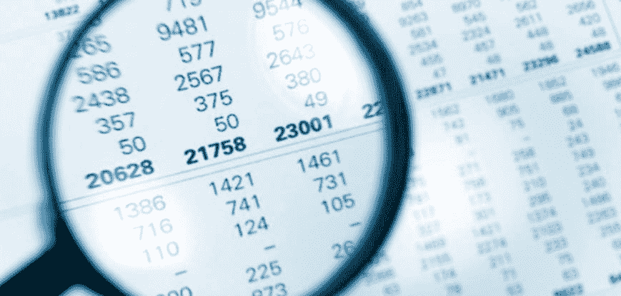
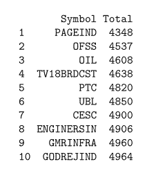

# 如何使用 R 检查数据质量

> 原文：<https://blog.quantinsti.com/use-clean-data-r/>

由[米林德·帕拉德卡](https://www.linkedin.com/in/milind-paradkar-b37292107)

### 您使用干净的数据吗？

永远追求干净的数据！为什么有经验的交易者/作者经常在他们的交易文章/书中强调这一点？作为一名交易新手，你可能会使用来自谷歌或雅虎财经的免费数据。这些来源提供准确、高质量的数据吗？

我们决定做一个快速检查，并对在印度国家证券交易所上市的 143 只股票进行了抽样调查。对于这些股票，我们下载了 2016 年 1 月 8 日至 2016 年 8 月 19 日期间的 1 分钟盘中数据。目的是检查谷歌金融是否捕捉到了 143 只股票在此期间的每一根 1 分钟棒线。

NSE 的交易时段从 IST 时间上午 9:15 开始，到下午 15:30 结束，总共 375 分钟。对于 14 个交易时段，我们应该有每只股票的 5250 个数据点。我们用 R 编写了一个简单的代码来执行检查。

这是我们的发现。在扫描的 143 只股票中，89 只股票的数据点少于 5250 点，这超过了我们样本集的 60%!！下表列出了这 89 只股票中的 10 只。

让我们以 PAGEIND 为例。谷歌金融只捕捉到了这只股票的 4348 个 1 分钟数据点，因此错过了 902 个点！！

示例-缺少 20160801 上的 1306 分钟条形图:

示例-缺少 20160802 上的 1032 分钟条形图:

如果一个交易者运行一个日内策略，根据 1 分钟棒线产生买入/卖出信号，这个策略必然会给出一些错误的信号。

从上面的快速检查可以看出，来自免费来源或廉价数据供应商的数据质量并不总是有保证的。许多廉价的数据供应商从雅虎财经获得数据，并提供给他们的客户。糟糕的数据反馈是许多交易者面临的一个大问题，你会发现许多交易者在各种交易论坛上抱怨同样的问题。

[回测 excel](https://blog.quantinsti.com/vectorized-backtesting-in-excel/) 使用此类数据的交易策略会给出错误的结果。如果你在实时交易中使用这些数据，万一谷歌或雅虎财经的服务器出现问题，就会导致数据传输延迟。作为一个交易者，你不想处于一个你有未平仓交易的位置，数据输入停止或延迟。当用真钱交易时，总是建议使用可靠的数据供应商提供的高质量数据。毕竟数据就是一切！

### **下一步**

如果你是一个对学习算法交易的各个方面感兴趣的散户交易者，可以看看算法交易(EPAT) 的[高管课程。课程涵盖统计学&计量经济学、金融计算&技术和算法&定量交易等培训模块。这门课程让你具备成为成功交易者所需的技能。](https://www.quantinsti.com/epat/)

**更新**

我们注意到一些用户在从雅虎和谷歌金融平台下载市场数据时面临挑战。如果你正在寻找市场数据的替代来源，你可以使用 [Quandl](https://www.quandl.com/) 来获得同样的信息。

### **下载数据文件**

*   你用干净的 Data.rar 吗
    *   15 天内历史数据. zip
    *   F&O 股票列表. csv
    *   r 码- Google_Data_Quality_Check.txt
    *   r 码-股价数据. txt