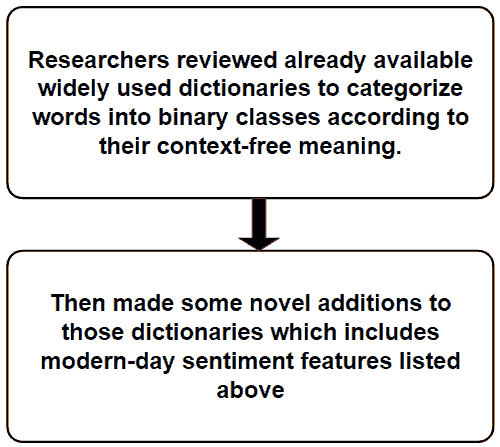

# VADER 情绪分析:完全指南，算法交易和更多

> 原文：<https://blog.quantinsti.com/vader-sentiment/>

由纳曼·斯旺卡

在金融和交易中，每天都会产生大量的数据。这些数据以新闻、预定的经济发布、就业数字等形式出现。很明显，这个消息对股票价格有很大的影响。

每个交易者都尽最大努力跟踪最新消息，并相应更新交易电话。这项任务的自动化提供了更好的交易机会。

在这篇博客中，我们将研究什么是 VADER 情绪分析，以及如何在我们使用 Python 的算法交易模型中使用它。

涵盖的主题:

*   什么是 VADER？
*   [VADER 的精确度是多少？](#what-is-the-accuracy-of-vader)
*   [什么是化合价分值？](#what-is-valence-score)
*   VADER 如何计算输入文本的配价分数？
*   VADER 如何计算输入句子的配价分数？
*   [用于分析情绪的复合 VADER 分数](#compound-vader-scores-for-analyzing-sentiment)
*   [VADER 的 Python 实现](#python-implementation-of-vader)
*   [使用解释 5 种启发法的句子进行演示](#demo-using-sentences-explaining-5-heuristics)
*   如何在交易中使用 VADER？
*   [使用 VADER 和简单移动平均线生成交易需求](#generating-trade-calls-using-vader-and-simple-moving-averages)

* * *

## 什么是 VADER？

VADER 是一种消耗资源较少的情感分析模型，它使用一组规则来指定数学模型，而无需显式编码。与机器学习模型相比，VADER 消耗的资源更少，因为它不需要大量的训练数据。

VADER 的资源高效方法帮助我们解码和量化文本、音频或视频等流媒体中包含的情感。VADER 并没有因为速度和性能的权衡而严重受损。

*代表****V****alence****A****ware****D****ictionary 代表 s****E****ntiment****R****easing*

*如果这些话现在对你没有任何意义，不要担心。在这篇博客结束的时候，你会对这些词的意思有很深的理解。*

**

*继续下一节，讨论 VADER 模型的分类精度以及 VADER 是如何实现的。*

* * *

## *VADER 的精确度是多少？*

*研究表明，在匹配基本事实方面，VADER 的表现与个人评分者一样好。*

*进一步检查 [F1 分数](https://scikit-learn.org/stable/modules/generated/sklearn.metrics.f1_score.html)(分类准确度)，我们看到 VADER (0.96)在正确地将推文的[情绪](https://quantra.quantinsti.com/course/trading-using-options-sentiment-indicators)分为积极、中立或消极类别方面优于个人评分者(0.84)。*

*这背后的原因是，*对情绪的**(情绪是积极还是消极)和 ****强度**** (情绪是积极还是消极)都很敏感。****

****VADER 通过给单词提供一个**的化合价来考虑这个问题。这就把我们带到了下一节。******

* * *

## ******什么是化合价分数？******

******它是通过观察和经验而不是纯粹的逻辑来给所考虑的单词打分。******

*   ******想想“可怕”、“无望”、“悲惨”这些词。任何有自知之明的人都会很容易判断出这些话的负面情绪。******
*   ******而另一方面，像“不可思议的”、“值得的”、“足够的”这样的词表示积极的情绪。******

******根据关于 VADER 的学术论文(T0 ),效价分数是从-4 到+4 来衡量的，其中-4 代表最“消极”的情绪，+4 代表最“积极”的情绪。人们可以直观地猜测，中点 0 代表“中性”情绪，这也是它实际上的定义。******

* * *

## ******VADER 如何计算输入文本的配价分数？******

******VADER 依靠一本字典来映射微博中情感表达常见的词汇和其他众多词汇特征。******

******这些功能包括:******

*   ******西式表情符号的完整列表(例如- :D 和:P)******
*   ******与情感相关的首字母缩写词(例如- LOL 和 ROFL)******
*   ******具有情感价值的常用俚语(例如- Nah 和 meh)******

******手动创建一个完整的情感词典是一个劳动密集型的过程，有时还容易出错。因此，难怪许多自然语言处理研究人员如此依赖现有的字典作为主要资源。******

******无需深入技术细节，这里有一个创建这样一个字典的两步过程分解。******

************

******研究 VADER 的研究人员使用****C****rowd’(****WotC****)方法确认了这些负责情感的词汇特征的普遍适用性。******

******【WotC】**依赖于这样一种思想，即一组人通过他们的聚集意见所表达的集体知识可以作为专家知识的替代而被信任。这有助于他们获得每个上下文无关文本的情感效价分数的有效点估计。****

***亚马逊土耳其机器人就是这样一个著名的众包市场，分散的专家评分员在这里执行远程评分等任务。***

*****一些上下文无关文本的价分值是:*****

*   ***正价:“还好”是 0.9，“好”是 1.9，“很棒”是 3.1***
*   ***负价:“恐怖”是–2.5，表情' :( '是–2.2，而“糟透了”及其俚语派生词“sux”都是–1.5***

* * *

## ***VADER 如何计算输入句子的配价分数？***

***VADER 利用某些规则来将每个子文本对句子级文本中情感感知强度的影响结合起来。这些规则被称为**启发式规则**。他们有 5 个人。***

*   ***高级读者注意:这些启发超出了通常在典型的单词袋模型中捕获的内容。它们合并了术语之间的词序敏感关系。***

*****VADER 的五种启发式:*****

1.  *******标点**** ，即感叹号(！)，在不修改语义方向的情况下增加强度的大小。比如:“天气热！！!"比“天气很热”更强烈***
2.  *******大写**** ，具体是在其他非大写单词存在的情况下，使用全大写来强调一个与情感相关的单词，在不影响语义指向的情况下，增加情感强度的大小。比如:“天气热。”传达比“天气很热”更强烈的信息***
3.  *****(也称为加强词、助词或程度副词)程度修饰语通过增加或减少强度来影响情绪强度。比如:“天气酷热难耐。”比“天气很热”更强烈，而“天气略热。”降低强度。*****
4.  *********因连词**** 极性转移，对比连词“but”发出情感极性转移的信号，连词后的文本情感占主导地位。例如:“天气很热，但还可以忍受。”喜忧参半，后半部分决定了总体评分。*****
5.  *****捕捉极性否定，通过检查充满情感的词汇特征之前的 3 个项目的连续序列，我们捕捉到了近 90%的否定翻转文本极性的情况。例如，一个否定的句子会是“天气并不真的那么热。”。*****

* * *

## *****用于分析情感的复合 VADER 分数*****

*****通过将词典中每个单词的化合价分数相加来计算复合分数，根据规则进行调整，然后归一化为-1(最极端的负面)和+1(最极端的正面)之间的值。如果你想对一个给定的句子进行单一的一维情感测量，这是最有用的度量。*****

*****正如论文中所解释的，研究人员使用了下面的归一化。*****

*****$$x = \frac{x}{\sqrt {x^2 + \alpha}} $$

其中 x =组成单词的价分数之和，α =归一化常数(默认值为 15)

* * *

## VADER 的 Python 实现

VADER 也被移植到其他编程语言上。标准的 Python 发行版没有捆绑 VADER 模块。我们将使用流行的 [Python](/python-trading/) 包安装程序、 **pip** 来完成这项工作。

一个包包含一个模块所需的所有文件。模块是可以包含在项目中的 Python 代码库。我们在 Anaconda 终端中使用以下代码来安装 VADER。*****