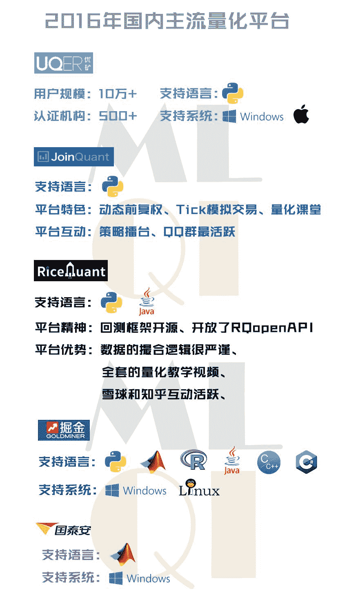

# 二千零一十六、年量化投资界的波澜壮阔

> 原文：[`mp.weixin.qq.com/s?__biz=MzAxNTc0Mjg0Mg==&mid=2653284346&idx=1&sn=dcd6571ac1f8d3c668525c1758ca9ca8&chksm=802e25efb759acf9257ad7a653dcd52ca49d6f772c9bf273051db77ff1b5e5358506f3be25a9&scene=27#wechat_redirect`](http://mp.weixin.qq.com/s?__biz=MzAxNTc0Mjg0Mg==&mid=2653284346&idx=1&sn=dcd6571ac1f8d3c668525c1758ca9ca8&chksm=802e25efb759acf9257ad7a653dcd52ca49d6f772c9bf273051db77ff1b5e5358506f3be25a9&scene=27#wechat_redirect)


编辑部：

2016 年就要结束啦！量化投资与机器学习公众号将给大家带来一篇关于量化投资总结性的推文。

作为**微信公众号全网搜索排名前三**的我们**精心准备了这篇推文**。希望 2016 年量化投资界有一个完美谢幕，并在 2017 年有新的展望。

谢谢你们的阅读！

**前言**

**2016 年量化投资界——综述**

我们对网络搜索进行了综合整理，给大家展示 2016 年量化投资在大家心目中的地位和趋势。

**2016 年趋势**  

**** 

但是我们从整体趋势来看，是稳定增长的，这说明，

**量化投资的春天在继续吹啊****！**

**整体趋势**

**** 

再看看最新的需求图谱

****需求图谱****

******** 

再看看相关词分类

****相关词分类****

 

******交易、策略**********是大家最关心的，也是情理之中。看来，赚钱是王道啊！****

对于地域问题，编辑部认为肯定是北上广深啦。为此，编辑部还专门写过一篇关于量化研究员工资问题的文章。

**公众号阅读量排名第一（点击图片可阅读）**

[私募机构量化研究员的薪酬水平（北上广深，一览无余）](http://mp.weixin.qq.com/s?__biz=MzAxNTc0Mjg0Mg==&mid=2653284109&idx=1&sn=00908f6ab13f3cd3e5214706316ac84e&chksm=802e2518b759ac0e516e5cc6e9b5f62dd22853203ba8298f5f681139a9cc0a45c1cdfa9c421e&scene=21#wechat_redirect)

  

最后我们看看人群属性

****人群属性****


男性基本无敌啊

不过女性做的好的那简直就是女神啊

以上就是对量化投资 2016 年的一个整体概括回顾，可以看得出，这个行业是朝气蓬勃，厚积薄发啊。

接下来分别对其三个方面进行进一步回顾分析。

**第一章**

**2016 年量化投资界——策略研究回顾**

**一、券商策略研究报告回顾**

我们统计了 2016 年全年在主要研报平台上，**金融工程**类的研报阅读排行。发现，来自新财富前五名（排名分先后）的分析师居多。

**1、****国泰君安证券：11 篇**

**2、广发证券：12 篇****3、申万宏源证券：7 篇****4、海通证券：3 篇****5、兴业证券：1 篇**


排在前 50 的研报分别是：

 

**二、量化策略回顾**

**如果用一句话描述每种量化策略在 2016 年的表现，那我们可以这样概括：**

**CTA：**商品的行情大一点，再大一点！

**Alpha：**终于慢慢跑得赢贴水了...... **股票 T****+0：**什么 T+0，你别乱说，我什么都不知道
**境内外套利：**有什么渠道让我转点资金去境外补补保证金？
**期权：**深 100ETF 期权到底还出不出了
**高频：**每天盘中电话一响就冒冷汗......
**固收：**人生连最后的 100 个 bp 都不剩了

**如果用一段代码描述期货策略 在 2016 年的表现，那我们可以这样概括：**

> if everthing: ```py
>  buy(nothing)
> ```

这个策略在期货市场能跑赢 98%的对手，哈哈！

**如果用权威数据描述每种量化策略 2016 年的表现，那我们可以这样概括：**

富国发布了 2016 年 Q2、Q3 季度各类对冲基金业绩的总结，用的数据都是 HFRI 的指数。总体来说，相比于去年，今年 Q2、Q3 季度各类策略的表现都出现了比较明显的反转、回暖，整体市场一片大好。

 

具体到策略来看，CTA 虽然很亮眼（下图没有单独列举，过去 12 个月大概 7%），但是跟其他策略横向对比来看就小巫见大巫了。事件驱动类对冲基金的回报突破天际，权益类也很不错（其中收益最好的是做空策略和能源类股票）。相对价值策略也比较亮眼。而之前比较火热的全球宏观却被几个黑天鹅打的吐不出牙来……


**如果用****国内数据描述每种量化策略 2016 年的表现，那我们可以这样概括：**

在基础市场不同的表现下，管理期货和股票策略私募产品今年整体出现了十几到二十几个点的收益率差距，股票、期货冰火两重天。今年股票私募愁发产品，而期货私募却能顺势扩张。

在私募八大策略中，债券、市场中性、事件驱动等策略的产品也因为各自投资的市场不一样的行情、不一样的风采，呈现出不一样的业绩表现。

私募排排网数据显示，公布最新净值的 833 只**债券策略**产品中，有 269 只公布了今年以来的业绩，今年的**平均收益率仍达到 5.54%**；而**宏观策略**表现也不错，公布最新净值的 168 只产品中有 75 只公布了今年以来的业绩，**平均收益率为 4.95%**。**相对价值**今年表现差强人意，公布最新净值的 652 只产品中有 407 只公布了今年以来的业绩，**平均收益率为 1.33%**；**复合策略**表现也一般，公布最新净值的 2478 只产品中有 495 只公布了今年以来的业绩，**平均收益率为 1.19%**。**组合基金**今年亏损，公布最新净值的 561 只产品中有 241 只公布了今年以来的业绩，**平均亏损为 1.46%**；**事件驱动**也亏损，公布最新净值的 680 只产品中有 322 只公布了今年以来的业绩，**平均亏损为 2.35%**。

 

**管理期货产品八成正收益 单账户最高 7100%**

目前表现最好的是东华期货主动平衡 1 号，截至 12 月 29 日，今年以来收益率 278.37%，暂列冠军；还有几只产品，东航金融-合顺伟业、鼎融叁号、信达润时成长 1 号等今年的收益也超过了 100%。

**管理期货私募产品前 10 名**

 

**股票垫底债券保存果实 多策略新策略受欢迎**

相比之下，债券策略、宏观策略、相对价值、复合策略、组合基金、事件驱动、股票策略的私募产品，今年表现则要黯淡很多，股票策略私募产品今年甚至整体表现垫底。

 尽管在 1 月熔断以后，市场底部不断抬高，但股票私募整体亏损仍然较大，其核心原因有两方面，一是策略原因导致的亏损，二是系统性风险导致的亏损。而且今年 1 月份的这次股灾各产品的亏损幅度远大于 2015 年 6 月股灾期间的亏损，年初股市熔断对今年私募的收益产生了巨大的影响。

**股票策略私募产品前 10 名**

 

**债券不温不火**

截至 12 月 29 日，八成左右的债券私募产品获得正收益。目前表现最好的是茂典 9 号，截至 11 月 29 日，今年以来收益率为 46.14%，还有鼎利 59 号(合晟 20 号)、嘉实资本日盛固收 4 号等产品今年收益也超过了 40%。

**债券策略私募产品前 10 名**

 

**2016 年的资本市场热热闹闹**

**注定是不平凡的一年**

**第二章**

**2016 年量化投资界——研究平台回顾**



从这些主流量化平台来看，平台活跃度（根据社区发帖数量和讨论数量）排名靠前的是（不分先后）：

**优矿****聚宽****米筐**

每个平台各有千秋，其中有一些很棒的策略和研究。下面我们根据综合度选出了这三个平台策略、研究的代表作：


**策略：**

《追踪聪明钱 - A 股市场交易的微观结构初探》

**研究：**

《破解股市泡沫之谜——对数周期幂率（LPPL）模型》


**策略：**

《smallGo! -- newGo! 历险记》

**研究：**

### 《【量化课堂】手把手教你如何应用机器学习》

**** **策略：**

《有“脑子”会“看盘”的小盘股【年化 68.444% | 夏普 3.4771 | 回撤-13.396%】》

**研究：**

《Barra 结构化风险模型实现(1)——沪深 300 指数的风格因子暴露度分析》

这些平台在近几年尤其今年表现的十分活跃，从在校学生到各大私募和机构在平台上都能看到他们的身影。我们也有理由相信，量化投资从之前的少数人群，到现在的多数人群的转变，将会让它更有活力和前景。

我们始终相信，量化投资的的确确给我们的投资带来了可观的收益。为此，每一个宽客都会更加努力！ 

**第三章**

**2016 年量化投资界——事件回顾**

**一、量化赛事回顾**

在 2016 年，量化策略的比赛举办了很多场。全国各地从量化平台、机构组织、地区竞赛等。参赛选手基本都是高校学生。可谓青出于蓝而胜于蓝！

下面让我们盘点一下在 2016 年举办过的量化赛事，说不定在 2017 年，你就是那个**冠军**。大家可以继续跟进这些赛事。

**2016 年量化赛事**

⊙优矿 500 万实盘循环赛

⊙通联数据量化投资大赛

⊙京东金融量化投资大赛 

⊙Ricequant 量化策略大赛

⊙广东省大学生金融建模大赛

⊙香港高校量化验算交易大赛

⊙实盈杯华南高校量化建模大赛

⊙国泰安"量化之星"模拟交易大赛

⊙WorldQuant 量化投资模型创建赛

⊙"品今杯"全国量化投资策略设计大赛

⊙优矿 2000 万实盘 FOF 寻找管理人大赛

⊙FDT-清华大学全球高校量化投资大赛

**二、量化峰会回顾**

在 2016 年，量化峰会接连召开，一轮又一轮，真是今天开完这个，明天开那个。

下面让我们盘点一下在 2016 年举办过的量化峰会，这些峰会为我们总结了 2016，展望了 2017.。值得借鉴。**大家可以收藏起来，以后方便查阅。**

**这里还有****2016 年****各大机构**

**百份策略研究报告**

(复制链接即可下载)

http://vdisk.weibo.com/s/uBGRts1eiT3A_?from=page_100505_profile&wvr=6

**2016 年量化峰会**

⊙各大券商策略会

⊙2016 全球量化金融峰会

⊙2017 全球最佳投资机会

⊙2016 深港通策略研讨峰会

⊙2016 中国量化投资俱乐部年会

⊙2016 年金融界高端投资策略峰会

⊙2016 上半年大型投资策略报告会

⊙2016 第十届中国量化投资国际峰会

⊙2016 下半年大宗商品投资策略峰会议程

**结尾**

**2016 公众号的回顾**

**公众号阅读前十文章**

**（点击标题可查看）**

**No.01 **[私募机构量化研究员的薪酬水平](http://mp.weixin.qq.com/s?__biz=MzAxNTc0Mjg0Mg==&mid=2653284109&idx=1&sn=00908f6ab13f3cd3e5214706316ac84e&chksm=802e2518b759ac0e516e5cc6e9b5f62dd22853203ba8298f5f681139a9cc0a45c1cdfa9c421e&scene=21#wechat_redirect)

**No.02** [揭秘新财富金融工程领域那些 NB 的分析师](http://mp.weixin.qq.com/s?__biz=MzAxNTc0Mjg0Mg==&mid=2653284026&idx=1&sn=ed8bb9ceca543eaa620c284ad4e374ce&chksm=802e24afb759adb99e6cee24f26e063fb7f43855349b8142d06b4c766fee16f1df5676a0dd74&scene=21#wechat_redirect)

**No.03**[跟你讲个笑话，我是做私募的……](http://mp.weixin.qq.com/s?__biz=MzAxNTc0Mjg0Mg==&mid=2653283777&idx=1&sn=252e295b1a788da1aaadf39c2ef959ee&scene=21#wechat_redirect)

**No.04 **[机器学习该如何应用到量化投资系列](http://mp.weixin.qq.com/s?__biz=MzAxNTc0Mjg0Mg==&mid=2653283935&idx=1&sn=56e84e986f278403d8840387c615a2a7&chksm=802e244ab759ad5c43720a7960567d215970877250ca72534016bf53a021c73f83665068639d&scene=21#wechat_redirect)

**No.05** [增强学习与量化投资初探](http://mp.weixin.qq.com/s?__biz=MzAxNTc0Mjg0Mg==&mid=2653283440&idx=1&sn=e5dc6e12f7b28b5ede13bd582b59b73c&scene=21#wechat_redirect)

**No.06** [量化缠论系列文章](http://mp.weixin.qq.com/s?__biz=MzAxNTc0Mjg0Mg==&mid=2653283801&idx=1&sn=0a05bb0247535a118183be2b917c56b4&scene=21#wechat_redirect)

**No.07** [书籍干货国外深度学习与机器学习书籍](http://mp.weixin.qq.com/s?__biz=MzAxNTc0Mjg0Mg==&mid=2653283143&idx=1&sn=2316c1a067239aa007196cc8cb2e6c5b&scene=21#wechat_redirect)

**No.08** [机器学习资料整理](http://mp.weixin.qq.com/s?__biz=MzAxNTc0Mjg0Mg==&mid=2653282920&idx=1&sn=6faa96116c590c75d92569351f987e52&scene=21#wechat_redirect)

**No.09 **[基于 TensorFlow 让机器生成周董的歌词](http://mp.weixin.qq.com/s?__biz=MzAxNTc0Mjg0Mg==&mid=2653284269&idx=1&sn=4355bf8736fd140f8c10bef2fd32755c&chksm=802e25b8b759acaee2f1f031ad49e41f4e194ad9b966dd079bfec8fa7b9d3731e10d21f0ef4f&scene=21#wechat_redirect)

**No.10 **[七夕没有对象的宽客都在看这篇文章](http://mp.weixin.qq.com/s?__biz=MzAxNTc0Mjg0Mg==&mid=2653283478&idx=1&sn=aa061849c61ee84eedda3ac9d0c74ec5&scene=21#wechat_redirect)

**我们会再接再厉**

**成为全网优质的科技文公众号**

**关注者**

**从****1 到 10000+**

**我们每天都在进步**

听说，置顶关注我们的人都不一般


****