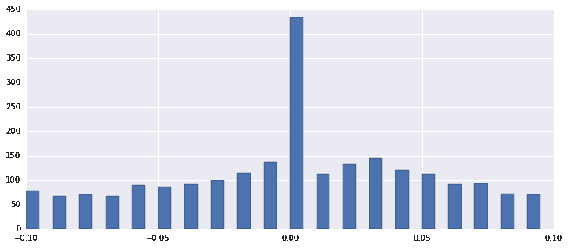

# 【Python 量化投资】涨跌幅度分级，使用 SVM 分类预测

> 原文：[`mp.weixin.qq.com/s?__biz=MzAxNTc0Mjg0Mg==&mid=2653284317&idx=1&sn=2be4558df8ac04e8ef6379f87ab17269&chksm=802e25c8b759acde46de2d4ba9161ad5e733e782f693b71fa7dbb73dfac23053c9221b363ec8&scene=27#wechat_redirect`](http://mp.weixin.qq.com/s?__biz=MzAxNTc0Mjg0Mg==&mid=2653284317&idx=1&sn=2be4558df8ac04e8ef6379f87ab17269&chksm=802e25c8b759acde46de2d4ba9161ad5e733e782f693b71fa7dbb73dfac23053c9221b363ec8&scene=27#wechat_redirect)

*   流通市值最小 500

    

*   引用情景因子初探

### 简单说明

* * *

*   开始的时候想做一个 ZZ800 成分股的小策略，然后受制于性能限制，也懒得自己造轮子，就改成 SH50 了

*   今天有空对 SH50 成分股简单优化了一下参数

*   本文不涉及信号的理念、产生、筛选、处理相关方面

* * *

### 策略假设

*   1 股票池里面股票涨跌幅度符合标准正态分布

*   3 假设股价是一个电梯运动轨迹，上升一层（一个价格区间），回调几层（另一个价格区间），那么在未来一段时间（10~20 天）内股价会有所表示。

*   更长时间的股票涨跌趋势涉及更多的信息层面和更多分类的信息处理不考虑。

*   4 指标在不同的市场行情投资心态下使用不同的参考标准，过去 3 ~ 4 月内的投资心态在短期内会有顺延趋势

* * *

然而效果并不好

*   资金流入 = 资金流出 + 永久性损耗（税、佣金等）

*   大致上还是符合正态分布的

*   简单看一下过去一段时间 SH50 10 天收益率波动

 

*   将波动率范围简单分级看一下

*   成分股看一下

 

*   测试效果

做成滚动策略看看效果

**源代码连接****点击**

**阅读原文**

**关注者**

**从 1 到 10000+**

**每天我们都在进步**

**阅读量前 10 文章**

**No.01 **[给你说个事，私募机构量化研究员的薪酬水平……](http://mp.weixin.qq.com/s?__biz=MzAxNTc0Mjg0Mg==&mid=2653284109&idx=1&sn=00908f6ab13f3cd3e5214706316ac84e&chksm=802e2518b759ac0e516e5cc6e9b5f62dd22853203ba8298f5f681139a9cc0a45c1cdfa9c421e&scene=21#wechat_redirect)

**No.02** [独家揭秘新财富金融工程领域那些 NB 的分析师们](http://mp.weixin.qq.com/s?__biz=MzAxNTc0Mjg0Mg==&mid=2653284026&idx=1&sn=ed8bb9ceca543eaa620c284ad4e374ce&chksm=802e24afb759adb99e6cee24f26e063fb7f43855349b8142d06b4c766fee16f1df5676a0dd74&scene=21#wechat_redirect)

**No.03**[跟你讲个笑话，我是做私募的……](http://mp.weixin.qq.com/s?__biz=MzAxNTc0Mjg0Mg==&mid=2653283777&idx=1&sn=252e295b1a788da1aaadf39c2ef959ee&scene=21#wechat_redirect)

**No.04 **[全网首发机器学习该如何应用到量化投资系列](http://mp.weixin.qq.com/s?__biz=MzAxNTc0Mjg0Mg==&mid=2653283935&idx=1&sn=56e84e986f278403d8840387c615a2a7&chksm=802e244ab759ad5c43720a7960567d215970877250ca72534016bf53a021c73f83665068639d&scene=21#wechat_redirect)

**No.05** [增强学习与量化投资初探](http://mp.weixin.qq.com/s?__biz=MzAxNTc0Mjg0Mg==&mid=2653283440&idx=1&sn=e5dc6e12f7b28b5ede13bd582b59b73c&scene=21#wechat_redirect)

**No.06** [量化缠论系列文章](http://mp.weixin.qq.com/s?__biz=MzAxNTc0Mjg0Mg==&mid=2653283801&idx=1&sn=0a05bb0247535a118183be2b917c56b4&scene=21#wechat_redirect)

**No.07** [书籍干货国外深度学习与机器学习书籍](http://mp.weixin.qq.com/s?__biz=MzAxNTc0Mjg0Mg==&mid=2653283143&idx=1&sn=2316c1a067239aa007196cc8cb2e6c5b&scene=21#wechat_redirect)

**No.08** [机器学习资料整理](http://mp.weixin.qq.com/s?__biz=MzAxNTc0Mjg0Mg==&mid=2653282920&idx=1&sn=6faa96116c590c75d92569351f987e52&scene=21#wechat_redirect)

**No.09 **[基于 TensorFlow 让机器生成周董的歌词](http://mp.weixin.qq.com/s?__biz=MzAxNTc0Mjg0Mg==&mid=2653284269&idx=1&sn=4355bf8736fd140f8c10bef2fd32755c&chksm=802e25b8b759acaee2f1f031ad49e41f4e194ad9b966dd079bfec8fa7b9d3731e10d21f0ef4f&scene=21#wechat_redirect)

**No.10 **[七夕没有对象的宽客都在看这篇文章](http://mp.weixin.qq.com/s?__biz=MzAxNTc0Mjg0Mg==&mid=2653283478&idx=1&sn=aa061849c61ee84eedda3ac9d0c74ec5&scene=21#wechat_redirect)

听说，置顶关注我们的人都不一般

****