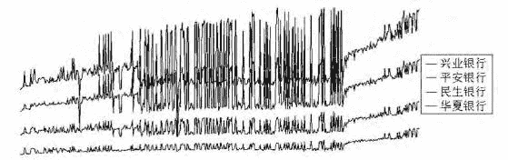

# 【量化投资研究】概率图模型在股票套利中的应用

> 原文：[`mp.weixin.qq.com/s?__biz=MzAxNTc0Mjg0Mg==&mid=2653284293&idx=1&sn=09c18e8513e835f27c0d5860e09dc128&chksm=802e25d0b759acc693e685b626501d2e58b35385a38166f1c1d032f8e10bdef04035dd7ff5d7&scene=27#wechat_redirect`](http://mp.weixin.qq.com/s?__biz=MzAxNTc0Mjg0Mg==&mid=2653284293&idx=1&sn=09c18e8513e835f27c0d5860e09dc128&chksm=802e25d0b759acc693e685b626501d2e58b35385a38166f1c1d032f8e10bdef04035dd7ff5d7&scene=27#wechat_redirect)

前言

概率图模型所涉及到的知识点非常广，难度也很高，但是，随着机器学习在这几年的迅速发展，概率图模型现在也要继续他的光辉啊。所以编辑部推送此文，来简单介绍一下。

本文不讲对概率图模型的理论研究，直接开门见山。

第一部分

股票套利的实质即计算出股票内在关系即联动性， 发现具有经济意义的股票群， 把握股票市场的整体规律， 利用个股滞后性， 在观察到某只股票的涨幅后立即做出反应， 买进与其正相关性较大且还未上涨的股票， 从而实现获利。

概率图模型的优势在于， 其聚集矩阵中的相关因子考虑的不仅仅是单独两个变量的相关性， 而是这两个变量在其他变量影响下的条件相关性， 即为综合考虑各因子的影响力下的相关性。因此， 概率图模型有效地避免了 Pearson 和 Spearman 相关系数的片面性， 更加的全面且完善。而同时还考虑了股票市场的时效性， 股票间的相关性也许会因为政策等种种原因发生变化， 使得原本相关性很大的两只个股在现在并无太大联系。因此在概率图模型协方差的选择上进行了改进， 在建模计算系数时将普通最小二乘法替换成了加权最小二乘法， 添加了随时间推近而增大的权重， 使得生成的结果更有合理性。

概率图模型

概率图模型使用图像来表示高维空间的复杂分布，通常对多维数据进行估计。假设有 p 维随机向量 X~Np(u，∑)， 其中，随机向量 X 的每个维度均对应一个独立个体， 例如： 研究股票联动关系时， 随机向量 X 为 p 支股票在某个交易日的连续对数收益率。

用一个协方差阵∑描述 X 中各个体间的相互关系，令 Ω=∑-1=(ωij) ，Ω 被称为聚集矩阵。该聚集矩阵元素与偏相关系数 ρij 有如下关系：

 

当 i 不等于 j 时， 若 Ω 中 ωij= 0 ，则第 i  个个体和第  j  个个体条件不相关。在图模型中， 对于 i 不等于 j ， 若 ωij 不等于 0 ， 则顶点 i 和顶点  j 有边相连， 反之则没有。

总体来说， 概率图模型中的节点表示随机变量， 而缺失的边表示条件独立， 如图所示， B 和 D、 A 和 D 等无边相连的随机变量均条件独立。

 

用回归估计图模型

基于以上提到的概率图模型中若 Ω 中 ωij= 0 ,则第 i 个个体和第 j  个个体条件独立的性质， 可将估计图模型的问题转化为估计聚集阵 Ω 的问题。

**加权最小二乘回归**

虑到时间对股市的影响 （例如某两只股过去联系很紧密， 但近期已因政策等各方面原因并无过大相关性）， 对以上模型进行了改进， 将普通最小二乘回归替换为加权最小二乘回归 （WLS）， 即在原模型上增加一个随时间推近而增大的权重矩阵 W 。将以上估计问题转化为对以下问题的估计。

当 X 为满秩时， 其系数矩阵 β-j 的估计为：

数据处理

选取了 2013 年 1 月 4 日至 2015 年 5 月 11 日（可以自行调整）中 567 个开盘日的 44 支股票的数据， 其中旅游股 10 支， 医药制造股 10 支， 银行股 14 支， 证券股 10 支， 这些行业均为国家政府报告中要大力发展的行业， 其中每股有着从 0 至 8 个不等的缺失数据。采用了均值填补法， 用该股 567 个开盘日所有非空白数据的平均值来填补少量的缺失数据。

然后根据公式 Rt = ln( ) Pt/Pt - 1 计算出各股 566 天的对数收益率， 其中 Rt 为 t 日对数收益率，Pt 为 t 日收盘价，Pt - 1 为 t 日前一天的收盘价。为寻求方便， 以

 

建立权重矩阵 W， 其中 n 为总天数 566， i 为日期编号， 2014 年 1 月 4 日为 1，往后依次增大至 566。之后对每一只股票的对数收益率关于其他所有股票以权重 W 进行加权最小二乘建模。在算法中建立循环，将原矩阵赋值给全新矩阵并将 X 的第 j 列转变为 0 向量之后建模不仅对 β-j 的计算无影响， 而且可避免对第 j 列

的移动及恢复， 增加程序的简便性。

最后分析聚集矩阵， 将所有绝对值大于一定数值的相关系数认定条件相关， 将其用边连接，实线为负相关， 虚线为正相关。且边长为相关系数的倒数， 即相关性越强， 距离越近。数字为各股票编号。所得关系如图所示：

 

结论

由图可看出， 华夏银行 （23）、 民生银行 （26）、 平安银行 （30）、 兴业银行 （32） 为一组股票群， 除民生银行与华夏银行之间， 其他均存在两两相互影响的关系， 而平安银行和兴业银行的正相关性最强， 民生银行其次， 华夏银行稍弱一点。即若平安银行股价上涨可考虑跟进购买兴业银行， 兴业银行上涨则可考虑购买平安银行， 而民生银行和华夏银行也可在考虑范围内， 可根据实际可承担风险而决定。

贵州百灵 （12）、 海南海药 （14）、 江中药业 （17）、 新华制药 （20） 为另一组股票群， 贵州百灵、 海南海药、 新华制药的正相关性较强， 而江中药业稍弱一点， 即贵州百灵、 海南海药和新华制药无论谁上涨均可考虑另外两方， 而江中药业相较于其他可以在考虑范围内。

东北证券 （35）、 光大证券 （37）、 广发证券 （38）、 海通证券 （40）、 华泰证券 （41）、 西部证券 （42）、 兴业证券 （43） 也组成以东北证券为中心的另一股票群， 其中东北证券和光大证券的正相关性最大， 其次是兴业证券和广发证券， 较弱的是海通证券、 华泰证券和西部证券。即若东北证券上涨了， 可按光大证券、 兴业证券、 广发证券、 西部证券、 海通证券、 华泰证券的顺序依次做考虑。

该相关图所显示的股票群基本均为同类别， 证明了该模型的可靠性。且通过原始数据只管画时序图， 也可验证以上模型的正确性。例如银行股票群 4 支股票的原始数据时序图如下图所示：

 

由上至下依次为兴业银行、 平安银行、 民生银行、 华夏银行的趋势线， 由该图仍可看出兴业银行和平安银行的相关性之强， 以及民生银行和华夏银行虽相关性稍弱， 但正相关趋势仍十分明显。与建模所得相关图结果一致。由图上上可得东北证券和贵州百灵、 海南海药、 江中药业存在负相关关系。原始数据绘图如下图所示：

 

虽然根据图片可得东北证券与其他三种股票确实存在负相关的关系， 但由于它们并非同类别股票， 其相关性产生的具体原因及可靠性仍需在考量更多数量的股票更长一段时间的数据后再做结论。

**关注者**

**从 1 到 10000+**

**每天我们都在进步**

**阅读量前 10 文章**

**No.01 **[给你说个事，私募机构量化研究员的薪酬水平……](http://mp.weixin.qq.com/s?__biz=MzAxNTc0Mjg0Mg==&mid=2653284109&idx=1&sn=00908f6ab13f3cd3e5214706316ac84e&chksm=802e2518b759ac0e516e5cc6e9b5f62dd22853203ba8298f5f681139a9cc0a45c1cdfa9c421e&scene=21#wechat_redirect)

**No.02** [独家揭秘新财富金融工程领域那些 NB 的分析师们](http://mp.weixin.qq.com/s?__biz=MzAxNTc0Mjg0Mg==&mid=2653284026&idx=1&sn=ed8bb9ceca543eaa620c284ad4e374ce&chksm=802e24afb759adb99e6cee24f26e063fb7f43855349b8142d06b4c766fee16f1df5676a0dd74&scene=21#wechat_redirect)

**No.03**[跟你讲个笑话，我是做私募的……](http://mp.weixin.qq.com/s?__biz=MzAxNTc0Mjg0Mg==&mid=2653283777&idx=1&sn=252e295b1a788da1aaadf39c2ef959ee&scene=21#wechat_redirect)

**No.04 **[全网首发机器学习该如何应用到量化投资系列](http://mp.weixin.qq.com/s?__biz=MzAxNTc0Mjg0Mg==&mid=2653283935&idx=1&sn=56e84e986f278403d8840387c615a2a7&chksm=802e244ab759ad5c43720a7960567d215970877250ca72534016bf53a021c73f83665068639d&scene=21#wechat_redirect)

**No.05** [增强学习与量化投资初探](http://mp.weixin.qq.com/s?__biz=MzAxNTc0Mjg0Mg==&mid=2653283440&idx=1&sn=e5dc6e12f7b28b5ede13bd582b59b73c&scene=21#wechat_redirect)

**No.06** [量化缠论系列文章](http://mp.weixin.qq.com/s?__biz=MzAxNTc0Mjg0Mg==&mid=2653283801&idx=1&sn=0a05bb0247535a118183be2b917c56b4&scene=21#wechat_redirect)

**No.07** [书籍干货国外深度学习与机器学习书籍](http://mp.weixin.qq.com/s?__biz=MzAxNTc0Mjg0Mg==&mid=2653283143&idx=1&sn=2316c1a067239aa007196cc8cb2e6c5b&scene=21#wechat_redirect)

**No.08** [机器学习资料整理](http://mp.weixin.qq.com/s?__biz=MzAxNTc0Mjg0Mg==&mid=2653282920&idx=1&sn=6faa96116c590c75d92569351f987e52&scene=21#wechat_redirect)

**No.09 **[基于 TensorFlow 让机器生成周董的歌词](http://mp.weixin.qq.com/s?__biz=MzAxNTc0Mjg0Mg==&mid=2653284269&idx=1&sn=4355bf8736fd140f8c10bef2fd32755c&chksm=802e25b8b759acaee2f1f031ad49e41f4e194ad9b966dd079bfec8fa7b9d3731e10d21f0ef4f&scene=21#wechat_redirect)

**No.10 **[七夕没有对象的宽客都在看这篇文章](http://mp.weixin.qq.com/s?__biz=MzAxNTc0Mjg0Mg==&mid=2653283478&idx=1&sn=aa061849c61ee84eedda3ac9d0c74ec5&scene=21#wechat_redirect)

听说，置顶关注我们的人都不一般

****