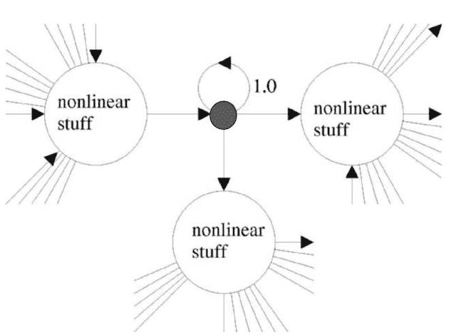

# 【深度学习研究系列】漫谈 RNN 之长短期记忆模型 LSTM

> 原文：[`mp.weixin.qq.com/s?__biz=MzAxNTc0Mjg0Mg==&mid=2653284281&idx=1&sn=bf683701b4b6827ec869e346e3f1c0be&chksm=802e25acb759acbae854fef1f5b76f037cf4f77764222c0be70bc07cb141c7d9a6f7503b07ef&scene=27#wechat_redirect`](http://mp.weixin.qq.com/s?__biz=MzAxNTc0Mjg0Mg==&mid=2653284281&idx=1&sn=bf683701b4b6827ec869e346e3f1c0be&chksm=802e25acb759acbae854fef1f5b76f037cf4f77764222c0be70bc07cb141c7d9a6f7503b07ef&scene=27#wechat_redirect)

推送第三日，量化投资与机器学习公众号将为大家带来一个系列的 **Deep Learning** 原创研究。本次深度学习系列的撰稿人为 **张泽旺 ，DM-Master，目前在研究自动语音识别系统**。希望大家有所收获，共同进步！

## **长短期记忆模型 LSTM**

首先想，为什么 RNN 的记忆性不够？我们可以把梯度消失问题转换成比较形象的解释，例如可能是输入权重 Win 没有很好地过滤掉输入噪音，还有可能是输出权重 W_out 没有很好地输出有用的记忆信息。一方面 W_in 既要吸收有用的输入信号，另一方面 W_in 又要过滤掉输入噪音，对于 W_in 而言，其承担的功能太多；同样，对于 W_out 而言也是，既要提取有用的记忆信息，又要去除没用的记忆信息。所以，提出 LSTM 的思路就是要解决输入噪音问题以及如何输出有用的信息，换句话说，就是要优化 W_in 和 W_out 的角色。

因此，LSTM 要解决的核心问题主要有两点：

*   **隐含状态应该存储什么**

*   **从隐含状态应该输出什么**

这个时候，我们可以添加两个门，分别是输入门以及输出门，这两个门的作用分别是过滤输入信息的噪音、控制输出有用的信息。

输入门函数：

输出门函数：

其中 f_in 和 f_out 分别是输入门和输出门，它们元素的值都在 0~1 之间。中间符号是矩阵相乘。

我们可以从上面这幅图去理解 LSTM 的结构。左边是原始 RNN 的结构，原始的 RNN 单元含有一个记忆模块，而这个记忆模块与其输入、输出神经元直接相连。

上图中间是 LSTM 结构，其核心是一个 memory cell，LSTM 的输入共有三个，分别是：当前时刻的输入 x，上一时刻的输出 h，以及上一时刻的 memory cell。而 LSTM 的输出则有两个，分别是：当前时刻的 memory cell，以及当前时刻的输出 h。总结成一句话就是：LSTM 的核心是由当前时刻的输入、上一时刻的输出、上一时刻的记忆共同决策的，并且产生一个新的输出，同时又更新了内部的记忆。

上图右边是 LSTM 的计算公式，i 是输入门，o 是输出门，a 是遗忘门，c 是记忆细胞，h 是最终的输出。如果上图不容易理解的话，可以参照下图 LSTM 的结构。 

从上图看 LSTM 更加直观。下面分别讲解 LSTM 的具体不同模块的作用。

> *   **遗忘门**。遗忘门的作用就是对历史信息的取舍，如果遗忘门关闭，那么不会有任何历史记忆进来；反之，如果遗忘门完全打开，那么所有的历史记忆都将通过。如上图的左边第一个'+'模块，遗忘门是由当前时刻输入 x、前一时刻输出 h、前一时刻记忆 c 共同决定的。
>     
>     
> *   **记忆模块**。可以看到最上面一条线，LSTM 的记忆模块就是一个流动的信息，它会从 t=0 一直更新到 t=T 时刻，它就像一种流一样，在前进的过程中不断更新，并且受当前输入 x 以及前一时刻输出 h 的共同作用。具体说，首先上一时刻的记忆信息会与遗忘门进行相乘，然后它与通过 tanh 激活的新的记忆进行相加合并，并且新的记忆也是通过与输入门进行相乘得到的。这样就完成了从 C_t-1 到 C-t 的过渡。
>     
>     
> *   **输入门**。输入门的作用就是决定有多少新记忆将和老记忆进行合并，输入门和遗忘门的决定因素一样，即由当前时刻输入 x、前一时刻输出 h、前一时刻记忆 c 共同决定的。
>     
>     
> *   **输出门**。输出门即决定着 LSTM 单元对外界的响应 h。输出门的决定因素和输入门、遗忘门的决定因素相同。
>     
>     
> *   **LSTM 的输出**。LSTM 的输出主要受输出门控制，具体来说，LSTM 的输出 h 是由当前时刻合并后的新记忆通过 tanh 再激活之后与输出门进行相乘而得到的。h 的作用是提供给外界的输出以及影响下一时刻提供新的记忆信息。

*   随着时间长度逐渐增大，矩阵 W 的特征值如果小于 1，那么就会导致梯度接近于 0；另一方面，如果特征值大于 1，在后向传播过程中就会导致梯度爆炸；

*   sigmoid 激活函数的导数范围是[0,0.25]，这加剧了梯度消失问题的发生；

LSTM 通过引入常数偏导来解决了这个问题，即 Constant Error Carousels（CEC），CEC 的具体意思是令求导偏导为单位矩阵，即：

这个时候，只要σ函数为线性函数即可，W_h 固定即可使得偏导固定为一个常数单位矩阵；甚至，可以直接令 W 为单位矩阵，σ为恒等变换线性函数：

 

简单来说，CEC 的做法就是对于细胞单元永远传递偏导为 1 的信号，而让其他各个门函数的权重去自我学习，如下图所示，这样就使得了 LSTM 的记忆细胞可以学得更长的历史记忆信息，从而解决了导致梯度消失的问题。

中间细胞单元的权重一直保持为单位矩阵，其他三个非线性单元是用来控制误差流进入细胞单元的大小。如果没有添加遗忘门的话，其结构图如下：

输入门和输出门分别负责允许多少输入流入以及允许多少信息流到下一时刻，而中间的记忆细胞是一个 CEC 结构。当我们求导的时候，偏导中始终会有一个单位矩阵 I 存在，这就保证了梯度不会消失为 0：

当加入了遗忘门以后，遗忘门就可以对历史记忆进行进一步取舍，换句话说，遗忘门可以决定哪些记忆没有必要记住：

 

总结一下，LSTM 不同于 RNN 的地方有以下几点：

*   它通过输入门来决定何时让输入进入细胞单元；

*   它通过遗忘门来决定何时应该记住前一时刻的记忆；

*   它通过输出门来决定何时让记忆流入到下一时刻；

无论是输入门、遗忘门还是输出门，都是通过此刻的输入以及前一时刻的输出来决定的，这一点本质上和原始的 RNN 是一样的，RNN 的隐含层状态是通过此刻的输入以及前一时刻的输出来决定的，只不过 LSTM 在 RNN 基础上添加了一个细胞层，而这个细胞层使得了相邻时刻的信息传递程度比 RNN 要高，因此具备了长时间记忆功能。

**关注者**

**从 1 到 10000+**

**每天我们都在进步**

**阅读量前 10 文章**

**No.01** [给你说个事，私募机构量化研究员的薪酬水平……](http://mp.weixin.qq.com/s?__biz=MzAxNTc0Mjg0Mg==&mid=2653284109&idx=1&sn=00908f6ab13f3cd3e5214706316ac84e&chksm=802e2518b759ac0e516e5cc6e9b5f62dd22853203ba8298f5f681139a9cc0a45c1cdfa9c421e&scene=21#wechat_redirect)

**No.02** [独家揭秘新财富金融工程领域那些 NB 的分析师们](http://mp.weixin.qq.com/s?__biz=MzAxNTc0Mjg0Mg==&mid=2653284026&idx=1&sn=ed8bb9ceca543eaa620c284ad4e374ce&chksm=802e24afb759adb99e6cee24f26e063fb7f43855349b8142d06b4c766fee16f1df5676a0dd74&scene=21#wechat_redirect)

**No.03** [跟你讲个笑话，我是做私募的……](http://mp.weixin.qq.com/s?__biz=MzAxNTc0Mjg0Mg==&mid=2653283777&idx=1&sn=252e295b1a788da1aaadf39c2ef959ee&scene=21#wechat_redirect)

**No.04** [全网首发机器学习该如何应用到量化投资系列](http://mp.weixin.qq.com/s?__biz=MzAxNTc0Mjg0Mg==&mid=2653283935&idx=1&sn=56e84e986f278403d8840387c615a2a7&chksm=802e244ab759ad5c43720a7960567d215970877250ca72534016bf53a021c73f83665068639d&scene=21#wechat_redirect)

**No.05**  [增强学习与量化投资初探](http://mp.weixin.qq.com/s?__biz=MzAxNTc0Mjg0Mg==&mid=2653283440&idx=1&sn=e5dc6e12f7b28b5ede13bd582b59b73c&scene=21#wechat_redirect)

**No.06**  [量化缠论系列文章](http://mp.weixin.qq.com/s?__biz=MzAxNTc0Mjg0Mg==&mid=2653283801&idx=1&sn=0a05bb0247535a118183be2b917c56b4&scene=21#wechat_redirect)

**No.07**  [书籍干货国外深度学习与机器学习书籍](http://mp.weixin.qq.com/s?__biz=MzAxNTc0Mjg0Mg==&mid=2653283143&idx=1&sn=2316c1a067239aa007196cc8cb2e6c5b&scene=21#wechat_redirect)

**No.08**  [机器学习资料整理](http://mp.weixin.qq.com/s?__biz=MzAxNTc0Mjg0Mg==&mid=2653282920&idx=1&sn=6faa96116c590c75d92569351f987e52&scene=21#wechat_redirect)

**No.09** [基于 TensorFlow 让机器生成周董的歌词](http://mp.weixin.qq.com/s?__biz=MzAxNTc0Mjg0Mg==&mid=2653284269&idx=1&sn=4355bf8736fd140f8c10bef2fd32755c&chksm=802e25b8b759acaee2f1f031ad49e41f4e194ad9b966dd079bfec8fa7b9d3731e10d21f0ef4f&scene=21#wechat_redirect)

**No.10** [七夕没有对象的宽客都在看这篇文章](http://mp.weixin.qq.com/s?__biz=MzAxNTc0Mjg0Mg==&mid=2653283478&idx=1&sn=aa061849c61ee84eedda3ac9d0c74ec5&scene=21#wechat_redirect)

听说，置顶关注我们的人都不一般

****