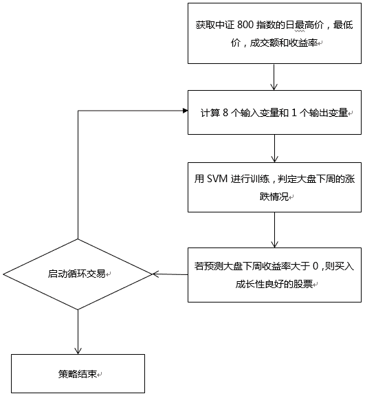
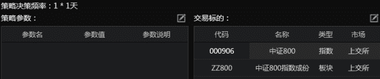
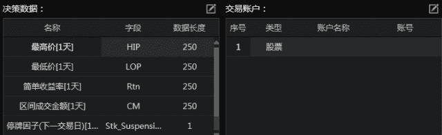
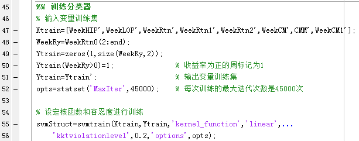
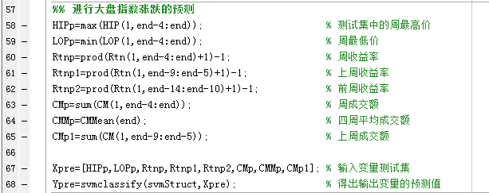
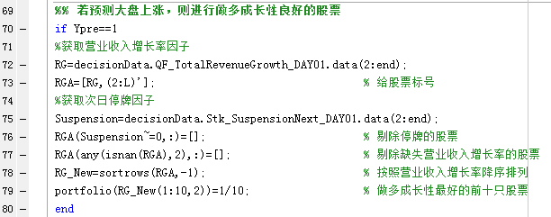
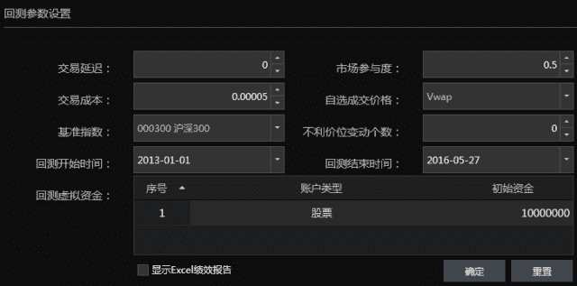
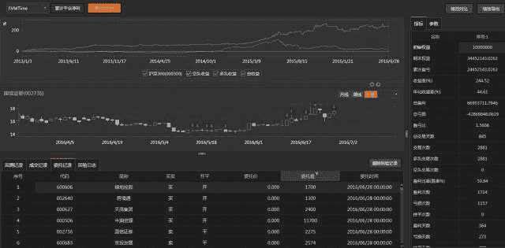
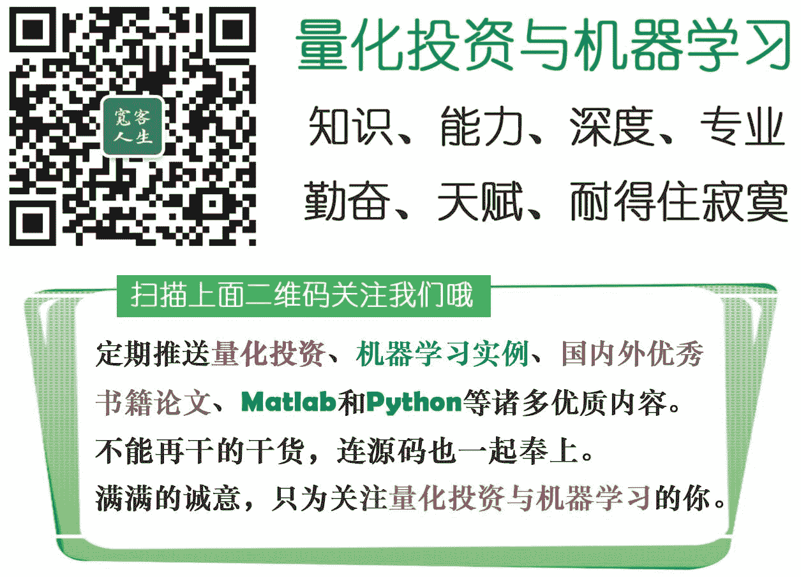

# 【Matlab 量化投资】支持向量机择时策略

> 原文：[`mp.weixin.qq.com/s?__biz=MzAxNTc0Mjg0Mg==&mid=2653284279&idx=1&sn=0b0c6857497d0133152af51efcaed295&chksm=802e25a2b759acb45b4e335c87464006ca5d600d0dd9926f358fda76b3135396d4027a506ef8&scene=27#wechat_redirect`](http://mp.weixin.qq.com/s?__biz=MzAxNTc0Mjg0Mg==&mid=2653284279&idx=1&sn=0b0c6857497d0133152af51efcaed295&chksm=802e25a2b759acb45b4e335c87464006ca5d600d0dd9926f358fda76b3135396d4027a506ef8&scene=27#wechat_redirect)

感谢国泰安与本公众号合作

推出**【Matlab 量化投资系列】**

> **机器学习**
> 
> 所谓机器学习，其实就是根据样本数据寻找规律，然后再利用这些规律来预测未来的数据（结果）。
> 
> 但是，直到今天，机器学习也没有一种被大家广泛认同的理论框架产生，这个也是机器学习被大家诟病的原因之一：它是没有理论基础的。
> 
> 目前机器学习的方法大概可以分为以下几种：
> 
> 1、经典的参数统计估计方法：基于传统统计学，需要已知的样本分布形式，局限性比较大。
> 
> 2、经验非线性方法：利用已知样本建立非线性模型（如人工神经网络），克服了传统参数估计方法的困难，但缺乏统一的数学理论。
> 
> 3、统计学习理论（SLT）：专门研究小样本情况下机器学习规律的理论，核心概念是 VC 维概念，解决了神经网络结构选择、局部极小点等问题。支持向量机（SVM）就是基于这一理论产生的。

##    **SVM 支持向量机择时策略**

**支持向量机**

支持向量机是用来解决分类问题的。

先考虑最简单的情况，豌豆和米粒，用晒子很快可以分开，小颗粒漏下去，大颗粒保留。用一个函数来表示就是当直径 d 大于某个值 D，就判定为豌豆，小于某个值就是米粒。

d>D, 豌豆；d<D, 米粒

在数轴上表现为 d 左边就是米粒，右边就是绿豆，这是一维的情况。

但是实际问题没这么简单，考虑的问题不单单是尺寸。

一个花的两个品种，怎么分类？

假设决定他们分类的有两个属性，花瓣尺寸和颜色。单独用一个属性来分类，像刚才分米粒那样，就不行了。这个时候我们设置两个值：尺寸 x 和颜色 y。

我们把所有的数据都丢到 x-y 平面上作为点，按道理如果只有这两个属性决定了两个品种，数据肯定会按两类聚集在这个二维平面上。

我们只要找到一条直线，把这两类划分开来，分类就很容易了，以后遇到一个数据，就丢进这个平面，看在直线的哪一边，就是哪一类。

例如：x+y-2=0 这条直线，我们把数据(x,y)代入，只要认为 x+y-2>0 的就是 A 类，x+y-2<0 的就是 B 类。

以此类推，还有三维的，四维的，N 维的属性的分类，这样构造的也许就不是直线，而是平面，超平面。

例如：一个三维的函数分类 ：x+y+z-2=0，这就是个分类的平面了。

有时候，分类的那条线不一定是直线，还有可能是曲线，我们通过某些函数来转换，就可以转化成刚才的那种多维的分类问题，这个就是核函数的思想。

例如：分类的函数是个圆形 x²+y²-4=0。这个时候令 x²=a; y²=b,还不就变成了 a+b-4=0 这种直线问题了。

这就是支持向量机的思想。

机的意思就是算法，机器学习领域里面常常用“机”这个字表示算法。

支持向量意思就是数据集种的某些点，位置比较特殊，比如刚才提到的 x+y-2=0 这条直线，直线上面区域 x+y-2>0 的全是 A 类，下面的 x+y-2<0 的全是 B 类，我们找这条直线的时候，一般就看聚集在一起的两类数据，他们各自的最边缘位置的点，也就是最靠近划分直线的那几个点，而其他点对这条直线的最终位置的确定起不了作用，所以我姑且叫这些点叫“支持点”（意思就是有用的点），但是在数学上，没这种说法，数学里的点，又可以叫向量，比如二维点(x,y)就是二维向量，三维度的就是三维向量（x,y,z)。所以 “支持点”改叫“支持向量”，听起来比较专业，NB。

所以就是”支持向量机了。

当然了，SVM 的实际理论要复杂的多，如果大家有兴趣，就自行去搜索一下参考资料来看啦，由于篇幅关系，这边就不赘述了。

##    **核函数分类**

目前应用最多的四类核函数分别为：线性核函数、多项式核函数、高斯核函数和 Sigmoid 核函数。

选择不同的核函数和参数，SVM 的性能会有很大的差异，因此核函数及其参数的选择是 SVM 理论和应用研究中的一个重要课题。

SVM 看上去是比较复杂，但是在实际应用当中还是比较简单的，因为 Matlab 本身就已经提供了 SVM 的工具箱（函数），我们直接调用就可以了，当然，大家也可以自行去安装一些其他 SVM 的工具箱来实现。

那下面我们就开始编写策略啦~

小编所使用的数据、策略回测、交易等等都是来自于国泰安量化终端**Quantrader**。而小编使用的策略编写语言是 Matlab，实现策略不要太简单。

##    **策略简介**

订阅中证 800 指数和相应的成分股，使用了日频最高价、最低价、收益率、成交金额、营业收入增长率和次日停牌因子等数据。

策略流程图如下：

##    **策略参数配置**

根据之前提到的订阅的交易代码和数据，使用**Quantrader**可以直接配置如下：

##    **策略主程序**

数据准备好了之后，我们就可以开始码代码啦。

1、训练分类器：

2、预测：

3、交易下单：

##    **策略回测**

策略写完了当然要用历史数据回测看看绩效。同样的，使用**Quantrader**，完成回测。

从过去 3 年半的绩效来看，这个策略年化收益约 50%左右，夏普达到了 2。

**完整版源代码请点击阅读原文**

**关注者**

**从 1 到 10000+**

**每天我们都在进步**

**阅读量前 10 文章**

**No.01** [给你说个事，私募机构量化研究员的薪酬水平……](http://mp.weixin.qq.com/s?__biz=MzAxNTc0Mjg0Mg==&mid=2653284109&idx=1&sn=00908f6ab13f3cd3e5214706316ac84e&chksm=802e2518b759ac0e516e5cc6e9b5f62dd22853203ba8298f5f681139a9cc0a45c1cdfa9c421e&scene=21#wechat_redirect)

**No.02** [独家揭秘新财富金融工程领域那些 NB 的分析师们](http://mp.weixin.qq.com/s?__biz=MzAxNTc0Mjg0Mg==&mid=2653284026&idx=1&sn=ed8bb9ceca543eaa620c284ad4e374ce&chksm=802e24afb759adb99e6cee24f26e063fb7f43855349b8142d06b4c766fee16f1df5676a0dd74&scene=21#wechat_redirect)

**No.03** [跟你讲个笑话，我是做私募的……](http://mp.weixin.qq.com/s?__biz=MzAxNTc0Mjg0Mg==&mid=2653283777&idx=1&sn=252e295b1a788da1aaadf39c2ef959ee&scene=21#wechat_redirect)

**No.04** [全网首发机器学习该如何应用到量化投资系列](http://mp.weixin.qq.com/s?__biz=MzAxNTc0Mjg0Mg==&mid=2653283935&idx=1&sn=56e84e986f278403d8840387c615a2a7&chksm=802e244ab759ad5c43720a7960567d215970877250ca72534016bf53a021c73f83665068639d&scene=21#wechat_redirect)

**No.05**  [增强学习与量化投资初探](http://mp.weixin.qq.com/s?__biz=MzAxNTc0Mjg0Mg==&mid=2653283440&idx=1&sn=e5dc6e12f7b28b5ede13bd582b59b73c&scene=21#wechat_redirect)

**No.06**  [量化缠论系列文章](http://mp.weixin.qq.com/s?__biz=MzAxNTc0Mjg0Mg==&mid=2653283801&idx=1&sn=0a05bb0247535a118183be2b917c56b4&scene=21#wechat_redirect)

**No.07**  [书籍干货国外深度学习与机器学习书籍](http://mp.weixin.qq.com/s?__biz=MzAxNTc0Mjg0Mg==&mid=2653283143&idx=1&sn=2316c1a067239aa007196cc8cb2e6c5b&scene=21#wechat_redirect)

**No.08**  [机器学习资料整理](http://mp.weixin.qq.com/s?__biz=MzAxNTc0Mjg0Mg==&mid=2653282920&idx=1&sn=6faa96116c590c75d92569351f987e52&scene=21#wechat_redirect)

**No.09** [基于 TensorFlow 让机器生成周董的歌词](http://mp.weixin.qq.com/s?__biz=MzAxNTc0Mjg0Mg==&mid=2653284269&idx=1&sn=4355bf8736fd140f8c10bef2fd32755c&chksm=802e25b8b759acaee2f1f031ad49e41f4e194ad9b966dd079bfec8fa7b9d3731e10d21f0ef4f&scene=21#wechat_redirect)

**No.10** [七夕没有对象的宽客都在看这篇文章](http://mp.weixin.qq.com/s?__biz=MzAxNTc0Mjg0Mg==&mid=2653283478&idx=1&sn=aa061849c61ee84eedda3ac9d0c74ec5&scene=21#wechat_redirect)

听说，置顶关注我们的人都不一般

****